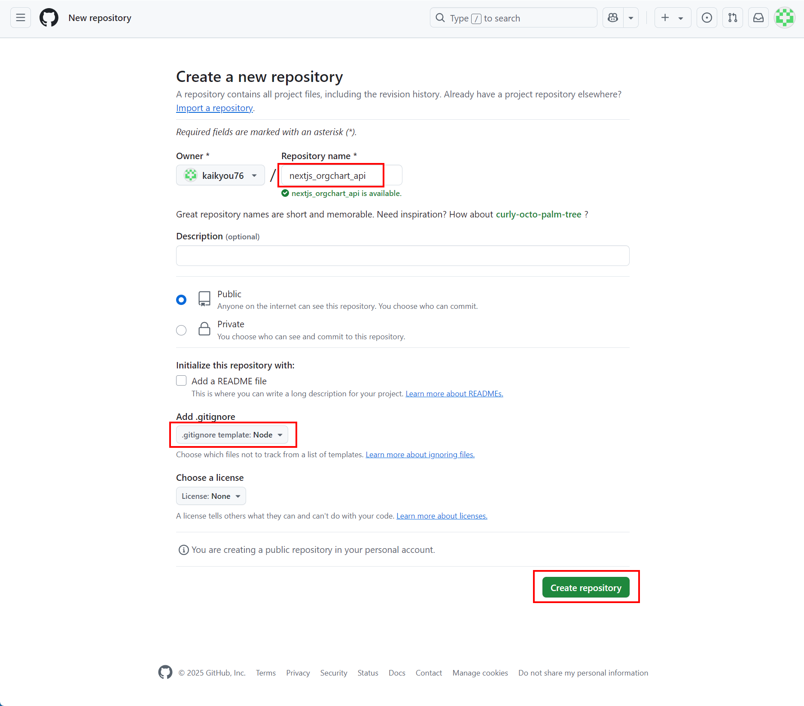
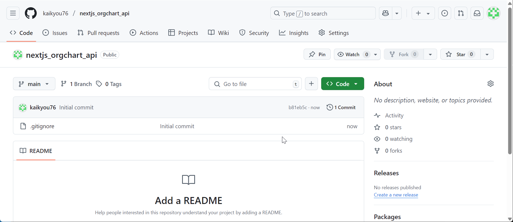

# 空のリポジトリを作成

## ✅ ④ GitHub に空のリポジトリを作成

### 手順：

1. [https://github.com](https://github.com) にアクセス

2. 新しいリポジトリを作成：

   - 名前：`nextjs_orgchart_api`
   - 公開/非公開は任意
   - ✅ `README.md` は **作成せず**（ローカルと競合するため）
   - ✅ `.gitignore` → `Node` を選択
   - ✅ ライセンスは任意

3. 作成完了後、GitHub 上に **空のリポジトリ**ができます

---

### Create Repository

### 作成完了

