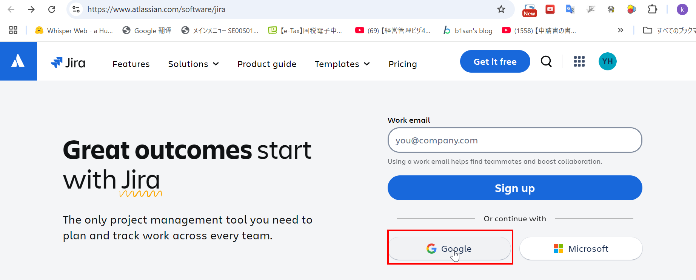
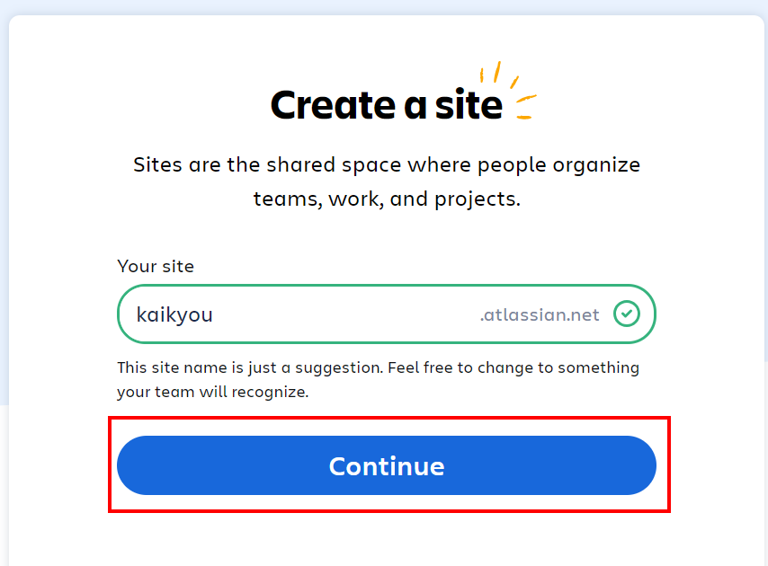
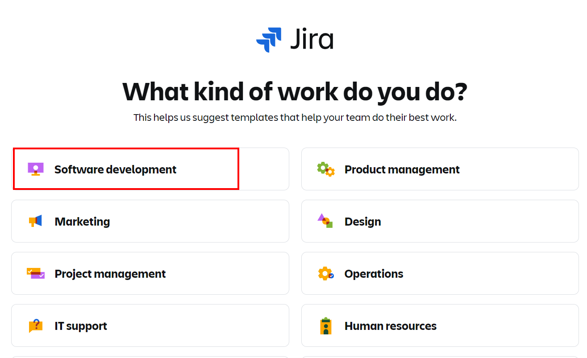
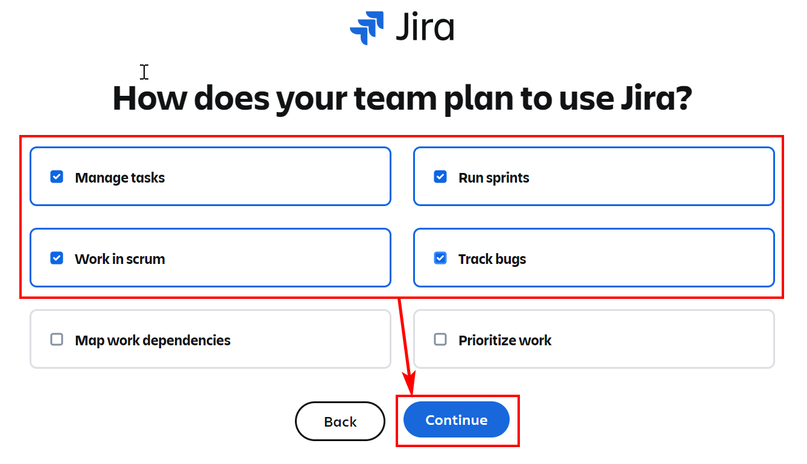
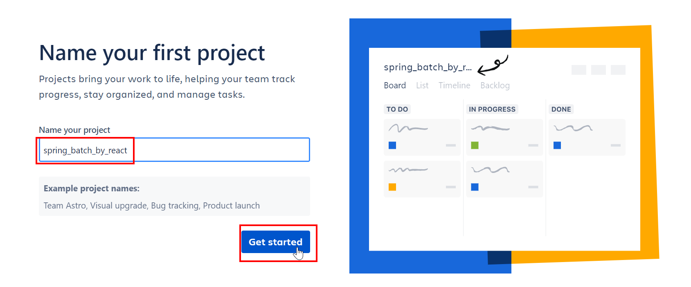
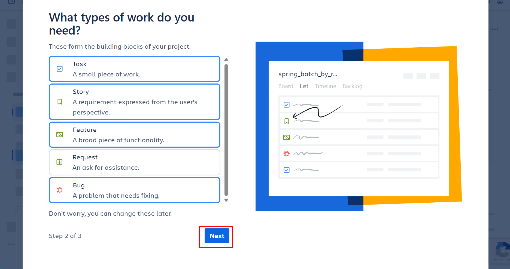
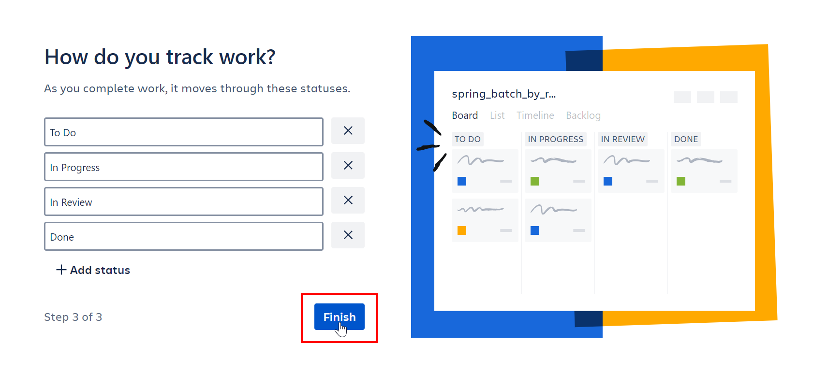
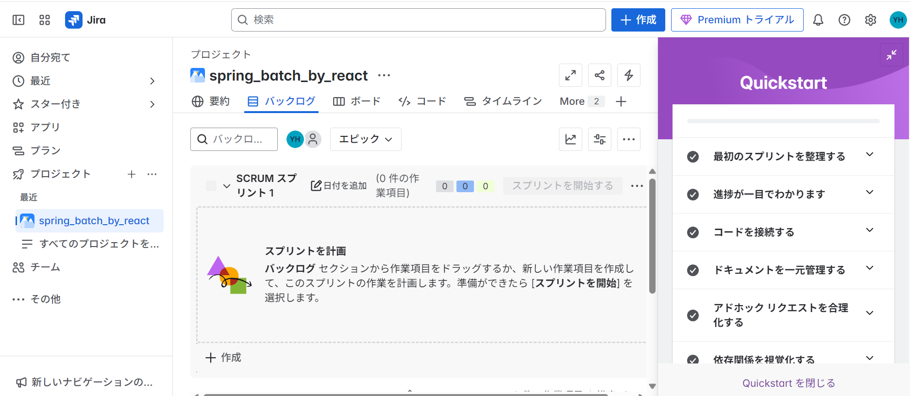
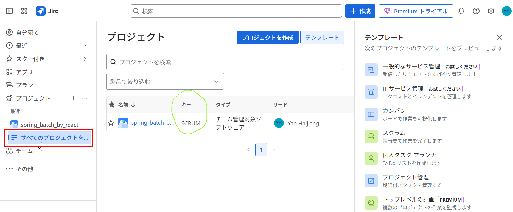

# Jira アカウント登録（Jira Cloud）

## ✅ ① Jira アカウント登録（Jira Cloud）

### 手順：

1. Jira Cloud 登録ページへアクセス
   👉 [https://www.atlassian.com/software/jira](https://www.atlassian.com/software/jira)

2. 無料アカウント作成（Google 連携も可能）

3. ワークスペース名・プロジェクト名を設定

   - プロジェクト名：`OrgChartAPI`
   - プロジェクトキー：例 `ORG`

4. プロジェクトテンプレートを選択（おすすめ）
   ✅ 「スクラム」 or 「カンバン」

---

### Google 連携でアカウント無料作成

### 自分のサイト作成

### React/Next.js や API などソフトウェア開発のため、Software development を選択

### ご自由に選択

### project 名を指定

### 必要に応じて選択

### Jira 設定完了

### プロジェクト作成済み画面

### プロジェクトキーの確認

#### ✅ 現在の Jira プロジェクト情報まとめ

| 項目             | 内容                                         |
| ---------------- | -------------------------------------------- |
| プロジェクト名   | `spring_batch_by_react`                      |
| プロジェクトキー | `SCRUM`（チケット番号：SCRUM-1, SCRUM-2...） |
| テンプレート     | スクラム or カンバン（※この後確認）          |
| 所有者 / 管理者  | Yao Haijiang（ご本人）                       |

---

---

## ✅ 現状まとめ

- **プロジェクト名**: `spring_batch_by_react`
- **プロジェクトキー**: `SCRUM`
- **プロジェクトリード**: ご本人（Yao Haijiang）
- **プロジェクトの詳細設定ページ**では「テンプレートの種類（スクラム or カンバン）」は表示されていない
- ただし、表示 UI が **看板（カンバン）っぽく見える**とのこと

---

## ✅ 推定されるテンプレート：**カンバン**

Jira では、**スクラムとカンバンで UI が大きく異なります**。

| 項目           | カンバン（Kanban）                 | スクラム（Scrum）                                |
| -------------- | ---------------------------------- | ------------------------------------------------ |
| 表示 UI        | 看板（To Do → In Progress → Done） | スプリント、バックログ、バーンダウンチャートなど |
| スプリント     | なし                               | あり（開始・終了ボタンあり）                     |
| チケットの配置 | 自由に移動可能（列ベース）         | スプリントごとに管理                             |

---

## ✅ カンバンテンプレートでできること

カンバンも十分に実務で使えます！特に「継続的な開発」や「一人または少人数チーム」では以下の点で便利です：

- チケットをドラッグで移動（To Do → In Progress → Done）
- 優先順位管理
- GitHub との連携可能（PR やコミットにチケット番号を書く）
- チームでの作業の可視化

---

今のまま \*\*「SCRUM キーのカンバンプロジェクト」\*\*を活用することも問題ありません。

---

## ✅ 次のアクション（おすすめ）

このままカンバンで進めて良ければ、以下のステップに進みましょう：

1. ✅ チケットを 1 つ作成して動作確認（タイトル例：`GitHubリポジトリを作成する`）
2. ✅ GitHub リポジトリを作成（`nextjs_orgchart_api`など）
3. ✅ Jira チケット番号（例：`SCRUM-1`）を使ってコミット・PR 連携
4. ✅ GitHub Actions や CI 環境の整備

---

## 🔧 チケット作成方法（復習）

1. Jira のプロジェクト画面で「作成（＋）」をクリック
2. 件名に例：「GitHub リポジトリを作成する」
3. 保存してチケット番号（例：`SCRUM-1`）を確認
4. ボードに表示されたら、カンバン形式の列（To Do, In Progress, Done）に移動できる

---

次に進みたいステップ（GitHub リポジトリ作成 or チケット作成サンプルなど）があれば教えてください。
一緒に作業を進めていきましょう。
