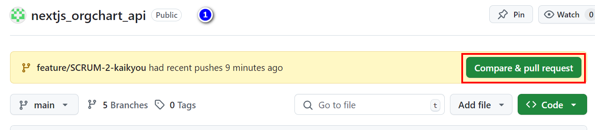
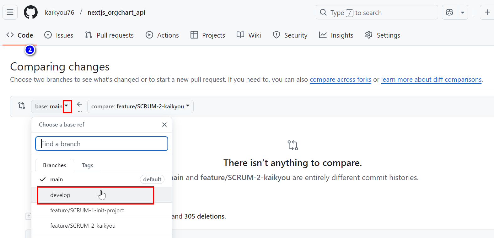
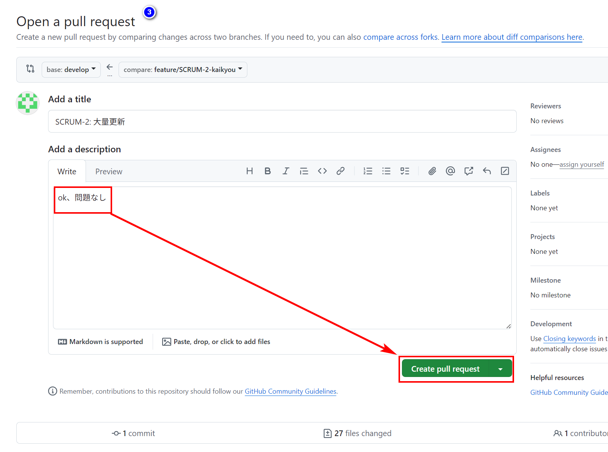

# 現在使用する作業手順

## kaikyou Working_Branch

### jira ダッシュボードで SCRUM-2 チケット作成済み

### 今のブランチ確認

```bash
PS D:\nextjs_orgchart_api> git branch
  develop
  feature/SCRUM-1-init-project
* feature/init-project
  main
PS D:\nextjs_orgchart_api>
```

### 作業開始

```bash
git checkout -b feature/SCRUM-2-kaikyou
git branch
git add .
git commit -m"SCRUM-2: 大量更新"
git push -u origin feature/SCRUM-2-kaikyou
```

### ✅ 今すぐ PR 作成する手順




