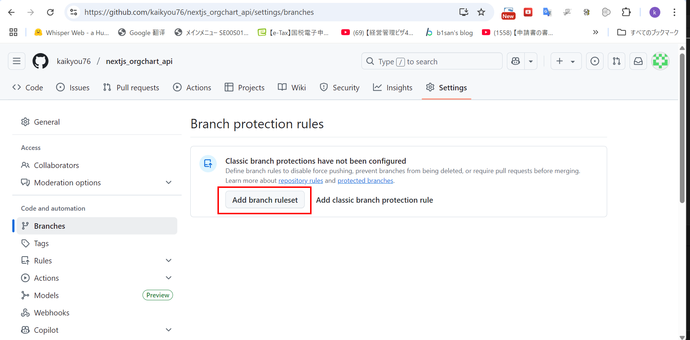
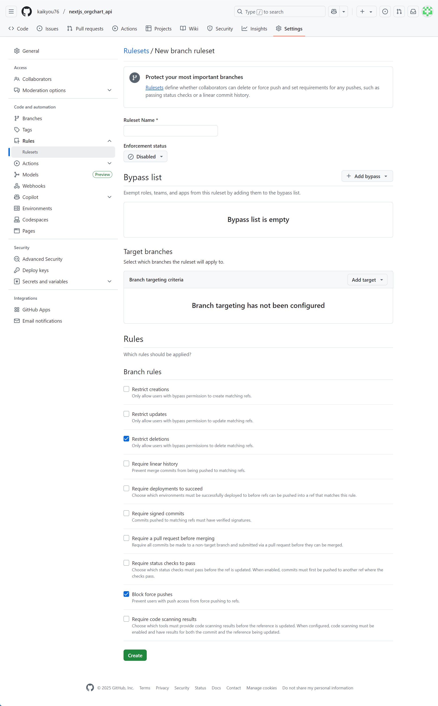
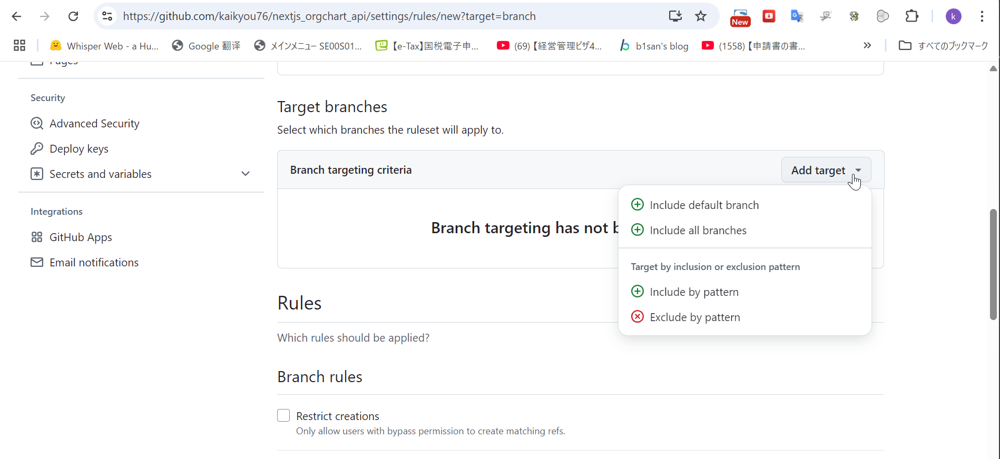
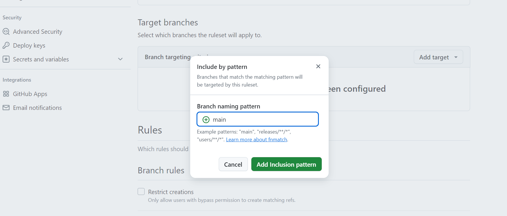
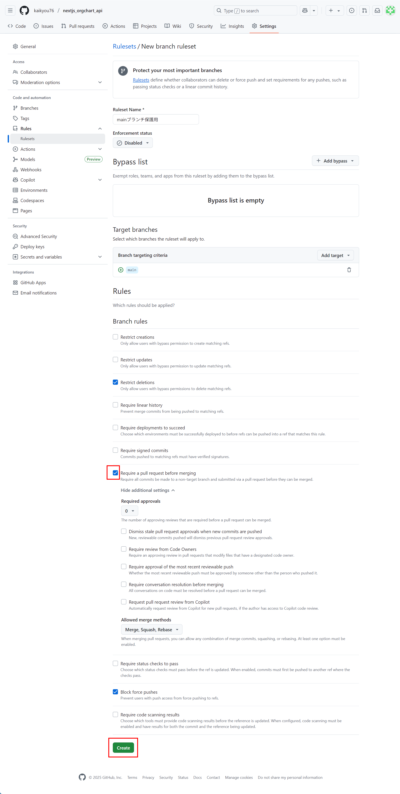
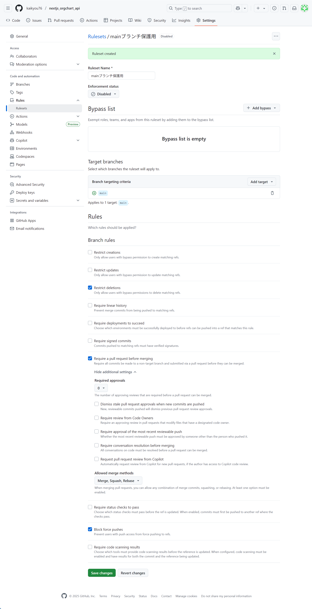
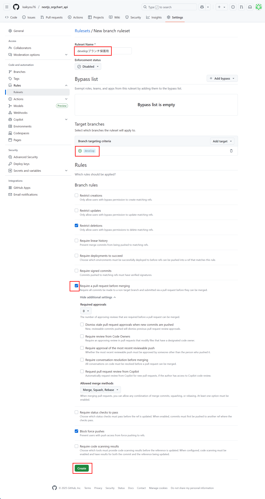
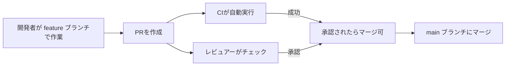
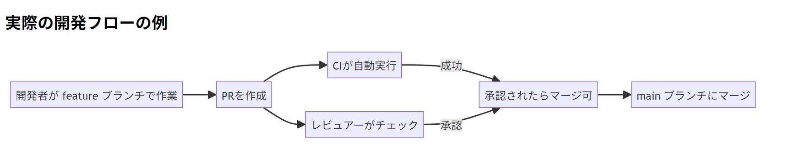
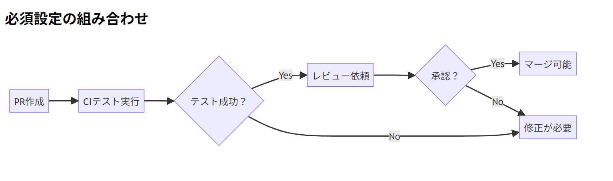

# ブランチ保護設定

## ✅ ⑦Settings > Branches → Add branch ruleset にて main / develop に保護ルールを追加

### 💡 GitHub 設定：

1.  GitHub で対象のリポジトリを開き、右上の「Settings」をクリックします。設定画面が開いたら「Branches」を選択し、Add branch ruleset ボタンをクリックすると、新しいブランチ保護ルールを作成するための画面が開きます。
    
2.  画面が切り替わると、ブランチ保護ルールの設定画面が表示されます。ここで新しいルールを作成する準備をします。
    
3.  次に、保護したいブランチを選択します。まず Target branches セクションで対象のブランチを選びます。
    
4.  include by pattern を選択し、main を入力します。これにより main ブランチにブランチ保護ルールを適用できます。ワイルドカードなどを使った柔軟な設定も可能です。
    
5.  続いてブランチルールを設定します。設定項目で「Require a pull request before merging」を有効にすることで、変更を反映するときにプルリクエストを必須にできます。これにより、変更がレビューされないままマージされることを防ぎます。
    
6.  main ブランチ保護ルール設定完了
    

### 同様に develop ブランチの保護ルールの設定方法は上記 main ブランチと同じです。



- **管理者権限**: これらの設定はリポジトリの管理者権限が必要です。
  > ***
  >
  > ### 実際の開発フローの例





> この設定により、`main`ブランチは常に「テスト済み」「レビュー済み」の安全な状態を保てます。

## GitHub ブランチ保護ルールの設定内容と意味

これらの設定は**ブランチ保護ルール（Branch Protection Rules）** と呼ばれ、重要なブランチ（特に `main` ブランチ）への変更を制御し、リポジトリの安定性とコード品質を保つための重要な仕組みです。

---

### 各設定項目の意味と目的

1. **Require pull request before merging（PR 必須）**

   - **意味**: `main` ブランチへの直接プッシュを禁止
   - **目的**:
     - すべての変更をプルリクエスト経由で行うことを強制
     - コードレビューや CI テストの機会を確保
     - 変更内容の可視性を高め、誤った変更を防ぐ

2. **Require status checks to pass（CI 必須）**

   - **意味**: すべての CI テストが成功しないとマージ不可
   - **目的**:
     - テストが失敗しているコードのマージを防止
     - ビルドエラーやテスト失敗が本番環境に流入するリスクを排除
     - コード品質と安定性を担保

3. **Require review from at least 1 reviewer（レビュー必須）**
   - **意味**: 最低 1 人の承認レビューが必要
   - **目的**:
     - 単独でのコード変更を防止
     - 知識共有とコード品質の向上
     - バグやセキュリティ問題の早期発見

---

### `develop` ブランチへの保護ルール追加（任意）の意味

- **推奨されるワークフロー**:
  ```
  featureブランチ → developブランチ（開発環境） → mainブランチ（本番環境）
  ```
- **`develop` 保護の目的**:
  - 開発中のブランチでも一定の品質を維持
  - 不安定なコードが開発ブランチに流入するのを防ぐ
  - チーム開発時の衝突を減少
- **設定内容例**:
  - PR 必須（直接プッシュ禁止）
  - CI テスト必須（最低限のテストパス）
  - レビュー必須（軽めの設定でも可）

---

### ブランチ保護ルールの効果的な使い方

1. **必須設定の組み合わせ**:

   ```mermaid
   graph LR
   A[PR作成] --> B[CIテスト実行]
   B --> C{テスト成功？}
   C -->|Yes| D[レビュー依頼]
   C -->|No| E[修正が必要]
   D --> F{承認？}
   F -->|Yes| G[マージ可能]
   F -->|No| E
   ```

   

2. **実際の開発フロー例**:

   - 開発者は `feature/new-login` ブランチで作業
   - PR を作成 → CI テスト自動実行
   - テスト成功 & チームメンバーの承認レビュー後にのみ `main` へマージ

3. **設定のベストプラクティス**:
   - `main` ブランチ：厳格な保護（全項目必須）
   - `develop` ブランチ：基本保護（PR 必須 + CI 必須）
   - リリースブランチ：`main` と同等の保護
   - 機能ブランチ：保護不要（自由に作業可能）
