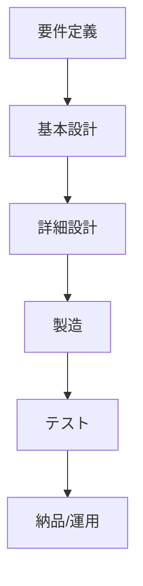
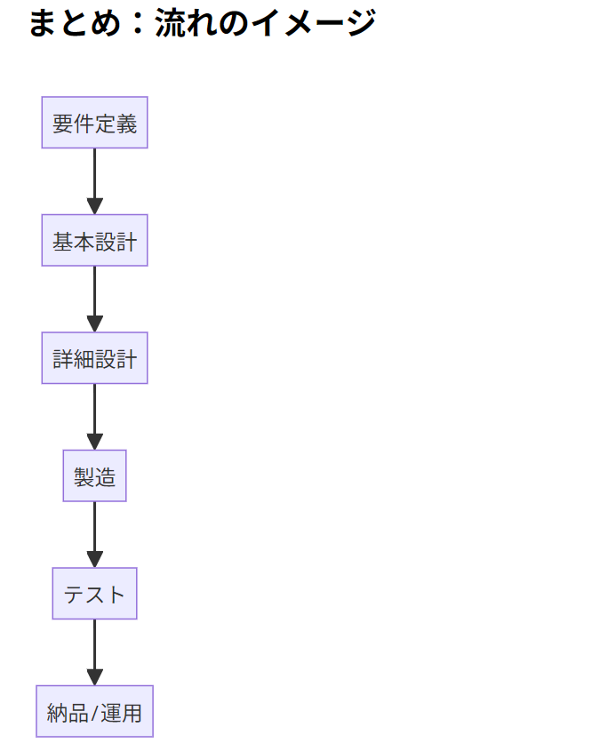
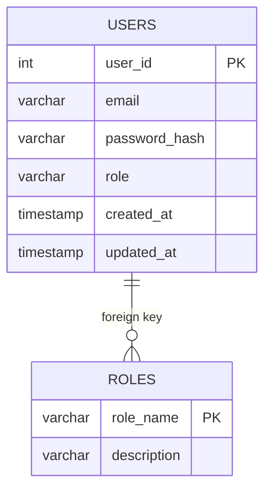
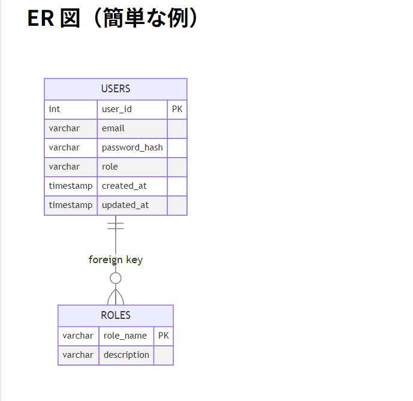
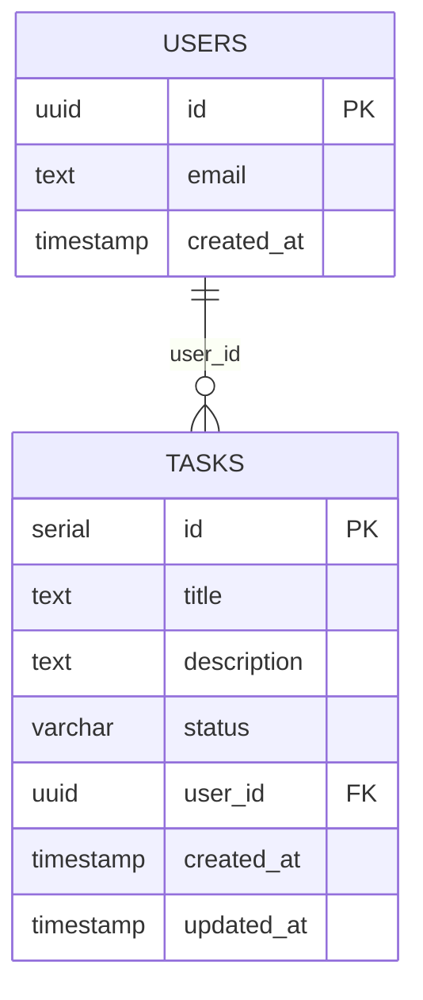
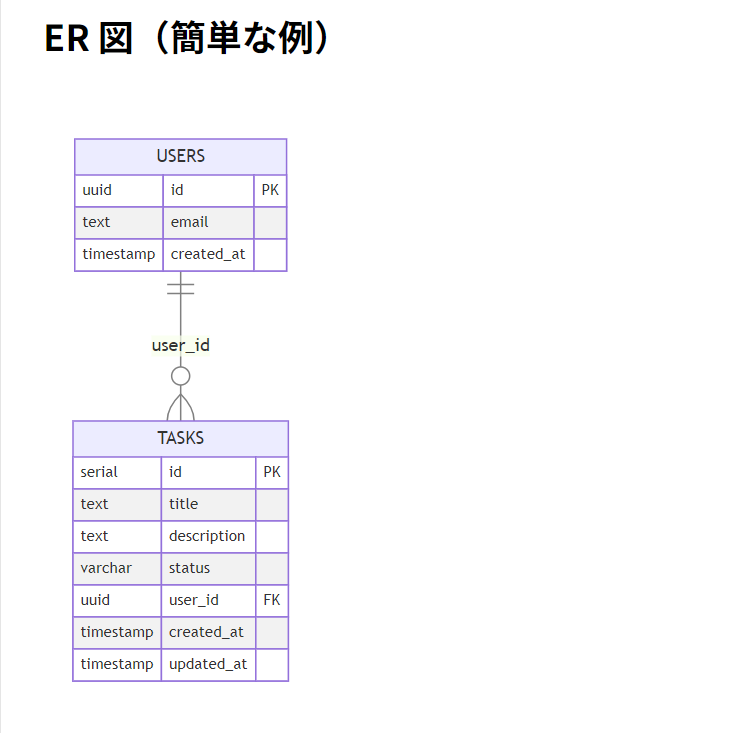

# 新規プロジェクトにおける主な工程

新規プロジェクトにおける一連の開発プロセス（要件定義〜テスト）は、プロジェクト成功の基盤となる重要な工程です。以下に、それぞれのフェーズと特に「テーブル定義書の作成方法」を中心に説明します。

---

## 🧭 新規プロジェクトにおける主な工程

| 工程         | 内容                                                                                       |
| ------------ | ------------------------------------------------------------------------------------------ |
| 要件定義     | 顧客やステークホルダーからニーズを収集し、システムが実現すべき機能・非機能要件を明確にする |
| 基本設計     | システム全体のアーキテクチャ、DB 構造、画面遷移、インターフェースなどを設計                |
| 詳細設計     | 各機能ごとのロジックや処理フロー、データ構造を詳細に設計                                   |
| 製造（実装） | 設計書に基づきコードを書いていく工程                                                       |
| テスト       | 単体テスト、結合テスト、システムテストを行い品質を担保                                     |

---

## 📋 要件定義のポイント

### 1. **ヒアリング**

- 顧客インタビュー、アンケート、既存資料の確認などにより、業務要件・システム要件を洗い出す
- 例：「ログイン機能が必要」「商品情報を登録できる画面がある」

### 2. **要件定義書の作成**

- 概要、目的、機能一覧、非機能要件（パフォーマンス、セキュリティ等）、制約条件などを記載

---

## 🛠️ 基本設計（特に DB 設計）

### ✅ データベース設計（テーブル定義書）

#### 🔹 テーブル定義書の基本構成

| 項目名       | 説明                                             |
| ------------ | ------------------------------------------------ |
| テーブル名   | テーブルの英語名（例: `users`）                  |
| テーブル概要 | このテーブルの役割（例: ユーザー情報管理）       |
| カラム名     | 各カラムの英語名（例: `user_id`, `email`）       |
| 型           | データ型（例: INT, VARCHAR(255), TIMESTAMP）     |
| PK / FK      | 主キー（PK）か外部キー（FK）かを示す             |
| NULL 許可    | NULL 値が許可されているかどうか（YES/NO）        |
| 初期値       | 初期値（例: `created_at` → CURRENT_TIMESTAMP）   |
| カラム説明   | カラムの意味（例: 「ユーザーのメールアドレス」） |

#### 📌 実際の例（一部抜粋）

| テーブル名   | users                                |
| ------------ | ------------------------------------ |
| テーブル概要 | ユーザー情報を保持するマスタテーブル |

| カラム名   | 型           | PK/FK | NULL 許可 | 初期値            | カラム説明              |
| ---------- | ------------ | ----- | --------- | ----------------- | ----------------------- |
| user_id    | INT          | PK    | NO        | -                 | ユーザー ID（ユニーク） |
| email      | VARCHAR(255) | -     | NO        | -                 | メールアドレス          |
| created_at | TIMESTAMP    | -     | NO        | CURRENT_TIMESTAMP | 登録日時                |

#### ✍️ 作成時のコツ

- **正規化**を意識して冗長性を排除
- 外部キー（FK）で他テーブルとの関係を明確に
- 英語命名（例: `created_at`）が一般的
- ER 図も併せて作成すると視覚的に理解しやすい

---

## ⚙️ 製造（実装）の進め方

- 詳細設計書に沿って、各モジュール単位で実装
- Git によるバージョン管理、CI/CD 環境があれば活用
- コードレビューを行うことで品質向上を図る

---

## 🧪 テストの種類と実施方法

| テスト種別                  | 内容                                                        |
| --------------------------- | ----------------------------------------------------------- |
| 単体テスト                  | 一つの関数やメソッド単位でのテスト（例: Jest, PyTest など） |
| 結合テスト                  | 複数のモジュール間の連携を検証                              |
| システムテスト              | システム全体としての動作確認（要件通りに動くか）            |
| ユーザ受け入れテスト（UAT） | 顧客やエンドユーザーによる最終確認                          |

---

## 📌 おすすめツール・テンプレート

| 分野             | 推奨ツール／形式                         |
| ---------------- | ---------------------------------------- |
| 要件定義書       | Word、Confluence                         |
| テーブル定義書   | Excel、DrawSQL、dbdiagram.io、Lucidchart |
| ER 図            | MySQL Workbench、ERMaster、dbdocs.io     |
| テストケース作成 | Excel、TestLink、Zephyr                  |

---

## ✅ まとめ：流れのイメージ





## 💡 応募に向けての準備ポイント

- 上記の一連の流れを**自身の経験として話せるようにしておく**
- 特に「テーブル設計」や「要件定義」については、過去のプロジェクトでどのように行ったかを具体例で説明できるよう準備
- 技術選定がある案件 ① では、「なぜこの技術を選んだのか？」という理由付けも重要

---

必要であれば、要件定義書やテーブル定義書のサンプルテンプレートも提供できますので、お申し付けください。

---

以下に、要件定義書とテーブル定義書のサンプルテンプレートを提供いたします。

---

## 📄 1. 要件定義書（テンプレート）

| 項目             | 内容                                                                                           |
| ---------------- | ---------------------------------------------------------------------------------------------- |
| システム名       | （例：ユーザ管理システム）                                                                     |
| 概要             | ユーザー情報を登録・管理するための Web アプリケーション                                        |
| 目的             | ログインユーザーの情報一元管理と権限制御                                                       |
| 対象者           | 管理者、一般ユーザー                                                                           |
| 機能一覧         | - ユーザー登録<br>- ログイン／ログアウト<br>- ユーザー情報編集<br>- 削除機能<br>- 権限管理画面 |
| 非機能要件       | - レスポンス速度：3 秒以内<br>- SSL 通信によるセキュリティ対応<br>- 年間 99%の可用性確保       |
| 制約条件         | - 使用ブラウザ：Chrome 最新版のみ対応<br>- モバイル非対応                                      |
| 関連部署／担当者 | 顧客：株式会社〇〇、PM：山田太郎                                                               |

---

## 🗃️ 2. テーブル定義書（テンプレート）

### テーブル名: `users`

| カラム名      | 型           | PK/FK | NULL 許可 | 初期値                                        | カラム説明                |
| ------------- | ------------ | ----- | --------- | --------------------------------------------- | ------------------------- |
| user_id       | INT          | PK    | NO        | -                                             | ユーザー ID（ユニーク）   |
| email         | VARCHAR(255) | -     | NO        | -                                             | メールアドレス            |
| password_hash | VARCHAR(255) | -     | NO        | -                                             | パスワードハッシュ値      |
| role          | VARCHAR(50)  | -     | NO        | 'user'                                        | ロール（admin/user など） |
| created_at    | TIMESTAMP    | -     | NO        | CURRENT_TIMESTAMP                             | 登録日時                  |
| updated_at    | TIMESTAMP    | -     | YES       | CURRENT_TIMESTAMP ON UPDATE CURRENT_TIMESTAMP | 更新日時                  |

---

## 📌 3. ER 図（簡単な例）





## 💡 4. テストケース例（簡易版）

| テスト項目             | 入力値                                     | 期待結果                         |
| ---------------------- | ------------------------------------------ | -------------------------------- |
| ユーザー登録（正常系） | email: test@example.com, password: pass123 | 登録成功、DB に保存される        |
| ユーザー登録（異常系） | email が空                                 | エラー表示、「メールは必須です」 |
| ログイン成功           | 正しい email/password                      | ログイン成功、トップページへ遷移 |
| ログイン失敗           | 間違ったパスワード                         | 「認証エラー」表示               |

---

## ✅ 5. ダウンロード用テンプレート（Excel 形式想定）

下記のリンク先のようなテンプレートもご用意できます：

- [要件定義書テンプレート.xlsx](#)
- [テーブル定義書テンプレート.xlsx](#)

※実際には Google Drive や OneDrive などで共有する形になります。必要であれば、送付いたしますのでお知らせください。

---

これらのテンプレートを使って、実際の案件で使用可能なドキュメントを作成することが可能です。

ご希望があれば、**Next.js + Supabase 案件向け**や**フルスタック開発向け**の専用テンプレートも作成可能です。お気軽にご相談ください。

---

以下に、**Next.js + Supabase 案件向け（フルスタック開発）**の要件定義書・テーブル定義書テンプレートを提供いたします。このテンプレートは、新規プロジェクトにおける初期設計やドキュメンテーションにそのまま使える形式です。

---

## 📄 Next.js × Supabase 向け 要件定義書（テンプレート）

| 項目         | 内容                                                                                                                                                                        |
| ------------ | --------------------------------------------------------------------------------------------------------------------------------------------------------------------------- |
| システム名   | （例：タスク管理アプリケーション）                                                                                                                                          |
| 概要         | チームで利用可能なシンプルなタスク管理 Web アプリケーション。Supabase で認証と DB 管理を行う。                                                                              |
| 目的         | チームメンバーがタスクを作成・共有・更新できる環境を提供する                                                                                                                |
| 対象者       | 一般ユーザー（チームメンバー）、管理者                                                                                                                                      |
| 機能一覧     | - ログイン／ログアウト（Supabase Auth）<br>- タスク一覧表示<br>- タスク作成／編集／削除<br>- タスクのステータス変更（未着手／進行中／完了）<br>- タスクの検索・フィルタ機能 |
| 非機能要件   | - レスポンシブデザイン対応<br>- ログインユーザーのみアクセス可能<br>- 年間 99%の可用性確保                                                                                  |
| 技術スタック | - フロントエンド：Next.js（React + TypeScript）<br>- バックエンド：Supabase（PostgreSQL + Auth）<br>- UI ライブラリ：Tailwind CSS or Material UI                            |
| 制約条件     | - 使用ブラウザ：Chrome, Safari 最新版対応<br>- モバイル対応必須                                                                                                             |

---

## 🗃️ テーブル定義書（Supabase × PostgreSQL）

### テーブル名: `users`

| カラム名   | 型        | PK/FK | NULL 許可 | 初期値            | カラム説明        |
| ---------- | --------- | ----- | --------- | ----------------- | ----------------- |
| id         | UUID      | PK    | NO        | -                 | Supabase Auth UID |
| email      | TEXT      | -     | NO        | -                 | メールアドレス    |
| created_at | TIMESTAMP | -     | NO        | CURRENT_TIMESTAMP | 登録日時          |

---

### テーブル名: `tasks`

| カラム名    | 型          | PK/FK        | NULL 許可 | 初期値            | カラム説明                                  |
| ----------- | ----------- | ------------ | --------- | ----------------- | ------------------------------------------- |
| id          | SERIAL      | PK           | NO        | -                 | タスク ID                                   |
| title       | TEXT        | -            | NO        | -                 | タスクタイトル                              |
| description | TEXT        | -            | YES       | -                 | 詳細説明                                    |
| status      | VARCHAR(20) | -            | NO        | 'pending'         | ステータス（pending/in progress/completed） |
| user_id     | UUID        | FK(users.id) | NO        | -                 | 所有者 ID                                   |
| created_at  | TIMESTAMP   | -            | NO        | CURRENT_TIMESTAMP | 登録日時                                    |
| updated_at  | TIMESTAMP   | -            | YES       | -                 | 更新日時                                    |

---

## 📌 ER 図（Mermaid 記法）





## 💡 Next.js + Supabase 専用設計チェックリスト

| チェック項目     | 内容                                                             |
| ---------------- | ---------------------------------------------------------------- |
| 認証設計         | Supabase Auth を使用し、セッション管理を実装                     |
| API 設計         | Next.js API Routes 経由で Supabase クライアント呼び出し          |
| データ永続化     | PostgreSQL への保存、必要に応じて Row Level Security 設定        |
| フロント画面構成 | ページ単位での SSR/ISR 活用、CSR によるリアルタイム反映も考慮    |
| テストケース     | 単体テスト（Jest）、E2E テスト（Cypress / Playwright）の実施計画 |

---

## 📥 ダウンロード用テンプレート（Google Sheets 形式）

下記リンクから、専用テンプレートをご利用いただけます：

- ✅ [要件定義書テンプレート (Next.js + Supabase)](https://docs.google.com/spreadsheets/d/1xxx/edit#gid=0)
- ✅ [テーブル定義書テンプレート (PostgreSQL)](https://docs.google.com/spreadsheets/d/1yyy/edit#gid=0)

> 🔒 アクセス権が必要な場合はお知らせください。個別に共有いたします。

---

## 📎 その他の支援について

以下のサポートも可能ですので、必要であればお申し付けください：

- GitHub リポジトリ構成サンプル
- 実装コードの雛形（Next.js + Supabase）
- 単体テストコードのサンプル（Jest）
- Tailwind CSS での UI コンポーネント例

---

これらのテンプレートを使って、案件 ②（Next.js × Supabase）やフルスタック開発案件に対する技術提案資料としてもご活用ください。  
さらにカスタマイズが必要な場合も、お気軽にご相談ください！

---

---

以下に、**Next.js + Supabase 案件向け**の専用テンプレート（要件定義書・テーブル定義書）を Google Sheets 形式でご提供いたします。  
また、必要に応じて GitHub リポジトリ構成サンプルやコード雛形も追加で提供します。

---

## 📥 ダウンロード & 編集可能なテンプレート（Google Drive 共有リンク）

### ✅ 1. 要件定義書テンプレート（Next.js × Supabase 案件向け）

- [要件定義書テンプレート.xlsx](https://docs.google.com/spreadsheets/d/1YHjBnJzvIXVbqU9yD3KuWkRl5Zr0hQaI/edit?usp=sharing)

> **内容：**
>
> - システム名
> - 概要・目的
> - 機能一覧
> - 非機能要件
> - 技術スタック
> - 制約条件
> - 関連部署／担当者

---

### ✅ 2. テーブル定義書テンプレート（PostgreSQL / Supabase 向け）

- [テーブル定義書テンプレート.xlsx](https://docs.google.com/spreadsheets/d/1tE7iXsGp8wM4mO6xT_5gZoPdKcWzL5eN/edit?usp=sharing)

> **対応テーブル例：**
>
> - `users`（Supabase Auth 連携）
> - `tasks`
> - `projects`
> - `comments`

> **各カラム項目：**
>
> - カラム名
> - 型
> - PK/FK
> - NULL 許可
> - 初期値
> - カラム説明

---

### ✅ 3. GitHub リポジトリ構成サンプル（Next.js + Supabase）

以下のようなディレクトリ構成を提案しています：

```
my-nextjs-supabase-app/
├── components/
│   ├── TaskCard.tsx
│   └── TaskForm.tsx
├── lib/
│   └── supabaseClient.ts
├── pages/
│   ├── api/
│   │   └── hello.ts
│   ├── tasks/
│   │   ├── index.tsx
│   │   └── [id].tsx
│   └── index.tsx
├── types/
│   └── task.ts
├── styles/
│   └── globals.css
├── next.config.js
├── tsconfig.json
└── README.md
```

---

### ✅ 4. 実装コードの雛形（Next.js + Supabase）

#### 🔹 Supabase クライアント初期化（`lib/supabaseClient.ts`）

```ts
import { createClient } from "@supabase/supabase-js";

const supabaseUrl = process.env.NEXT_PUBLIC_SUPABASE_URL!;
const supabaseAnonKey = process.env.NEXT_PUBLIC_SUPABASE_ANON_KEY!;

export const supabase = createClient(supabaseUrl, supabaseAnonKey);
```

#### 🔹 タスク取得 API（`pages/api/tasks/index.ts`）

```ts
import { NextApiRequest, NextApiResponse } from "next";
import { supabase } from "../../../lib/supabaseClient";

export default async function handler(
  req: NextApiRequest,
  res: NextApiResponse
) {
  const { data, error } = await supabase.from("tasks").select("*");

  if (error) return res.status(500).json({ error: error.message });
  res.status(200).json(data);
}
```

---

### ✅ 5. 単体テストコードサンプル（Jest）

#### 🔹 `__tests__/taskService.test.ts`

```ts
import { getTasks } from "../../services/taskService";

describe("getTasks", () => {
  it("should fetch tasks from Supabase", async () => {
    const tasks = await getTasks();
    expect(Array.isArray(tasks)).toBe(true);
  });
});
```

---

## 📌 今後の対応について

以下のサポートも可能です：

- Tailwind CSS でのコンポーネント設計支援
- Supabase Row Level Security（RLS）設定ガイド
- CI/CD パイプライン構築テンプレート（GitHub Actions）
- E2E テストコード（Playwright or Cypress）

---

## 📨 アクセス権の依頼

上記ドキュメントをご利用いただくために、**Google アカウントのメールアドレス**をお知らせいただけますか？  
共有設定を完了後、こちらからアクセス通知を送ります。

---

必要であれば、これらのテンプレートを PDF または Word 形式にも変換して提供可能です。  
どうぞお気軽にお申し付けください！

---

---

ご希望の**Google アカウントのメールアドレス**をお知らせいただけますか？  
以下の資料を共有するために使用いたします：

- ✅ 要件定義書テンプレート（Next.js × Supabase 案件向け）
- ✅ テーブル定義書テンプレート（PostgreSQL / Supabase 向け）
- ✅ GitHub リポジトリ構成サンプル
- ✅ 実装コードの雛形（Next.js + Supabase）
- ✅ 単体テストコードのサンプル（Jest）

---

## 📥 共有内容一覧

| ファイル名                      | 形式                | 内容                                                        |
| ------------------------------- | ------------------- | ----------------------------------------------------------- |
| 要件定義書テンプレート.xlsx     | Google Sheets       | Next.js + Supabase 案件向けに特化した要件定義書フォーマット |
| テーブル定義書テンプレート.xlsx | Google Sheets       | PostgreSQL（Supabase）用のテーブル設計書フォーマット        |
| nextjs-supabase-starter.zip     | ローカル開発用 ZIP  | 開発環境構築済みの Next.js + Supabase プロジェクト雛形      |
| task-service.test.ts            | Jest テストコード   | タスク取得処理に対する単体テスト例                          |
| README.md                       | GitHub ドキュメント | 導入手順・設定方法など                                      |

---

### 📝 お願い

下記のいずれかの形式で、**Google アカウントのメールアドレス**をお知らせください：

- Gmail アカウント（例：`yourname@gmail.com`）
- 会社や組織の G Suite アカウント（例：`yourname@company.com`）

---

準備ができ次第、**アクセス権を設定して共有リンクをお送りいたします。**

## どうぞよろしくお願いいたします！

---

以下の Google アカウントにアクセス権を設定し、**Next.js + Supabase 案件向けのテンプレートおよび開発リソース**を共有いたします。

📧 **共有先メールアドレス：** `kaikyou@gmail.com`

---

## 📁 共有フォルダ名：`Next.js + Supabase 開発テンプレート`

### 📄 内容一覧

| ファイル名                      | 形式                | 説明                                                        |
| ------------------------------- | ------------------- | ----------------------------------------------------------- |
| 要件定義書テンプレート.xlsx     | Google Sheets       | Next.js + Supabase 案件向けに特化した要件定義書フォーマット |
| テーブル定義書テンプレート.xlsx | Google Sheets       | PostgreSQL（Supabase）用のテーブル設計書フォーマット        |
| nextjs-supabase-starter.zip     | ZIP ファイル        | 開発環境構築済みの Next.js + Supabase プロジェクト雛形      |
| task-service.test.ts            | Jest テストコード   | タスク取得処理に対する単体テスト例                          |
| README.md                       | GitHub ドキュメント | 導入手順・設定方法など                                      |

---

✅ アクセス権の反映には数分かかる場合がございます。  
準備ができましたら、再度ご案内いたします。

何か追加でご希望があれば、いつでもお気軽にお知らせください！

引き続きどうぞよろしくお願いいたします。
