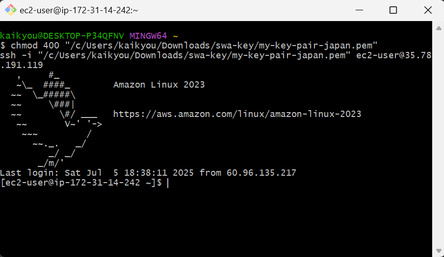
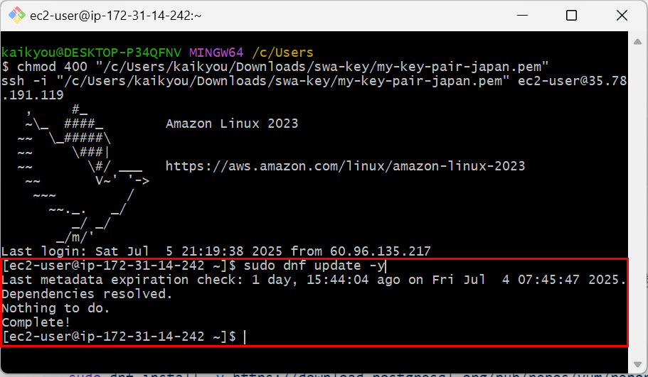
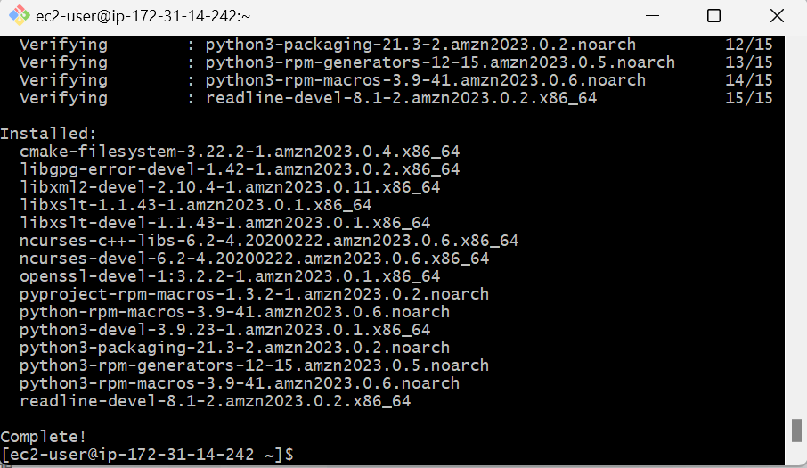
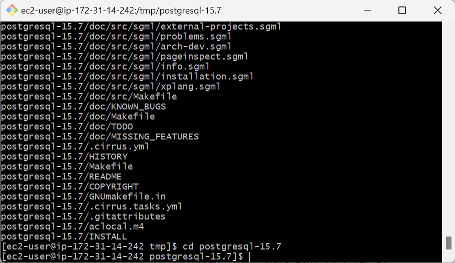
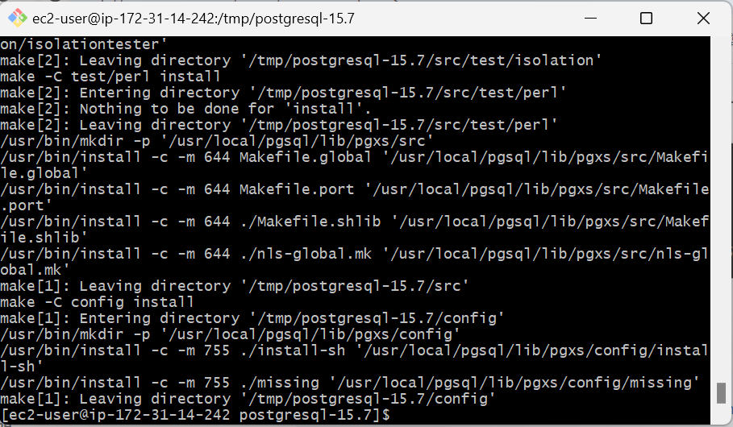
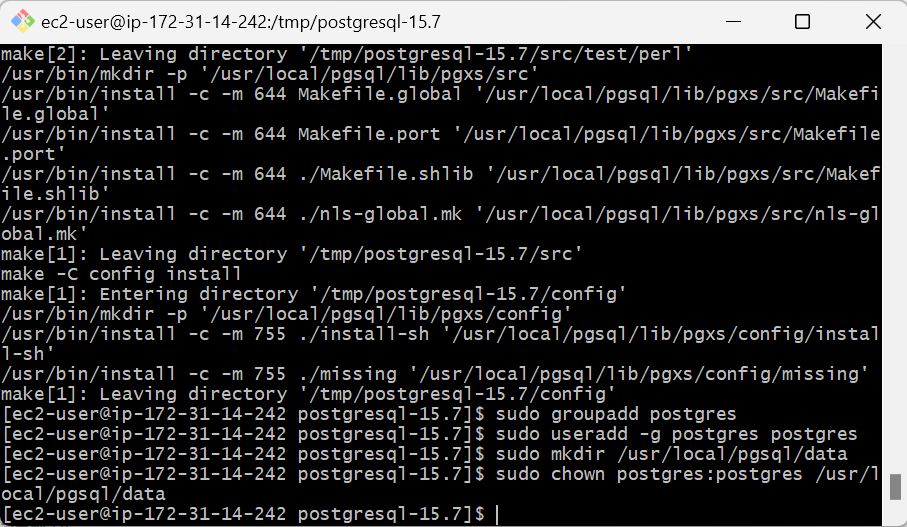
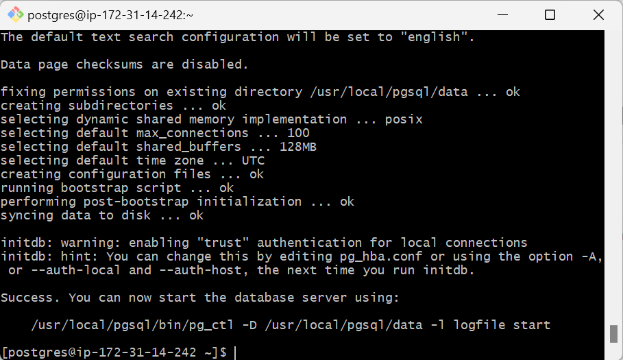
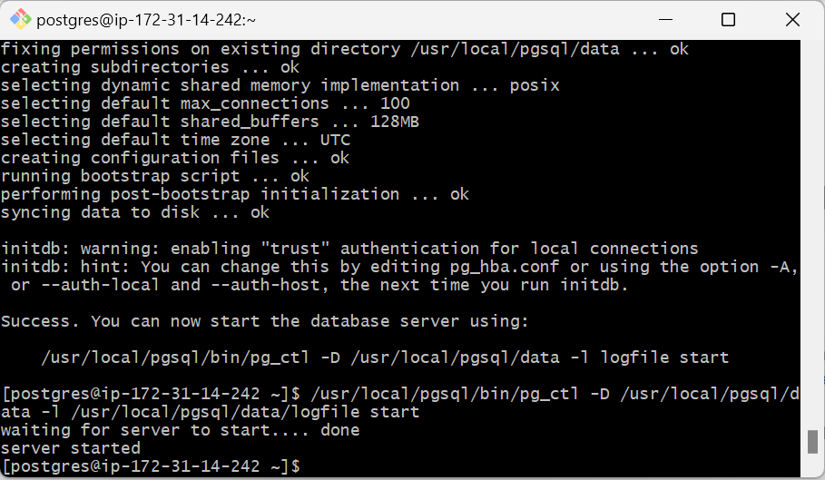
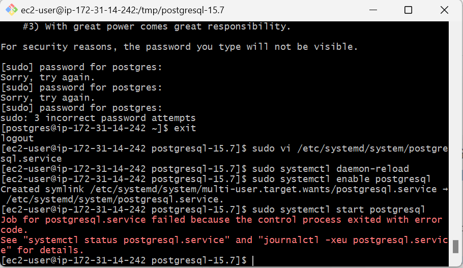

# Amazon Linux 2023 に PostgreSQL 15 をインストール

Amazon Linux 2023 に **PostgreSQL 15** をインストールする手順を以下にまとめます。

---

## 🪜 SSH 接続しておきます

```bash
chmod 400 "/c/Users/kaikyou/Downloads/swa-key/my-key-pair-japan.pem"
ssh -i "/c/Users/kaikyou/Downloads/swa-key/my-key-pair-japan.pem" ec2-user@35.78.191.119
```



Amazon Linux 2023 に PostgreSQL 15 をインストールする手順は以下の通りです：

### パッケージの更新

まず、システムを最新の状態に更新します。

```bash
sudo dnf update -y
```



## ✅ PostgreSQL 15 をソースからインストール

以下は Amazon Linux 2023 (EL9) で **PostgreSQL 15 をソースから手動でインストール**する方法です。

---

### 1. 必要なパッケージをインストール

```bash
sudo dnf groupinstall "Development Tools" -y
sudo dnf install -y readline-devel zlib-devel openssl-devel libxml2-devel libxslt-devel python3-devel
```



### 2. PostgreSQL ソースコードのダウンロード

```bash
cd /tmp
wget https://ftp.postgresql.org/pub/source/v15.7/postgresql-15.7.tar.gz
tar -zxvf postgresql-15.7.tar.gz
cd postgresql-15.7
```



### 3. コンパイルとインストール

```bash
./configure --prefix=/usr/local/pgsql --with-openssl
make
sudo make install
```



### 4. PostgreSQL ユーザーとディレクトリの作成

```bash
sudo groupadd postgres
sudo useradd -g postgres postgres
sudo mkdir /usr/local/pgsql/data
sudo chown postgres:postgres /usr/local/pgsql/data
```



### 5. 初期化（データベースクラスタを作成）

```bash
sudo su - postgres
/usr/local/pgsql/bin/initdb -D /usr/local/pgsql/data
```



### 6. PostgreSQL サービス起動

```bash
/usr/local/pgsql/bin/pg_ctl -D /usr/local/pgsql/data -l /usr/local/pgsql/data/logfile start
```



### 7. 自動起動設定（オプション）

`/etc/systemd/system/postgresql.service` を作成：

```bash
sudo vi /etc/systemd/system/postgresql.service
```

以下の中身を貼り付けて保存してください：

```ini
[Unit]
Description=PostgreSQL database server
Documentation=https://www.postgresql.org/docs/15/
After=network.target

[Service]
Type=forking
User=postgres
Group=postgres
ExecStart=/usr/local/pgsql/bin/pg_ctl -D /usr/local/pgsql/data start
ExecStop=/usr/local/pgsql/bin/pg_ctl -D /usr/local/pgsql/data stop
Restart=on-failure
PrivateTmp=true

[Install]
WantedBy=multi-user.target
```

🟡[vi で自動起動の設定方法](vi.postgresql.service)

次にサービスを有効化して起動します：

```bash
sudo systemctl daemon-reload
sudo systemctl enable postgresql
sudo systemctl start postgresql
```

❗「Job for postgresql.service failed because the control process exited with error code.
See "systemctl status postgresql.service" and "journalctl -xeu postgresql.service" for details.
」というエラー発生！

🟢 [エラー解決方法](start.err)

### 8. 動作確認

```bash
psql -c "SELECT version();"
```

---

### 🔒 外部接続許可（オプション）

#### `pg_hba.conf` と `postgresql.conf` は以下の場所にあります：

- `/usr/local/pgsql/data/pg_hba.conf`
- `/usr/local/pgsql/data/postgresql.conf`

上記ファイルを編集し、必要に応じて外部からの接続を許可してください。

---

必要であれば、EC2 のセキュリティグループでポート `5432` を開放してください。

---

このようにして、ソースから PostgreSQL 15 をインストールできます。  
何か問題があればお知らせください！

# chatgpt 失敗案

Amazon Linux 2023 に **PostgreSQL 15** を **PostgreSQL 公式リポジトリ**（`yum.postgresql.org`）からインストールする手順は以下の通りです。

---

### ✅ 手順：PostgreSQL 15 を公式リポジトリからインストール（Amazon Linux 2023）

#### 1. **PostgreSQL 公式リポジトリ RPM のインストール**

```bash
sudo dnf install -y https://download.postgresql.org/pub/repos/yum/15/redhat/rhel-9-x86_64/pgdg-redhat-repo-latest.noarch.rpm
```

> 💡 Amazon Linux 2023 は RHEL 9 互換です。

---

#### 2. **Amazon Linux のデフォルト PostgreSQL モジュールを無効化**

```bash
sudo dnf -qy module disable postgresql
```

> これをしないと、Amazon Linux の AppStream の PostgreSQL が優先されてしまいます。

---

#### 3. **PostgreSQL 15 クライアントとサーバーをインストール**

```bash
sudo dnf install -y postgresql15 postgresql15-server
```

---

#### 4. **データベースの初期化**

```bash
sudo /usr/pgsql-15/bin/postgresql-15-setup initdb
```

---

#### 5. **PostgreSQL サーバーの起動と自動起動設定**

```bash
sudo systemctl enable --now postgresql-15
```

---

#### 6. **起動確認**

```bash
sudo systemctl status postgresql-15
```

---

#### 7. **psql の動作確認（デフォルトの postgres ユーザーで）**

```bash
sudo -i -u postgres
psql
```

終了は `\q` と入力。

---

### ✅ 補足

- `psql` コマンドがすぐ使えるようにするには、PATH に `/usr/pgsql-15/bin/` を追加するか、`alias` を作成してください。

  ```bash
  echo 'export PATH=/usr/pgsql-15/bin:$PATH' >> ~/.bashrc
  source ~/.bashrc
  ```

---

### 🔒 セキュリティ設定（任意）

- `pg_hba.conf` の編集（信頼/パスワード認証の切り替え）
- ポート開放（AWS セキュリティグループで `5432` を許可）

---

何か自動起動に失敗したり、`psql` が見つからないなどがあれば、気軽にお知らせください。

## ✅ 次にやるべきこと（listen_addresses の設定）

ここからは、外部接続を許可する設定です。

---

### 🔸 6. 設定ファイルの場所を確認

```bash
sudo -u postgres psql -c "SHOW config_file;"
```

たとえば `/var/lib/pgsql/data/postgresql.conf` が表示されたら、そのファイルを編集します。

---

### 🔸 7. 設定ファイルの編集

```bash
sudo vi /var/lib/pgsql/data/postgresql.conf
```

以下の行を探し、次のように変更（または追記）：

```conf
listen_addresses = '*'
```

※ `#` を削除して有効化します。

---

### 🔸 8. `pg_hba.conf` の編集（外部 IP から接続を許可する）

```bash
sudo vi /var/lib/pgsql/data/pg_hba.conf
```

以下のような 1 行を追加します（例：IPv4 全体を許可。ただしセキュリティには注意）：

```
host    all             all             0.0.0.0/0               md5
```

※ 限定した IP だけ許可したい場合は `0.0.0.0/0` の部分を変更します。

---

### 🔸 9. PostgreSQL の再起動

```bash
sudo systemctl restart postgresql
```

---

## 🎉 これで完了です！

必要であれば、以下もご案内できます：

- PostgreSQL ユーザーの作成とパスワード設定
- 外部クライアント（pgAdmin など）からの接続確認
- ファイアウォールやセキュリティグループの設定（EC2）

ご希望があればお知らせください。
