# Graphiti MCP Server を利用する手順

### ⚛️①docker を起動する

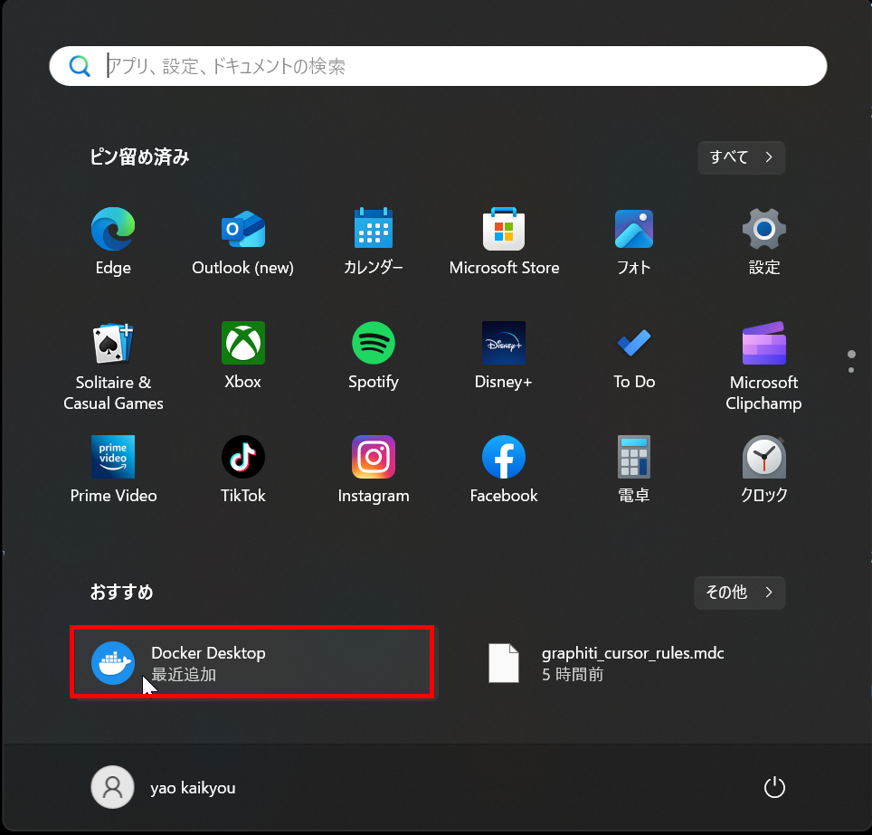
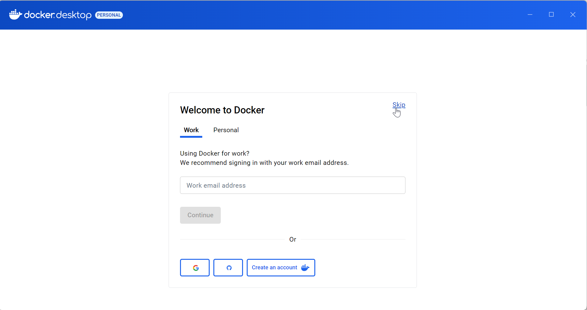
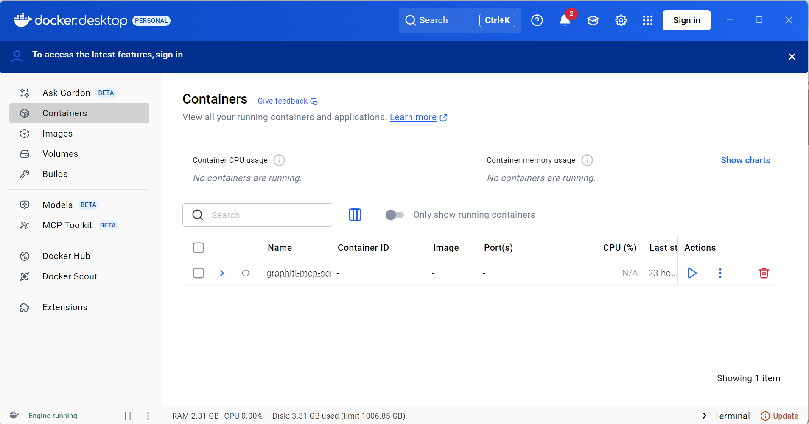

### ⚛️②Neo4j Desktop 2 を起動する

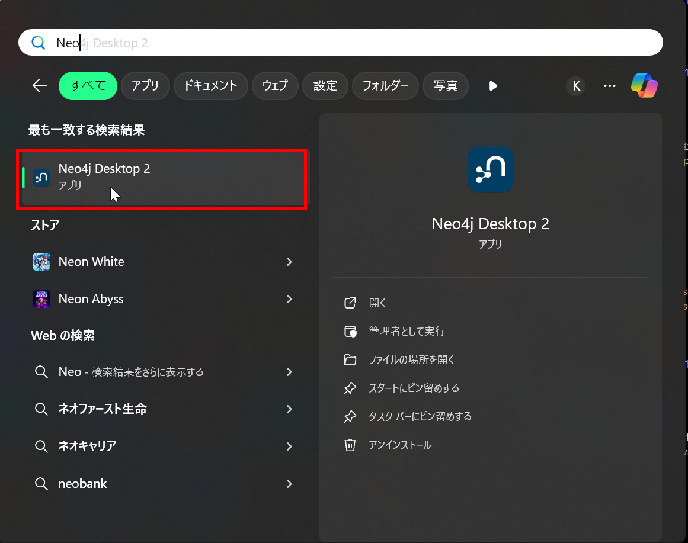
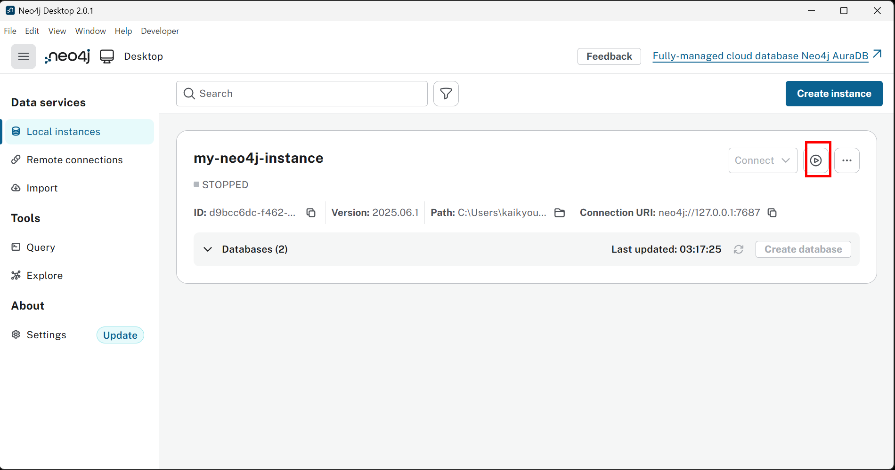
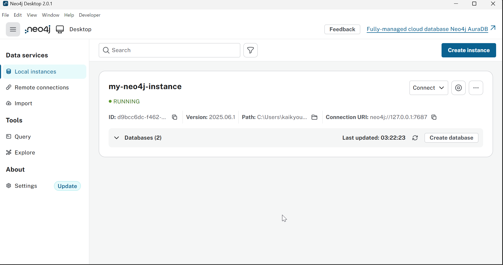

### ⚛️③docker で Graphiti MCP Server を起動する

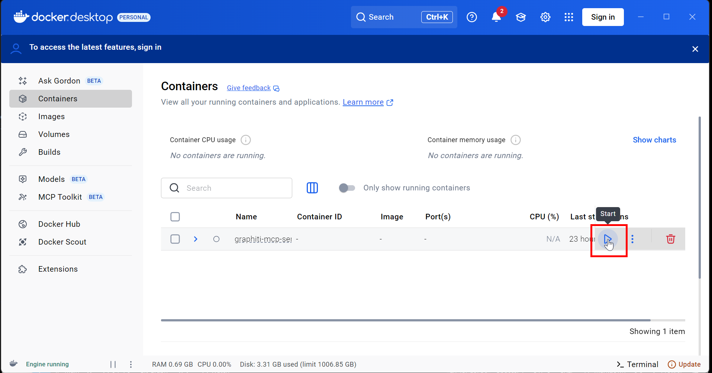
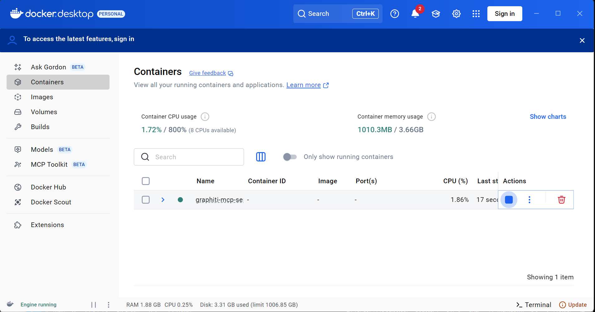

### ⚛️④Docker コンテナを起動する

```bash
cc D:\graphiti-mcp-server

docker compose up -d
```

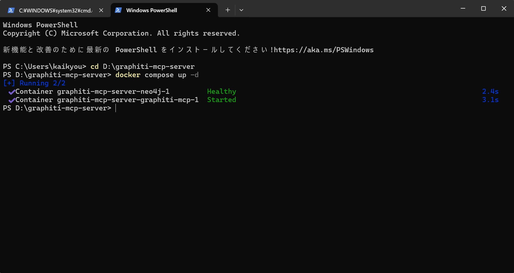

### ⚛️⑤Trae を起動する

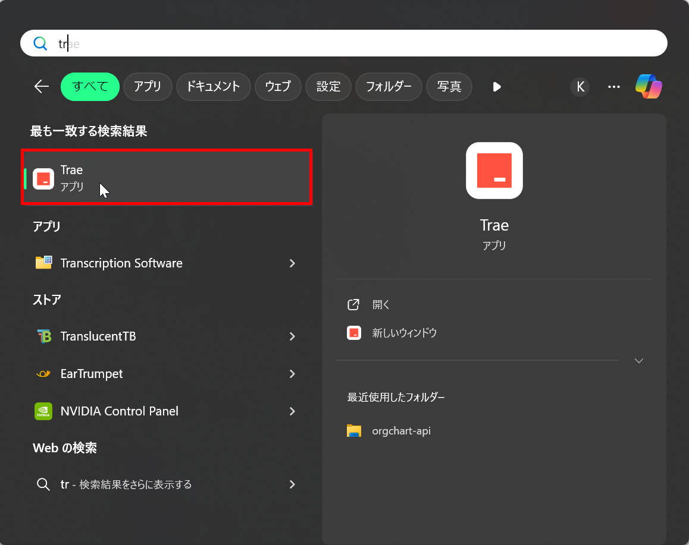
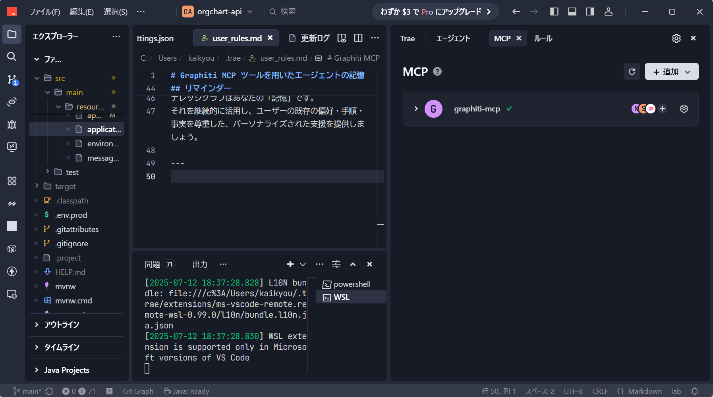

### ⚛️⑥Neo4j ブラウザでグラフを見る

```bash
http://localhost:7474

```

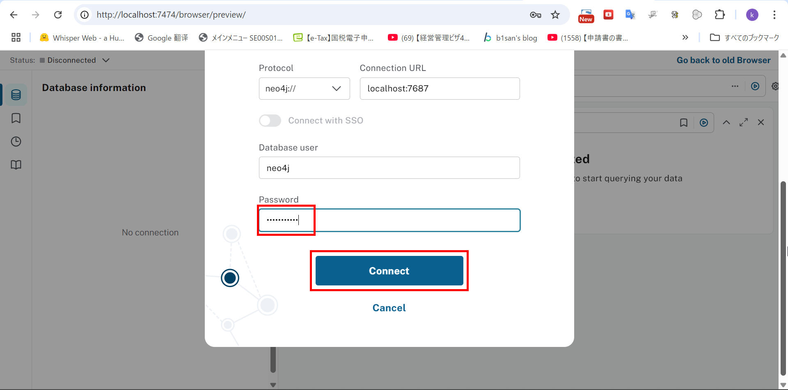
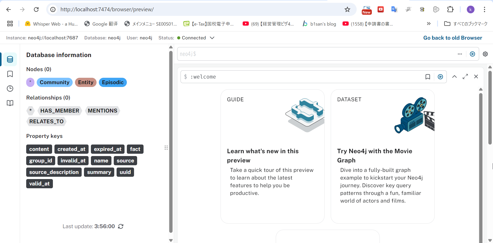
