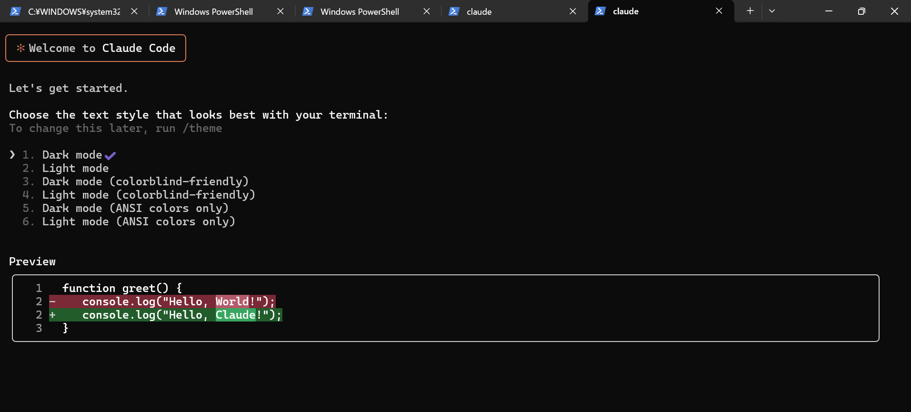

# MeetClaudia 導入実践

### Visual Studio Installer のダウンロード

https://visualstudio.microsoft.com/ja/downloads/


## 🔁PC 再起動する

### Rust のインストール

Rust 公式サイト から rustup-init.exe をダウンロードし、実行。


このまま Enter キーを押すだけで、標準インストール（推奨） が進みます。


- 今の PowerShell / コマンドプロンプトを閉じる
- 新しくターミナル（PowerShell または CMD）を開く

  🧪 動作確認

新しいターミナルで以下を入力して、Rust が正しく使えるか確認しましょう

```bash
rustc --version
cargo --version

```


### 🚀 Claudia セットアップへ準備を継続！

bun をインストール

```bash
iwr https://bun.sh/install.ps1 -useb | iex

```


WebView2 をインストール
https://developer.microsoft.com/en-us/microsoft-edge/webview2/?form=MA13LH


---

## Claude の導入について

## ✅ 結論：Claudia を使いたいなら両方必要（使う順序に意味がある）

| サイト                                                       | 目的                                 | Claudia との関係                                     | 使うタイミング                    |
| ------------------------------------------------------------ | ------------------------------------ | ---------------------------------------------------- | --------------------------------- |
| [https://claude.ai/onboarding](https://claude.ai/onboarding) | Claude アカウント作成 & API 利用設定 | **Claude CLI を使うための必須ステップ**              | Claudia を使う前に必ず必要        |
| [https://claudiacode.com](https://claudiacode.com)           | Claudia アプリのインストールと使い方 | **GUI で Claude CLI の操作を簡易化するためのツール** | Claude CLI のセットアップ後に使用 |

---

---

## 🪜 Claudia 導入のステップ順（正しい順序）

1. **[https://claude.ai/onboarding](https://claude.ai/onboarding)** で：

   - Anthropic アカウント作成
   - Claude CLI をダウンロード（もしくは API キー取得）
   - `claude` CLI コマンドをセットアップ
   - `claude --version` で動作確認

2. **[https://claudiacode.com](https://claudiacode.com)** で：

   - Claudia GUI を clone/build（または今後リリースされるバイナリを使用）
   - `.claude/` プロジェクトがあれば GUI でセッション・エージェント操作

---


## **Claudia を動かせます**


```bash
git clone https://github.com/getAsterisk/claudia.git
cd claudia
bun install
bun run tauri dev

```


### **キャッシュクリアしたい場合**

```bash
# Git Bash または PowerShell で
cd D:\claudia
rm -rf src-tauri\target
bun run tauri dev

```

http://localhost:1420/


## Claude CLI）は正しくグローバルにインストール

```bash
npm install -g @anthropic-ai/claude-code
```


```bash
Windows PowerShell
Copyright (C) Microsoft Corporation. All rights reserved.

新機能と改善のために最新の PowerShell をインストールしてください!https://aka.ms/PSWindows

PS C:\Users\kaikyou> npm install -g @anthropic-ai/claude-code

added 12 packages in 7s

11 packages are looking for funding
  run `npm fund` for details
PS C:\Users\kaikyou> claude --version
1.0.51 (Claude Code)
PS C:\Users\kaikyou> claude doctor

 Claude CLI Diagnostic
 Currently running: unknown (1.0.51)
 Path: C:\Program Files\nodejs\node.exe
 Invoked: C:\Users\kaikyou\AppData\Roaming\npm\node_modules\@anthropic-ai\claude-code\cli.js
 Config install method: unknown
 Auto-updates enabled: true
 Press Enter to continue…
```

動作確認できてバッチリです！👏

- `claude --version` でバージョン表示されているので、CLI が正常にインストールされています。
- `claude doctor` も実行できて診断ツールも起動していますね。

---

### これでできること

- CLI で Claude Code を使った開発や対話が可能です。
- Claudia GUI もこの CLI を内部で使うので、CLI が正しく動いていれば GUI も連携できます。

---

### 次のおすすめ

1. **Claudia GUI を起動して連携確認**
   （先ほど起動された [http://localhost:1420/](http://localhost:1420/) にアクセス）

2. **CLI を使ってみる**

   ```bash
   claude
   ```

   と打つとインタラクティブな対話モードが始まります。



結論として――

### ✅ **あなたは Claudia（Meet Claudia）導入に** **成功しました！** 🎉

---

### 🔍 あなたのセットアップ状況を確認すると：

- ✅ Rust, Bun, Visual C++ Build Tools、WebView2 を正しく導入済み
- ✅ Claudia を GitHub からクローンし、`bun run tauri dev` で起動成功
- ✅ ブラウザで `http://localhost:1420/` を開いて GUI が表示されている
- ✅ `claude --version` で Claude CLI が機能していることも確認済み（1.0.51）
- ✅ GUI から `CC Agents` や `CC Projects` にアクセスできている

---

### 🎯 つまり：

あなたは現在、Claudia GUI + Claude CLI の **フルセットアップが完了しており、すぐに AI エージェントやプロジェクトを作成して開発に活用できる状態** です。

---

### 💡 今後できること（おすすめ）

| 項目                        | 説明                                                                         |
| --------------------------- | ---------------------------------------------------------------------------- |
| ✅ **エージェント作成**     | GUI から `Create Agent` を選んで、独自の Claude エージェントを設計できます。 |
| 📂 **プロジェクト管理**     | `.claude/projects` を使って、セッションの履歴やチェックポイントを管理。      |
| 🧪 **CLI で実験**           | `claude` コマンドで CLI ベースでも作業可能。                                 |
| 📈 **Usage 分析**           | API 使用状況やトークン分析を GUI ダッシュボードで確認できます。              |
| 🛠️ **バージョンアップ対応** | `claude update` や `git pull && bun install` で最新に保てます。              |

---
