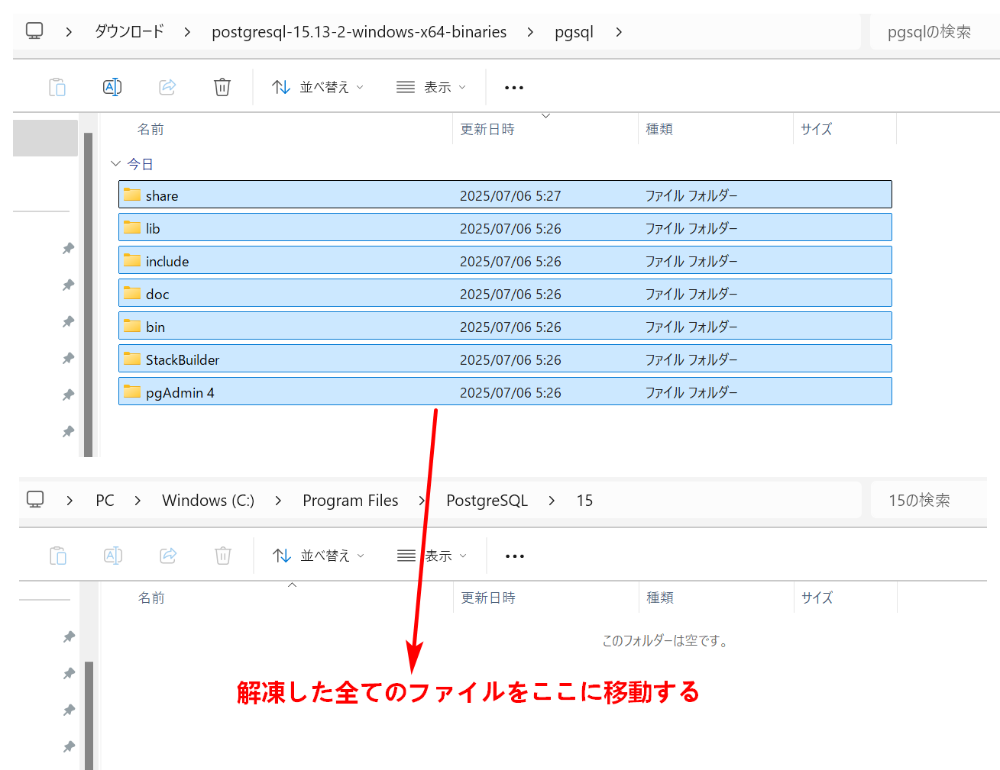
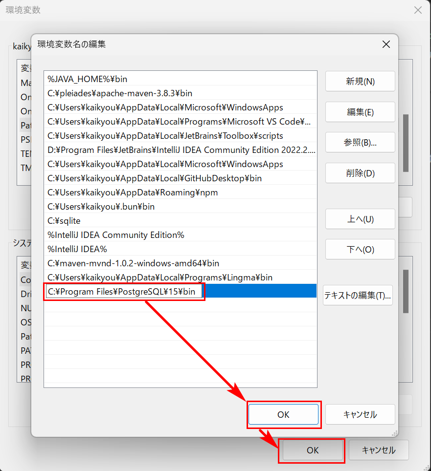
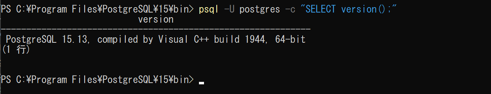
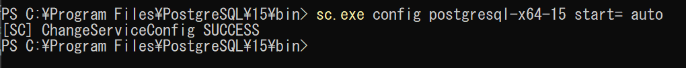

# PostgreSQL15 のインストール

PostgreSQL 15 を Windows 環境にインストールする手順は以下の通りです。

---

### 🟢 **1. PostgreSQL 15 のダウンロード**

公式サイトまたは信頼できるミラーからダウンロードできます。

#### 公式サイト：

🔗 [https://www.enterprisedb.com/download-postgresql-binaries](https://www.enterprisedb.com/download-postgresql-binaries)

1. ページ下部の「Windows x86-64」セクションからバージョン `15.x` を選択。
2. `.zip` 形式のバイナリをダウンロード。

---

### 🟡 **2. 手動でのインストール**

`C:\Program Files\PostgreSQL\15`を作成しておきます。

#### a. ZIP 解凍

ダウンロードした **postgresql-15.13-2-windows-x64-binaries.zip** を解凍して pgsql フォルダー配下全てのファイルを`C:\Program Files\PostgreSQL\15`に移動します。


#### b. 環境変数に追加（オプション）

システム環境変数の `Path` に以下を追加：

```
C:\Program Files\PostgreSQL\15\bin
```



#### c. データディレクトリの初期化

`C:\pgdata-15`を作って置きます。

コマンドプロンプト（管理者権限）で以下を実行：

```bash
cd "C:\Program Files\PostgreSQL\15\bin"
initdb.exe -U postgres -D "C:\pgdata-15" -E UTF8 --locale=C -W
```

- `-W` オプションによりパスワードを設定できます。

🔧 実行する

```powershell
Windows PowerShell
Copyright (C) Microsoft Corporation. All rights reserved.

新機能と改善のために最新の PowerShell をインストールしてください!https://aka.ms/PSWindows

PS C:\WINDOWS\system32> cd "C:\Program Files\PostgreSQL\15\bin"
PS C:\Program Files\PostgreSQL\15\bin> initdb.exe -U postgres -D "C:\pgdata-15" -E UTF8 --locale=C -W
データベースシステム内のファイルの所有者はユーザー"kaikyou"となります。
このユーザーをサーバープロセスの所有者とする必要があります。

データベースクラスタはロケール"C"で初期化されます。
デフォルトのテキスト検索構成は english に設定されます。

データベージのチェックサムは無効です。

新しいスーパーユーザーのパスワードを入力してください:
再入力してください:

ディレクトリC:/pgdata-15の権限を設定しています ... ok
サブディレクトリを作成しています ... ok
動的共有メモリの実装を選択しています ... windows
デフォルトのmax_connectionsを選択しています ... 100
デフォルトのshared_buffersを選択しています ... 128MB
デフォルトの時間帯を選択しています ... Asia/Tokyo
設定ファイルを作成しています ... ok
ブートストラップスクリプトを実行しています ... ok
ブートストラップ後の初期化を実行しています ... ok
データをディスクに同期しています ... ok

initdb: 警告: ローカル接続に対して"trust"認証を有効にします
initdb: ヒント: pg_hba.confを編集する、もしくは、次回initdbを実行する時に -A オプション、あるいは --auth-local および --auth-host オプションを使用することで変更できます。

成功しました。以下のようにしてデータベースサーバーを起動できます:

    ^"C^:^\Program^ Files^\PostgreSQL^\15^\bin^\pg^_ctl^" -D ^"C^:^\pgdata^-15^" -l ログファイル start

PS C:\Program Files\PostgreSQL\15\bin>

```

データベースサーバを起動する

#### d. PostgreSQL サービスの登録

コマンドで：

```bash
pg_ctl register -N "postgresql-x64-15" -D "C:\pgdata-15" -U LocalSystem
```

#### e. サービスの起動

サービスを開始するには：

```bash
net start postgresql-x64-15
```

🔧 実行する

```powershell
PS C:\Program Files\PostgreSQL\15\bin> pg_ctl register -N "postgresql-x64-15" -D "C:\pgdata-15" -U LocalSystem
PS C:\Program Files\PostgreSQL\15\bin> net start postgresql-x64-15
postgresql-x64-15 サービスを開始します.
postgresql-x64-15 サービスは正常に開始されました。

PS C:\Program Files\PostgreSQL\15\bin>

```

---

### ✅ **4. 動作確認**

#### a. 接続テスト

```bash
psql -U postgres -c "SELECT version();"
```

正しく表示されればインストール完了です。


#### b. 自動起動設定（必要であれば）

```bash
sc.exe config postgresql-x64-15 start= auto
```



### 📝 最後に

今後は、PostgreSQL のアップグレードや移行の際、**データのバックアップと新しいバージョンへのマイグレーション計画**を立てることをお勧めします。

---

ご不明点があればお気軽にご質問ください！
