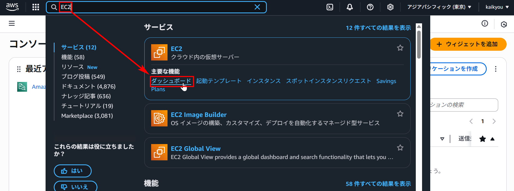
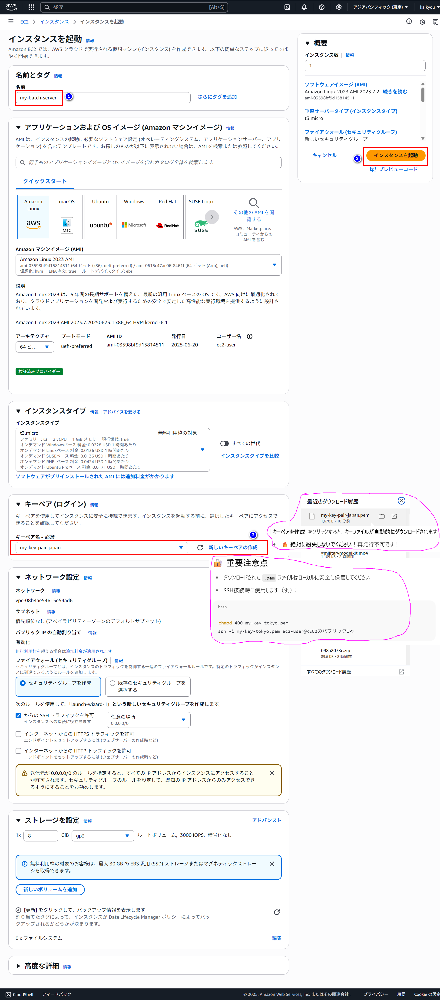

# aws アカウントとインスタンスの作成

[AWS 公式サイト](https://ap-northeast-1.console.aws.amazon.com/console/home?region=ap-northeast-1#)

## ✅ 新規アカウント作成してログインする


## ✅「EC2 ダッシュボード」に移動します







### . Spring Boot 用ポートの追加

以下の新しいインバウンドルールを追加：

```
タイプ: カスタムTCP
ポート範囲: 8080
ソース: 0.0.0.0/0 (または特定のIPアドレス)
説明: Spring Boot Application
```

### . 推奨セキュリティグループ設定

```
SSH         TCP  22    0.0.0.0/0      (管理用)
HTTP        TCP  80    0.0.0.0/0      (Webアクセス)
HTTPS       TCP  443   0.0.0.0/0      (HTTPS)
Custom TCP  TCP  8080  0.0.0.0/0      (Spring Boot)
PostgreSQL  TCP  5432  10.0.0.0/8     (DBアクセス - VPC内のみ)
```

これで Spring Boot アプリケーション（通常ポート 8080）にアクセスできるようになります。


