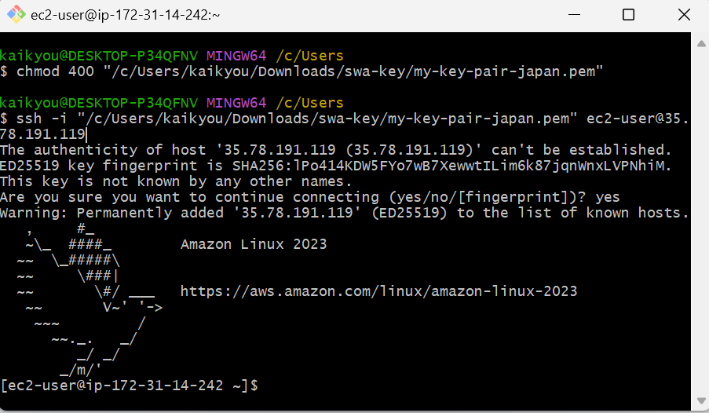

# インスタンス起動後の作業

はい、その通りです。
EC2 インスタンスの作成手順が完了したら、**最後に「インスタンスを起動」ボタンを押してインスタンスを起動**してください。

---

### ✅ 確認ポイント（ボタンを押す前に）

1. **AMI**：Amazon Linux 2023（OK か確認）
2. **インスタンスタイプ**：`t3.micro`（無料枠対象）
3. **キーペア**：指定済み・`.pem`ファイルをダウンロード済み
4. **セキュリティグループ**：

   - ポート 22（SSH）：自分の IP のみ許可
   - ポート 80（HTTP）：`0.0.0.0/0`（開発中のみ許可）
   - ポート 443（HTTPS）：`0.0.0.0/0`（開発中のみ許可）

---

### ✅ 次にやること

インスタンスが起動したら、以下の手順で進めます：

| ステップ | 内容                                     |
| -------- | ---------------------------------------- |
| ✅ 1     | **パブリック IP** を確認する             |
| ✅ 2     | SSH で接続してみる                       |
| ✅ 3     | Java 21 をインストールする               |
| ✅ 4     | Spring Boot アプリをアップロードして起動 |
| ✅ 5     | 必要であれば PostgreSQL (RDS) を接続     |

---

### 🧪 SSH 接続のサンプル（Mac/Linux）

```bash
chmod 400 my-key.pem
ssh -i my-key.pem ec2-user@<パブリックIPv4アドレス>
```

---

**インスタンス起動後、パブリック IP が表示されますので、それを教えていただければ SSH 接続コマンドを一緒に作成できます。**
次に進める準備ができたら教えてください！

## ✅ 1 パブリック IP を確認する


## ✅ 2 SSH で接続してみる

```bash
chmod 400 "/c/Users/kaikyou/Downloads/swa-key/my-key-pair-japan2.pem"
ssh -i "/c/Users/kaikyou/Downloads/swa-key/my-key-pair-japan2.pem" ec2-user@13.114.183.62
```



## ✅ 3 Java 21 をインストールする

① sudo 権限で root に昇格する手順

```bash
sudo su -
```

これを実行すると、次のように表示が変わります：

```bash
[root@ip-172-31-14-242 ~]#
```


これで root 権限（管理者モード）になったことが確認できます。

② Amazon Corretto 21 をインストール

```bash
dnf install java-21-amazon-corretto -y
```


③ Java のバージョン確認

```
java -version
```


## ✅ 4 データベースを構築

[データベース構築手順](aws-account02_2)

## ✅ 5 Spring Boot アプリをアップロードして起動

では、次は **Spring Boot アプリ（`.jar`）を EC2 上にアップロードして起動**する手順を進めましょう。

---

## 📦 Step 1: build して `.jar` をローカル PC で作成

もしまだ作成していなければ、Windows の PowerShell や Git Bash 上で次のコマンドを実行してください：

```bash
# プロジェクトルートで
./mvnw clean package -DskipTests
```

- `./mvnw`（または `mvn`）を使って、`target/orgchart-api-0.0.1-SNAPSHOT.jar` が生成されます。
- `-DskipTests` によってテストをスキップし、短時間でビルドできます。

---

## ↔ Step 2: `.jar` を EC2 に転送（SCP を使う）

PowerShell または Git Bash に以下を入力し、先ほどダウンロードした `.pem` キーと生成された `.jar` を指定します：

⚠️ 注意:例を挙がるだけで実行できない ❗

```bash
scp -i "/c/Users/kaikyou/Downloads/swa-key/your-key-pair-xxx.pem" \
  /c/path/to/orgchart-api/target/orgchart-api-0.0.1-SNAPSHOT.jar \
  ec2-user@13.114.183.62:/home/ec2-user/
```

- `/c/path/to/…` を実際の `.jar` のあるパスに書き換えてください。
- 転送後は、EC2 の `/home/ec2-user/` に `.jar` ファイルが配置されます。

---

- EC2 からログアウトする必要があります。

```bash
[root@ip-172-31-14-242 ~]# exit
logout
[ec2-user@ip-172-31-14-242 ~]$ exit
logout
Connection to 35.78.191.119 closed.
```

- .jar を EC2 に転送（SCP を使う）🌐 ここから転送する

```bash
scp -i "/c/Users/kaikyou/Downloads/swa-key/my-key-pair-japan2.pem" \
  "/d/eclipse-workspace/orgchart-api/target/orgchart-api-0.0.1-SNAPSHOT.jar" \
  ec2-user@13.114.183.62:/home/ec2-user/
```


## 🔧 Step 3: SSH 接続して `.jar` を配置確認

先程の Git Bash で再度 SSH 接続し、次のコマンドでファイルを確認します：

```bash
chmod 400 "/c/Users/kaikyou/Downloads/swa-key/my-key-pair-japan2.pem"
ssh -i "/c/Users/kaikyou/Downloads/swa-key/my-key-pair-japan2.pem" ec2-user@13.114.183.62
ls -l /home/ec2-user/orgchart-api-0.0.1-SNAPSHOT.jar
```

→ サイズや更新日時が正しければ転送成功です。


---

## ▶️ Step 4: Spring Boot アプリを起動

```bash
java -jar orgchart-api-0.0.1-SNAPSHOT.jar
```

- `application.properties` の設定で `server.port=8081` になっているので、Spring Boot は **ポート 8081** で起動されます。

  ## **❗ 起動エラー発生！！！**

  

## 🔜 [起動エラーの原因分析と問題解決](aws-account03)🔚

---

## 🌐 Step 5: 起動確認（別ターミナルまたはブラウザ）

- ブラウザで `http://35.78.191.119:8081/actuator/health` にアクセス
- または Git Bash で：

```bash
curl http://127.0.0.1:8081/actuator/health
```

→ `{ "status":"UP" }` のような応答が返れば成功です。

---

## ⚙️ Step 6: バックグラウンドで起動（任意）

開発中にターミナルを閉じても継続動作させたい場合、以下の方法が便利です：

```bash
nohup java -jar orgchart-api-0.0.1-SNAPSHOT.jar > spring.log 2>&1 &
```

これでバックグラウンド起動され、ログは `spring.log` に出力されます。

---

## ✅ 6 PostgreSQL (RDS) を接続
