# データベースの構築

## ✅ PostgreSQL15 をインストール

❌ 破棄[PostgreSQL15 インストール手順](AWSPostgreSQL15)

✅🏗️👑[再度 PostgreSQL 15 ソースインストール計画 📦 Step 2 から](AWSPostgreSQL15_sis)

## ✅ pgAdmin をインストール

`pgAdmin` は、PostgreSQL を操作・管理するための **GUI ツール**です。EC2 インスタンス上で使うには、次のような選択肢があります：

---

## ✅ 結論：pgAdmin の使い方（EC2 で）

| 方法                                                                                | 説明                                 | 難易度               |
| ----------------------------------------------------------------------------------- | ------------------------------------ | -------------------- |
| ✅ **ローカル PC に pgAdmin をインストール**して EC2 上の PostgreSQL にリモート接続 | 最も現実的で簡単な方法               | ⭐（おすすめ）       |
| EC2 に pgAdmin4 を Web アプリとしてインストール（Apache + Python + Flask）          | EC2 を GUI 管理サーバにする          | ⭐⭐⭐（構成が複雑） |
| EC2 へ X11 転送して GUI を表示（ssh -X）                                            | GUI 環境が必要（あまり推奨されない） | ⭐⭐⭐⭐             |

---

## ✅ 一番簡単な方法：**ローカル PC の pgAdmin から EC2 上の PostgreSQL に接続**

### 🔹 ステップ 1：pgAdmin をローカル PC にインストール

- [pgAdmin 公式サイト](https://www.pgadmin.org/download/) からダウンロード（Windows/macOS/Linux）してからインストールする
  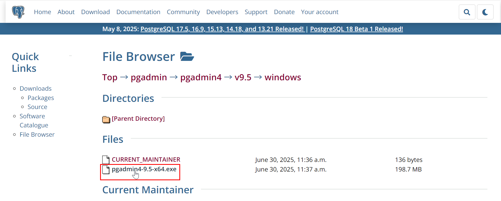

---

- インストール完了してから起動する
  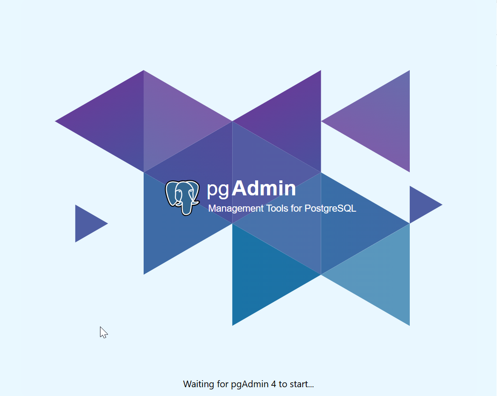
  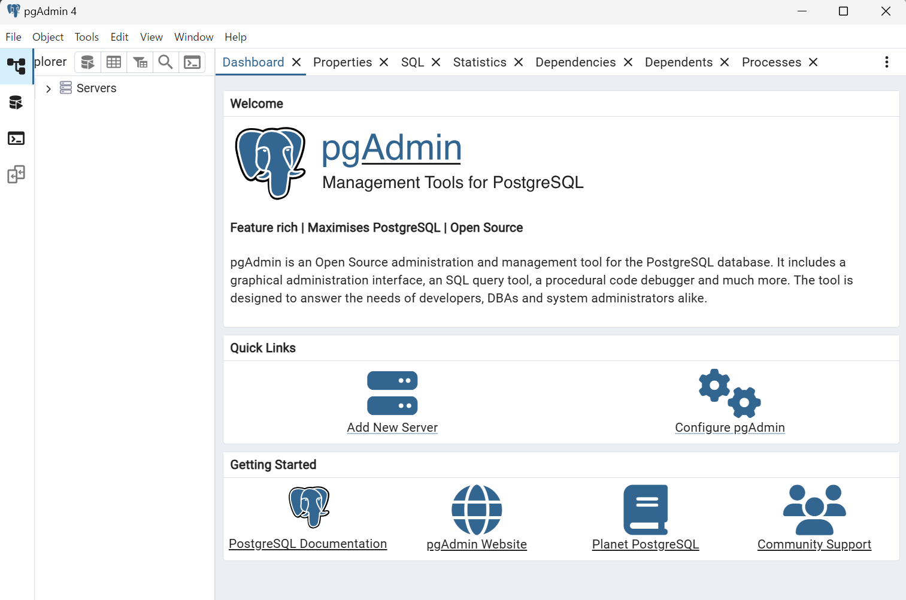
- [pgAdmin の設定について](pg_admin)

### 🔹 ステップ 2：EC2 上の PostgreSQL のポート（通常 5432）を開ける

1. AWS マネジメントコンソールにログイン

   https://ap-northeast-1.console.aws.amazon.com/ec2/home?region=ap-northeast-1#Instances:sort=instanceTypeFilter
   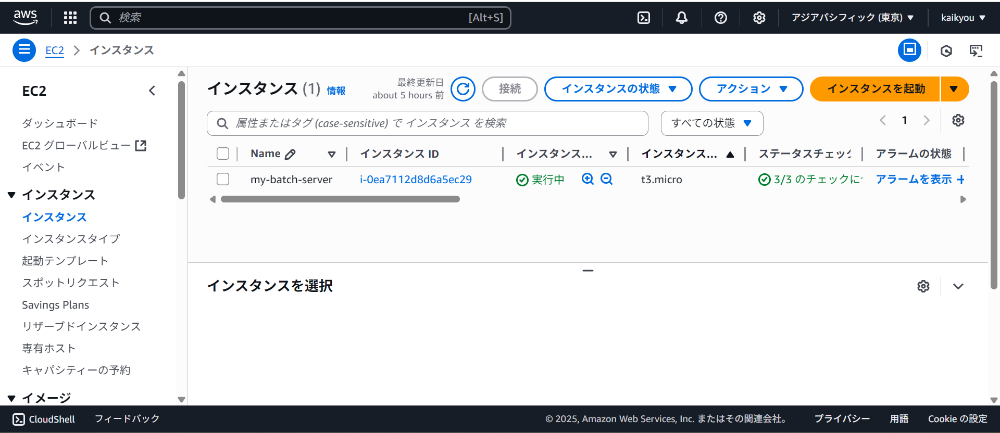
   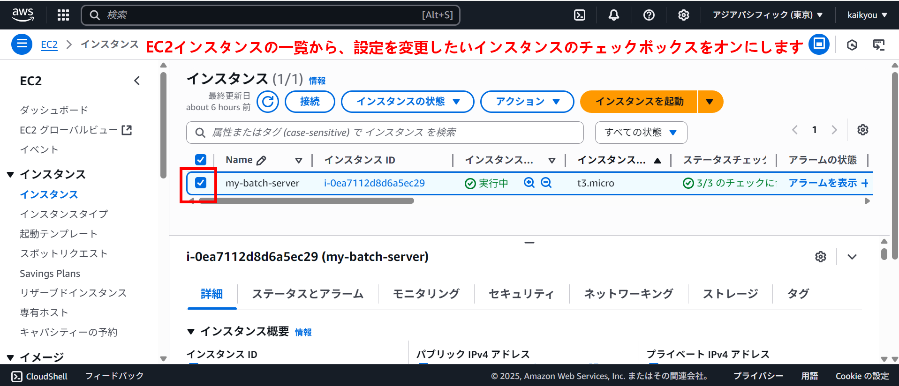

2. 対象の EC2 インスタンスの **セキュリティグループ** を開く
   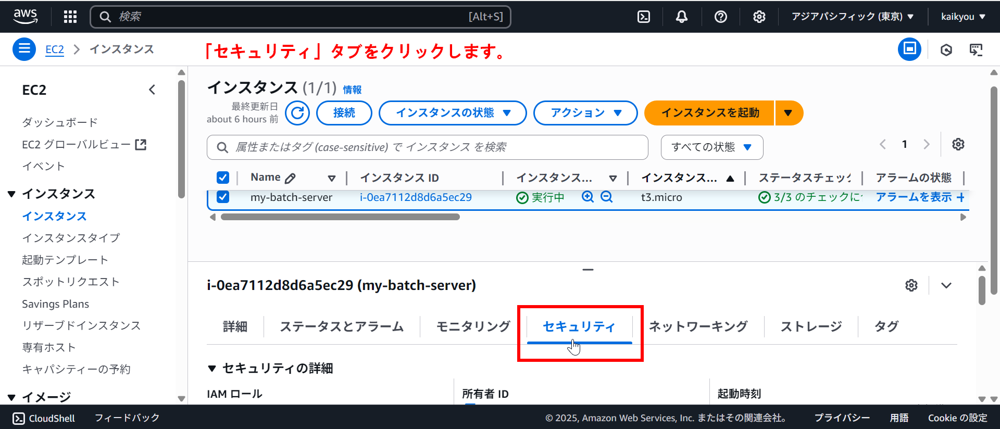
   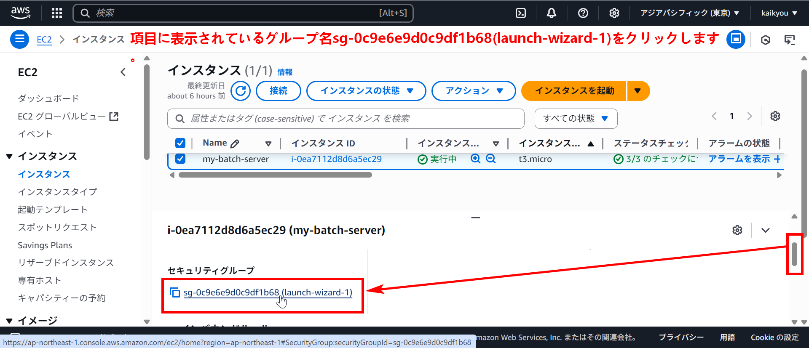
   ** セキュリティグループの編集画面に移動してから画面下部の「Inbound rules (インバウンドルール)」タブをクリックして、そして「Edit inbound rules (インバウンドルールを編集)」ボタンをクリックします。**
   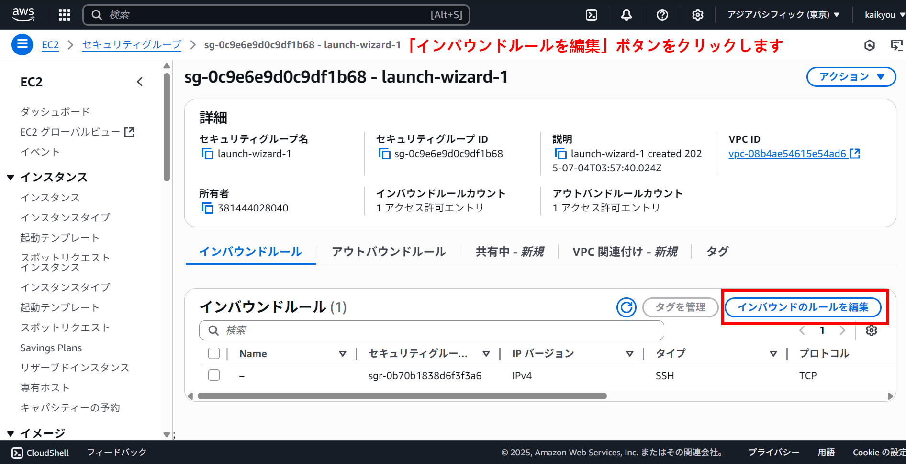
   ** 「Add rule (ルールを追加)」ボタンをクリックします。**
   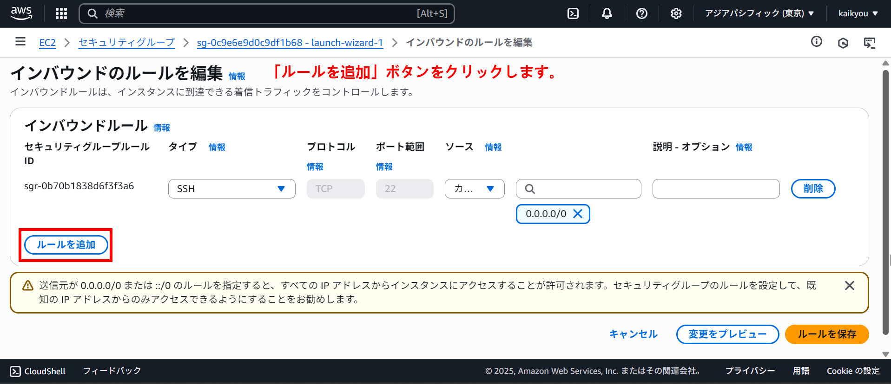
3. インバウンドルールに次を追加：

   - タイプ: PostgreSQL
   - ポート: 5432
   - ソース: あなたの IP（`My IP`ボタンで設定）

📌 **注意**：全開放（0.0.0.0/0）はセキュリティ上危険です！

** Type (タイプ): ドロップダウンリストから「PostgreSQL」を選択します。これを選択すると、自動的にポート範囲が 5432 に設定されます。**
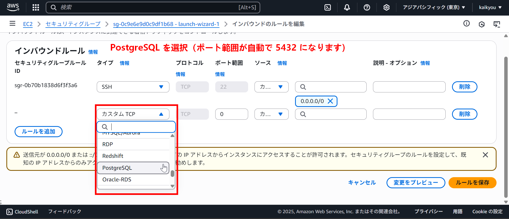
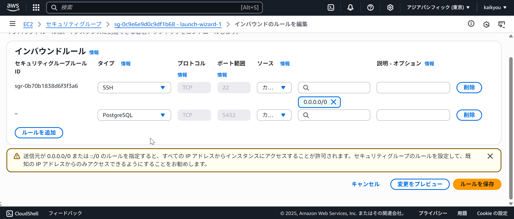
** Source (ソース): ここが重要です。ドロップダウンリストから「My IP」を選択します。これにより、現在あなたがインターネットに接続している PC のグローバル IP アドレスのみが、このポートへのアクセスを許可されます。これはセキュリティ上、最も推奨される設定です。**
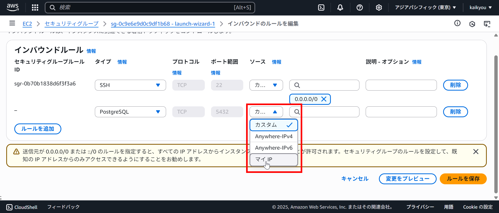
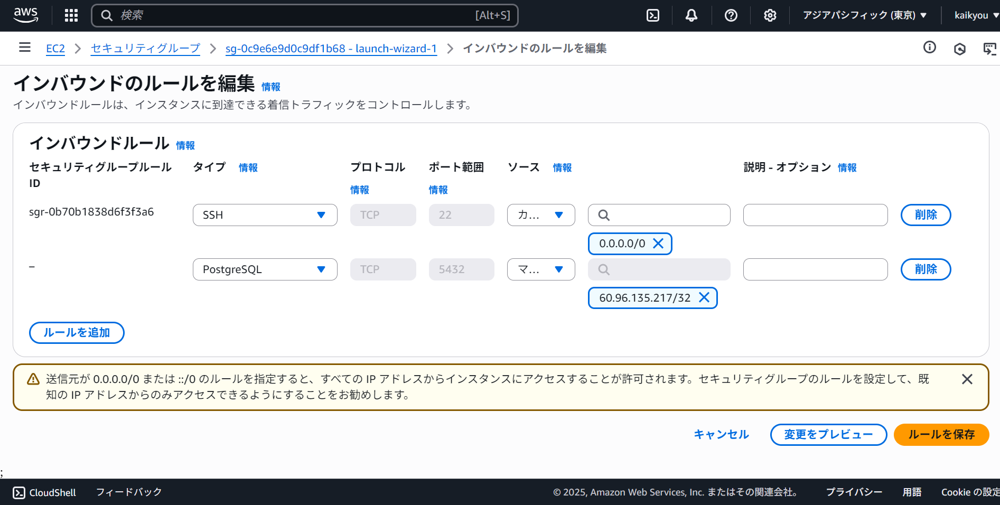
** Description (説明) (オプション): 任意の分かりやすい説明を入力します。例: Allow PostgreSQL from My IP **
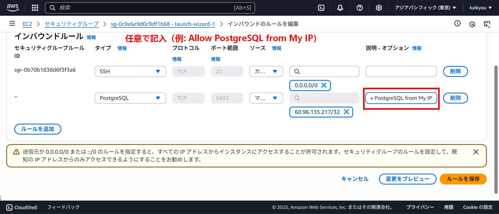
** 設定が完了したら、画面右下の「Save rules (ルールを保存)」ボタンをクリックします。**
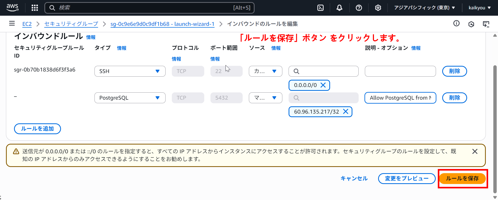
** セキュリティグループの変更が成功しました **
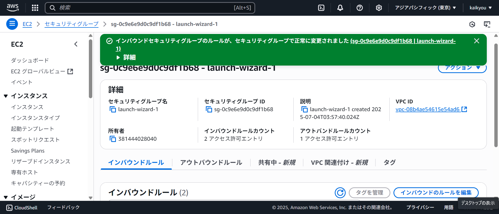

---

### 🔹 ステップ 3：PostgreSQL の設定変更

EC2 に SSH 接続して、次の設定を変更します。

#### 🔸 `/var/lib/pgsql/data/postgresql.conf`（または `/etc/postgresql/...`）

```
listen_addresses = '*'
```

🔧 実行する

```bash
chmod 400 "/c/Users/kaikyou/Downloads/swa-key/my-key-pair-japan2.pem"
ssh -i "/c/Users/kaikyou/Downloads/swa-key/my-key-pair-japan2.pem" ec2-user@13.114.183.62
```

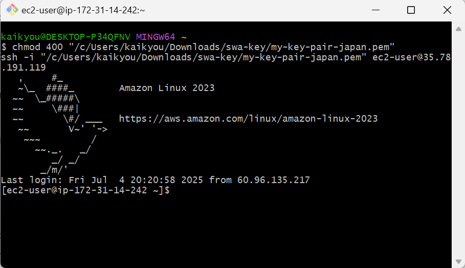
以下は、`vi`（または `vim`）で `postgresql.conf` を編集し、`listen_addresses = '*'` に設定して保存・終了するまでの**具体的な手順**です。

---

## ✅ vi で `listen_addresses = '*'` に設定して保存・終了する手順

### 1. vi を開く

```bash
sudo vi /var/lib/pgsql/data/postgresql.conf
```

---

### 2. 編集対象の行を探す（検索）

vi では、**スラッシュ `/` を使って検索**できます。

```vim
/ listen_addresses
```

と入力し、Enter を押すと `listen_addresses` を含む行にジャンプします。
（先頭のスペースを入れない `/listen_addresses` でも可）

---

### 3. 行を編集する

該当の行が次のようになっているはずです（先頭に `#` があると無効化されています）：

```conf
#listen_addresses = 'localhost'
```

この行を編集するには、まず **編集モード** に入ります：

- カーソルをその行に移動して、`i` を押す（← 挿入モード）

その後、次のように変更してください：

```conf
listen_addresses = '*'
```

※ `#` を削除し、`'localhost'` を `'*'` に変更します。

---

### 4. 編集が完了したら、vi を保存して終了する

以下の操作を行ってください：

1. `Esc` キーを押して編集モードを抜ける
2. 以下を入力して保存＆終了：

```vim
:wq
```

（`:w` は「write ＝保存」、`:q` は「quit ＝終了」）

---

### 🔁 間違えた場合のリセット方法

編集ミスして「やり直したい」と思ったときは：

- `Esc` キーを押してから、次を入力：

```vim
:q!
```

これは「保存せずに終了」です。

---

#### 🔸 `/var/lib/pgsql/data/pg_hba.conf`

以下の行を追加（または修正）：

```
host    all             all             0.0.0.0/0               md5
```

> 必要に応じて `systemctl restart postgresql` で PostgreSQL を再起動します。

---

### 🔹 ステップ 4：pgAdmin から接続

pgAdmin 起動後：

- Host name/address: EC2 の **パブリック IP アドレス**
- Port: `5432`
- Maintenance database: `postgres`
- Username: PostgreSQL のユーザー名（例: `postgres`）
- Password: そのパスワード

---

## 💡 補足：EC2 に `pgAdmin4` を直接インストールしたい場合

可能ですが、以下が必要です：

- Python 3
- Flask
- Apache or Nginx
- pgAdmin の Web バージョンの構成
- `localhost` を外部アクセス可能に変更

→ 初心者にはやや複雑です。ローカルで接続する方法が無難です。

---

## ご希望に応じて：

- セキュリティグループの具体的な設定例
- PostgreSQL の設定ファイルの実物パス（OS 別）
- EC2 の IP に固定接続できる pgAdmin 接続情報テンプレート

などもご案内できます！

どの方法で進めたいか教えてください。
