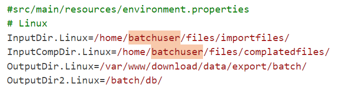
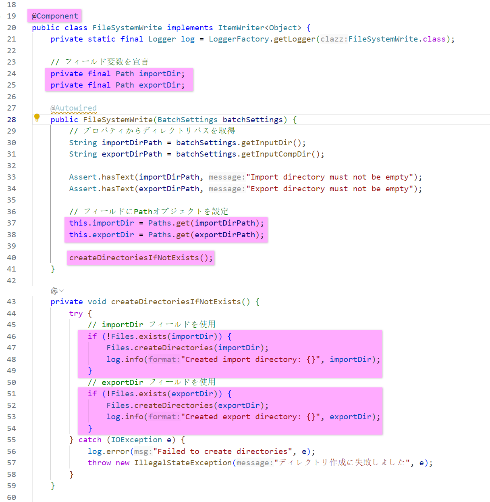
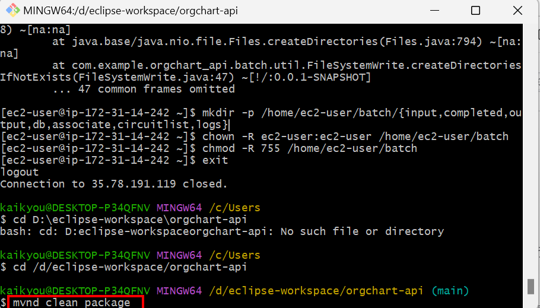
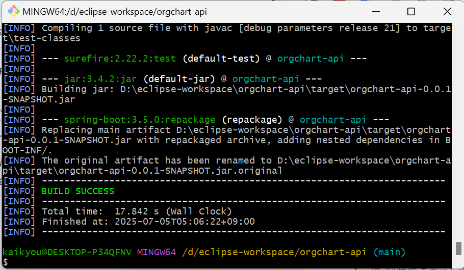
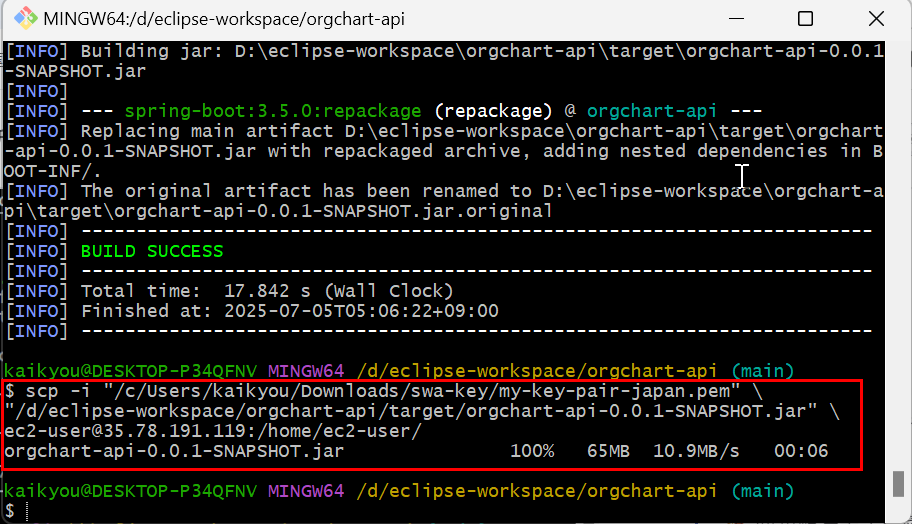
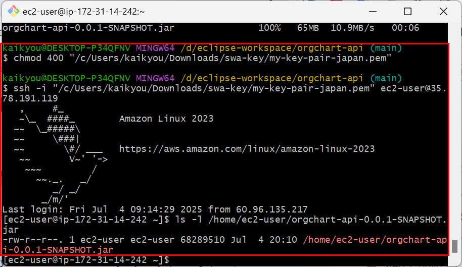

# 起動エラーの原因分析と問題解決

## ❗ エラー内容

```
2025-07-04T09:22:03.877Z ERROR 33638 --- [orgchart-api] [main] c.e.o.batch.util.FileSystemWrite: Failed to create directories
...
Caused by: java.nio.file.AccessDeniedException: /home/batchuser
        at sun.nio.fs.UnixException.translateToIOException(UnixException.java:90)
        ...
        at com.example.orgchart_api.batch.util.FileSystemWrite.createDirectoriesIfNotExists(FileSystemWrite.java:47)
```

## 🙇 事象

FileSystemWrite クラスが/home/batchuser というパスを作成しようとする時に失敗したというエラーです。

## ❓ なぜ、どの設計でどういうタイミングで当該挙動が発生したのですか？

- もとの設計では batchuser というユーザーがバッチ操作を行うため、「/home/batchuser」というパスを設置したからです。
  
- @Component アノテーションが付いている FileSystemWrite クラスは、アプリケーション起動時に Spring によって自動的にインスタンス化され、コンストラクタ内でディレクトリ作成がトリガーされます。
  

## ❌ 結果

上記分析の通り`batchuser` というユーザーが EC2 上に存在しないし、パス `/home/batchuser` ディレクトリも用意していないです。FileSystemWrite クラスがパス `/home/batchuser` ディレクトリを作成しようとしますが、**権限や存在チェックに失敗して `AccessDeniedException` や `NoSuchFileException` が発生する結果**となります。

## 🏗️ 問題解決手法と流れ

[BatchSettings.java](file://d:\eclipse-workspace\orgchart-api\src\main\java\com\example\orgchart_api\batch\util\BatchSettings.java) と [LoadStaffInfoLogic.java](file://d:\eclipse-workspace\orgchart-api\src\main\java\com\example\orgchart_api\batch\component\LoadStaffInfoLogic.java) を確認しました。

---

### 🔍 現在の構造と問題点

### ✅ ファイルパス取得ロジックの流れ：

```
environment.properties
       ↓
BatchSettings.getProperty()
       ↓
FileSystemWrite.importDir = BatchSettings.getInputDir()
       ↓
FileSystemWrite.createDirectoriesIfNotExists() でディレクトリ作成試行
```

### 🚨 問題点：

1. **`/home/batchuser` が存在しない環境ではディレクトリ作成に失敗**
   - 実際には `ec2-user` でログインしているため、権限がない
2. **ハードコーディングされたパスを使用している**
   - `environment.properties` に `/home/batchuser` 固定で記述されている
3. **BatchSettings 経由でしかパスを変更できない**
   - Spring Boot の外部設定（application.properties）や環境変数での柔軟な制御が効かない

---

### ✅ 推奨修正案：パス管理の柔軟性向上

### 1. **Spring の`@Value`で設定値を注入する**

→ [BatchSettings](file://d:\eclipse-workspace\orgchart-api\src\main\java\com\example\orgchart_api\batch\util\BatchSettings.java#L35-L559) だけでなく、[application.properties](file://d:\eclipse-workspace\orgchart-api\target\classes\application.properties) からも指定可能に

### 2. **[environment.properties](file://d:\eclipse-workspace\orgchart-api\target\classes\environment.properties) 内のパスを `/home/ec2-user` に変更**

```properties|CODE_EDIT_BLOCK|d:\eclipse-workspace\orgchart-api\src\main\resources\environment.properties
// ... existing code ...
# Linux
InputDir.Linux=/home/ec2-user/batch/input/
InputCompDir.Linux=/home/ec2-user/batch/completed/
OutputDir.Linux=/home/ec2-user/batch/output/
OutputDir2.Linux=/home/ec2-user/batch/db/
OutputDir3.Linux=/home/ec2-user/batch/associate/
OutputDir4.Linux=/home/ec2-user/batch/circuitlist/
OutputRetireDir.Linux=/home/ec2-user/batch/logs/
```

---

### ✅ 次のステップ：ファイルシステム準備（EC2 側）

### EC2 上で以下のコマンドを実行：

```bash
mkdir -p /home/ec2-user/batch/{input,completed,output,db,associate,circuitlist,logs}
chown -R ec2-user:ec2-user /home/ec2-user/batch
chmod -R 755 /home/ec2-user/batch
```

これにより、アプリケーションがアクセス可能なディレクトリ構造が整います。
[UNIX コマンド説明](aws-account04)

---

### ✅ application.properties にも追加設定（オプション）

```properties|CODE_EDIT_BLOCK|d:\eclipse-workspace\orgchart-api\src\main\resources\application.properties
// ... existing code ...
# バッチ処理用ディレクトリ設定
app.batch.base-dir=/home/ec2-user/batch
app.batch.input-dir=${app.batch.base-dir}/input
app.batch.completed-dir=${app.batch.base-dir}/completed
app.batch.output-dir=${app.batch.base-dir}/output
app.batch.db-dir=${app.batch.base-dir}/db
app.batch.associate-dir=${app.batch.base-dir}/associate
app.batch.circuitlist-dir=${app.batch.base-dir}/circuitlist
app.batch.log-dir=${app.batch.base-dir}/logs
```

このようにしておけば、今後コード側でも以下のように使用可能です：

```java
@Value("${app.batch.input-dir}")
private String inputDir;
```

---

### ✅ FileSystemWrite.java の改良案（柔軟な設定対応）

現状は `BatchSettings` 経由でのみパスを取得していますが、Spring の`@Value`でも受け取れるように拡張すると良いです。

```java
import org.springframework.beans.factory.annotation.Value;
import jakarta.annotation.PostConstruct;

@Component
public class FileSystemWrite implements ItemWriter<Object> {
    private static final Logger log = LoggerFactory.getLogger(FileSystemWrite.class);

    // フィールド変数を宣言
    private final Path importDir;
    private final Path exportDir;

    @Autowired
    public FileSystemWrite(
            @Value("${app.batch.input-dir}") String inputDir,
            @Value("${app.batch.completed-dir}") String completedDir) {
        this.importDir = Paths.get(inputDir);
        this.exportDir = Paths.get(completedDir);
        createDirectoriesIfNotExists();
    }

    public FileSystemWrite(BatchSettings batchSettings) {
        this.importDir = Paths.get(batchSettings.getInputDir());
        this.exportDir = Paths.get(batchSettings.getInputCompDir());
        createDirectoriesIfNotExists();
    }

    @PostConstruct
    public void init() {
        if (importDir == null || exportDir == null) {
            throw new IllegalStateException("Input or export directory path is not set");
        }
    }

    private void createDirectoriesIfNotExists() {
        try {
            if (!Files.exists(importDir)) {
                Files.createDirectories(importDir);
                log.info("Created import directory: {}", importDir);
            }
            if (!Files.exists(exportDir)) {
                Files.createDirectories(exportDir);
                log.info("Created export directory: {}", exportDir);
            }
        } catch (IOException e) {
            log.error("Failed to create directories", e);
            throw new IllegalStateException("ディレクトリ作成に失敗しました", e);
        }
    }

    // 中略...
}
```

---

### ✅ 最終的な修正ポイントまとめ

| ファイル               | 修正内容                                                         |
| ---------------------- | ---------------------------------------------------------------- |
| environment.properties | `/home/batchuser` → `/home/ec2-user`                             |
| application.properties | 新しいバッチ用パス設定を追加（推奨）                             |
| FileSystemWrite.java   | コンストラクタに `@Value` 注入サポートを追加し、柔軟な設定に対応 |

---

### ✅ 次の手順

1. 上記の通り [environment.properties](file://d:\eclipse-workspace\orgchart-api\src\main\resources\environment.properties) を修正
2. 必要であれば [FileSystemWrite.java](file://d:\eclipse-workspace\orgchart-api\src\main\java\com\example\orgchart_api\batch\util\FileSystemWrite.java) も修正
3. Maven で再ビルド
   ```bash
   mvn clean package
   ```
   
   
4. EC2 へ JAR 転送 + 起動
   ```bash
   scp -i "/c/Users/kaikyou/Downloads/swa-key/my-key-pair-japan.pem" \
   "/d/eclipse-workspace/orgchart-api/target/orgchart-api-0.0.1-SNAPSHOT.jar" \
   ec2-user@35.78.191.119:/home/ec2-user/
   ```
   

---

### 📌 備考：本番運用におけるベストプラクティス

| 項目             | 推奨内容                                                        |
| ---------------- | --------------------------------------------------------------- |
| パス管理         | 外部設定（application.properties） or 環境変数経由で注入        |
| ディレクトリ権限 | IAM ロール or 特定バッチ専用アカウントを使用                    |
| ファイル保存先   | S3 など永続ストレージへの移行も検討（ECS/Fargate 等での運用時） |
| ロギング         | ディレクトリ作成時のログ出力を明確にしておく                    |

---

### ✅ SSH 接続して .jar を配置確認

Git Bash で再度 SSH 接続し、次のコマンドでファイルを確認します

```bash
chmod 400 "/c/Users/kaikyou/Downloads/swa-key/my-key-pair-japan.pem"
ssh -i "/c/Users/kaikyou/Downloads/swa-key/my-key-pair-japan.pem" ec2-user@35.78.191.119
ls -l /home/ec2-user/orgchart-api-0.0.1-SNAPSHOT.jar
```

→ サイズや更新日時が正しければ転送成功です。



### ✅ Spring Boot アプリを起動

```bash
java -jar orgchart-api-0.0.1-SNAPSHOT.jar
```

- `application.properties` の設定で `server.port=8081` になっているので、Spring Boot は **ポート 8081** で起動されます。

## ✅ 次のサポート

上記の修正を行っても依然問題がある場合は、以下の情報をいただければ詳細診断可能です：

- アプリケーション起動時のログ全体
- EC2 上のディレクトリ・権限確認結果
- 使用中の Spring Boot プロファイル（dev/prod 等）

また、以下のような次のステップも対応可能です：

- **S3 連携による CSV 出力先移行**
- **Docker 化 + AWS ECS/Fargate での常駐化**
- **CI/CD パイプライン構築（GitHub Actions or CodePipeline）**

何か他にもご質問や要望があれば、いつでもお気軽にお知らせください！
