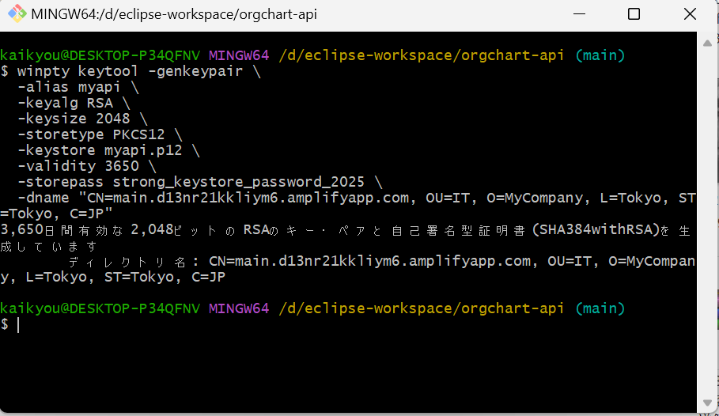

# 📌 Spring Boot アプリケーションでの HTTPS 対応方法

### 本番環境向けの HTTPS 設定

- Windows で自己署名証明書を生成する

## ✅ 正しい手順：本番用証明書を作成して EC2 に配置

### 手順 ①：キーストアを作成（端末）

```bash
winpty keytool -genkeypair \
  -alias myapi \
  -keyalg RSA \
  -keysize 2048 \
  -storetype PKCS12 \
  -keystore myapi.p12 \
  -validity 3650 \
  -storepass strong_keystore_password_2025 \
  -dname "CN=main.d13nr21kkliym6.amplifyapp.com, OU=IT, O=MyCompany, L=Tokyo, ST=Tokyo, C=JP"
```

> 💡 このコマンドは「本番用」なので、`alias = myapi`, `CN = main.d13nr21kkliym6.amplifyapp.com` としています。

---

🔧 実行する

```bash
kaikyou@DESKTOP-P34QFNV MINGW64 /d/eclipse-workspace/orgchart-api (main)
$ winpty keytool -genkeypair \
  -alias myapi \
  -keyalg RSA \
  -keysize 2048 \
  -storetype PKCS12 \
  -keystore myapi.p12 \
  -validity 3650 \
  -storepass strong_keystore_password_2025 \
  -dname "CN=main.d13nr21kkliym6.amplifyapp.com, OU=IT, O=MyCompany, L=Tokyo, ST=Tokyo, C=JP"
3,650日間有効な2,048ビットのRSAのキー・ペアと自己署名型証明書(SHA384withRSA)を生
成しています
        ディレクトリ名: CN=main.d13nr21kkliym6.amplifyapp.com, OU=IT, O=MyCompan
y, L=Tokyo, ST=Tokyo, C=JP

kaikyou@DESKTOP-P34QFNV MINGW64 /d/eclipse-workspace/orgchart-api (main)
$

```



#### ✅ 実行結果

このコマンドを Git Bash (MINGW64) で実行すると、カレントディレクトリに以下のファイルが作成されます：

```
myapi.p12
```

## 📅 証明書の有効期限

証明書には、以下のように明確な有効期間が設定されています：

```
Not Before:  Jul 1 00:00:00 2025 GMT
Not After :  Oct 1 23:59:59 2025 GMT
```

- この場合、有効期間は **2025 年 7 月 1 日〜2025 年 10 月 1 日**。
- 有効期限を過ぎると、ブラウザやクライアントは「このサイトは安全ではありません」と警告を出します。
- ※Let's Encrypt の証明書は 90 日間の有効期限。

---

## 🔍 有効期限の確認方法（Linux）

```bash
# myapi.p12 の証明書の有効期限を確認する
openssl pkcs12 -in myapi.p12 -nokeys -clcerts
```

または詳細を含めて確認：

```bash
openssl pkcs12 -in myapi.p12 -nokeys -clcerts | openssl x509 -noout -dates
```

出力例：

```
notBefore=Jul  1 00:00:00 2025 GMT
notAfter=Oct  1 23:59:59 2025 GMT
```

---

## 🛠 証明書の更新（期限切れ後）

- 証明書が期限切れになる前に、**新しい証明書を取得して再度 `.p12` を作成し直す**必要があります。
- 例：Let's Encrypt で新しい PEM 証明書を取得 → `openssl pkcs12` で `.p12` を再生成。

---

### 手順 ②：生成した `myapi.p12` を EC2 にアップロード

#### 方法 ① SCP or SFTP でアップロード

```bash
scp -i "/c/Users/kaikyou/Downloads/swa-key/my-key-pair-japan2.pem" \
  "/d/eclipse-workspace/orgchart-api/myapi.p12" \
  ec2-user@13.114.183.62:/home/ec2-user/
```

```bash
chmod 400 "/c/Users/kaikyou/Downloads/swa-key/my-key-pair-japan2.pem"
ssh -i "/c/Users/kaikyou/Downloads/swa-key/my-key-pair-japan2.pem" ec2-user@13.114.183.62
```

#### 方法 ② SSH ログイン後、配置場所に移動

```bash
sudo mv /home/ec2-user/myapi.p12 /etc/ssl/certs/
sudo chmod 600 /etc/ssl/certs/myapi.p12
sudo chown root:root /etc/ssl/certs/myapi.p12
```

---

## ✅ 本番環境向け の HTTPS 設定を追加

(src/main/resources/application-prod.properties)

```
# ======================
# HTTPS設定（本番環境）
# ======================
server.port=443
server.ssl.enabled=true
server.ssl.key-store=/etc/ssl/certs/myapi.p12
server.ssl.key-store-password=prod_keystore_password
server.ssl.key-store-type=PKCS12
server.ssl.key-alias=myapi.example.com
```

実際の本番運用では、以下のような構成がベストプラクティスです：

| 層                       | 内容                               |
| ------------------------ | ---------------------------------- |
| フロント（AWS Amplify）  | HTTPS（443）のみ許可               |
| ELB（ロードバランサー）  | ACM 証明書による SSL 終端          |
| EC2 / Spring Boot アプリ | HTTP（8081 など）で OK（内部通信） |

この場合、Spring Boot アプリケーションは HTTP でも問題ありません。

## 🔒 セキュリティ注意

- パスワードを直接コマンドラインに書くのは **セキュリティリスクが高い** です。

  - 他のユーザーに `ps aux` で見られる可能性があります。

- 本番では `.env` ファイルや秘密管理システム（例：AWS Secrets Manager、Spring Cloud Vault）などの利用をおすすめします。

---

以下に、 `application-prod.properties` をもとにした `.env` ファイルと、それに対応する **実行コマンド** を作成しました。

---

## ✅ `.env` ファイル（.env.prod）

このファイルはプロジェクトルートなどに配置して、セキュリティ情報や環境依存値を外部化します。

```env
# ======================
# データベース認証情報
# ======================
SPRING_DATASOURCE_URL=jdbc:postgresql://13.114.183.62:5432/irdb
SPRING_DATASOURCE_USERNAME=postgres
SPRING_DATASOURCE_PASSWORD=AM2013japan

# ======================
# キーストア設定
# ======================
SPRING_SSL_KEY_STORE=/etc/ssl/certs/myapi.p12
SPRING_SSL_KEY_STORE_PASSWORD=strong_keystore_password_2025
SPRING_SSL_KEY_STORE_TYPE=PKCS12
SPRING_SSL_KEY_ALIAS=myapi

```

---

## ✅ 更新後の`application-prod.properties` ファイル（src/main/resources/application-prod.properties）

```properties
# ======================
# アプリケーション基本設定
# ======================
spring.application.name=orgchart-api-batch

# ======================
# HTTPS設定（パスワードなどは環境変数から取得）
# ======================
server.port=443
server.ssl.enabled=true
server.ssl.key-store=${SPRING_SSL_KEY_STORE}
server.ssl.key-store-password=${SPRING_SSL_KEY_STORE_PASSWORD}
server.ssl.key-store-type=${SPRING_SSL_KEY_STORE_TYPE:PKCS12}
server.ssl.key-alias=${SPRING_SSL_KEY_ALIAS:myapi}

# ======================
# データベース設定（環境変数経由に変更）
# ======================
spring.datasource.url=${SPRING_DATASOURCE_URL}
spring.datasource.username=${SPRING_DATASOURCE_USERNAME}
spring.datasource.password=${SPRING_DATASOURCE_PASSWORD}
spring.datasource.driver-class-name=org.postgresql.Driver

# ======================
# 接続プール設定（本番時最適化）
# ======================
spring.datasource.hikari.maximum-pool-size=20
spring.datasource.hikari.minimum-idle=10
spring.datasource.hikari.idle-timeout=300000
spring.datasource.hikari.leak-detection-threshold=60000
spring.datasource.hikari.connection-timeout=30000
spring.datasource.hikari.pool-name=HikariPool-PostgreSQL-Prod

# ======================
# MyBatis設定（本番時最適化）
# ======================
mybatis.mapper-locations=classpath:mapper/*.xml
mybatis.type-aliases-package=com.example.orgchart_api.domain
mybatis.configuration.map-underscore-to-camel-case=true
mybatis.configuration.lazy-loading-enabled=true

# ======================
# バッチ設定（開発と共通）
# ======================
# Spring Batch の自動実行を無効化
spring.batch.job.enabled=false
# 実行するジョブ名
spring.batch.job.names=humanResourceBatchJob
# ジョブ再実行を許可
spring.batch.job.restartable=true
# チャンクサイズ
chunk.size=100

# ======================
# ロギング設定（本番時最適化）
# ======================
# 共通ロギング（INFOレベルで出力）
logging.level.com.example.orgchart_api=INFO
# JDBCログ（DEBUG → INFO）
logging.level.org.springframework.jdbc.core.JdbcTemplate=INFO
# リポジトリログ（TRACE → INFO）
logging.level.com.example.orgchart_api.repository=INFO
# バッチ処理の詳細ログ（DEBUG → INFO
logging.level.org.springframework.batch=INFO
logging.level.com.example.orgchart_api.batch=INFO
# Spring Securityログ（DEBUG → INFO）
logging.level.org.springframework.security=INFO

# ======================
# エラーレスポンス設定（削除禁止）
# ======================
server.error.include-message=always
server.error.include-binding-errors=never
server.error.include-stacktrace=never
server.error.include-exception=false

# ======================
# Jackson設定（削除禁止）
# ======================
spring.jackson.serialization.indent-output=true
spring.jackson.default-property-inclusion=non-null

# ======================
# Actuatorエンドポイント有効化（制限推奨）
# ======================
management.endpoints.web.exposure.include=health,info,metrics
management.endpoint.health.show-details=when_authorized
management.security.enabled=true


```

## ✅ 実行コマンド（`.env` 読み込み + `nohup` 起動）

`.env.prod` を読み込んでバックグラウンドで起動する形です：

```bash
set -o allexport
source .env.prod
set +o allexport

nohup java -jar orgchart-api.jar --spring.profiles.active=prod > app.log 2>&1 &
```

---

## ✅ `.env` を使わない場合の直書き実行例（非推奨）

```bash
SPRING_DATASOURCE_PASSWORD=AM2013japan \
SPRING_SSL_KEY_STORE_PASSWORD=strong_keystore_password_2025 \
nohup java -jar orgchart-api.jar --spring.profiles.active=prod > app.log 2>&1 &
```

※ ただしこれは `ps` コマンドなどで見えてしまうため、本番環境では `.env` ファイル or シークレットマネージャの使用を推奨します。

---

## ✅ Spring Boot が `.env` を認識する方法について

Spring Boot は `.env` を自動では読み込みません。以下のいずれかの方法で読み込ませる必要があります：

1. `source .env && java -jar ...` で環境変数として OS レベルに渡す。
2. `.bashrc` や `systemd` の `EnvironmentFile=` に登録する。
3. `.env` を `dotenv` ライブラリ等でカスタム読み込みするコードを書く（高度な用途）。

---

必要であれば systemd 向けの設定ファイルや `.env` を使った安全な CI/CD 方法も案内できます！

## tongyi

ご質問ありがとうございます。  
**`.env.prod` ファイルと [application-prod.properties](file://d:\eclipse-workspace\orgchart-api\src\main\resources\application-prod.properties) を使って本番環境で Spring Boot アプリを起動する正しい方法**について、要件に沿って丁寧に説明いたします。

---

## ✅ 結論

以下の手順は **基本的には正しい** ですが、**補足すべきポイントがいくつかあります**：

```bash
set -o allexport
source .env.prod
set +o allexport

nohup java -jar orgchart-api.jar --spring.profiles.active=prod > app.log 2>&1 &
```

このコマンドにより、以下のような処理が行われます：

| 処理                   | 内容                                                     |
| ---------------------- | -------------------------------------------------------- |
| `.env.prod` の読み込み | 環境変数として一括エクスポート                           |
| Spring Boot 起動       | `--spring.profiles.active=prod` で本番プロファイルを使用 |
| ログ出力先指定         | `app.log` に標準出力・エラー出力を集約                   |
| バックグラウンド実行   | `&` でバックグラウンド起動                               |

---

## ✅ 推奨：.env.prod ファイルの内容例

```properties
SPRING_DATASOURCE_URL=jdbc:postgresql://13.114.183.62:5432/irdb
SPRING_DATASOURCE_USERNAME=postgres
SPRING_DATASOURCE_PASSWORD=strong_secure_db_password_2025
SPRING_DATASOURCE_DRIVER_CLASS_NAME=org.postgresql.Driver

SPRING_SSL_KEY_STORE=/etc/ssl/certs/myapi.p12
SPRING_SSL_KEY_STORE_PASSWORD=strong_keystore_password_2025
SPRING_SSL_KEY_STORE_TYPE=PKCS12
SPRING_SSL_KEY_ALIAS=myapi
```

> 🔐 **パスワードなどの機密情報はソース管理（Git）に含めないようにしてください。**

---

## ✅ application-prod.properties の確認済み修正版

[application-prod.properties](file://d:\eclipse-workspace\orgchart-api\target\classes\application-prod.properties) には、**すべての設定値が環境変数で渡されるよう`${}`形式に変更されています。**

```properties
# ======================
# アプリケーション基本設定
# ======================
spring.application.name=orgchart-api-batch

# ======================
# HTTPS設定（パスワードなどは環境変数から取得）
# ======================
server.port=443
server.ssl.enabled=true
server.ssl.key-store=${SPRING_SSL_KEY_STORE}
server.ssl.key-store-password=${SPRING_SSL_KEY_STORE_PASSWORD}
server.ssl.key-store-type=${SPRING_SSL_KEY_STORE_TYPE:PKCS12}
server.ssl.key-alias=${SPRING_SSL_KEY_ALIAS:myapi}

# ======================
# データベース設定（環境変数経由に変更）
# ======================
spring.datasource.url=${SPRING_DATASOURCE_URL}
spring.datasource.username=${SPRING_DATASOURCE_USERNAME}
spring.datasource.password=${SPRING_DATASOURCE_PASSWORD}
spring.datasource.driver-class-name=org.postgresql.Driver

# ======================
# 接続プール設定（本番時最適化）
# ======================
spring.datasource.hikari.maximum-pool-size=20
spring.datasource.hikari.minimum-idle=10
spring.datasource.hikari.idle-timeout=300000
spring.datasource.hikari.leak-detection-threshold=60000
spring.datasource.hikari.connection-timeout=30000
spring.datasource.hikari.pool-name=HikariPool-PostgreSQL-Prod

# ======================
# MyBatis設定（本番時最適化）
# ======================
mybatis.mapper-locations=classpath:mapper/*.xml
mybatis.type-aliases-package=com.example.orgchart_api.domain
mybatis.configuration.map-underscore-to-camel-case=true
mybatis.configuration.lazy-loading-enabled=true

# ======================
# エラーレスポンス設定（削除禁止）
# ======================
server.error.include-message=always
server.error.include-binding-errors=never
server.error.include-stacktrace=never
server.error.include-exception=false

# ======================
# Jackson設定（削除禁止）
# ======================
spring.jackson.serialization.indent-output=true
spring.jackson.default-property-inclusion=non-null

# ======================
# Actuatorエンドポイント有効化（制限推奨）
# ======================
management.endpoints.web.exposure.include=health,info,metrics
management.endpoint.health.show-details=when_authorized
management.security.enabled=true
```

---

## ✅ 実際の運用フロー

### 1. `.env.prod` を作成（EC2 上）

```bash
SPRING_DATASOURCE_URL=jdbc:postgresql://13.114.183.62:5432/irdb
SPRING_DATASOURCE_USERNAME=postgres
SPRING_DATASOURCE_PASSWORD=strong_secure_db_password_2025
SPRING_SSL_KEY_STORE=/etc/ssl/certs/myapi.p12
SPRING_SSL_KEY_STORE_PASSWORD=strong_keystore_password_2025
SPRING_SSL_KEY_STORE_TYPE=PKCS12
SPRING_SSL_KEY_ALIAS=myapi
```

### 2. 起動スクリプトを作成（例：start-prod.sh）

```bash
#!/bin/bash

# 環境変数をエクスポート
set -o allexport
source .env.prod
set +o allexport

# アプリケーション起動
nohup java -jar orgchart-api.jar --spring.profiles.active=prod > app.log 2>&1 &
```

権限を付与して実行：

```bash
chmod +x start-prod.sh
./start-prod.sh
```

---

## ✅ systemd サービス登録（推奨）

長期的に運用する場合は、**systemd による常駐化**が推奨されます。

### `/etc/systemd/system/orgchart-api.service`

```ini
[Unit]
Description=OrgChart API Service
After=syslog.target

[Service]
User=ec2-user
EnvironmentFile=/home/ec2-user/.env.prod
ExecStart=/usr/bin/java -jar /home/ec2-user/orgchart-api.jar --spring.profiles.active=prod
SuccessExitStatus=143
StandardOutput=file:/home/ec2-user/logs/orgchart-api.log
StandardError=file:/home/ec2-user/logs/orgchart-api.err
Restart=on-failure
RestartSec=10

[Install]
WantedBy=multi-user.target
```

その後、サービスを登録して起動：

```bash
sudo systemctl daemon-reexec
sudo systemctl enable orgchart-api
sudo systemctl start orgchart-api
```

---

## ✅ 最終確認リスト

| 項目                                                                                                                                                 | 状態        |
| ---------------------------------------------------------------------------------------------------------------------------------------------------- | ----------- |
| `.env.prod` が存在し、機密情報が含まれているか                                                                                                       | ✅ OK       |
| [application-prod.properties](file://d:\eclipse-workspace\orgchart-api\target\classes\application-prod.properties) が `${}` 形式で外部化されているか | ✅ OK       |
| 起動コマンドにログ出力先が指定されているか                                                                                                           | ✅ OK       |
| systemd での運用準備ができているか                                                                                                                   | ❌ 検証必要 |
| `.env.prod` が `.gitignore` に含まれているか                                                                                                         | ❌ 検証必要 |

---

## ✅ 応用：CI/CD パイプラインとの連携（GitHub Actions 例）

```yaml
- name: Deploy to EC2
  run: |
    scp target/orgchart-api.jar ec2-user@your-ip:/home/ec2-user/
    ssh ec2-user@your-ip 'systemctl restart orgchart-api'
```

---

## ✅ 次のステップ

| ステップ                  | 内容                                                    |
| ------------------------- | ------------------------------------------------------- |
| ✅ CI/CD パイプライン構築 | GitHub Actions / GitLab CI / Jenkins など               |
| ✅ 外部シークレット管理   | AWS Secrets Manager / HashiCorp Vault / Azure Key Vault |
| ✅ 自動証明書更新対応     | Let's Encrypt + Certbot + Cron 自動更新                 |
| ✅ 監視・アラート設定     | Prometheus + Grafana + AlertManager                     |

---

ご希望があれば、**`.env.prod` ファイル生成スクリプト**、**systemd ユニットファイル作成**、**CI/CD 統合コード** も支援可能です。  
引き続きお気軽にご相談ください。

# GPT✅ 補足

本番環境で Spring Boot アプリケーションを「**再起動（リスタート）**」したい場合、以下の 2 ステップを踏むのが一般的です：

---

## ✅ 再起動のステップ

### 🔁 ① 現在のプロセスを終了（停止）

まず、`orgchart-api.jar` を動かしている Java プロセスの PID（プロセス ID）を確認して終了させます。

```bash
# 実行中の Java プロセスを確認（jarファイル名などでフィルタ）
ps aux | grep orgchart-api.jar
```

出力例：

```
ec2-user 12345  0.5  ... java -jar orgchart-api.jar --spring.profiles.active=prod
```

プロセス ID（ここでは `12345`）を `kill` で終了：

```bash
kill 12345
```

強制終了したい場合（通常不要）：

```bash
kill -9 12345
```

---

### 🔄 ② 再起動コマンドを実行

次に、再度アプリを起動します。**環境変数を直接書く方法**でも良いですが、前回の `.env.prod` のように **安全に再起動できる方法**がベストです。

#### ✅ `.env` を使った安全な再起動方法

```bash
set -o allexport
source .env.prod
set +o allexport

nohup java -jar orgchart-api.jar --spring.profiles.active=prod > app.log 2>&1 &
```

---

## ✅ 短縮した一時的な再起動（危険：パスワードが見える）

```bash
SPRING_DATASOURCE_PASSWORD=AM2013japan \
SPRING_SSL_KEY_STORE_PASSWORD=strong_keystore_password_2025 \
nohup java -jar orgchart-api.jar --spring.profiles.active=prod > app.log 2>&1 &
```

> ❗ **注意：** `ps aux` で他の人にパスワードが見えてしまう可能性があるので、本番では `.env` の読み込み方式をおすすめします。

---

## ✅ 補足：再起動をもっと楽にしたい場合

- **systemd** を使えば `sudo systemctl restart myapp.service` だけで再起動できます。
- `docker` を使っているなら `docker restart` ですぐに再起動できます。

---

## ✅ 結論

> **Spring Boot アプリの「起動」と「再起動」は、基本的に同じコマンドで行います。**

違いは：

- **起動**：プロセスが存在しない状態からスタートする
- **再起動**：既存のプロセスを一度「停止」してから「同じ起動コマンドで再実行」する

---

## 🔁 再起動の流れ（おさらい）

1. **既存プロセスの終了**（`kill`）
2. **同じ起動コマンドを再実行**

```bash
set -o allexport
source .env.prod
set +o allexport

nohup java -jar orgchart-api.jar --spring.profiles.active=prod > app.log 2>&1 &
```

---

## ✅ ワンポイント補足

| 状態     | コマンド内容          | 備考                              |
| -------- | --------------------- | --------------------------------- |
| 初回起動 | 同上                  | `.env` を読み込んで起動           |
| 再起動   | 同上（の前に `kill`） | プロセス停止後に同じコマンドで OK |

---

## ✅ 補足：よりスマートにしたい場合

- `restart.sh` などのシェルスクリプトを用意しておくと再起動もワンコマンドで可能です。
- 例：

```bash
#!/bin/bash
# restart.sh

echo "Stopping orgchart-api..."
pkill -f orgchart-api.jar

echo "Starting orgchart-api..."
set -o allexport
source .env.prod
set +o allexport
nohup java -jar orgchart-api.jar --spring.profiles.active=prod > app.log 2>&1 &
echo "Restart complete."
```

---

必要であれば、`systemd` に登録して `systemctl restart orgchart-api` だけで済ませる方法も案内可能です。
