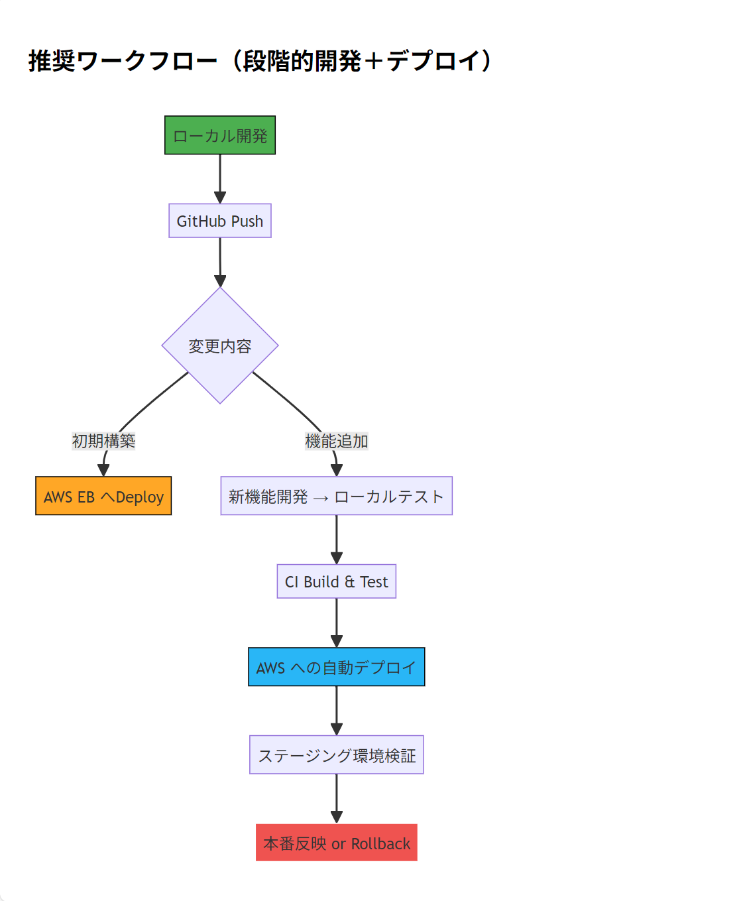

# AWS デプロイ戦略（CI/CD + Infrastructure as Code）

## ✅

**AWS に最小限の Spring Boot アプリケーションをデプロイしておき、その後で機能を少しずつ追加する形での開発・デプロイ戦略は、非常に現実的かつ推奨される方法です。**

---

## 🛠 推奨される AWS デプロイ戦略（CI/CD + Infrastructure as Code）

### ✅ Step 1: 最小構成アプリケーションを作成

- **目的**: AWS 上に Spring Boot アプリが正しく動作することを確認
- **内容**: `Hello World` や `/actuator/health` などの最低限の API を含むプロジェクト

```java
@RestController
public class HelloController {
    @GetMapping("/hello")
    public String hello() {
        return "Hello from AWS!";
    }
}
```

---

## ☁️ AWS デプロイ候補サービス一覧（Spring Boot 向け）

| サービス名                                                | 適用ケース                     | 特徴                                                           |
| --------------------------------------------------------- | ------------------------------ | -------------------------------------------------------------- |
| ✅ **AWS Elastic Beanstalk**                              | 手軽な初期導入                 | WAR/JAR ファイルをアップロードするだけでデプロイ完了           |
| ✅ **Amazon ECS (Fargate)**                               | コンテナ化したい場合           | Docker + Spring Boot アプリをコンテナ化し、管理も簡単          |
| ✅ **AWS Lambda + Spring Cloud Function**                 | シンプルな REST API のみの場合 | イベント駆動型でコスト効率良いが、初期設定やレイテンシ考慮必要 |
| ✅ **Amazon EC2 + Jenkins or GitHub Actions**             | 完全な制御が必要な場合         | OS レベルのカスタマイズ可能、ただし運用負荷あり                |
| ✅ **AWS CodeBuild + CodePipeline + S3 + CloudFormation** | CI/CD 自動化希望時             | Infrastructure as Code による本番向け構成                      |

---

## 🧱 推奨ワークフロー（段階的開発＋デプロイ）


## 

## 📦 初期デプロイ用最小構成アプリ作成手順（Spring Initializr）

```bash
curl https://start.spring.io/starter.zip \
  -d dependencies=web,data-jpa,security,actuator \
  -d name=demo \
  -d artifactId=demo-api \
  -o demo-api.zip
```

---

## 🛡️ AWS Elastic Beanstalk へのデプロイ手順（推奨）

### ✅ Step 1: JAR ファイルをビルド

```bash
./mvnw clean package
```

生成先：`target/demo-api-0.0.1-SNAPSHOT.jar`

---

### ✅ Step 2: AWS Elastic Beanstalk アプリケーション作成（AWS Console or CLI）

```bash
aws elasticbeanstalk create-application --application-name orgchart-api
```

---

### ✅ Step 3: 環境作成（CLI 使用例）

```bash
aws elasticbeanstalk create-environment \
  --application-name orgchart-api \
  --environment-name orgchart-env \
  --solution-stack-name "64bit Amazon Linux 2 v3.5.0 running Corretto 17" \
  --option-settings file://options.json
```

`options.json` 例：

```json
[
  {
    "Namespace": "aws:elasticbeanstalk:environment",
    "OptionName": "LoadBalancerType",
    "Value": "application"
  },
  {
    "Namespace": "aws:elasticbeanstalk:environment:process:default",
    "OptionName": "Port",
    "Value": "5000"
  }
]
```

---

### ✅ Step 4: デプロイ（CLI 使用例）

```bash
aws elasticbeanstalk create-application-version \
  --application-name orgchart-api \
  --version-label v1 \
  --source-bundle S3Bucket="your-bucket",S3Key="demo-api-0.0.1-SNAPSHOT.jar"

aws elasticbeanstalk update-environment \
  --environment-name orgchart-env \
  --version-label v1
```

---

## 🔄 段階的開発＋デプロイ ワークフロー

| ステップ  | 内容                                        | 工数目安   |
| --------- | ------------------------------------------- | ---------- |
| ✅ Step 1 | 最小アプリ作成 + AWS デプロイ               | 1〜2 時間  |
| ✅ Step 2 | DB 接続設定（PostgreSQL）                   | 1〜2 時間  |
| ✅ Step 3 | ユーザー認証モジュール追加                  | 2〜4 時間  |
| ✅ Step 4 | バッチジョブ実装（Spring Batch）            | 8〜10 時間 |
| ✅ Step 5 | ロギング＋監視（CloudWatch + X-Ray）        | 2〜4 時間  |
| ✅ Step 6 | CI/CD 導入（CodePipeline / GitHub Actions） | 4〜6 時間  |

---

## 🔐 AWS 上でのセキュリティ基本設定（OWASP 原則に基づく）

| 項目                | 設定内容                                                     |
| ------------------- | ------------------------------------------------------------ |
| ✅ IAM Role         | Elastic Beanstalk 用の IAM ロールを事前に作成                |
| ✅ Secret Manager   | DB 接続情報、JWT シークレットなどは Secrets Manager から取得 |
| ✅ VPC              | 必要であれば VPC 内部にデプロイ                              |
| ✅ WAF              | 不正アクセス防止策として WAF 設定                            |
| ✅ ACM SSL          | HTTPS 化のために証明書登録                                   |
| ✅ CloudFront + WAF | 公開サイト向けキャッシュ＋セキュリティ強化                   |

---

## 📂 推奨ディレクトリ構成（Spring Boot + AWS 対応）

```
src/
├── main/
│   ├── java/
│   │   └── com.example.orgchart_api/
│   │       ├── controller/
│   │       ├── service/
│   │       ├── repository/
│   │       ├── model/
│   │       ├── dto/
│   │       ├── exception/
│   │       └── OrgchartApiApplication.java
│   │
│   └── resources/
│       ├── application.properties
│       ├── application-dev.properties
│       ├── application-prod.properties
│       └── data.sql
│
└── test/
    └── java/
        └── com.example.orgchart_api/
            └── AllTests.java
```

---

## 🧪 単体テストと CI 連携（Maven + GitHub Actions）

`.github/workflows/build.yml` 例：

```yaml
name: Java CI

on:
  push:
    branches: [main]
jobs:
  build:
    runs-on: ubuntu-latest
    steps:
      - uses: actions/checkout@v2
      - name: Set up JDK 21
        uses: actions/setup-java@v1
        with:
          java-version: "21"
      - name: Build with Maven
        run: ./mvnw clean package
      - name: Upload Artifact
        uses: actions/upload-artifact@v2
        with:
          name: spring-boot-app
          path: target/*.jar
```

---

## 📈 AWS 上での拡張性設計（YAGNI + KISS 原則に基づく）

| 項目              | 説明                                           |
| ----------------- | ---------------------------------------------- |
| ✅ Feature Toggle | Spring Profiles (`dev`, `prod`) で機能切り替え |
| ✅ モック処理     | 未完成機能は `@Profile("dev")` で代替実装      |
| ✅ ロギング       | SLF4J + CloudWatch Logs で統合ログ管理         |
| ✅ モニタリング   | CloudWatch Alarms + X-Ray でパフォーマンス監視 |

---

## 🧩 今後のバッチジョブ機能追加時の流れ（Spring Batch + AWS）


---

## 📋 AWS デプロイチェックリスト（初回）

| 項目                         | 状態                         |
| ---------------------------- | ---------------------------- |
| ✅ IAM Role                  | 作成済                       |
| ✅ Elastic Beanstalk         | アプリケーション・環境作成済 |
| ✅ RDS (PostgreSQL)          | 接続設定済                   |
| ✅ Secret Manager            | DB ユーザ／パスワード登録済  |
| ✅ CloudWatch Logs           | ログ出力確認済               |
| ✅ Application Load Balancer | HTTP/HTTPS 設定済            |
| ✅ Security Group            | 80/443 ポート解放済          |

---

## 📦 application.properties 推奨設定（AWS 向け）

```properties
# AWS Elastic Beanstalk 用設定
server.port=5000

spring.datasource.url=jdbc:postgresql://${DATABASE_URL}
spring.datasource.username=${DATABASE_USERNAME}
spring.datasource.password=${DATABASE_PASSWORD}

spring.jpa.hibernate.ddl-auto=update
spring.jpa.show-sql=true
spring.jpa.properties.hibernate.format_sql=true

spring.batch.job.enabled=false
spring.jpa.open-in-view=false

# ロギング設定
logging.level.root=INFO
logging.file.name=/var/log/orgchart-api.log
```

---

## 📊 推奨ツール一覧（AWS + Spring Boot）

| ツール名                    | 用途                   |
| --------------------------- | ---------------------- |
| ✅ AWS SAM / CloudFormation | インフラコード化       |
| ✅ AWS CodePipeline         | CI/CD 管理             |
| ✅ AWS CodeBuild            | 自動ビルド             |
| ✅ AWS Secrets Manager      | セキュアな設定値管理   |
| ✅ AWS CloudWatch           | ロギング＋メトリクス   |
| ✅ AWS X-Ray                | 分散トレーシング       |
| ✅ AWS RDS                  | PostgreSQL 接続先      |
| ✅ AWS S3                   | バッチファイル保存場所 |

---

## 📌 推奨コマンド集（AWS CLI）

| 目的                           | コマンド                                          |
| ------------------------------ | ------------------------------------------------- |
| アプリケーション作成           | `aws elasticbeanstalk create-application`         |
| 環境作成                       | `aws elasticbeanstalk create-environment`         |
| アプリケーションバージョン作成 | `aws elasticbeanstalk create-application-version` |
| デプロイ                       | `aws elasticbeanstalk update-environment`         |
| ログ取得                       | `eb logs orgchart-env`                            |

---

## ✅ 次の手順

| 手順      | 内容                                            |
| --------- | ----------------------------------------------- |
| ✅ Step 1 | 上記最小構成アプリ作成                          |
| ✅ Step 2 | GitHub リポジトリ作成                           |
| ✅ Step 3 | AWS EB にデプロイ                               |
| ✅ Step 4 | `/hello` または `/actuator/health` で動作確認   |
| ✅ Step 5 | 以降、Pull Request + GitHub Actions で CI/CD 化 |

---

## 📌 参考：AWS に Spring Boot をデプロイする際のベストプラクティス

| 項目                  | 推奨内容                                      |
| --------------------- | --------------------------------------------- |
| ✅ データベース       | AWS RDS PostgreSQL 推奨                       |
| ✅ セキュリティ       | IAM + Secrets Manager + VPC 内部通信          |
| ✅ ロギング           | CloudWatch + SLF4J                            |
| ✅ オートスケーリング | Elastic Beanstalk または Auto Scaling         |
| ✅ CI/CD              | GitHub Actions / CodePipeline                 |
| ✅ セッション管理     | Redis (ElastiCache) or DynamoDB Session Store |

---

## 🧩 今後の開発計画（例）

| 週次   | 実施内容                                           |
| ------ | -------------------------------------------------- |
| Week 1 | 最小アプリ作成 + AWS デプロイ                      |
| Week 2 | ユーザー認証・権限管理（Spring Security）          |
| Week 3 | バッチジョブ機能追加（Spring Batch）               |
| Week 4 | ロギング・監視（CloudWatch + X-Ray）               |
| Week 5 | CI/CD 自動化                                       |
| Week 6 | パフォーマンスチューニング（非同期・バッチ最適化） |

---

## ✅ 最終的な推奨案

1. ✅ 最小構成アプリを作成し、GitHub に Push
2. ✅ AWS Elastic Beanstalk にデプロイ（CLI or Console）
3. ✅ `/hello` で疎通確認
4. ✅ 以降、API 機能単位で Pull Request + CI/CD 流れに乗せてデプロイ

---

再度繰り返しますが、**「AWS を早めに把握したい」という目的には、最小構成アプリをまずデプロイするのが最短かつ安全な方法です。**

ご希望であれば、以下のような **「最小構成アプリ」を即座に作成し、GitHub 連携＋ AWS デプロイ準備まで行います。**

---

引き続き安心して開発できるよう、全力でお手伝いいたします。  
上記手順をご承認いただければ、**最小アプリ作成＋ GitHub ＋ AWS デプロイ準備**を行いますので、ご指示ください。
