# springboot と next.js を連携する前提条件

EC2 上で `http://ec2-xx-xxx-xxx-xxx.compute-1.amazonaws.com:8081/api` として Spring Boot アプリケーションの API を公開するためには、以下の手順が必要です。ご提供いただいたコード（AuthController, RegisterController, BatchJobController など）を前提に説明します。

---

## ✅ 前提条件

- EC2 インスタンスに Spring Boot アプリケーションがビルド済みかつ実行可能状態
- Java 21 がインストールされている
- PostgreSQL または使用しているデータベースへの接続設定が完了
- ポート `8081` がファイアウォール/セキュリティグループで開放されている

---

## 📦 ステップ 1: Spring Boot アプリケーションをビルド & 実行

### 1. Maven でアプリケーションをビルド

```bash
cd d:\eclipse-workspace\orgchart-api
mvn clean package
```

これにより `target/orgchart-api-0.0.1-SNAPSHOT.jar` が生成されます。

### 2. EC2 にアップロードし、起動

ローカルから EC2 に JAR ファイルを転送：

```bash
scp target/orgchart-api-0.0.1-SNAPSHOT.jar ec2-user@<your-ec2-ip>:/home/ec2-user/app/
```

EC2 側で実行：

```bash
java -jar orgchart-api-0.0.1-SNAPSHOT.jar
```

---

## 🔐 ステップ 2: EC2 のセキュリティグループ設定

AWS コンソール > EC2 > セキュリティグループ > 対象の SG を選択 > **受信ルール** を編集

以下のようなルールを追加：

| Type       | Protocol | Port range | Source      | Description                             |
| ---------- | -------- | ---------- | ----------- | --------------------------------------- |
| Custom TCP | TCP      | `8081`     | `0.0.0.0/0` | Allow access to port 8081 from anywhere |

> 必要であればソース IP を制限してください（例：特定の CIDR）

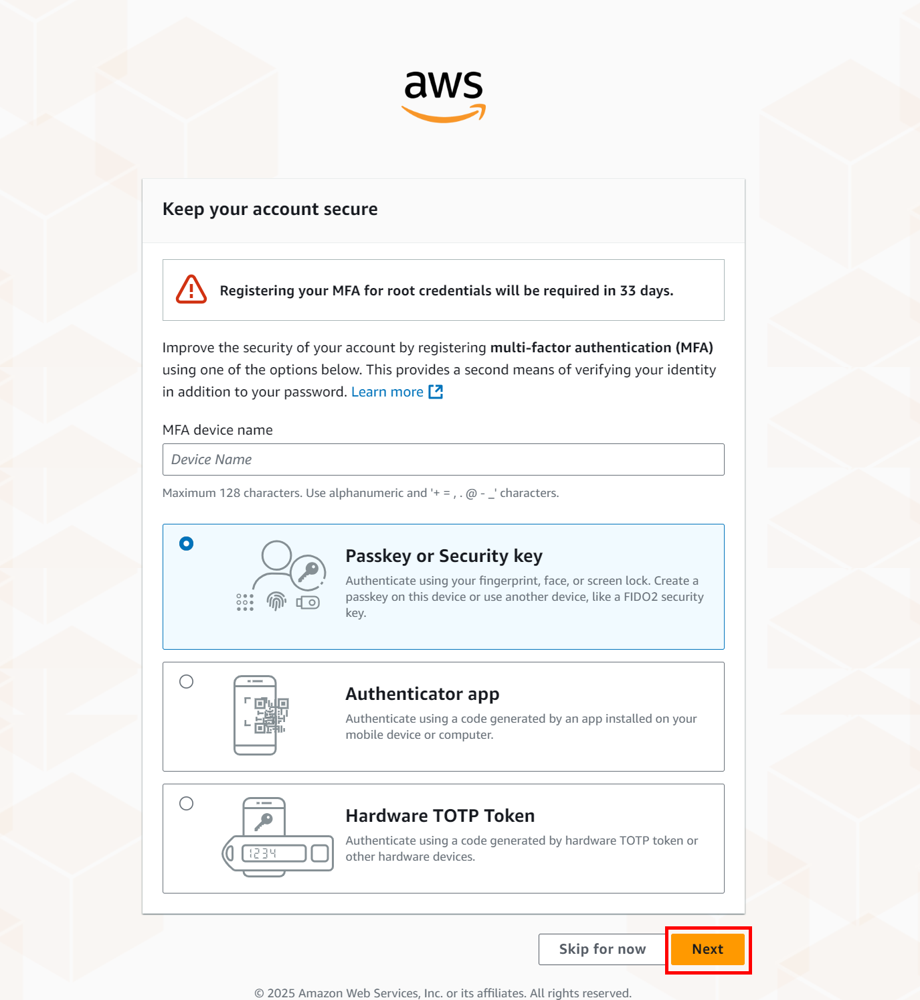
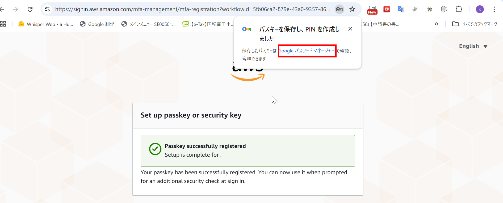
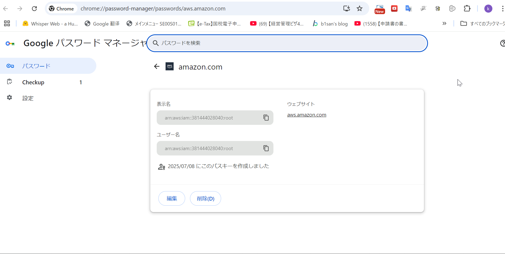
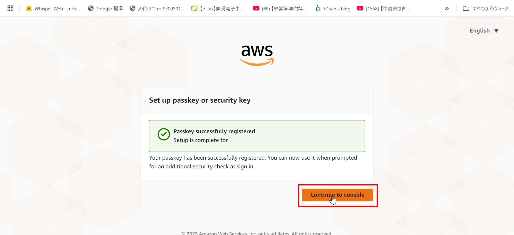
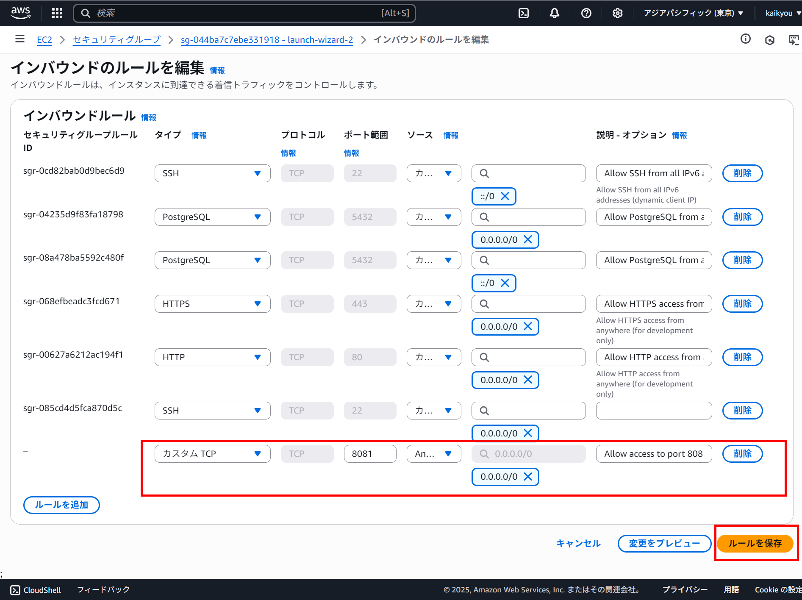
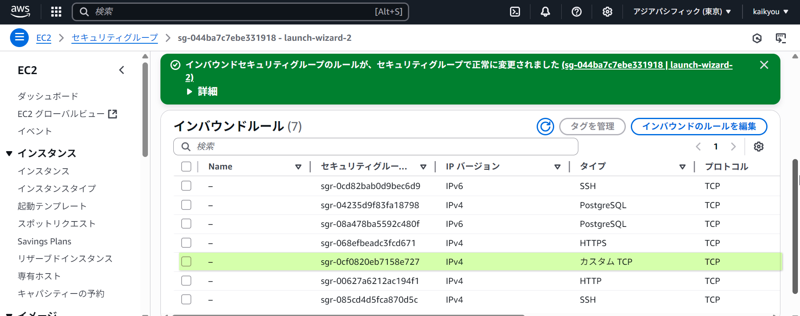

## 🌐 ステップ 3: アプリケーションのベース URL 設定

Spring Boot 側で `/api` などのパスを正しく扱うために、[application.properties](file://d:\eclipse-workspace\orgchart-api\target\classes\application.properties) に以下を追加：

```properties
server.servlet.context-path=/api
```

または Spring Boot 3.x 以降では：

```properties
spring.mvc.servlet.path=/api
```

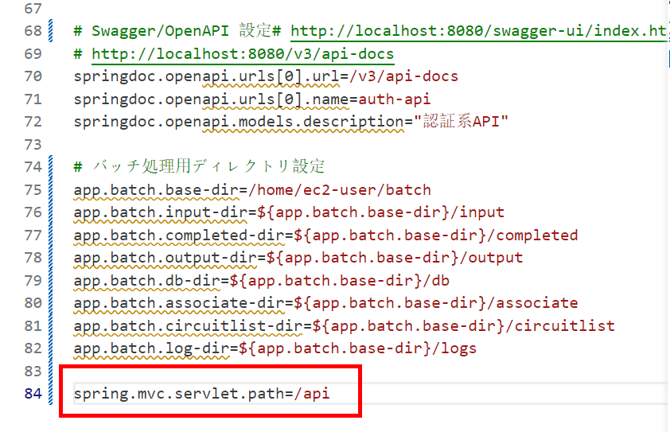

## ✔ ステップ 4: batch 用ディレクトリを作成する

```bash
mkdir -p /home/ec2-user/batch/input/
mkdir -p /home/ec2-user/batch/completed/
mkdir -p /home/ec2-user/batch/output/
mkdir -p /home/ec2-user/batch/db/
mkdir -p /home/ec2-user/batch/associate/
mkdir -p /home/ec2-user/batch/circuitlist/
mkdir -p /home/ec2-user/batch/logs/
chown -R ec2-user:ec2-user /home/ec2-user/batch
chmod -R 755 /home/ec2-user/batch
```

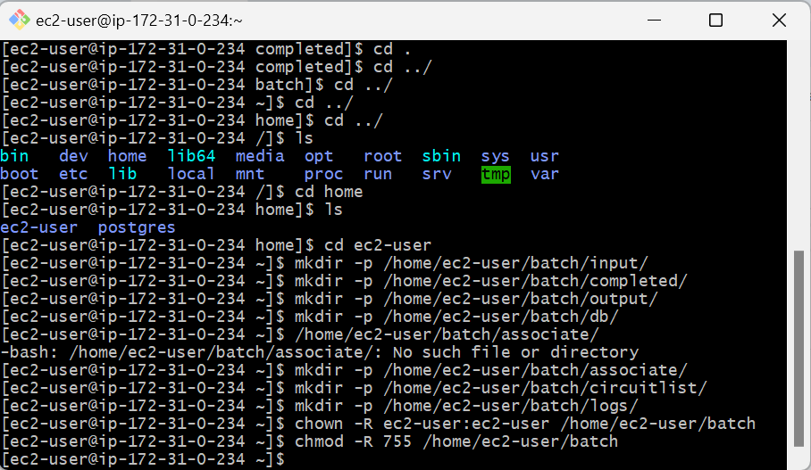

## ✔ ステップ 5: batch テストファイルのアプロード

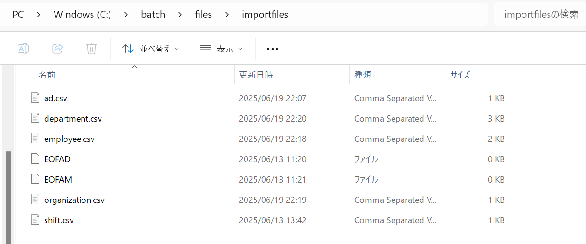

```bash
scp -i "/c/Users/kaikyou/Downloads/swa-key/my-key-pair-japan2.pem" \
  /c/batch/files/importfiles/*.csv \
  ec2-user@13.114.183.62:/home/ec2-user/batch/input/
```

```bash
scp -i "/c/Users/kaikyou/Downloads/swa-key/my-key-pair-japan2.pem" \
  /c/batch/files/importfiles/EOFAD \
  ec2-user@13.114.183.62:/home/ec2-user/batch/input/
```

```bash
scp -i "/c/Users/kaikyou/Downloads/swa-key/my-key-pair-japan2.pem" \
  /c/batch/files/importfiles/EOFAM \
  ec2-user@13.114.183.62:/home/ec2-user/batch/input/
```

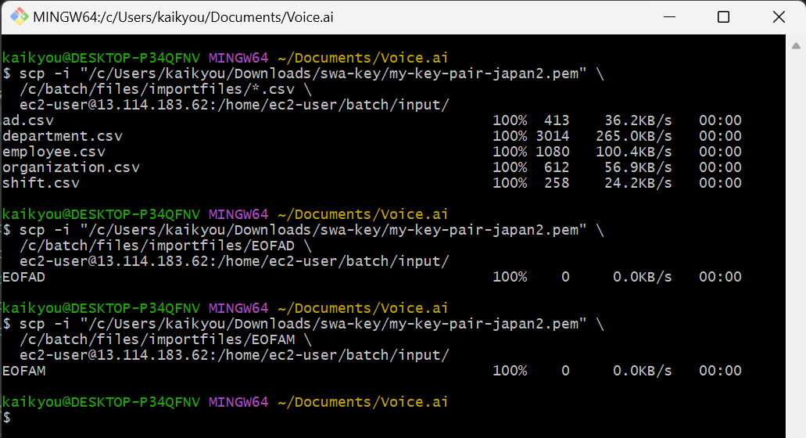

```bash
chmod 400 "/c/Users/kaikyou/Downloads/swa-key/my-key-pair-japan2.pem"
ssh -i "/c/Users/kaikyou/Downloads/swa-key/my-key-pair-japan2.pem" ec2-user@13.114.183.62
```

```bash
ls -l /home/ec2-user/batch/input/
```

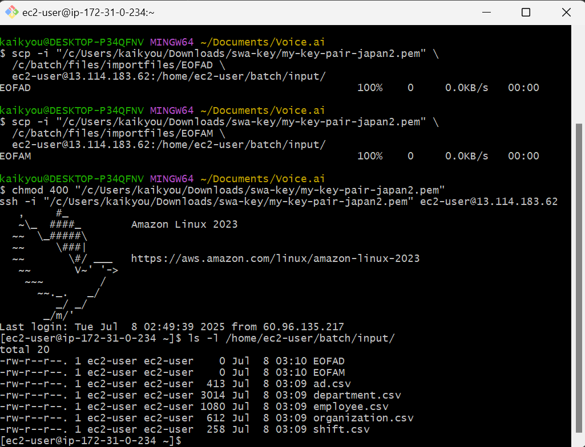

## 🧪 ステップ 4: API 動作確認（curl または Postman で）

### RegisterController (POST /register)

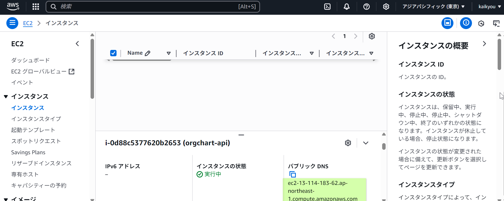

```bash
	 curl -X POST http://ec2-13-114-183-62.ap-northeast-1.compute.amazonaws.com:8081/api/register \
     -H "Content-Type: application/json" \
     -d '{"email":"kaikyou@gmail.com", "name":"NewUser", "password":"password123"}'
```

⭕️ 実施する
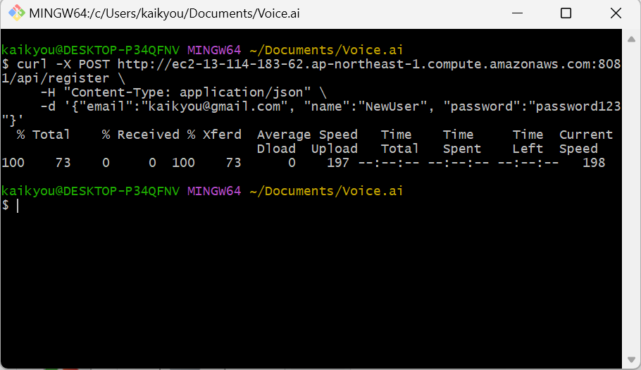

### AuthController (POST /login)

```bash
curl -X POST http://ec2-xx-xxx-xxx-xxx.compute-1.amazonaws.com:8080/api/auth/login \
     -H "Content-Type: application/json" \
     -d '{"email":"test@example.com", "password":"pass"}'
```

### BatchJobController (POST /run-human-resource-job)

```bash
curl -X POST http://ec2-xx-xxx-xxx-xxx.compute-1.amazonaws.com:8080/api/batch/run-human-resource-job
```

---

## 🛡️ ステップ 5: CORS 設定（フロントエンドからのアクセス用）

Spring Boot 側に CORS 設定を追加することで、外部ドメインからのアクセスを許可します。

### WebConfig.java に以下を追加

```java
@Configuration
@EnableWebMvc
public class WebConfig implements WebMvcConfigurer {

    @Override
    public void addCorsMappings(CorsRegistry registry) {
        registry.addMapping("/api/**")
                .allowedOrigins("https://your-frontend-url.com") // AmplifyやVercelのURL
                .allowedMethods("GET", "POST", "PUT", "DELETE", "OPTIONS")
                .allowedHeaders("*")
                .allowCredentials(true);
    }
}
```

---

## 🧹 ステップ 6: ロギングとデバッグ

ログ出力場所（例）：

```bash
tail -f nohup.out
```

またはログファイルを指定して起動：

```bash
nohup java -jar orgchart-api-0.0.1-SNAPSHOT.jar > app.log 2>&1 &
```

---

## 📌 参考情報

- [Spring Boot Externalized Configuration](https://docs.spring.io/spring-boot/docs/current/reference/html/features.html#features.external-config)
- [Spring MVC CORS Support](https://docs.spring.io/spring-framework/docs/current/javadoc-api/org/springframework/web/bind/annotation/CrossOrigin.html)

---

以上が、EC2 上で Spring Boot アプリケーションの `/api` 配下の API（AuthController, RegisterController, BatchJobController など）を公開する手順です。

必要であれば、HTTPS 化（Let’s Encrypt + Nginx）、負荷分散（ELB）、CI/CD 構築なども対応可能ですので、お気軽にお知らせください。
