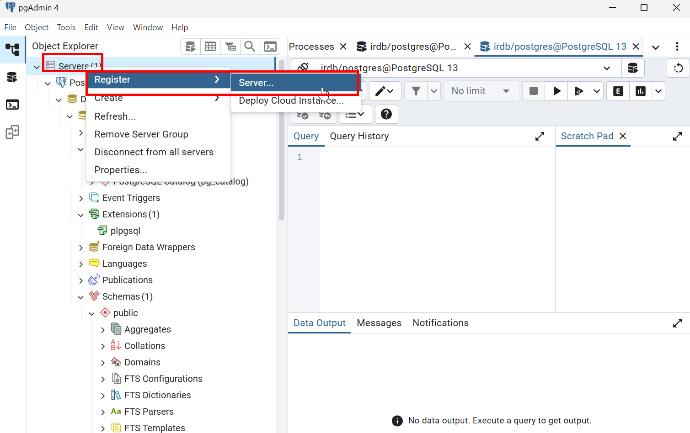
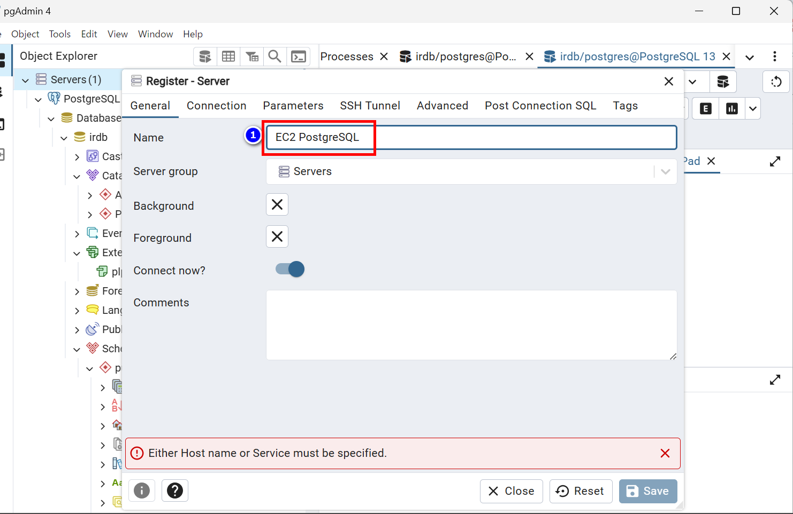
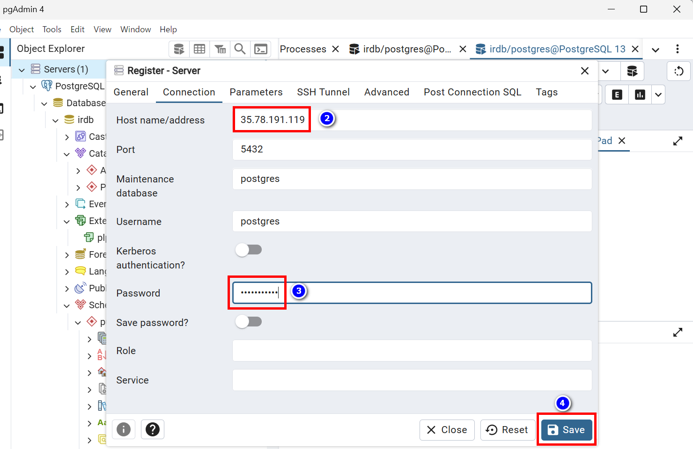

# pgAdmin 4 から EC2 の PostgreSQL に接続するための作業手順

**ローカルの pgAdmin 4 (v9.5)** を使って **Amazon EC2 上の PostgreSQL 15.7** に接続

以下に、**pgAdmin 4 から EC2 の PostgreSQL に接続するための作業手順**をまとめます。

---

## ✅ 【EC2 側】PostgreSQL 設定変更手順

### 1. `postgresql.conf` を編集（リッスンアドレスを変更）

```bash
vi /usr/local/pgsql/data/postgresql.conf
```

以下の設定が完了したことを確認してください

```conf
listen_addresses = '*'
port = 5432
```

---

### 2. `pg_hba.conf` を編集（外部アクセス許可）

```bash
 vi /usr/local/pgsql/data/pg_hba.conf
```

- 既存設定(後ほど上書きされる)

```
# TYPE  DATABASE        USER            ADDRESS                 METHOD

# "local" is for Unix domain socket connections only
local   all             all                                     trust
# IPv4 local connections:
host    all             all             127.0.0.1/32            trust
# IPv6 local connections:
host    all             all             ::1/128                 trust
# Allow replication connections from localhost, by a user with the
# replication privilege.
local   replication     all                                     trust
host    replication     all             127.0.0.1/32            trust
host    replication     all             ::1/128                 trust
host    all             all             0.0.0.0/0               trust
# IPv4 local connections:
host    all             all             127.0.0.1/32            scram-sha-256
# IPv4 remote connections (your local PC):
host    all             all             60.96.135.217/32        scram-sha-256
# Allow any IPv4 (for dev/test only - use with caution)
host    all             all             0.0.0.0/0               scram-sha-256
```

- 修正設定（上記既存設定を上書きしてください）

```
# TYPE  DATABASE        USER            ADDRESS                 METHOD

# Unix domain socket (ローカルのみ)
local   all             all                                     peer

# IPv4 local connections:
host    all             all             127.0.0.1/32            scram-sha-256

# IPv6 local connections:
host    all             all             ::1/128                 scram-sha-256

# pgAdmin からの接続許可（特定IPのみ）
host    all             postgres        60.96.135.217/32        scram-sha-256

# Replication（オプション）
local   replication     all                                     peer
host    replication     all             127.0.0.1/32            scram-sha-256
host    replication     all             ::1/128                 scram-sha-256
```

最新版

```
# TYPE  DATABASE        USER            ADDRESS                 METHOD

# Unix domain socket (ローカルのみ)
local   all             all                                     peer

# IPv4 local connections:
host    all             all             127.0.0.1/32            scram-sha-256

# IPv6 local connections:
host    all             all             ::1/128                 scram-sha-256

# IPv4 remote connections
host    all             all             0.0.0.0/0               scram-sha-256

# IPv6 remote connections
host    all             all             ::/0                    scram-sha-256

# pgAdmin からの接続許可（postgres ユーザ）
host    all             postgres        ::/0                    scram-sha-256
host    all             postgres        0.0.0.0/0               scram-sha-256

# backup_user によるリモートバックアップ用接続許可
host    all             backup_user     0.0.0.0/0               scram-sha-256
host    all             backup_user     ::/0                    scram-sha-256

# Replication（オプション）
local   replication     all                                     peer
host    replication     all             127.0.0.1/32            scram-sha-256
host    replication     all             ::1/128                 scram-sha-256
```

- PostgreSQL 設定の反映（再読み込み）

```bash
exit  # ec2-userに戻る
sudo systemctl restart postgresql
```

## 🧰 補足：PostgreSQL のログ確認方法

サービス起動時の詳細なエラーを見るには：

```bash
sudo journalctl -xeu postgresql.service
```

もしくは、手動起動してログを直接確認：

```bash
sudo -i -u postgres
/usr/local/pgsql/bin/pg_ctl -D /usr/local/pgsql/data -l /tmp/manual_postgres.log start
cat /tmp/manual_postgres.log
```

---

## 📋 確認コマンドまとめ

```bash
# PostgreSQL ステータス
sudo systemctl status postgresql

# 動作中のポート確認
sudo netstat -tulpn | grep :5432

# systemd ログを確認
sudo journalctl -xeu postgresql.service

# pg_hba.conf の内容確認
sudo cat /usr/local/pgsql/data/pg_hba.conf
```

---

---

## ✅ 【EC2 側】ファイアウォール設定（セキュリティグループ）

AWS コンソールで対象インスタンスの **セキュリティグループ** を編集し、以下を追加します：

| Type       | Protocol | Port Range | Source                    |
| ---------- | -------- | ---------- | ------------------------- |
| Custom TCP | TCP      | `5432`     | `<あなたのローカルIP>/32` |

例：`192.168.1.10/32`

---

## ✅ PostgreSQL の `postgres` ユーザーにパスワードを設定

EC2 上で PostgreSQL にログインし、パスワードを設定します。

### 1. PostgreSQL にログイン（ローカルから）

```bash
sudo -i -u postgres
 /usr/local/pgsql/bin/psql -U postgres -h /var/run/postgresql
```

### 2. `postgres` ユーザーにパスワードを設定

```sql
ALTER USER postgres WITH ENCRYPTED PASSWORD 'your_password_here';
```

例：

```sql
ALTER USER postgres WITH ENCRYPTED PASSWORD 'pgadmin4';
```

> 🔒 `your_password_here` は任意のパスワードに変更してください。

---

## ✅ pgAdmin 側の接続設定を更新

pgAdmin の Connection タブで以下の通り修正：

| 項目         | 値                                         |
| ------------ | ------------------------------------------ |
| **Password** | 先ほど設定したパスワード（例: `pgadmin4`） |

再度「Save」して接続を試してください。

---

## 📌 補足：PostgreSQL 側の `pg_hba.conf` が OK か確認

`pg_hba.conf` に以下のようなルールがあることを確認してください：

```conf
host    all             all             60.96.135.217/32        scram-sha-256
# または開発環境向け
host    all             all             0.0.0.0/0               scram-sha-256
```

その後、PostgreSQL を再起動：

```bash
exit  # ec2-user に戻る
sudo systemctl restart postgresql
```

---

## 🧰 必要であれば `pg_hba.conf` のデバッグログも取得可能

```bash
sudo journalctl -xeu postgresql.service
```

---

## ✅ 無事に接続できたら次にやること（任意）

- 新しいデータベース作成
- 新しいユーザー作成
- アプリケーションからの接続テスト

---

## ✅ 【ローカル】pgAdmin 4 から接続設定

1. **pgAdmin 4 を起動**
2. 左側の「**Servers**」を右クリック → 「Create > Server...」
   

### General タブ

- Name: `EC2 PostgreSQL`
- Group: 適当な名前 or Default
  

### Connection タブ

- Host name/address: `EC2のパブリックIPアドレス`
- Port: `5432`
- Maintenance database: `postgres`
- Username: `postgres`
- Password: パスワード（デフォルトは未設定なので必要なら初期パスワードを設定してください）

✅ 入力後、「Save」をクリックして保存。


---

## 🧪 動作確認（任意）

接続後に、左側のツリーから `Databases`, `Schemas`, `Tables` を展開できれば成功です。

---

## 🔒 必要であれば PostgreSQL パスワード設定

PostgreSQL の `postgres` ユーザーにパスワードを設定するには、EC2 上で以下を実行：

```bash
sudo -i -u postgres
/usr/local/pgsql/bin/psql -U postgres
```

```sql
ALTER USER postgres WITH PASSWORD 'your_password';
```

pgAdmin 4 側のパスワード入力欄にもそのパスワードを入力してください。

---

## 📌 最終チェックリスト

| 項目                                           | 確認状況 |
| ---------------------------------------------- | -------- |
| PostgreSQL の `listen_addresses = '*'`         | ✅       |
| PostgreSQL の `pg_hba.conf` にホストが追加済み | ✅       |
| AWS セキュリティグループでポート `5432` を解放 | ✅       |
| pgAdmin 4 で正しくサーバー設定完了             | ✅       |

---

## 📎 補足：SSH トンネル経由での接続（より安全な方法）

もし IP 制限やファイアウォールで直接接続できない場合、**SSH トンネル経由で接続する方法**もサポート可能です。必要であればお知らせください！

---

引き続きサポートいたしますので、pgAdmin 側のエラーが出る場合などは、その内容をお知らせください！  
無事に接続できるよう全力でお手伝いいたします 💪
