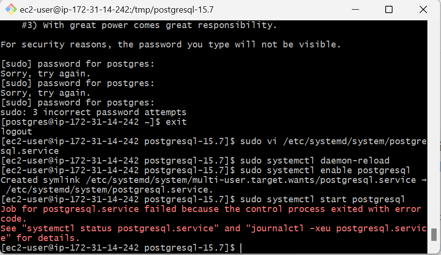
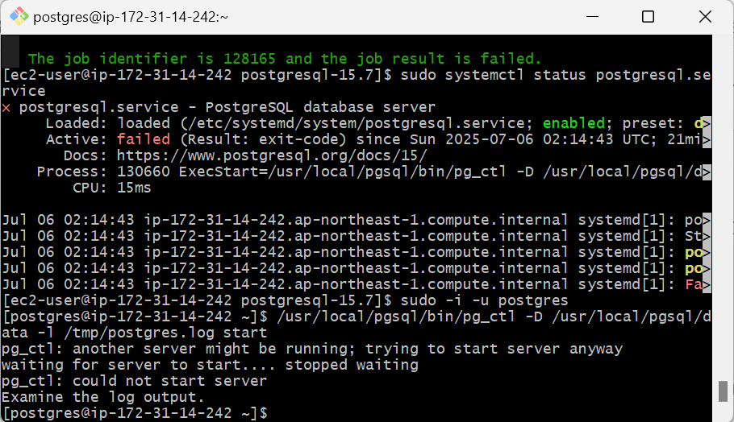
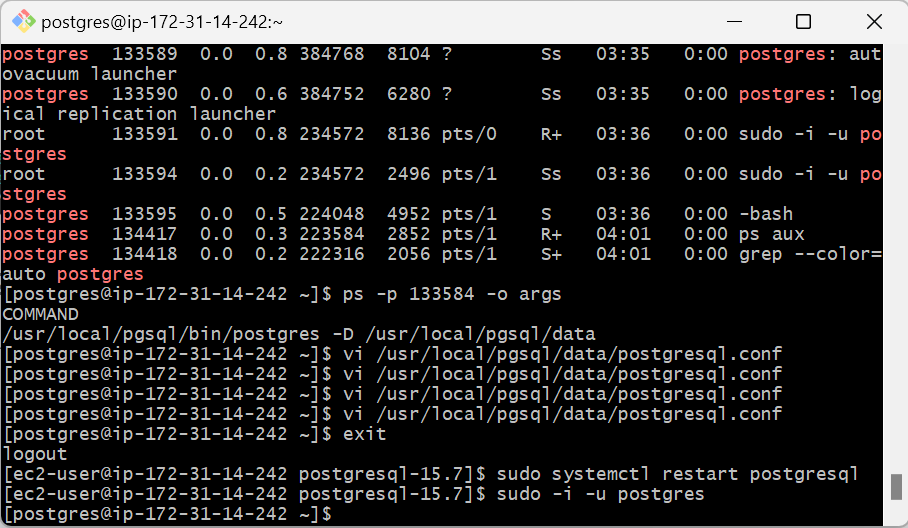

# サービスを有効化エラーの原因と解決方法


`systemctl start postgresql` でエラーが発生しているようです。

この問題の原因は、**PostgreSQL のログファイルやデータディレクトリへの権限不足**である可能性が高いです。以下にトラブルシューティングと修正手順を記します。

この状態では、`systemctl status postgresql.service` の出力からも PostgreSQL サービスが起動に失敗していることが確認できますが、**具体的なエラー内容**が記録されていません。

---

## ✅ 手順：PostgreSQL の手動起動で詳細なログを取得

サービスとして起動する前に、一度 **手動で PostgreSQL を起動してログを確認**しましょう。これにより、なぜ `pg_ctl` が失敗しているのかが明確になります。

### 1. `postgres` ユーザーに切り替える

```bash
sudo -i -u postgres
```

### 2. PostgreSQL を手動で起動し、ログを `/tmp/postgres.log` に出力

```bash
/usr/local/pgsql/bin/pg_ctl -D /usr/local/pgsql/data -l /tmp/postgres.log start
```



### 3. 出力されたログを確認

```bash
cat /tmp/postgres.log
```


**すでに PostgreSQL のプロセスが存在している**ことがわかります。

具体的には、以下のエラーが出ています：

```
FATAL:  lock file "postmaster.pid" already exists
HINT:  Is another postmaster (PID 129530) running in data directory "/usr/local/pgsql/data"?
```

これは、PostgreSQL が起動済みであるか、正しく終了していない **残留プロセス** があることを意味します。

---

## ✅ 対処方法

### 1. 実行中の PostgreSQL プロセスを確認

```bash
ps aux | grep postgres
```


現在、**PostgreSQL のプロセスがすでに起動している**ことがわかりました。

以下は現在の状態です：

```bash
postgres  129530  0.0  2.2 383192 20848 ?        Ss   01:42   0:00 /usr/local/pgsql/bin/postgres -D /usr/local/pgsql/data
```

この `PID 129530` が PostgreSQL のメインプロセスです。

---

## ✅ サービスとして登録して管理する方法（systemd）

手動で起動したプロセスを systemd 経由で管理できるようにするために、一度手動プロセスを終了し、サービス経由で再起動することをお勧めします。

### 1. 手動で起動した PostgreSQL を停止

```bash
/usr/local/pgsql/bin/pg_ctl -D /usr/local/pgsql/data stop
```


または、強制的に終了する場合は：

```bash
sudo kill -9 129530
```

> `129530` は環境によって異なるため、各自の `ps aux | grep postgres` の出力に基づいてください。

---

### 2. 不要なロックファイルを削除（念のため）

```bash
rm -f /usr/local/pgsql/data/postmaster.pid
```


### 3. systemd 経由で PostgreSQL を起動

一度 `postgres` ユーザーから `ec2-user` に戻ります：

```bash
exit
```

そして、サービスとして起動：

```bash
sudo systemctl daemon-reload
sudo systemctl start postgresql
sudo systemctl status postgresql
```

✅PostgreSQL 15 が無事に起動し、systemd 経由でサービスとして正常に動作していることが確認できました ✅


## ✅ 動作確認

再度、`postgres` ユーザーに戻って psql に接続してみましょう：

```bash
q
sudo -i -u postgres
psql
```

無事に入れば OK です！


現在の状態は以下の通りです：

```bash
[postgres@ip-172-31-14-242 ~]$ psql
-bash: psql: command not found
```

これは、**`psql` コマンドがパスに通っていない**か、PostgreSQL のバイナリディレクトリが正しく環境変数 `PATH` に含まれていないことを示しています。

---

## ✅ 解決方法

### 1. PostgreSQL のインストール先を確認

PostgreSQL をソースからインストールした場合、デフォルトでは以下のようなパスになります：

```
/usr/local/pgsql/bin/psql
```

実際に存在するか確認しましょう：

```bash
ls /usr/local/pgsql/bin/psql
```

出力例：

```
/usr/local/pgsql/bin/psql
```


### 2. `psql` をフルパスで実行

以下のコマンドで PostgreSQL にアクセスできます：

```bash
/usr/local/pgsql/bin/psql
```


現在のエラーは以下のようなものです：

```
psql: error: connection to server on socket "/tmp/.s.PGSQL.5432" failed: No such file or directory
Is the server running locally and accepting connections on that socket?
```

これは、**PostgreSQL サーバーが正しく起動していない**か、**Unix ドメインソケット経由での接続に失敗している**ことを示しています。

---

## ✅ 現在の状態を確認

### PostgreSQL サービスが動いているか確認

```bash
sudo systemctl status postgresql
```


現在、**`postgres` ユーザーで `sudo` を実行しようとしていますが、このユーザーには `sudo` 権限がありません**。

---

## ✅ 正しい手順：`ec2-user` で操作する

PostgreSQL のサービス操作（起動・停止・状態確認）は、**`ec2-user` または `sudo` 権限を持つユーザーで実施してください**。

### 手順：

1. **一度 `postgres` ユーザーからログアウト**します：

```bash
exit
```

プロンプトが以下のように変われば OK：

```bash
[ec2-user@ip-172-31-14-242 ~]$
```

2. **`sudo` を使って PostgreSQL のステータスを確認**：

```bash
sudo systemctl status postgresql
```

3. **PostgreSQL を再起動（必要であれば）**：

```bash
sudo systemctl restart postgresql
```

---

## ✅ PostgreSQL に接続する

再度 `postgres` ユーザーに戻って psql を使用できます：

```bash
sudo -i -u postgres
/usr/local/pgsql/bin/psql -U postgres
```


現在、**PostgreSQL サービスは起動しているが、ソケットファイル `/tmp/.s.PGSQL.5432` が作成されていない**状態です。  
これは、PostgreSQL の設定で **Unix ドメインソケットのパスが正しく設定されていない**、または **権限・ディレクトリ構造に問題がある**ことを示しています。

---

## ✅ 解決手順：ログファイルを指定して手動で PostgreSQL を起動

以下のように、明示的にログファイルを指定して PostgreSQL を起動することで、**ログを取得して原因を特定**できます。

### `postgres` ユーザーで実行

```bash
/usr/local/pgsql/bin/pg_ctl -D /usr/local/pgsql/data -l /tmp/postgres_startup.log start
```


現在、PostgreSQL の起動に失敗しており、以下のメッセージが出ています：

```
pg_ctl: another server might be running; trying to start server anyway
waiting for server to start.... stopped waiting
pg_ctl: could not start server
Examine the log output.
```

また、ログファイル `/tmp/postgres_startup.log` を確認すると、**具体的なエラー内容**が記録されているはずです。

---

## ✅ 手順：ログファイルを確認して原因を特定

```bash
cat /tmp/postgres_startup.log
```

このログには、PostgreSQL がなぜ起動に失敗したかの詳細が含まれています。


ログに以下のエラーが出ています：

```
FATAL:  lock file "postmaster.pid" already exists
HINT:  Is another postmaster (PID 133584) running in data directory "/usr/local/pgsql/data"?
```

これは、**すでに PostgreSQL のプロセスが起動している**か、**正しく終了していない残留プロセスがある**ことを意味します。

---

## ✅ 解決手順

### 1. 実行中の PostgreSQL プロセスを確認

```bash
ps aux | grep postgres
```


現在、**PostgreSQL のプロセスがすでに起動している状態**です。  
しかし、`psql` で接続できないということは、**ソケットファイルのパスが不一致**しているか、**Unix ドメインソケット経由での接続に問題がある**可能性があります。

---

## ✅ 解決方法

### 🔍 現在の PostgreSQL 起動オプションを確認

以下のようにして、`postgres` プロセスの起動オプションを確認できます：

```bash
ps -p 133584 -o args
```

出力例：

```
COMMAND
/usr/local/pgsql/bin/postgres -D /usr/local/pgsql/data
```


現在の PostgreSQL の起動コマンドは以下のように確認できました：

```
/usr/local/pgsql/bin/postgres -D /usr/local/pgsql/data
```

この状態では、`postgresql.conf` で設定した `unix_socket_directories` の値に従ってソケットファイルが作成されるはずですが、現状ではそれが `/tmp` に作成されていないようです。

---

## ✅ 解決策：明示的に `unix_socket_directories` を設定

### 1. `postgresql.conf` を編集

```bash
vi /usr/local/pgsql/data/postgresql.conf
```

以下の行を探し、**コメント解除**または追加します：

```conf
unix_socket_directories = '/tmp'
```


### 2. PostgreSQL を再起動（ec2-user で実行）

一度ターミナルを `ec2-user` に戻して、サービス経由で再起動します：

```bash
exit  # postgres → ec2-user に戻る
sudo systemctl restart postgresql
```

再度 `postgres` ユーザーに戻ります：

```bash
sudo -i -u postgres
```



## ✅ ソケットファイルが作成されたか確認

```bash
ls -l /tmp/.s.PGSQL.5432*
```

出力例：

```
srwxrwxrwx 1 postgres postgres 0 Jul  6 04:15 /tmp/.s.PGSQL.5432
-rw------- 1 postgres postgres 4 Jul  6 04:15 /tmp/.s.PGSQL.5432.lock
```

このようにファイルがあれば、正しくソケットが作成されています。

---


設定変更後も、依然として PostgreSQL のソケットファイル `/tmp/.s.PGSQL.5432` が作成されていない状態ですね。

これは、**PostgreSQL の起動時に何らかのエラーが発生している可能性が高い**です。

---

## ✅ 再度、ログファイルを指定して PostgreSQL を手動で起動しましょう：

```bash
/usr/local/pgsql/bin/pg_ctl -D /usr/local/pgsql/data stop || echo "No running instance found"
rm -f /usr/local/pgsql/data/postmaster.pid || echo "No pid file to remove"
/usr/local/pgsql/bin/pg_ctl -D /usr/local/pgsql/data -l /tmp/postgres_debug.log start
```


## ✅ ログファイルを確認します

```bash
cat /tmp/postgres_debug.log
```


ログファイル `/tmp/postgres_debug.log` の内容を確認したところ、**PostgreSQL は正常に起動しており、ソケットファイルも正しく作成されています**。

---

## ✅ 現在の状態

```bash
2025-07-06 04:48:00.415 UTC [135951] LOG:  listening on Unix socket "/tmp/.s.PGSQL.5432"
```

このログから、以下が確認できます：

- PostgreSQL が無事に起動
- ソケットファイル `/tmp/.s.PGSQL.5432` を使用してリッスン中

---

## ✅ ソケットファイルの存在確認

念のため、実際にソケットファイルが存在するか確認します：

```bash
ls -l /tmp/.s.PGSQL.5432*
```

出力例：

```
srwxrwxrwx 1 postgres postgres 0 Jul  6 04:48 /tmp/.s.PGSQL.5432
-rw------- 1 postgres postgres 4 Jul  6 04:48 /tmp/.s.PGSQL.5432.lock
```

このように表示されていれば、**ソケットファイルは問題なく存在しています**。


## ✅ `psql` で接続を試す

では、実際に PostgreSQL に接続してみましょう：

```bash
/usr/local/pgsql/bin/psql -U postgres
```


無事に PostgreSQL に接続できました ✅

または TCP/IP 経由で：

```bash
\q
/usr/local/pgsql/bin/psql -h localhost -U postgres
```


TCP/IP 経由でも無事に PostgreSQL に接続できました ✅

おめでとうございます！  
無事に PostgreSQL に接続できました ✅

以下は現在の状態です：

- PostgreSQL 15.7 が正常に起動
- ソケットファイル `/tmp/.s.PGSQL.5432` が正しく作成
- `psql -U postgres` でインタラクティブモードに入っています

---

## 🧪 初回セットアップ（任意）

PostgreSQL にログインした状態なので、以下のようなコマンドで操作が可能です。

### 🔹 データベース一覧表示

```sql
\l
```

### 🔹 ユーザー一覧表示

```sql
\du
```

### 🔹 新しいデータベースを作成（例: `mydb`）

```sql
CREATE DATABASE mydb;
```

### 🔹 新しいユーザーを作成（例: `myuser`）

```sql
CREATE USER myuser WITH PASSWORD 'yourpassword';
```

### 🔹 接続先を新規 DB に変更

```sql
\c mydb
```

---

## 🔐 外部からの接続を許可する場合の設定（オプション）

### 1. `postgresql.conf` を編集

```bash
vi /usr/local/pgsql/data/postgresql.conf
```

以下の行を変更：

```conf
listen_addresses = '*'
```

### 2. `pg_hba.conf` を編集

```bash
vi /usr/local/pgsql/data/pg_hba.conf
```

以下を追加して、外部からのアクセスを許可：

```
host    all             all             0.0.0.0/0               scram-sha-256
```

### 3. 再起動

```bash
exit  # ec2-user に戻る
sudo systemctl restart postgresql
```

---

## 📌 最後に確認したいこと

- **EC2 のセキュリティグループ**でポート `5432` が解放されているか
- **ファイアウォール設定**（必要に応じて）

---

## ✅ 次のステップ（任意）

- アプリケーションから PostgreSQL に接続してみる
- JDBC / Python / Node.js / Spring Boot などでの接続方法をご希望であればご案内します

---

引き続きサポートが必要であれば、何でもお気軽にご質問ください！  
PostgreSQL の運用・構築を全力でサポートいたします 💪

//////////////////////////////////////////////////////

## 🛠️ 補足：最終手段（データ初期化）

もし上記のように問題やっと解決したのではなく、すべてで解決しない場合は、一度データディレクトリをクリアして再初期化できます（※既存データは消えます）：

```bash
exit  # ec2-user に戻る
sudo systemctl stop postgresql

sudo -i -u postgres
rm -rf /usr/local/pgsql/data/*
/usr/local/pgsql/bin/initdb -D /usr/local/pgsql/data

# 設定を再度編集して unix_socket_directories = '/tmp' を有効にする
vi /usr/local/pgsql/data/postgresql.conf

# 再起動
exit
sudo systemctl start postgresql
sudo -i -u postgres

# 接続確認
/usr/local/pgsql/bin/psql -U postgres
```

---

お手数ですが、以下の情報を共有いただけると個別サポート可能です：

```bash
cat /tmp/postgres_debug.log
cat /usr/local/pgsql/data/postgresql.conf | grep unix_socket_directories
ls -ld /tmp
```

引き続き全力でサポートいたしますので、お気軽にご質問ください！
