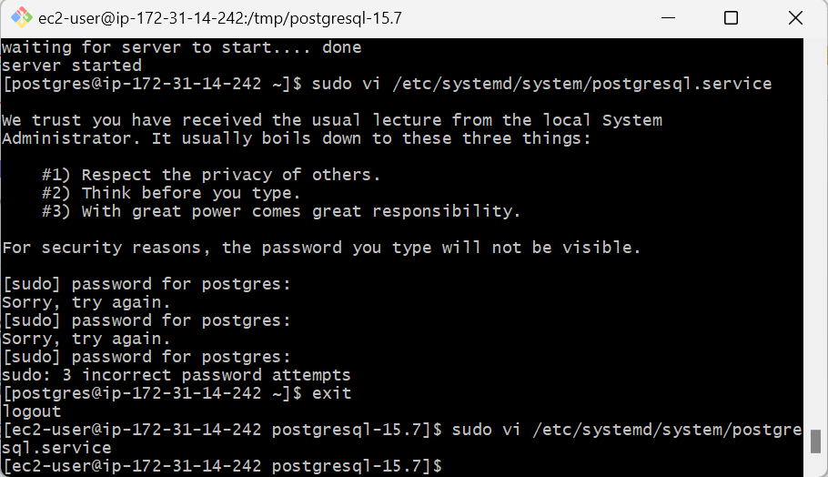

# postgresql.service 自動起動設定（オプション）

`vi`（または `vim`）エディタでの**基本的な編集方法と保存・終了の手順**をわかりやすく説明します。

---

## root 権限のある ec2-user に戻って処理を実施

```bash
exit
```

## 🔧 `vi` での編集・保存・終了手順

### ① 編集対象ファイルを開く

```bash
sudo vi /etc/systemd/system/postgresql.service
```

---

### ② 編集モードに入る

キーボードで以下を押します：

```bash
i
```

> 🔁 `i` は「Insert（挿入）」の意味で、編集モードに切り替わります。

---

### ③ 画面に以下の内容を貼り付ける（マウス右クリックや Shift+Insert など）

```ini
[Unit]
Description=PostgreSQL database server
Documentation=https://www.postgresql.org/docs/15/
After=network.target

[Service]
Type=forking
User=postgres
Group=postgres
ExecStart=/usr/local/pgsql/bin/pg_ctl -D /usr/local/pgsql/data start
ExecStop=/usr/local/pgsql/bin/pg_ctl -D /usr/local/pgsql/data stop
Restart=on-failure
PrivateTmp=true

[Install]
WantedBy=multi-user.target
```

---

### ④ 編集を保存して終了する

1. キーボードで `Esc` を押して**編集モードを終了**。
2. 以下を入力して**保存して終了**します：

```bash
:wq
```

（`:wq` は「write & quit」＝保存して終了）


## ✅ まとめ（よく使う `vi` 操作）

| 操作内容               | キー入力      |
| ---------------------- | ------------- |
| 編集モードに入る       | `i`           |
| 編集モードを抜ける     | `Esc`         |
| 保存して終了する       | `:wq` + Enter |
| 保存せずに終了する     | `:q!` + Enter |
| 保存のみ（終了しない） | `:w` + Enter  |

---

質問があれば何でもどうぞ。`systemctl enable` などの次のステップも必要なら案内します。
