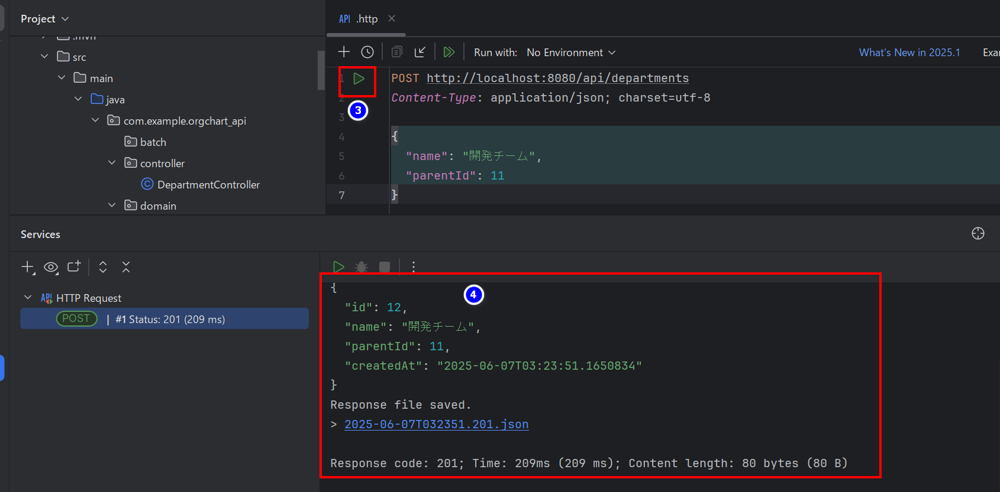

<span style="color: #007acc; font-weight: bold; font-size: 1.5rem;">008 挙動テスト</span>

## ✅ IntelliJ IDEA のターミナル文字コード設定を UTF-8 にする

### 1. IntelliJ IDEA の設定を開く

- Windows/Linux: `Ctrl + Alt + S`
- macOS: `Cmd + ,`

### 2. `Editor > File Encodings` を開く

以下のように設定してください：

| 設定項目                        | 設定値 |
| ------------------------------- | ------ |
| Global Encoding                 | UTF-8  |
| Project Encoding                | UTF-8  |
| Default encoding for properties | UTF-8  |

✅ **"Transparent native-to-ascii conversion"** にチェックも入れてください（.properties 用）。

---

## intelliJ ターミナルでの文字化け問題

```bash
PS D:\orgchart-api> Invoke-RestMethod -Uri http://localhost:8080/api/departments `
>>   -Method POST `
>>   -Headers @{ "Content-Type" = "application/json" } `
>>   -Body '{ "name": "設計チーム" }'

id name  parentId createdAt
-- ----  -------- ---------
 5 ?????          2025-06-06T18:33:49.4065812


PS D:\orgchart-api>


```

## .http ファイルでのテスト方法に変更

curl での登録は文字化けの問題が解決できないため、.http ファイルテストに切り替えます。

プロジェクトのルートディレクトリ(他の適切な場所でも ok)に`.http`ファイルを作成する。

```json
POST http://localhost:8080/api/departments
Content-Type: application/json; charset=utf-8

{
  "name": "設計チーム",
  "parentId": null
}
```


```json
POST http://localhost:8080/api/departments
Content-Type: application/json; charset=utf-8

{
  "name": "開発チーム",
  "parentId": 11
}
```



