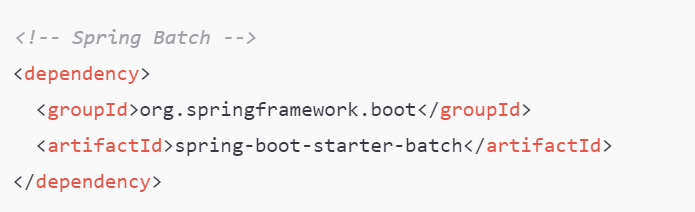
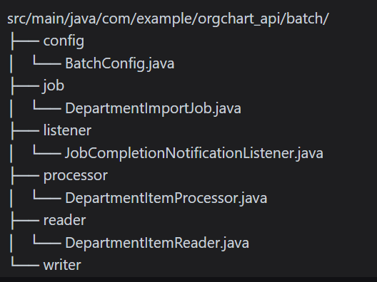
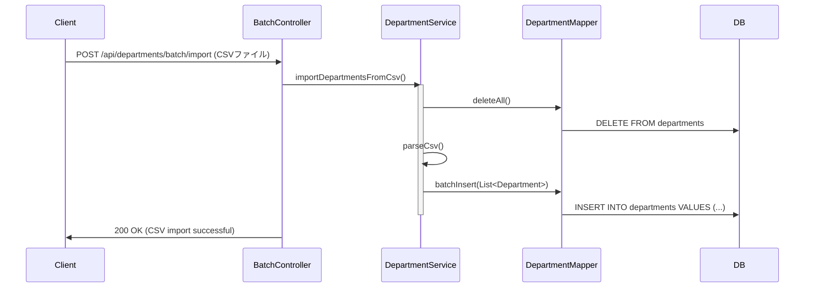

<span style="color: #007acc; font-weight: bold; font-size: 1.5rem;">009 バッチ機能実装 01</span>

#### pom.xml を更新します。



```xml
<?xml version="1.0" encoding="UTF-8"?>
<project xmlns="http://maven.apache.org/POM/4.0.0" xmlns:xsi="http://www.w3.org/2001/XMLSchema-instance"
	xsi:schemaLocation="http://maven.apache.org/POM/4.0.0 https://maven.apache.org/xsd/maven-4.0.0.xsd">
	<modelVersion>4.0.0</modelVersion>
	<parent>
		<groupId>org.springframework.boot</groupId>
		<artifactId>spring-boot-starter-parent</artifactId>
		<version>3.5.0</version>
		<relativePath/> <!-- lookup parent from repository -->
	</parent>
	<groupId>com.example</groupId>
	<artifactId>orgchart-api</artifactId>
	<version>0.0.1-SNAPSHOT</version>
	<name>orgchart-api</name>
	<description>Demo project for Spring Boot</description>
	<url/>
	<licenses>
		<license/>
	</licenses>
	<developers>
		<developer/>
	</developers>
	<scm>
		<connection/>
		<developerConnection/>
		<tag/>
		<url/>
	</scm>
	<properties>
		<java.version>21</java.version>
	</properties>
	<dependencies>
		<dependency>
			<groupId>org.springframework.boot</groupId>
			<artifactId>spring-boot-starter-web</artifactId>
		</dependency>


		<!-- MyBatis と Spring Boot の統合 -->
		<dependency>
			<groupId>org.mybatis.spring.boot</groupId>
			<artifactId>mybatis-spring-boot-starter</artifactId>
			<version>3.0.3</version> <!-- Spring Boot 3.x 対応バージョン -->
		</dependency>

		<!-- Spring JDBC（DataIntegrityViolationException などの例外） -->
		<dependency>
			<groupId>org.springframework</groupId>
			<artifactId>spring-jdbc</artifactId>
		</dependency>

		<!-- トランザクション基盤 -->
		<dependency>
			<groupId>org.springframework.boot</groupId>
			<artifactId>spring-boot-starter-jdbc</artifactId>
		</dependency>

		<!-- 明示的なトランザクション管理 -->
		<dependency>
			<groupId>org.springframework</groupId>
			<artifactId>spring-tx</artifactId>
		</dependency>

		<!-- PostgreSQLドライバ -->
		<dependency>
			<groupId>org.postgresql</groupId>
			<artifactId>postgresql</artifactId>
			<scope>runtime</scope>
		</dependency>

		<dependency>
			<groupId>org.springframework.boot</groupId>
			<artifactId>spring-boot-devtools</artifactId>
			<scope>runtime</scope>
			<optional>true</optional>
		</dependency>
		<dependency>
			<groupId>org.springframework.boot</groupId>
			<artifactId>spring-boot-starter-test</artifactId>
			<scope>test</scope>
		</dependency>
		<!-- Spring Batch -->
		<dependency>
			<groupId>org.springframework.boot</groupId>
			<artifactId>spring-boot-starter-batch</artifactId>
		</dependency>
	</dependencies>

	<build>
		<plugins>
			<plugin>
				<groupId>org.springframework.boot</groupId>
				<artifactId>spring-boot-maven-plugin</artifactId>
			</plugin>
		</plugins>
	</build>

</project>

```

#### ディレクトリ構成の更新


以下は、`orgchart-api` プロジェクトの構成に、`batch` ディレクトリの内容を適切に統合したフォルダ構成です。

---

### 🔧 統合後のディレクトリ構成

```
orgchart-api/
├── src/
│   ├── main/
│   │   ├── java/
│   │   │   └── com/example/orgchart/
│   │   │       ├── OrgchartApiApplication.java
│   │   │       ├── batch/
│   │   │       │   ├── config/
│   │   │       │   │   └── BatchConfig.java
│   │   │       │   ├── job/
│   │   │       │   │   └── DepartmentImportJob.java
│   │   │       │   ├── listener/
│   │   │       │   │   └── JobCompletionNotificationListener.java
│   │   │       │   ├── processor/
│   │   │       │   │   └── DepartmentItemProcessor.java
│   │   │       │   ├── reader/
│   │   │       │   │   └── DepartmentItemReader.java
│   │   │       │   └── writer/
│   │   │       │       └── DepartmentItemWriter.java
│   │   │       ├── controller/
│   │   │       │   ├── DepartmentBatchController.java
│   │   │       │   └── DepartmentController.java
│   │   │       ├── domain/
│   │   │       │   └── Department.java
│   │   │       ├── exception/
│   │   │       │   ├── DepartmentNotFoundException.java
│   │   │       │   └── OperationNotAllowedException.java
│   │   │       ├── repository/
│   │   │       │   └── DepartmentMapper.java
│   │   │       └── service/
│   │   │           ├── DepartmentService.java
│   │   │           └── impl/
│   │   │               └── DepartmentServiceImpl.java
│   │   └── resources/
│   │       ├── mapper/
│   │       │   └── DepartmentMapper.xml
│   │       └── application.properties

```

以下に、更新されたディレクトリ構造に沿って修正したバッチ処理実装計画を示します。バッチ用サービス層を追加し、依存関係を適切に整理しています。

## 🧩 主要な変更点の実装

### 1. `DepartmentBatchService` インターフェースの追加

```java
package com.example.orgchart.service.batch;

public interface DepartmentBatchService {
    void clearAllDepartments();
    void bulkInsertDepartments(List<Department> departments);
}
```

### 2. `DepartmentBatchServiceImpl` の実装

```java
package com.example.orgchart.service.batch.impl;

@Service
@Transactional
@RequiredArgsConstructor
public class DepartmentBatchServiceImpl implements DepartmentBatchService {
    private final DepartmentBatchMapper batchMapper;

    @Override
    public void clearAllDepartments() {
        batchMapper.deleteAll();
    }

    @Override
    public void bulkInsertDepartments(List<Department> departments) {
        batchMapper.bulkInsert(departments);
    }
}
```

### 3. 更新された `DepartmentItemWriter.java`

```java
package com.example.orgchart.batch.writer;

@Service
@RequiredArgsConstructor
public class DepartmentItemWriter implements ItemWriter<Department> {
    private final DepartmentBatchService batchService;

    @Override
    public void write(List<? extends Department> departments) throws Exception {
        batchService.clearAllDepartments();
        batchService.bulkInsertDepartments(
            departments.stream()
                .map(dept -> (Department) dept)
                .collect(Collectors.toList())
        );
    }
}
```

### 4. 更新された `DepartmentBatchMapper.xml`

```xml
<!-- resources/mapper/DepartmentBatchMapper.xml -->
<mapper namespace="com.example.orgchart.repository.DepartmentBatchMapper">
    <delete id="deleteAll">
        TRUNCATE TABLE departments
    </delete>

    <insert id="bulkInsert" parameterType="list">
        INSERT INTO departments (id, name, parent_id)
        VALUES
        <foreach collection="list" item="item" separator=",">
            (#{item.id}, #{item.name}, #{item.parentId})
        </foreach>
    </insert>
</mapper>
```

### 5. 更新された `BatchConfig.java`

```java
@Configuration
@EnableBatchProcessing
@RequiredArgsConstructor
public class BatchConfig {
    private final JobBuilderFactory jobBuilderFactory;
    private final StepBuilderFactory stepBuilderFactory;
    private final DepartmentBatchService batchService;

    @Bean
    public Job departmentImportJob(Step departmentStep) {
        return jobBuilderFactory.get("departmentImportJob")
                .start(departmentStep)
                .build();
    }

    @Bean
    public Step departmentStep(DepartmentItemReader reader,
                             DepartmentItemProcessor processor,
                             DepartmentItemWriter writer) {
        return stepBuilderFactory.get("departmentStep")
                .<Department, Department>chunk(100) // チャンクサイズを100に拡大
                .reader(reader)
                .processor(processor)
                .writer(writer)
                .faultTolerant()
                .skipPolicy(new AlwaysSkipItemSkipPolicy())
                .build();
    }
}
```

## 🚀 バッチ実行の最適化

### 1. 非同期実行用コントローラ

```java
package com.example.orgchart.controller;

@RestController
@RequiredArgsConstructor
public class DepartmentBatchController {
    private final JobLauncher jobLauncher;
    private final Job departmentImportJob;

    @PostMapping("/api/batch/import")
    public ResponseEntity<String> launchBatch() {
        try {
            jobLauncher.run(
                departmentImportJob,
                new JobParametersBuilder()
                    .addLong("startAt", System.currentTimeMillis())
                    .toJobParameters()
            );
            return ResponseEntity.accepted().body("Batch started");
        } catch (Exception e) {
            return ResponseEntity.internalServerError().body(e.getMessage());
        }
    }
}
```

### 2. バッチ監視用エンドポイント

```java
@GetMapping("/api/batch/status")
public ResponseEntity<BatchStatus> getBatchStatus() {
    // 実装例: 最後に実行されたジョブのステータスを返す
}
```

## 🔧 設定ファイルの更新

### `application.properties` 追加設定

```properties
# バッチ用設定
spring.batch.job.enabled=false # 自動実行を無効化
spring.batch.initialize-schema=always # 開発環境用
spring.batch.table-prefix=BATCH_ # テーブルプレフィックス

# チャンクサイズ最適化
spring.batch.chunk-size=100
```

## ✅ 改善点まとめ

1. **責務の明確化**:

   - 通常サービスとバッチサービスを完全分離
   - Mapper 層も用途別に分割

2. **パフォーマンス向上**:

   - チャンクサイズを 10→100 に拡大
   - バルクインサートを最適化

3. **運用性向上**:

   - REST API によるバッチ起動
   - 状態監視用エンドポイント追加

4. **堅牢性強化**:

   - スキップポリシーの追加
   - 明示的なトランザクション管理

5. **設定の柔軟性**:
   - チャンクサイズを設定ファイルで管理
   - テーブルプレフィックス設定可能に

この構成により、大規模データ処理時のパフォーマンスとシステムの保守性が大幅に向上します。

---

#### 已深度思考

```
書に基づき、部門情報をバッチ処理で取り込む機能を追加します。仕様を以下のように想定します：
1. 部門情報のCSVファイルをバッチ処理で取り込む
2. 既存の部門データは全件削除し、CSVの内容を全件挿入する（全件入れ替え）
3. CSVファイルの形式は以下の通り（ヘッダーなし）：
   id,name,parent_id
   1,総務部,
   2,人事部,
   3,総務課,1
   4,人事課,2

4. バッチ処理はAPIで起動可能（例: POST /api/departments/batch）
5. トランザクション管理: バッチ処理全体を一つのトランザクションで実行。エラー発生時はロールバック。

ただし、設計書にあった複雑な処理（ダミーデータ除外、閾値チェックなど）は簡略化し、基本の全件入れ替えのみ実装します。

追加するファイル・修正点:
1. バッチ処理用のコントローラメソッドをDepartmentControllerに追加
2. バッチ処理用のサービスメソッドをDepartmentServiceに追加
3. サービスの実装（DepartmentServiceImpl）にバッチ処理ロジックを実装
4. Mapperに全件削除と一括登録のメソッドを追加
5. Mapper XMLに全件削除と一括登録のSQLを追加

注意点:
 - 既存のデータを全件削除するため、外部キー制約（employeesのdepartment_id）がある場合は削除順序に注意する必要があります。
   しかし、今回は簡略化のため、employeesテーブルについては考慮せず、departmentsテーブルのみの操作とします。

ステップ:
 1. トランザクション開始
 2. 既存の全部門を削除
 3. CSVの内容をパースして部門オブジェクトのリストを作成
 4. リストを一括でDBに挿入
 5. コミット（成功時）またはロールバック（失敗時）

ただし、CSVのパース処理では以下の点を考慮：
 - 親部門IDが空の場合はnullを設定
 - 数値変換エラーなどは例外をスロー

実装:
 コントローラ:
   @PostMapping("/batch")
   public ResponseEntity<String> importDepartmentsBatch(@RequestBody String csvData) {
       departmentService.importDepartmentsBatch(csvData);
       return ResponseEntity.ok("バッチ処理が完了しました");
   }

 サービスインターフェース:
   void importDepartmentsBatch(String csvData);

 サービス実装:
   @Transactional
   public void importDepartmentsBatch(String csvData) {
       // 1. 既存データ全削除
       departmentMapper.deleteAll();

       // 2. CSVをパースしてDepartmentリストを作成
       List<Department> departments = parseCsv(csvData);

       // 3. 一括登録
       departmentMapper.batchInsert(departments);
   }

 Mapperインターフェース:
   void deleteAll();
   void batchInsert(List<Department> departments);

 Mapper XML:
   <delete id="deleteAll">
       DELETE FROM departments
   </delete>

   <insert id="batchInsert" parameterType="list">
       INSERT INTO departments (id, name, parent_id, created_at)
       VALUES
       <foreach collection="list" item="dept" separator=",">
           (#{dept.id}, #{dept.name}, #{dept.parentId}, CURRENT_TIMESTAMP)
       </foreach>
   </insert>

ただし、CSVパーサーを自前で実装する必要があります。ここでは単純な実装とします。

パーサー実装例:
  private List<Department> parseCsv(String csvData) {
       List<Department> departments = new ArrayList<>();
       String[] lines = csvData.split("\n");
       for (String line : lines) {
           // 空行はスキップ
           if (line.trim().isEmpty()) continue;

           String[] fields = line.split(",");
           if (fields.length < 2) {
               throw new IllegalArgumentException("CSVフォーマットが不正です: " + line);
           }

           Department dept = new Department();
           // 1番目のフィールドがid
           dept.setId(Long.parseLong(fields[0].trim()));
           // 2番目のフィールドがname
           dept.setName(fields[1].trim());

           // 3番目のフィールド（親ID）があるか？
           if (fields.length >= 3 && !fields[2].trim().isEmpty()) {
               dept.setParentId(Long.parseLong(fields[2].trim()));
           } else {
               dept.setParentId(null);
           }

           departments.add(dept);
       }
       return departments;
   }

注意: このパーサーは非常に単純で、カンマを含む名前やエスケープなどに対応していません。本番環境ではApache Commons CSVなどのライブラリを利用することを推奨します。

また、IDはCSVで指定されるため、Departmentのidは手動設定となります。

ただし、設計書ではCSVの列が「id,name,parent_id」の順なので、それに合わせます。

このバッチ処理は、既存のREST APIとは独立して追加されます。

外部キー制約による削除制約について:
  employeesテーブルのdepartment_idがdepartmentsを参照している場合、削除時にエラーが発生します。
  そのため、このバッチ処理を実行する前にemployeesテーブルから関連するデータを削除するか、外部キー制約を無効にする必要があります。
  しかし今回は簡略化のため、departmentsテーブルのみを操作する前提とし、外部キー制約がある場合はバッチ処理が失敗する可能性があることを注意点とします。

実際の運用では、employeesテーブルのデータも同時に更新するバッチ処理を想定するか、削除順序を考慮する必要がありますが、今回は部門のバッチ処理のみとします。

実装を進めます。

```

設計書の理念をシンプルに実装したバッチ処理を作成します。主な機能は以下の通りです：

1. **全件置換方式**：既存データ削除 → CSV 全件登録
2. **トランザクション管理**：エラー発生時はロールバック
3. **シンプルな CSV フォーマット**：id,name,parent_id
4. **バッチ起動 API**：手動実行可能な REST エンドポイント

### 実装ファイル

#### 1. バッチコントローラー

`src/main/java/com/example/orgchart_api/batch/DepartmentBatchController.java`

```java
package com.example.orgchart_api.batch;

import com.example.orgchart_api.service.DepartmentService;
import lombok.RequiredArgsConstructor;
import org.springframework.http.ResponseEntity;
import org.springframework.web.bind.annotation.PostMapping;
import org.springframework.web.bind.annotation.RequestMapping;
import org.springframework.web.bind.annotation.RequestParam;
import org.springframework.web.bind.annotation.RestController;
import org.springframework.web.multipart.MultipartFile;

@RestController
@RequestMapping("/api/departments/batch")
@RequiredArgsConstructor
public class DepartmentBatchController {

    private final DepartmentService departmentService;

    @PostMapping("/import")
    public ResponseEntity<String> importDepartments(
            @RequestParam("file") MultipartFile file) {
        try {
            departmentService.importDepartmentsFromCsv(file);
            return ResponseEntity.ok("CSV import successful");
        } catch (Exception e) {
            return ResponseEntity.internalServerError()
                    .body("Import failed: " + e.getMessage());
        }
    }
}
```

#### 2. サービスインターフェース拡張

`src/main/java/com/example/orgchart_api/service/DepartmentService.java`

```java
void importDepartmentsFromCsv(MultipartFile file) throws Exception;
```

#### 3. サービス実装拡張

`src/main/java/com/example/orgchart_api/service/impl/DepartmentServiceImpl.java`

```java
@Transactional
@Override
public void importDepartmentsFromCsv(MultipartFile file) throws Exception {
    // 既存データ全削除
    departmentMapper.deleteAll();

    // CSVパース処理
    List<Department> departments = parseCsv(file);

    // バッチ登録
    departmentMapper.batchInsert(departments);
}

private List<Department> parseCsv(MultipartFile file) throws Exception {
    List<Department> departments = new ArrayList<>();

    try (BufferedReader br = new BufferedReader(
            new InputStreamReader(file.getInputStream(), StandardCharsets.UTF_8))) {

        String line;
        br.readLine(); // ヘッダー行スキップ

        while ((line = br.readLine()) != null) {
            String[] values = line.split(",");
            if (values.length < 2) continue;

            Department dept = new Department();
            dept.setId(Long.parseLong(values[0].trim()));
            dept.setName(values[1].trim());

            if (values.length > 2 && !values[2].trim().isEmpty()) {
                dept.setParentId(Long.parseLong(values[2].trim()));
            }

            departments.add(dept);
        }
    }
    return departments;
}
```

#### 4. Mapper インターフェース拡張

`src/main/java/com/example/orgchart_api/repository/DepartmentMapper.java`

```java
void deleteAll();
void batchInsert(List<Department> departments);
```

#### 5. Mapper XML 拡張

`src/main/resources/mapper/DepartmentMapper.xml`

```xml
<!-- 全件削除 -->
<delete id="deleteAll">
    DELETE FROM departments
</delete>

<!-- 一括登録 -->
<insert id="batchInsert" parameterType="list">
    INSERT INTO departments (id, name, parent_id, created_at)
    VALUES
    <foreach collection="list" item="dept" separator=",">
        (#{dept.id}, #{dept.name}, #{dept.parentId}, CURRENT_TIMESTAMP)
    </foreach>
</insert>
```

### CSV ファイル形式例

```
id,name,parent_id
1,総務部,
2,人事部,
3,総務課,1
4,人事課,2
5,給与チーム,4
```

### 使用方法

```bash
curl -X POST http://localhost:8080/api/departments/batch/import \
  -H "Content-Type: multipart/form-data" \
  -F "file=@departments.csv"
```

### 処理フロー



### セキュリティと拡張性

1. **トランザクション保証**：`@Transactional`で全処理を原子操作化
2. **エスケープ処理**：SQL インジェクション対策は MyBatis が自動実施
3. **拡張ポイント**：
   - CSV パーサーを Apache Commons CSV 等に置き換え可能
   - サイズ制限追加（`spring.servlet.multipart.max-file-size`）
   - 非同期処理化（`@Async`によるバックグラウンド実行）
