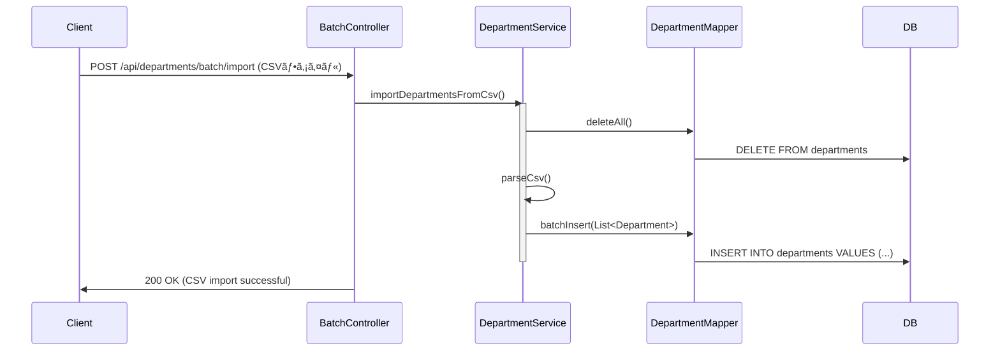

<span style="color: #007acc; font-weight: bold; font-size: 1.5rem;">009 ãƒãƒƒãƒæ©Ÿèƒ½å®Ÿè£… 01</span>

#### pom.xml ã‚’æ›´æ–°ã—ã¾ã™ã€‚


```xml
<?xml version="1.0" encoding="UTF-8"?>
<project xmlns="http://maven.apache.org/POM/4.0.0" xmlns:xsi="http://www.w3.org/2001/XMLSchema-instance"
	xsi:schemaLocation="http://maven.apache.org/POM/4.0.0 https://maven.apache.org/xsd/maven-4.0.0.xsd">
	<modelVersion>4.0.0</modelVersion>
	<parent>
		<groupId>org.springframework.boot</groupId>
		<artifactId>spring-boot-starter-parent</artifactId>
		<version>3.5.0</version>
		<relativePath/> <!-- lookup parent from repository -->
	</parent>
	<groupId>com.example</groupId>
	<artifactId>orgchart-api</artifactId>
	<version>0.0.1-SNAPSHOT</version>
	<name>orgchart-api</name>
	<description>Demo project for Spring Boot</description>
	<url/>
	<licenses>
		<license/>
	</licenses>
	<developers>
		<developer/>
	</developers>
	<scm>
		<connection/>
		<developerConnection/>
		<tag/>
		<url/>
	</scm>
	<properties>
		<java.version>21</java.version>
	</properties>
	<dependencies>
		<dependency>
			<groupId>org.springframework.boot</groupId>
			<artifactId>spring-boot-starter-web</artifactId>
		</dependency>


		<!-- MyBatis 㨠Spring Boot ã®çµ±åˆ -->
		<dependency>
			<groupId>org.mybatis.spring.boot</groupId>
			<artifactId>mybatis-spring-boot-starter</artifactId>
			<version>3.0.3</version> <!-- Spring Boot 3.x 対応ãƒãƒ¼ã‚¸ãƒ§ãƒ³ -->
		</dependency>

		<!-- Spring JDBC（DataIntegrityViolationException ãªã©ã®ä¾‹å¤–） -->
		<dependency>
			<groupId>org.springframework</groupId>
			<artifactId>spring-jdbc</artifactId>
		</dependency>

		<!-- トランザクション基盤 -->
		<dependency>
			<groupId>org.springframework.boot</groupId>
			<artifactId>spring-boot-starter-jdbc</artifactId>
		</dependency>

		<!-- æ˜ç¤ºçš„ãªãƒˆãƒ©ãƒ³ã‚¶ã‚¯ã‚·ãƒ§ãƒ³ç®¡ç† -->
		<dependency>
			<groupId>org.springframework</groupId>
			<artifactId>spring-tx</artifactId>
		</dependency>

		<!-- PostgreSQLドライム-->
		<dependency>
			<groupId>org.postgresql</groupId>
			<artifactId>postgresql</artifactId>
			<scope>runtime</scope>
		</dependency>

		<dependency>
			<groupId>org.springframework.boot</groupId>
			<artifactId>spring-boot-devtools</artifactId>
			<scope>runtime</scope>
			<optional>true</optional>
		</dependency>
		<dependency>
			<groupId>org.springframework.boot</groupId>
			<artifactId>spring-boot-starter-test</artifactId>
			<scope>test</scope>
		</dependency>
		<!-- Spring Batch -->
		<dependency>
			<groupId>org.springframework.boot</groupId>
			<artifactId>spring-boot-starter-batch</artifactId>
		</dependency>
	</dependencies>

	<build>
		<plugins>
			<plugin>
				<groupId>org.springframework.boot</groupId>
				<artifactId>spring-boot-maven-plugin</artifactId>
			</plugin>
		</plugins>
	</build>

</project>

```

#### ディレクトリ構æˆã®æ›´æ–°


以下ã¯ã€`orgchart-api` プロジェクトã®æ§‹æˆã«ã€`batch` ディレクトリã®å†…容をé©åˆ‡ã«çµ±åˆã—ãŸãƒ•ã‚©ãƒ«ãƒ€æ§‹æˆã§ã™ã€‚

---

### 🔧 çµ±åˆå¾Œã®ãƒ‡ã‚£ãƒ¬ã‚¯ãƒˆãƒªæ§‹æˆ

```
orgchart-api/
├── src/
│   ├── main/
│   │   ├── java/
│   │   │   └── com/example/orgchart/
│   │   │       ├── OrgchartApiApplication.java
│   │   │       ├── batch/
│   │   │       │   ├── config/
│   │   │       │   │   └── BatchConfig.java
│   │   │       │   ├── job/
│   │   │       │   │   └── DepartmentImportJob.java
│   │   │       │   ├── listener/
│   │   │       │   │   └── JobCompletionNotificationListener.java
│   │   │       │   ├── processor/
│   │   │       │   │   └── DepartmentItemProcessor.java
│   │   │       │   ├── reader/
│   │   │       │   │   └── DepartmentItemReader.java
│   │   │       │   └── writer/
│   │   │       │       └── DepartmentItemWriter.java
│   │   │       ├── controller/
│   │   │       │   ├── DepartmentBatchController.java
│   │   │       │   └── DepartmentController.java
│   │   │       ├── domain/
│   │   │       │   └── Department.java
│   │   │       ├── exception/
│   │   │       │   ├── DepartmentNotFoundException.java
│   │   │       │   └── OperationNotAllowedException.java
│   │   │       ├── repository/
│   │   │       │   └── DepartmentMapper.java
│   │   │       └── service/
│   │   │           ├── DepartmentService.java
│   │   │           └── impl/
│   │   │               └── DepartmentServiceImpl.java
│   │   └── resources/
│   │       ├── mapper/
│   │       │   └── DepartmentMapper.xml
│   │       └── application.properties

```

以下ã«ã€æ›´æ–°ã•ã‚ŒãŸãƒ‡ã‚£ãƒ¬ã‚¯ãƒˆãƒªæ§‹é€ ã«æ²¿ã£ã¦ä¿®æ­£ã—ãŸãƒãƒƒãƒå‡¦ç†å®Ÿè£…計画を示ã—ã¾ã™ã€‚ãƒãƒƒãƒç”¨ã‚µãƒ¼ãƒ“ス層を追加ã—ã€ä¾å­˜é–¢ä¿‚ã‚’é©åˆ‡ã«æ•´ç†ã—ã¦ã„ã¾ã™ã€‚

## 🧩 主è¦ãªå¤‰æ›´ç‚¹ã®å®Ÿè£…

### 1. `DepartmentBatchService` インターフェースã®è¿½åŠ 

```java
package com.example.orgchart.service.batch;

public interface DepartmentBatchService {
    void clearAllDepartments();
    void bulkInsertDepartments(List<Department> departments);
}
```

### 2. `DepartmentBatchServiceImpl` ã®å®Ÿè£…

```java
package com.example.orgchart.service.batch.impl;

@Service
@Transactional
@RequiredArgsConstructor
public class DepartmentBatchServiceImpl implements DepartmentBatchService {
    private final DepartmentBatchMapper batchMapper;

    @Override
    public void clearAllDepartments() {
        batchMapper.deleteAll();
    }

    @Override
    public void bulkInsertDepartments(List<Department> departments) {
        batchMapper.bulkInsert(departments);
    }
}
```

### 3. æ›´æ–°ã•ã‚ŒãŸ `DepartmentItemWriter.java`

```java
package com.example.orgchart.batch.writer;

@Service
@RequiredArgsConstructor
public class DepartmentItemWriter implements ItemWriter<Department> {
    private final DepartmentBatchService batchService;

    @Override
    public void write(List<? extends Department> departments) throws Exception {
        batchService.clearAllDepartments();
        batchService.bulkInsertDepartments(
            departments.stream()
                .map(dept -> (Department) dept)
                .collect(Collectors.toList())
        );
    }
}
```

### 4. æ›´æ–°ã•ã‚ŒãŸ `DepartmentBatchMapper.xml`

```xml
<!-- resources/mapper/DepartmentBatchMapper.xml -->
<mapper namespace="com.example.orgchart.repository.DepartmentBatchMapper">
    <delete id="deleteAll">
        TRUNCATE TABLE departments
    </delete>

    <insert id="bulkInsert" parameterType="list">
        INSERT INTO departments (id, name, parent_id)
        VALUES
        <foreach collection="list" item="item" separator=",">
            (#{item.id}, #{item.name}, #{item.parentId})
        </foreach>
    </insert>
</mapper>
```

### 5. æ›´æ–°ã•ã‚ŒãŸ `BatchConfig.java`

```java
@Configuration
@EnableBatchProcessing
@RequiredArgsConstructor
public class BatchConfig {
    private final JobBuilderFactory jobBuilderFactory;
    private final StepBuilderFactory stepBuilderFactory;
    private final DepartmentBatchService batchService;

    @Bean
    public Job departmentImportJob(Step departmentStep) {
        return jobBuilderFactory.get("departmentImportJob")
                .start(departmentStep)
                .build();
    }

    @Bean
    public Step departmentStep(DepartmentItemReader reader,
                             DepartmentItemProcessor processor,
                             DepartmentItemWriter writer) {
        return stepBuilderFactory.get("departmentStep")
                .<Department, Department>chunk(100) // ãƒãƒ£ãƒ³ã‚¯ã‚µã‚¤ã‚ºã‚’100ã«æ‹¡å¤§
                .reader(reader)
                .processor(processor)
                .writer(writer)
                .faultTolerant()
                .skipPolicy(new AlwaysSkipItemSkipPolicy())
                .build();
    }
}
```

## 🚀 ãƒãƒƒãƒå®Ÿè¡Œã®æœ€é©åŒ–

### 1. éåŒæœŸå®Ÿè¡Œç”¨ã‚³ãƒ³ãƒˆãƒ­ãƒ¼ãƒ©

```java
package com.example.orgchart.controller;

@RestController
@RequiredArgsConstructor
public class DepartmentBatchController {
    private final JobLauncher jobLauncher;
    private final Job departmentImportJob;

    @PostMapping("/api/batch/import")
    public ResponseEntity<String> launchBatch() {
        try {
            jobLauncher.run(
                departmentImportJob,
                new JobParametersBuilder()
                    .addLong("startAt", System.currentTimeMillis())
                    .toJobParameters()
            );
            return ResponseEntity.accepted().body("Batch started");
        } catch (Exception e) {
            return ResponseEntity.internalServerError().body(e.getMessage());
        }
    }
}
```

### 2. ãƒãƒƒãƒç›£è¦–用エンドãƒã‚¤ãƒ³ãƒˆ

```java
@GetMapping("/api/batch/status")
public ResponseEntity<BatchStatus> getBatchStatus() {
    // 実装例: 最後ã«å®Ÿè¡Œã•ã‚ŒãŸã‚¸ãƒ§ãƒ–ã®ã‚¹ãƒ†ãƒ¼ã‚¿ã‚¹ã‚’è¿”ã™
}
```

## 🔧 設定ファイルã®æ›´æ–°

### `application.properties` 追加設定

```properties
# ãƒãƒƒãƒç”¨è¨­å®š
spring.batch.job.enabled=false # 自動実行を無効化
spring.batch.initialize-schema=always # 開発環境用
spring.batch.table-prefix=BATCH_ # テーブルプレフィックス

# ãƒãƒ£ãƒ³ã‚¯ã‚µã‚¤ã‚ºæœ€é©åŒ–
spring.batch.chunk-size=100
```

## ✅ 改善点ã¾ã¨ã‚

1. **責務ã®æ˜ç¢ºåŒ–**:

   - 通常サービスã¨ãƒãƒƒãƒã‚µãƒ¼ãƒ“スを完全分離
   - Mapper 層も用途別ã«åˆ†å‰²

2. **パフォーãƒãƒ³ã‚¹å‘上**:

   - ãƒãƒ£ãƒ³ã‚¯ã‚µã‚¤ã‚ºã‚’ 10→100 ã«æ‹¡å¤§
   - ãƒãƒ«ã‚¯ã‚¤ãƒ³ã‚µãƒ¼ãƒˆã‚’最é©åŒ–

3. **é‹ç”¨æ€§å‘上**:

   - REST API ã«ã‚ˆã‚‹ãƒãƒƒãƒèµ·å‹•
   - 状態監視用エンドãƒã‚¤ãƒ³ãƒˆè¿½åŠ 

4. **堅牢性強化**:

   - スキップãƒãƒªã‚·ãƒ¼ã®è¿½åŠ 
   - æ˜ç¤ºçš„ãªãƒˆãƒ©ãƒ³ã‚¶ã‚¯ã‚·ãƒ§ãƒ³ç®¡ç†

5. **設定ã®æŸ”軟性**:
   - ãƒãƒ£ãƒ³ã‚¯ã‚µã‚¤ã‚ºã‚’設定ファイルã§ç®¡ç†
   - テーブルプレフィックス設定å¯èƒ½ã«

ã“ã®æ§‹æˆã«ã‚ˆã‚Šã€å¤§è¦æ¨¡ãƒ‡ãƒ¼ã‚¿å‡¦ç†æ™‚ã®ãƒ‘フォーãƒãƒ³ã‚¹ã¨ã‚·ã‚¹ãƒ†ãƒ ã®ä¿å®ˆæ€§ãŒå¤§å¹…ã«å‘上ã—ã¾ã™ã€‚

---

#### 已深度æ€è€ƒ

```
書ã«åŸºã¥ãã€éƒ¨é–€æƒ…報をãƒãƒƒãƒå‡¦ç†ã§å–り込む機能を追加ã—ã¾ã™ã€‚仕様を以下ã®ã‚ˆã†ã«æƒ³å®šã—ã¾ã™ï¼š
1. 部門情報ã®CSVファイルをãƒãƒƒãƒå‡¦ç†ã§å–り込む
2. 既存ã®éƒ¨é–€ãƒ‡ãƒ¼ã‚¿ã¯å…¨ä»¶å‰Šé™¤ã—ã€CSVã®å†…容を全件挿入ã™ã‚‹ï¼ˆå…¨ä»¶å…¥ã‚Œæ›¿ãˆï¼‰
3. CSVファイルã®å½¢å¼ã¯ä»¥ä¸‹ã®é€šã‚Šï¼ˆãƒ˜ãƒƒãƒ€ãƒ¼ãªã—）：
   id,name,parent_id
   1,ç·å‹™éƒ¨,
   2,人事部,
   3,ç·å‹™èª²,1
   4,人事課,2

4. ãƒãƒƒãƒå‡¦ç†ã¯APIã§èµ·å‹•å¯èƒ½ï¼ˆä¾‹: POST /api/departments/batch）
5. トランザクション管ç†: ãƒãƒƒãƒå‡¦ç†å…¨ä½“を一ã¤ã®ãƒˆãƒ©ãƒ³ã‚¶ã‚¯ã‚·ãƒ§ãƒ³ã§å®Ÿè¡Œã€‚エラー発生時ã¯ãƒ­ãƒ¼ãƒ«ãƒãƒƒã‚¯ã€‚

ãŸã ã—ã€è¨­è¨ˆæ›¸ã«ã‚ã£ãŸè¤‡é›‘ãªå‡¦ç†ï¼ˆãƒ€ãƒŸãƒ¼ãƒ‡ãƒ¼ã‚¿é™¤å¤–ã€é–¾å€¤ãƒã‚§ãƒƒã‚¯ãªã©ï¼‰ã¯ç°¡ç•¥åŒ–ã—ã€åŸºæœ¬ã®å…¨ä»¶å…¥ã‚Œæ›¿ãˆã®ã¿å®Ÿè£…ã—ã¾ã™ã€‚

追加ã™ã‚‹ãƒ•ã‚¡ã‚¤ãƒ«ãƒ»ä¿®æ­£ç‚¹:
1. ãƒãƒƒãƒå‡¦ç†ç”¨ã®ã‚³ãƒ³ãƒˆãƒ­ãƒ¼ãƒ©ãƒ¡ã‚½ãƒƒãƒ‰ã‚’DepartmentControllerã«è¿½åŠ 
2. ãƒãƒƒãƒå‡¦ç†ç”¨ã®ã‚µãƒ¼ãƒ“スメソッドをDepartmentServiceã«è¿½åŠ 
3. サービスã®å®Ÿè£…（DepartmentServiceImpl）ã«ãƒãƒƒãƒå‡¦ç†ãƒ­ã‚¸ãƒƒã‚¯ã‚’実装
4. Mapperã«å…¨ä»¶å‰Šé™¤ã¨ä¸€æ‹¬ç™»éŒ²ã®ãƒ¡ã‚½ãƒƒãƒ‰ã‚’追加
5. Mapper XMLã«å…¨ä»¶å‰Šé™¤ã¨ä¸€æ‹¬ç™»éŒ²ã®SQLを追加

注æ„点:
 - 既存ã®ãƒ‡ãƒ¼ã‚¿ã‚’全件削除ã™ã‚‹ãŸã‚ã€å¤–部キー制約（employeesã®department_id）ãŒã‚ã‚‹å ´åˆã¯å‰Šé™¤é †åºã«æ³¨æ„ã™ã‚‹å¿…è¦ãŒã‚ã‚Šã¾ã™ã€‚
   ã—ã‹ã—ã€ä»Šå›ã¯ç°¡ç•¥åŒ–ã®ãŸã‚ã€employeesテーブルã«ã¤ã„ã¦ã¯è€ƒæ…®ã›ãšã€departmentsテーブルã®ã¿ã®æ“作ã¨ã—ã¾ã™ã€‚

ステップ:
 1. トランザクション開始
 2. 既存ã®å…¨éƒ¨é–€ã‚’削除
 3. CSVã®å†…容をパースã—ã¦éƒ¨é–€ã‚ªãƒ–ジェクトã®ãƒªã‚¹ãƒˆã‚’作æˆ
 4. リストを一括ã§DBã«æŒ¿å…¥
 5. コミット（æˆåŠŸæ™‚）ã¾ãŸã¯ãƒ­ãƒ¼ãƒ«ãƒãƒƒã‚¯ï¼ˆå¤±æ•—時）

ãŸã ã—ã€CSVã®ãƒ‘ース処ç†ã§ã¯ä»¥ä¸‹ã®ç‚¹ã‚’考慮：
 - 親部門IDãŒç©ºã®å ´åˆã¯nullを設定
 - 数値変æ›ã‚¨ãƒ©ãƒ¼ãªã©ã¯ä¾‹å¤–をスロー

実装:
 コントローラ:
   @PostMapping("/batch")
   public ResponseEntity<String> importDepartmentsBatch(@RequestBody String csvData) {
       departmentService.importDepartmentsBatch(csvData);
       return ResponseEntity.ok("ãƒãƒƒãƒå‡¦ç†ãŒå®Œäº†ã—ã¾ã—ãŸ");
   }

 サービスインターフェース:
   void importDepartmentsBatch(String csvData);

 サービス実装:
   @Transactional
   public void importDepartmentsBatch(String csvData) {
       // 1. 既存データ全削除
       departmentMapper.deleteAll();

       // 2. CSVをパースã—ã¦Departmentリストを作æˆ
       List<Department> departments = parseCsv(csvData);

       // 3. 一括登録
       departmentMapper.batchInsert(departments);
   }

 Mapperインターフェース:
   void deleteAll();
   void batchInsert(List<Department> departments);

 Mapper XML:
   <delete id="deleteAll">
       DELETE FROM departments
   </delete>

   <insert id="batchInsert" parameterType="list">
       INSERT INTO departments (id, name, parent_id, created_at)
       VALUES
       <foreach collection="list" item="dept" separator=",">
           (#{dept.id}, #{dept.name}, #{dept.parentId}, CURRENT_TIMESTAMP)
       </foreach>
   </insert>

ãŸã ã—ã€CSVパーサーを自å‰ã§å®Ÿè£…ã™ã‚‹å¿…è¦ãŒã‚ã‚Šã¾ã™ã€‚ã“ã“ã§ã¯å˜ç´”ãªå®Ÿè£…ã¨ã—ã¾ã™ã€‚

パーサー実装例:
  private List<Department> parseCsv(String csvData) {
       List<Department> departments = new ArrayList<>();
       String[] lines = csvData.split("\n");
       for (String line : lines) {
           // 空行ã¯ã‚¹ã‚­ãƒƒãƒ—
           if (line.trim().isEmpty()) continue;

           String[] fields = line.split(",");
           if (fields.length < 2) {
               throw new IllegalArgumentException("CSVフォーãƒãƒƒãƒˆãŒä¸æ­£ã§ã™: " + line);
           }

           Department dept = new Department();
           // 1番目ã®ãƒ•ã‚£ãƒ¼ãƒ«ãƒ‰ãŒid
           dept.setId(Long.parseLong(fields[0].trim()));
           // 2番目ã®ãƒ•ã‚£ãƒ¼ãƒ«ãƒ‰ãŒname
           dept.setName(fields[1].trim());

           // 3番目ã®ãƒ•ã‚£ãƒ¼ãƒ«ãƒ‰ï¼ˆè¦ªID）ãŒã‚ã‚‹ã‹ï¼Ÿ
           if (fields.length >= 3 && !fields[2].trim().isEmpty()) {
               dept.setParentId(Long.parseLong(fields[2].trim()));
           } else {
               dept.setParentId(null);
           }

           departments.add(dept);
       }
       return departments;
   }

注æ„: ã“ã®ãƒ‘ーサーã¯é常ã«å˜ç´”ã§ã€ã‚«ãƒ³ãƒã‚’å«ã‚€åå‰ã‚„エスケープãªã©ã«å¯¾å¿œã—ã¦ã„ã¾ã›ã‚“。本番環境ã§ã¯Apache Commons CSVãªã©ã®ãƒ©ã‚¤ãƒ–ラリを利用ã™ã‚‹ã“ã¨ã‚’æ¨å¥¨ã—ã¾ã™ã€‚

ã¾ãŸã€IDã¯CSVã§æŒ‡å®šã•ã‚Œã‚‹ãŸã‚ã€Departmentã®idã¯æ‰‹å‹•è¨­å®šã¨ãªã‚Šã¾ã™ã€‚

ãŸã ã—ã€è¨­è¨ˆæ›¸ã§ã¯CSVã®åˆ—ãŒã€Œid,name,parent_idã€ã®é †ãªã®ã§ã€ãã‚Œã«åˆã‚ã›ã¾ã™ã€‚

ã“ã®ãƒãƒƒãƒå‡¦ç†ã¯ã€æ—¢å­˜ã®REST APIã¨ã¯ç‹¬ç«‹ã—ã¦è¿½åŠ ã•ã‚Œã¾ã™ã€‚

外部キー制約ã«ã‚ˆã‚‹å‰Šé™¤åˆ¶ç´„ã«ã¤ã„ã¦:
  employeesテーブルã®department_idãŒdepartmentsã‚’å‚ç…§ã—ã¦ã„ã‚‹å ´åˆã€å‰Šé™¤æ™‚ã«ã‚¨ãƒ©ãƒ¼ãŒç™ºç”Ÿã—ã¾ã™ã€‚
  ãã®ãŸã‚ã€ã“ã®ãƒãƒƒãƒå‡¦ç†ã‚’実行ã™ã‚‹å‰ã«employeesテーブルã‹ã‚‰é–¢é€£ã™ã‚‹ãƒ‡ãƒ¼ã‚¿ã‚’削除ã™ã‚‹ã‹ã€å¤–部キー制約を無効ã«ã™ã‚‹å¿…è¦ãŒã‚ã‚Šã¾ã™ã€‚
  ã—ã‹ã—今å›ã¯ç°¡ç•¥åŒ–ã®ãŸã‚ã€departmentsテーブルã®ã¿ã‚’æ“作ã™ã‚‹å‰æã¨ã—ã€å¤–部キー制約ãŒã‚ã‚‹å ´åˆã¯ãƒãƒƒãƒå‡¦ç†ãŒå¤±æ•—ã™ã‚‹å¯èƒ½æ€§ãŒã‚ã‚‹ã“ã¨ã‚’注æ„点ã¨ã—ã¾ã™ã€‚

実際ã®é‹ç”¨ã§ã¯ã€employeesテーブルã®ãƒ‡ãƒ¼ã‚¿ã‚‚åŒæ™‚ã«æ›´æ–°ã™ã‚‹ãƒãƒƒãƒå‡¦ç†ã‚’想定ã™ã‚‹ã‹ã€å‰Šé™¤é †åºã‚’考慮ã™ã‚‹å¿…è¦ãŒã‚ã‚Šã¾ã™ãŒã€ä»Šå›ã¯éƒ¨é–€ã®ãƒãƒƒãƒå‡¦ç†ã®ã¿ã¨ã—ã¾ã™ã€‚

実装を進ã‚ã¾ã™ã€‚

```

設計書ã®ç†å¿µã‚’シンプルã«å®Ÿè£…ã—ãŸãƒãƒƒãƒå‡¦ç†ã‚’作æˆã—ã¾ã™ã€‚主ãªæ©Ÿèƒ½ã¯ä»¥ä¸‹ã®é€šã‚Šã§ã™ï¼š

1. **全件置æ›æ–¹å¼**：既存データ削除 → CSV 全件登録
2. **トランザクション管ç†**：エラー発生時ã¯ãƒ­ãƒ¼ãƒ«ãƒãƒƒã‚¯
3. **シンプル㪠CSV フォーãƒãƒƒãƒˆ**：id,name,parent_id
4. **ãƒãƒƒãƒèµ·å‹• API**：手動実行å¯èƒ½ãª REST エンドãƒã‚¤ãƒ³ãƒˆ

### 実装ファイル

#### 1. ãƒãƒƒãƒã‚³ãƒ³ãƒˆãƒ­ãƒ¼ãƒ©ãƒ¼

`src/main/java/com/example/orgchart_api/batch/DepartmentBatchController.java`

```java
package com.example.orgchart_api.batch;

import com.example.orgchart_api.service.DepartmentService;
import lombok.RequiredArgsConstructor;
import org.springframework.http.ResponseEntity;
import org.springframework.web.bind.annotation.PostMapping;
import org.springframework.web.bind.annotation.RequestMapping;
import org.springframework.web.bind.annotation.RequestParam;
import org.springframework.web.bind.annotation.RestController;
import org.springframework.web.multipart.MultipartFile;

@RestController
@RequestMapping("/api/departments/batch")
@RequiredArgsConstructor
public class DepartmentBatchController {

    private final DepartmentService departmentService;

    @PostMapping("/import")
    public ResponseEntity<String> importDepartments(
            @RequestParam("file") MultipartFile file) {
        try {
            departmentService.importDepartmentsFromCsv(file);
            return ResponseEntity.ok("CSV import successful");
        } catch (Exception e) {
            return ResponseEntity.internalServerError()
                    .body("Import failed: " + e.getMessage());
        }
    }
}
```

#### 2. サービスインターフェース拡張

`src/main/java/com/example/orgchart_api/service/DepartmentService.java`

```java
void importDepartmentsFromCsv(MultipartFile file) throws Exception;
```

#### 3. サービス実装拡張

`src/main/java/com/example/orgchart_api/service/impl/DepartmentServiceImpl.java`

```java
@Transactional
@Override
public void importDepartmentsFromCsv(MultipartFile file) throws Exception {
    // 既存データ全削除
    departmentMapper.deleteAll();

    // CSVパース処ç†
    List<Department> departments = parseCsv(file);

    // ãƒãƒƒãƒç™»éŒ²
    departmentMapper.batchInsert(departments);
}

private List<Department> parseCsv(MultipartFile file) throws Exception {
    List<Department> departments = new ArrayList<>();

    try (BufferedReader br = new BufferedReader(
            new InputStreamReader(file.getInputStream(), StandardCharsets.UTF_8))) {

        String line;
        br.readLine(); // ヘッダー行スキップ

        while ((line = br.readLine()) != null) {
            String[] values = line.split(",");
            if (values.length < 2) continue;

            Department dept = new Department();
            dept.setId(Long.parseLong(values[0].trim()));
            dept.setName(values[1].trim());

            if (values.length > 2 && !values[2].trim().isEmpty()) {
                dept.setParentId(Long.parseLong(values[2].trim()));
            }

            departments.add(dept);
        }
    }
    return departments;
}
```

#### 4. Mapper インターフェース拡張

`src/main/java/com/example/orgchart_api/repository/DepartmentMapper.java`

```java
void deleteAll();
void batchInsert(List<Department> departments);
```

#### 5. Mapper XML æ‹¡å¼µ

`src/main/resources/mapper/DepartmentMapper.xml`

```xml
<!-- 全件削除 -->
<delete id="deleteAll">
    DELETE FROM departments
</delete>

<!-- 一括登録 -->
<insert id="batchInsert" parameterType="list">
    INSERT INTO departments (id, name, parent_id, created_at)
    VALUES
    <foreach collection="list" item="dept" separator=",">
        (#{dept.id}, #{dept.name}, #{dept.parentId}, CURRENT_TIMESTAMP)
    </foreach>
</insert>
```

### CSV ファイル形å¼ä¾‹

```
id,name,parent_id
1,ç·å‹™éƒ¨,
2,人事部,
3,ç·å‹™èª²,1
4,人事課,2
5,給ä¸ãƒãƒ¼ãƒ ,4
```

### 使用方法

```bash
curl -X POST http://localhost:8080/api/departments/batch/import \
  -H "Content-Type: multipart/form-data" \
  -F "file=@departments.csv"
```

### 処ç†ãƒ•ãƒ­ãƒ¼



### セキュリティã¨æ‹¡å¼µæ€§

1. **トランザクションä¿è¨¼**：`@Transactional`ã§å…¨å‡¦ç†ã‚’åŸå­æ“作化
2. **エスケープ処ç†**：SQL インジェクション対策㯠MyBatis ãŒè‡ªå‹•å®Ÿæ–½
3. **æ‹¡å¼µãƒã‚¤ãƒ³ãƒˆ**：
   - CSV パーサーを Apache Commons CSV ç­‰ã«ç½®ãæ›ãˆå¯èƒ½
   - サイズ制é™è¿½åŠ ï¼ˆ`spring.servlet.multipart.max-file-size`）
   - éåŒæœŸå‡¦ç†åŒ–（`@Async`ã«ã‚ˆã‚‹ãƒãƒƒã‚¯ã‚°ãƒ©ã‚¦ãƒ³ãƒ‰å®Ÿè¡Œï¼‰
