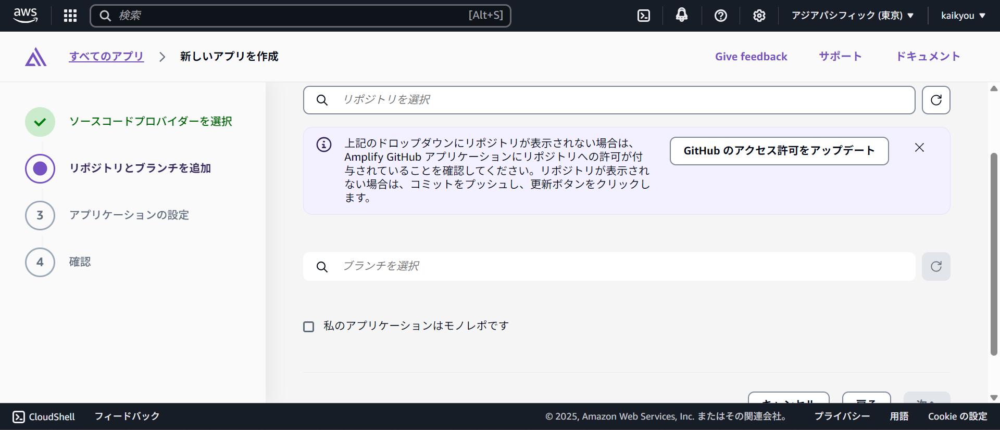
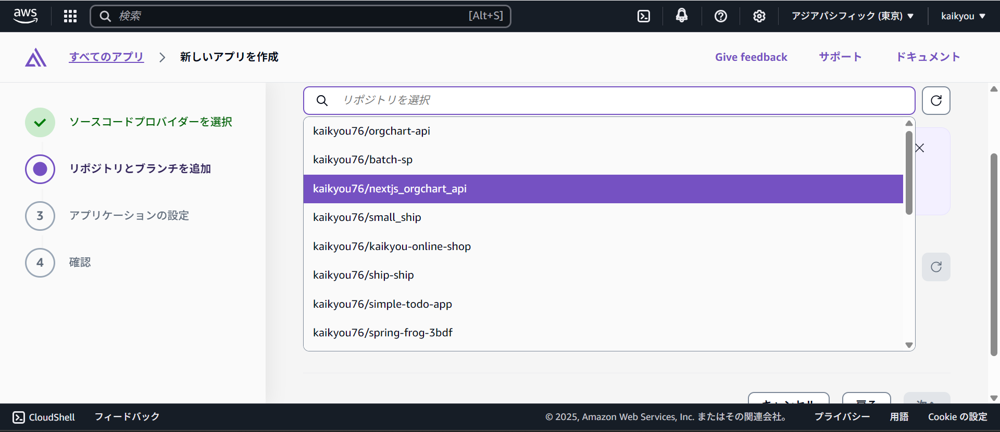
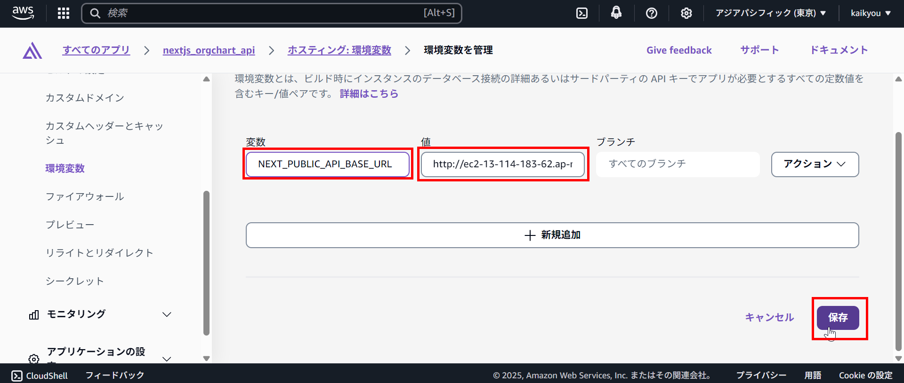
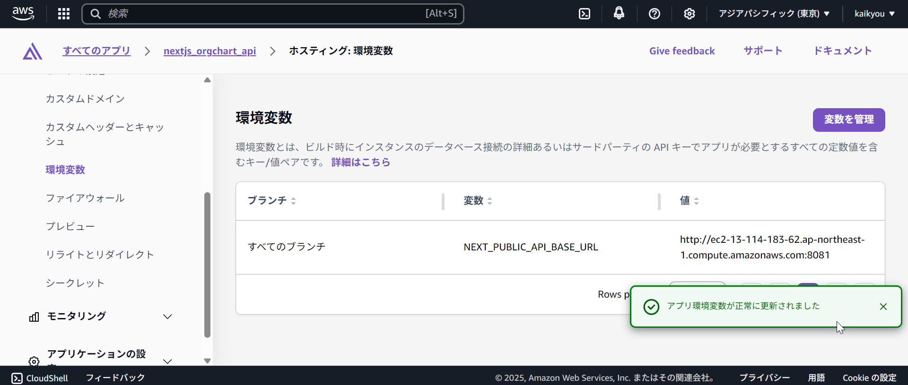

# GitHub 経由で AWS Amplify へのデプロイ

AWS Amplify を使用して React/Next.js フロントエンドを GitHub 経由でデプロイし、EC2 上の Spring Boot バックエンドと連携する手順は以下の通りです。この手順では AWS Amplify によるフロントエンドのホスティングと、Spring Boot アプリケーションとの通信設定について説明します。

---

## 🔧 前提条件

1. **GitHub リポジトリ**が存在しており、React/Next.js のコードがプッシュされていること。
2. **AWS アカウント**を持っていること。
3. **EC2 インスタンス**に Spring Boot アプリケーションが稼働しており、API エンドポイントが公開されていること（例：`http://ec2-xx-xxx-xxx-xxx.compute-1.amazonaws.com:8080/api`）。
4. CORS 設定が正しく、フロントエンドからのリクエストを受け付けるよう Spring Boot が構成されていること。

---

## 📦 ステップ 1: AWS Amplify でアプリケーションを作成

1. [AWS Amplify Console](https://console.aws.amazon.com/amplify/) にログインします。
2. 「Get started」をクリック。
   
3. GitHub をソースとして選択 → GitHub にログインし、リポジトリを選択。
   
   
   
   
4. ブランチ（通常は [main](file://d:\eclipse-workspace\orgchart-api\src\main\java\com\example\orgchart_api\OrgchartApiApplication.java#L22-L24) または `master`）を選択。
   
   
   
5. Amplify が自動的に [build](file://d:\eclipse-workspace\orgchart-api\src\main\java\com\example\orgchart_api\model\LoginUserModel.java#L132-L134) コマンドと出力ディレクトリ（通常は `dist` や `.next`）を検出します。必要に応じて変更してください。
   
6. 「Next step」→「Deploy」をクリックしてデプロイを開始。
   
   
   

---

## ⚙️ ステップ 2: API エンドポイントの設定（環境変数）

1. Amplify コンソールの「App settings」 > 「Environment variables」へ移動。
2. `NEXT_PUBLIC_API_BASE_URL` などの環境変数を追加し、値を EC2 の Spring Boot API URL に設定（例：`http://ec2-xx-xxx-xxx-xxx.compute-1.amazonaws.com:8080`）。
   
   
3. React/Next.js 側のコード内でこの環境変数を使用して API 通信を行います。

---

## 🔐 ステップ 3: Spring Boot 側の CORS 設定

AWS Amplify でホストされているフロントエンド（例：`https://main.d13nr21kkliym6.amplifyapp.com`）から EC2 上の Spring Boot アプリケーションにアクセスする場合、**CORS の設定が正しく行われている必要があります。**

以下は、提供されたファイルに基づいた CORS 設定方法です。

---

## ✅ 必要な変更点

### 1. [SecurityConfig.java](file://d:\eclipse-workspace\orgchart-api\src\main\java\com\example\orgchart_api\config\SecurityConfig.java) で CORS 設定を更新

```java
@Bean
public CorsConfigurationSource corsConfigurationSource() {
    CorsConfiguration configuration = new CorsConfiguration();
    configuration.setAllowedOrigins(Collections.singletonList("https://main.d13nr21kkliym6.amplifyapp.com")); // AWS Amplify ドメインを追加
    configuration.setAllowedMethods(Arrays.asList("GET", "POST", "PUT", "DELETE", "OPTIONS"));
    configuration.setAllowedHeaders(Arrays.asList("Authorization", "Cache-Control", "Content-Type"));
    configuration.setExposedHeaders(Collections.singletonList("Authorization"));
    configuration.setAllowCredentials(true);
    configuration.setMaxAge(3600L);

    UrlBasedCorsConfigurationSource source = new UrlBasedCorsConfigurationSource();
    source.registerCorsConfiguration("/**", configuration);
    return source;
}
```

- 🔍 **ポイント**
  - `setAllowedOrigins` に AWS Amplify の URL を指定
  - `setAllowCredentials(true)` で Cookie や JWT の送信を許可（必要に応じて）
  - `setExposedHeaders` で `Authorization` ヘッダーを公開（JWT トークン使用時に重要）

---

### 2. `AuthController.java`（確認のみ）

このコントローラーには `@CrossOrigin` がありませんが、グローバルな CORS 設定により対応済みです。個別に制限が必要な場合は下記のように追加できます：

```java
@CrossOrigin(origins = "https://main.d13nr21kkliym6.amplifyapp.com", allowCredentials = "true")
@RestController
@RequestMapping("/api/auth")
@Tag(name = "認証 API", description = "ログイン・ログアウト・トークン更新を提供します")
public class AuthController {
    // ...
}
```

ただし、グローバル設定が優先されるため、通常は不要です。

---

### 3. `BatchJobController.java`（確認のみ）

こちらも同様に `@CrossOrigin` は不要です。`SecurityConfig` でのグローバル設定で十分です。

---

## 🛡️ CSRF 対策

Spring Security ではセキュリティ強化のために CSRF 保護がデフォルトで有効ですが、JWT を使用している場合、以下の設定で無効化するのが一般的です。

```java
.csrf(csrf -> csrf.disable())
```

これは [SecurityConfig.java](file://d:\eclipse-workspace\orgchart-api\src\main\java\com\example\orgchart_api\config\SecurityConfig.java) で既に設定されていますので問題ありません。

---

## 🔐 セキュリティヘッダー設定（オプション）

フロントエンドとの通信を安全にするために、以下のようなセキュリティヘッダーを追加することも検討してください：

```java
.headers(headers -> headers
    .frameOptions(HeadersConfigurer.FrameOptionsConfig::disable)
    .contentSecurityPolicy(cps -> cps
        .policyDirectives("default-src 'self'; frame-ancestors 'self';")
    )
)
```

---

## ✅ 確認手順

1. Spring Boot アプリケーションを再起動
2. AWS Amplify 側から API 実行
3. ブラウザの開発者ツールでネットワーク → レスポンスヘッダーに `Access-Control-Allow-Origin: https://main.d13nr21kkliym6.amplifyapp.com` が含まれるか確認

---

## 📌 注意事項

- **CORS 設定ミスによるエラー例**：
  - `Blocked by CORS policy: No 'Access-Control-Allow-Origin' header present`
- **Cookie/JWT 使用時の注意**：
  - `withCredentials: true` を使用する場合、`allowCredentials = "true"` が必要
- **HTTPS 利用推奨**：
  - 本番環境では SSL/TLS を導入し、`https://` 通信を行うことを強く推奨します

---

以上が、AWS Amplify 側のフロントエンドから EC2 上の Spring Boot アプリケーションへ安全かつ正しくアクセスするための CORS 設定です。他にもセキュリティやパフォーマンスに関する最適化が必要であればお気軽にご相談ください。
