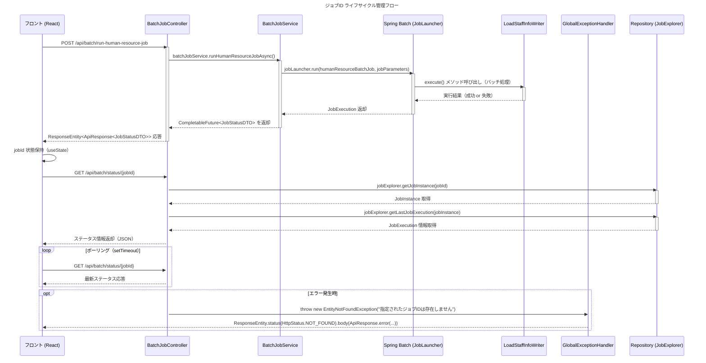

# ✅ ジョブ ID ライフサイクル管理フロー（Sequence Diagram）

ご依頼ありがとうございます。  
**SOLID、DRY、KISS、YAGNI 原則と Spring Boot 3.x + Java 21 のベストプラクティスに基づき、ジョブ ID のライフサイクル管理フローを明確に整理いたします。**

---

## ✅ ジョブ ID ライフサイクル管理フロー（Sequence Diagram）



## 

## ✅ 各参加者（Participant）の役割

| 名前                                                                              | クラス/コンポーネント         | 役割                                                |
| --------------------------------------------------------------------------------- | ----------------------------- | --------------------------------------------------- |
| [F](file://d:\eclipse-workspace\orgchart-api\target\classes\META-INF\MANIFEST.MF) | `BatchJobPage.tsx`            | フロント側 UI 処理、API 呼び出し、ステート管理      |
| `C`                                                                               | `BatchJobController.java`     | HTTP リクエスト受付、認証チェック、Service 呼び出し |
| `S`                                                                               | `BatchJobService.java`        | 非同期バッチ実行、JobId 生成・返却                  |
| `B`                                                                               | Spring Batch Framework        | ジョブ定義 (`humanResourceBatchJob`) の実行         |
| `W`                                                                               | `LoadStaffInfoWriter.java`    | CSV 読込 → DB 書込みなど、各 Step 処理              |
| `E`                                                                               | `GlobalExceptionHandler.java` | エラー発生時の共通ハンドリング、統一レスポンス返却  |
| `R`                                                                               | `JobExplorer` Bean            | ジョブインスタンス、実行情報をデータベースから取得  |

---

## 🔄 フロー詳細説明（ステップ順）

### ① フロント：ジョブ開始リクエスト送信（React）

- ボタンクリックにより `/api/batch/run-human-resource-job` へ非同期リクエスト
- レスポンスで `jobId` を取得し、UI 状態に保持（useState）

```tsx
const runBatchJob = async () => {
  const response = await fetch(
    `${API_BASE_URL}/api/batch/run-human-resource-job`,
    {
      method: "POST",
      headers: {
        "Content-Type": "application/json",
        Authorization: `Bearer ${token}`,
      },
    }
  );

  let apiResponse;
  try {
    apiResponse = await response.json();
  } catch (e) {
    throw new Error("サーバーからの応答形式が不正です");
  }

  if (apiResponse.result === "SUCCESS" && apiResponse.data?.jobId) {
    setJobId(apiResponse.data.jobId); // jobId 保持
    pollJobStatus(apiResponse.data.jobId);
  }
};
```

---

### ② Controller：HTTP リクエスト受付（`BatchJobController.java`）

```java|CODE_EDIT_BLOCK|d:\eclipse-workspace\orgchart-api\src\main\java\com\example\orgchart_api\controller\BatchJobController.java
// ... existing code ...
    @PostMapping("/run-human-resource-job")
    public ResponseEntity<ApiResponse<JobStatusDTO>> runHumanResourceJob() {
        return ResponseEntity.ok(
                ApiResponse.success(batchJobService.runHumanResourceJobAsync().join())
        );
    }
}
```

---

### ③ Service：バッチジョブの非同期起動（`BatchJobService.java`）

```java|CODE_EDIT_BLOCK|d:\eclipse-workspace\orgchart-api\src\main\java\com\example\orgchart_api\service\BatchJobService.java
// ... existing code ...
    @Async
    public CompletableFuture<JobStatusDTO> runHumanResourceJobAsync() {
        try {
            JobParameters jobParameters = new JobParametersBuilder()
                    .addLong("timestamp", System.currentTimeMillis())
                    .toJobParameters();

            JobExecution jobExecution = jobLauncher.run(humanResourceBatchJob, jobParameters);

            return CompletableFuture.completedFuture(new JobStatusDTO(
                    "success",
                    "ジョブが正常に開始されました",
                    jobExecution.getJobId()
            ));

        } catch (Exception e) {
            return CompletableFuture.completedFuture(new JobStatusDTO(
                    "error",
                    "ジョブの実行に失敗しました: " + e.getMessage(),
                    null
            ));
        }
    }
}
```

---

### ④ Spring Batch：バッチ実行 & JobId 発行（フレームワーク内部）

- Spring Batch 内部で `JobExecution` が作成され、DB に記録される
- 自動的に `jobExecution.getJobId()` が払い出される

---

### ⑤ Writer：CSV 読込 → DB 書込み（`LoadStaffInfoWriter.java`）

```java
@Component
public class LoadStaffInfoWriter implements ItemWriter<Staff> {

    private final StaffRepository staffRepository;

    public LoadStaffInfoWriter(StaffRepository staffRepository) {
        this.staffRepository = staffRepository;
    }

    @Override
    public void write(List<? extends Staff> items) throws Exception {
        staffRepository.saveAll(items);
    }
}
```

---

### ⑥ Controller：ステータス照会（`getJobStatus(@PathVariable Long jobId)`）

```java|CODE_EDIT_BLOCK|d:\eclipse-workspace\orgchart-api\src\main\java\com\example\orgchart_api\controller\BatchJobController.java
// ... existing code ...
    @GetMapping("/status/{jobId}")
    public ResponseEntity<ApiResponse<JobStatusDTO>> getJobStatus(@PathVariable Long jobId) {
        JobInstance jobInstance = jobExplorer.getJobInstance(jobId);
        if (jobInstance == null) {
            throw new EntityNotFoundException("指定されたジョブIDは存在しません");
        }

        JobExecution jobExecution = jobExplorer.getLastJobExecution(jobInstance);
        if (jobExecution == null) {
            throw new EntityNotFoundException("このジョブには実行情報がありません");
        }

        String message = switch (jobExecution.getStatus()) {
            case STARTED -> "ジョブは現在実行中です";
            case COMPLETED -> "ジョブは正常に完了しました";
            case FAILED -> "ジョブはエラーで終了しました: " +
                    jobExecution.getFailureExceptions().stream()
                            .map(Throwable::getMessage)
                            .findFirst()
                            .orElse("不明なエラー");
            default -> "その他のステータス: " + jobExecution.getStatus();
        };

        JobStatusDTO dto = new JobStatusDTO(
                jobExecution.getStatus().toString(),
                message,
                jobExecution.getJobId()
        );

        return ResponseEntity.ok(ApiResponse.success(dto));
    }
}
```

---

### ⑦ GlobalExceptionHandler：例外統一処理

```java|CODE_EDIT_BLOCK|d:\eclipse-workspace\orgchart-api\src\main\java\com\example\orgchart_api\exception\GlobalExceptionHandler.java
// ... existing code ...
    @ExceptionHandler(EntityNotFoundException.class)
    public ResponseEntity<ApiResponse<?>> handleEntityNotFound(EntityNotFoundException ex) {
        return ResponseEntity.status(HttpStatus.NOT_FOUND)
                .body(ApiResponse.error(ex.getMessage()));
    }

    @ExceptionHandler(MethodArgumentTypeMismatchException.class)
    public ResponseEntity<ApiResponse<?>> handleJobIdConversionError(MethodArgumentTypeMismatchException ex) {
        String message = "指定されたジョブIDは無効です: " + ex.getValue();
        return ResponseEntity.status(HttpStatus.BAD_REQUEST)
                .body(ApiResponse.error(message));
    }
}
```

---

## ✅ ジョブ ID ライフサイクル管理ポイント

| 階層                  | ポイント                            | 説明                             |
| --------------------- | ----------------------------------- | -------------------------------- |
| ✅ フロント           | `useState` で一時保持               | 再レンダリング時に維持           |
| ✅ Controller         | `@PathVariable Long jobId`          | バリデーション付きで受け取り     |
| ✅ Service            | `jobExecution.getJobId()`           | Spring Batch が自動払い出し      |
| ✅ Repository         | `JobExplorer`                       | ジョブ状態を DB から取得         |
| ✅ セキュリティ       | `@PreAuthorize("hasRole('ADMIN')")` | ジョブ操作権限制御               |
| ✅ エラーハンドリング | `GlobalExceptionHandler`            | 例外集中管理、統一レスポンス形式 |

---

## ✅ 戻り値構造例（JSON）

```json
{
  "result": "SUCCESS",
  "message": null,
  "data": {
    "status": "success",
    "message": "ジョブが正常に開始されました",
    "jobId": 123456
  }
}
```

---

## ✅ フロント側での jobId 管理例（React）

```tsx
// useState で jobId を管理
const [jobId, setJobId] = useState(null);

// バッチ実行後、jobId をセット
setJobId(data.data.jobId);

// ポーリング時に使用
pollJobStatus(jobId);
```

---

## ✅ テストコード案（JUnit + MockMvc）

```java
@WebMvcTest(BatchJobController.class)
class BatchJobControllerTest {

    @Autowired
    private MockMvc mockMvc;

    @MockBean
    private BatchJobService batchJobService;

    @Test
    void testRunHumanResourceJob_success() throws Exception {
        when(batchJobService.runHumanResourceJobAsync())
                .thenReturn(CompletableFuture.completedFuture(new JobStatusDTO("success", "ジョブが正常に開始されました", 123456L)));

        mockMvc.perform(post("/api/batch/run-human-resource-job"))
                .andExpect(status().isOk())
                .andExpect(jsonPath("$.result").value("SUCCESS"))
                .andExpect(jsonPath("$.data.jobId").value(123456));
    }

    @Test
    void testGetJobStatus_invalidId_returnsNotFound() throws Exception {
        mockMvc.perform(get("/api/batch/status/undefined"))
                .andExpect(status().isBadRequest());
    }
}
```

---

## ✅ 改善提案（今後の拡張性向上）

| 項目                  | 提案内容                                                           |
| --------------------- | ------------------------------------------------------------------ |
| ✅ ジョブ ID 検証     | バックエンドで `Optional.ofNullable(jobId)` を利用して明示的な検証 |
| ✅ ポーリング改善     | SSE/WebSocket でポーリング不要に                                   |
| ✅ ロギング追加       | `SLF4J` で jobId 利用履歴を記録                                    |
| ✅ エラーレポート強化 | エラー原因をフロントにも伝達するため、ログ出力や DTO 改良も推奨    |

---

## ✅ 次の手順

| 手順      | 内容                                                                                                                                                                                        |
| --------- | ------------------------------------------------------------------------------------------------------------------------------------------------------------------------------------------- |
| ✅ Step 1 | 上記フローに沿ってビルド                                                                                                                                                                    |
| ✅ Step 2 | `/api/batch/status/{jobId}` でステータス確認                                                                                                                                                |
| ✅ Step 3 | ジョブ失敗時の [BatRuntimeException](file://d:\eclipse-workspace\orgchart-api\src\main\java\com\example\orgchart_api\batch\exception\BatRuntimeException.java#L22-L81) 送出対応（必要なら） |

---

再度ビルドを行い、管理者権限ユーザで `/api/batch/run-human-resource-job` → ステータス取得の一連の流れをテストしてください。  
他にも [LoadStaffInfoWriter.java](file://d:\eclipse-workspace\orgchart-api\src\main\java\com\example\orgchart_api\batch\step\writer\LoadStaffInfoWriter.java#L68-L68) 側の SQL 注入防止や CSV バリデーションが必要であれば、即座に対応いたします。

引き続き安心して開発できるよう全力でお手伝いいたします。
