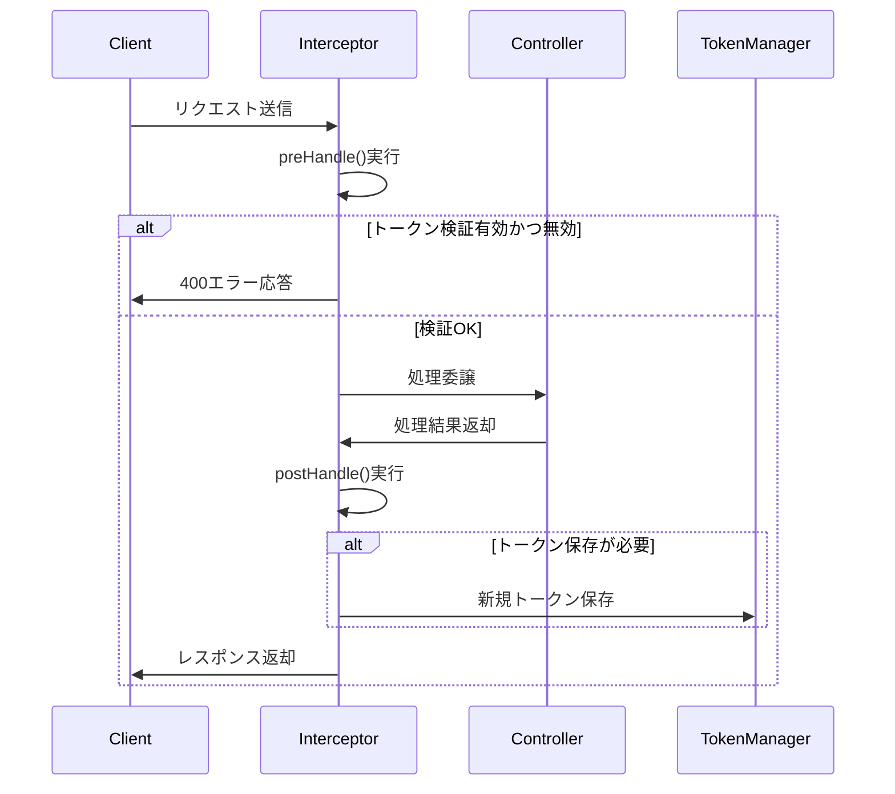
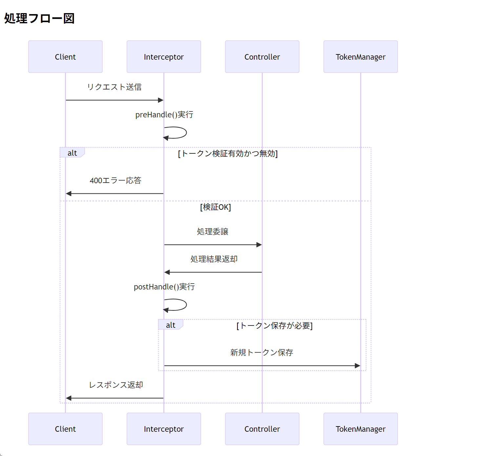

# SecurityHandlerInterceptor

### (src/main/java/com/example/orgchart_api/security/SecurityHandlerInterceptor.java)

```java
package com.example.orgchart_api.security;

import jakarta.servlet.http.HttpServletRequest;
import jakarta.servlet.http.HttpServletResponse;
import org.apache.commons.lang3.StringUtils;
import org.springframework.validation.BindingResult;
import org.springframework.web.method.HandlerMethod;
import org.springframework.web.servlet.HandlerInterceptor;
import org.springframework.web.servlet.ModelAndView;
import org.springframework.web.servlet.view.json.MappingJackson2JsonView;

import java.util.Map;
/**
 * セキュリティのハンドラークラス
 *
 * @author Yao Kaikyou
 * @version 1.0 (original), updated for Spring Boot 3.5.0
 */
public class SecurityHandlerInterceptor implements HandlerInterceptor {
    @Override
    public boolean preHandle(HttpServletRequest request, HttpServletResponse response, Object handler) throws Exception {
        if (!(handler instanceof HandlerMethod handlerMethod)) return true;

        // クリックジャッキング対策
        response.setHeader("X-FRAME-OPTIONS", "SAMEORIGIN");

        // ワンタイムトークンの検証
        TokenValidateType type = getValidateTokenType(handlerMethod);
        if (!type.equals(TokenValidateType.NONE)) {
            boolean removeToken = type.equals(TokenValidateType.REMOVE);
            if (!TokenManager.validate(request, getTokenName(handlerMethod), removeToken)) {
                if (!shouldHandleError(handlerMethod)) {
                    response.sendError(HttpServletResponse.SC_BAD_REQUEST, "Bad or Missing onetime token");
                    return false;
                }
            }
        }
        return true;
    }

    @Override
    public void postHandle(HttpServletRequest request, HttpServletResponse response, Object handler, ModelAndView mav) throws Exception {
        if (!(handler instanceof HandlerMethod handlerMethod)) return;

        if (mav == null) return;

        String tokenName = getTokenName(handlerMethod);

        // トークン保存処理
        if (shouldSaveToken(handlerMethod)) {
            if (mav.getView() instanceof MappingJackson2JsonView) {
                TokenManager.save(request, mav, tokenName);
            } else {
                TokenManager.save(request, tokenName);
            }
            return;
        }

        // フォームバリデーションに失敗した場合のトークン再保存
        if (getValidateTokenType(handlerMethod).equals(TokenValidateType.REMOVE) && hasFormErrors(mav)) {
            if (mav.getView() instanceof MappingJackson2JsonView) {
                TokenManager.save(request, mav, tokenName);
            } else {
                TokenManager.save(request, tokenName);
            }
        }
    }

    private String getTokenName(HandlerMethod handlerMethod) {
        TokenHandler annotation = handlerMethod.getMethodAnnotation(TokenHandler.class);
        return (annotation == null || StringUtils.isEmpty(annotation.name()))
                ? TokenManager.DEFAULT_TOKEN_NAME
                : annotation.name();
    }

    private boolean shouldSaveToken(HandlerMethod handlerMethod) {
        TokenHandler annotation = handlerMethod.getMethodAnnotation(TokenHandler.class);
        return annotation != null && annotation.save();
    }

    private TokenValidateType getValidateTokenType(HandlerMethod handlerMethod) {
        TokenHandler annotation = handlerMethod.getMethodAnnotation(TokenHandler.class);
        return annotation != null ? annotation.validate() : TokenValidateType.NONE;
    }

    private boolean shouldHandleError(HandlerMethod handlerMethod) {
        TokenHandler annotation = handlerMethod.getMethodAnnotation(TokenHandler.class);
        return annotation != null && annotation.handleError();
    }

    private boolean hasFormErrors(ModelAndView mav) {
        String keyPrefix = BindingResult.MODEL_KEY_PREFIX;
        for (Map.Entry<String, Object> entry : mav.getModel().entrySet()) {
            if (entry.getKey().startsWith(keyPrefix) && entry.getValue() instanceof BindingResult result) {
                if (result.hasErrors()) {
                    return true;
                }
            }
        }
        return false;
    }
}

```

このコードは、Spring MVC の`HandlerInterceptor`を実装したカスタムインターセプターで、主に**セキュリティ関連の前処理・後処理**を行っています。以下に各部分の役割を解説します。

---

### **1. クラスの全体像**

- **役割**: リクエスト処理の前後でセキュリティ対策を実施
- **主な機能**:
  - クリックジャッキング対策（X-FRAME-OPTIONS ヘッダー設定）
  - ワンタイムトークンの検証・管理
  - フォームバリデーションエラー時のトークン再発行

---

### **2. 主要メソッドの詳細**

#### ▶ **`preHandle()` - リクエスト前処理**

```java
@Override
public boolean preHandle(HttpServletRequest request, HttpServletResponse response, Object handler) throws Exception {
    if (!(handler instanceof HandlerMethod handlerMethod)) return true;

    // クリックジャッキング対策
    response.setHeader("X-FRAME-OPTIONS", "SAMEORIGIN");

    // ワンタイムトークンの検証
    TokenValidateType type = getValidateTokenType(handlerMethod);
    if (!type.equals(TokenValidateType.NONE)) {
        boolean removeToken = type.equals(TokenValidateType.REMOVE);
        if (!TokenManager.validate(request, getTokenName(handlerMethod), removeToken)) {
            if (!shouldHandleError(handlerMethod)) {
                response.sendError(HttpServletResponse.SC_BAD_REQUEST, "Bad or Missing onetime token");
                return false;
            }
        }
    }
    return true;
}
```

- **クリックジャッキング対策**:
  - `X-FRAME-OPTIONS: SAMEORIGIN`ヘッダーを設定し、同一ドメイン内でのみフレーム表示を許可
- **トークン検証**:
  - `@TokenHandler`アノテーションの設定に基づき、リクエスト内のトークンを検証
  - トークンが無効な場合、`400 Bad Request`エラーを返す（`handleError=false`時）

#### ▶ **`postHandle()` - レスポンス後処理**

```java
@Override
public void postHandle(HttpServletRequest request, HttpServletResponse response, Object handler, ModelAndView mav) throws Exception {
    if (!(handler instanceof HandlerMethod handlerMethod)) return;
    if (mav == null) return;

    String tokenName = getTokenName(handlerMethod);

    // トークン保存処理
    if (shouldSaveToken(handlerMethod)) {
        if (mav.getView() instanceof MappingJackson2JsonView) {
            TokenManager.save(request, mav, tokenName); // JSONレスポンス用
        } else {
            TokenManager.save(request, tokenName); // 通常のHTMLレスポンス用
        }
        return;
    }

    // フォームエラー時のトークン再保存
    if (getValidateTokenType(handlerMethod).equals(TokenValidateType.REMOVE) && hasFormErrors(mav)) {
        if (mav.getView() instanceof MappingJackson2JsonView) {
            TokenManager.save(request, mav, tokenName);
        } else {
            TokenManager.save(request, tokenName);
        }
    }
}
```

- **トークン保存**:
  - `@TokenHandler(save=true)`が指定されたメソッドで、新しいトークンを発行
  - レスポンス形式（JSON/HTML）に応じて保存方法を切り替え
- **フォームエラー対応**:
  - バリデーションエラー発生時、トークンを再発行（CSRF 対策のため）

#### ▶ **補助メソッド群**

| メソッド                 | 説明                                                                  |
| ------------------------ | --------------------------------------------------------------------- |
| `getTokenName()`         | `@TokenHandler`アノテーションからトークン名を取得（デフォルト値あり） |
| `shouldSaveToken()`      | トークン保存が必要か判定                                              |
| `getValidateTokenType()` | トークン検証タイプ（`NONE`/`VALIDATE`/`REMOVE`）を取得                |
| `hasFormErrors()`        | モデル内にバリデーションエラーがあるかチェック                        |

---

### **3. 想定されるアノテーション**

このインターセプターは、以下のようなカスタムアノテーションと連携することを想定しています。

#### 例: `@TokenHandler`アノテーション

```java
@Target(ElementType.METHOD)
@Retention(RetentionPolicy.RUNTIME)
public @interface TokenHandler {
    String name() default "";
    boolean save() default false;
    TokenValidateType validate() default TokenValidateType.NONE;
    boolean handleError() default false;
}

public enum TokenValidateType {
    NONE, VALIDATE, REMOVE
}
```

#### コントローラーでの使用例

```java
@PostMapping("/submit")
@TokenHandler(save = true, validate = TokenValidateType.REMOVE)
public String submitForm(@Valid FormData form, BindingResult result) {
    if (result.hasErrors()) {
        return "form";
    }
    return "success";
}
```

---

### **4. 処理フロー図**



## 

### **5. 主な利用シーン**

1. **CSRF 対策**:
   - フォーム送信時にワンタイムトークンを検証
2. **画面遷移制御**:
   - トークンがない操作を拒否することで、不正な画面遷移を防止
3. **API セキュリティ**:
   - JSON API でもトークン検証を適用可能

このインターセプターは、**Spring Security の CSRF 保護機能と似た役割**を持ちつつ、より柔軟なカスタマイズを可能にしています。実際のプロジェクトでは、Spring Security との統合方法を検討する必要があります。
