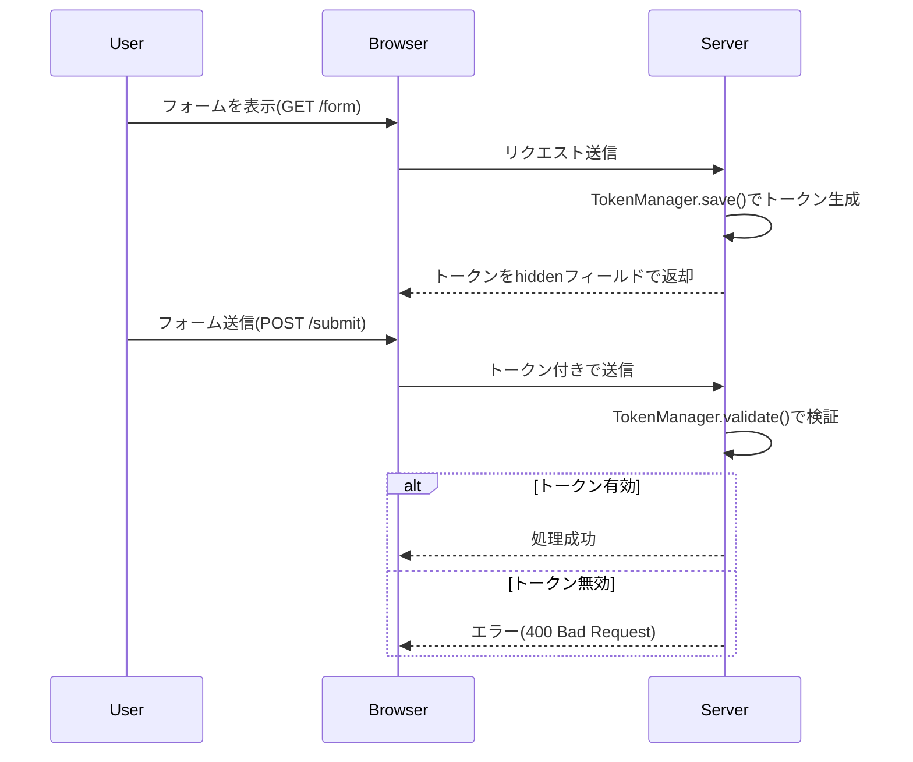
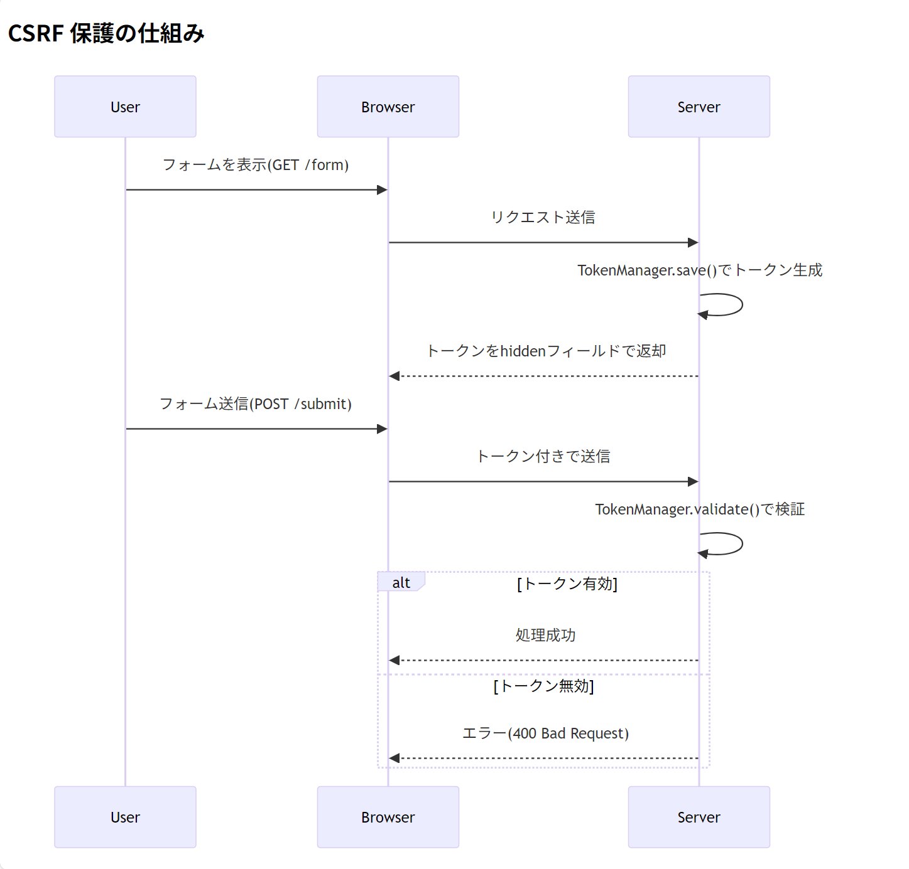

# TokenManager

### (src/main/java/com/example/orgchart_api/security/TokenManager.java)

```java
package com.example.orgchart_api.security;

import jakarta.servlet.http.HttpServletRequest;
import org.slf4j.Logger;
import org.slf4j.LoggerFactory;
import org.springframework.web.servlet.ModelAndView;

import java.util.UUID;

public class TokenManager {
    private static final Logger log = LoggerFactory.getLogger(TokenManager.class);
    public static final String DEFAULT_TOKEN_NAME = "_RequestVerificationToken";

    public static void save(HttpServletRequest request, String tokenName) {
        String token = generateToken();
        setSessionToken(request, tokenName, token);
    }

    public static void save(HttpServletRequest request, ModelAndView mav, String tokenName) {
        String token = generateToken();
        setSessionToken(request, tokenName, token);
        mav.addObject(tokenName, token);
    }

    public static boolean validate(HttpServletRequest request, String tokenName, boolean removeToken) {
        String sessionToken = getSessionToken(request, tokenName);
        String requestToken = request.getParameter(tokenName);

        if (log.isDebugEnabled()) {
            log.debug("Token validation: Session[{}] vs Request[{}]", sessionToken, requestToken);
        }

        boolean isValid = sessionToken != null && sessionToken.equals(requestToken);

        if (isValid && removeToken) {
            removeSessionToken(request, tokenName);
        }

        return isValid;
    }

    private static String generateToken() {
        return UUID.randomUUID().toString();
    }

    private static void setSessionToken(HttpServletRequest request, String tokenName, String token) {
        request.getSession().setAttribute(tokenName, token);
    }

    private static String getSessionToken(HttpServletRequest request, String tokenName) {
        return (String) request.getSession().getAttribute(tokenName);
    }

    private static void removeSessionToken(HttpServletRequest request, String tokenName) {
        request.getSession().removeAttribute(tokenName);
    }
}

```

このコードは、**ワンタイムトークン（CSRF トークン）の生成・検証・管理**を行うユーティリティクラスです。Spring アプリケーションで CSRF（Cross-Site Request Forgery）攻撃を防ぐために使用されます。以下に詳細を解説します。

---

### **1. クラスの全体像**

- **役割**: セッションとリクエスト間でトークンを管理し、CSRF 攻撃を防止
- **主な機能**:
  - トークンの生成（ランダムな UUID）
  - トークンの保存（セッションとリクエストへ）
  - トークンの検証（セッション vs リクエスト）
  - トークンの削除（検証後）

---

### **2. 主要メソッドの詳細**

#### ▶ **`save()` - トークン生成＆保存**

```java
// HTMLフォーム用
public static void save(HttpServletRequest request, String tokenName) {
    String token = generateToken();
    setSessionToken(request, tokenName, token); // セッションに保存
}

// JSON API用
public static void save(HttpServletRequest request, ModelAndView mav, String tokenName) {
    String token = generateToken();
    setSessionToken(request, tokenName, token); // セッションに保存
    mav.addObject(tokenName, token); // モデルにも保存（JSONレスポンス用）
}
```

- **動作例**:
  ```html
  <!-- HTMLフォーム -->
  <input
    type="hidden"
    name="_RequestVerificationToken"
    value="a1b2c3d4-5678-..."
  />
  ```
  ```json
  // JSONレスポンス
  {
    "_RequestVerificationToken": "a1b2c3d4-5678-...",
    "data": { ... }
  }
  ```

#### ▶ **`validate()` - トークン検証**

```java
public static boolean validate(HttpServletRequest request, String tokenName, boolean removeToken) {
    String sessionToken = getSessionToken(request, tokenName); // セッションから取得
    String requestToken = request.getParameter(tokenName); // リクエストから取得

    boolean isValid = sessionToken != null && sessionToken.equals(requestToken);

    if (isValid && removeToken) {
        removeSessionToken(request, tokenName); // 検証後はトークンを破棄
    }

    return isValid;
}
```

- **検証フロー**:
  1. ユーザーがフォームを送信
  2. セッション内のトークンとリクエストパラメータのトークンを比較
  3. 一致すれば正当なリクエストと判定

#### ▶ **トークン生成・セッション操作**

| メソッド               | 説明                                                   |
| ---------------------- | ------------------------------------------------------ |
| `generateToken()`      | ランダムな UUID を生成（例: `a1b2c3d4-5678-90ef-...`） |
| `setSessionToken()`    | トークンをセッションに保存                             |
| `getSessionToken()`    | セッションからトークンを取得                           |
| `removeSessionToken()` | トークンをセッションから削除                           |

---

### **3. CSRF 保護の仕組み**



## 

### **4. 実際の使用例**

#### コントローラーでの利用

```java
@Controller
public class FormController {

    @GetMapping("/form")
    public String showForm(Model model) {
        // トークンを生成してモデルに追加
        TokenManager.save(request, "_token");
        return "form";
    }

    @PostMapping("/submit")
    public String submitForm(@RequestParam String _token) {
        // トークン検証
        if (!TokenManager.validate(request, "_token", true)) {
            throw new BadRequestException("Invalid token");
        }
        return "success";
    }
}
```

#### Thymeleaf でのトークン埋め込み

```html
<form action="/submit" method="post">
  <input
    type="hidden"
    th:name="${T(com.example.orgchart_api.security.TokenManager).DEFAULT_TOKEN_NAME}"
    th:value="${_RequestVerificationToken}"
  />
  <!-- 他のフォーム項目 -->
  <button type="submit">送信</button>
</form>
```

---

### **5. 本番環境での注意点**

1. **HTTPS 必須**:
   - トークンが平文で送信されるため、HTTP では盗聴リスクあり
2. **セッション管理**:
   - セッション固定攻撃を防ぐため、ログイン後にセッション ID を変更
3. **トークンのライフサイクル**:
   - 重要な操作ではトークンを 1 回限りで無効化（`removeToken=true`）
4. **Spring Security との併用**:
   - Spring Security の CSRF 保護機能と競合する可能性があるため、どちらか一方を選択

---

### **6. なぜ UUID を使うのか？**

- **予測不可能性**: ランダムな値のため攻撃者が推測不能
- **衝突確率の低さ**: 重複が事実上発生しない
- **シンプルな実装**: 複雑な暗号化が不要

このクラスは、**Spring Security の`CsrfToken`を自前実装した簡易版**と考えることができます。小規模アプリケーションやレガシーシステムで有用ですが、大規模システムでは Spring Security の標準機能を使う方が安全です。
