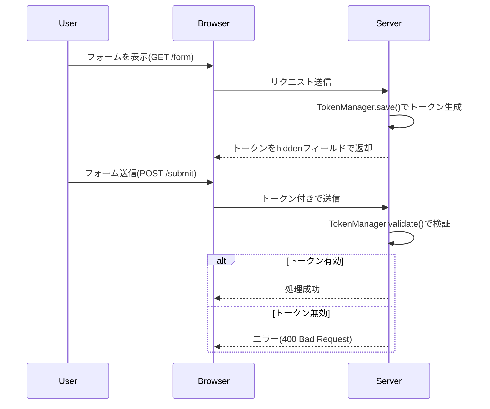

# TokenManager

### (src/main/java/com/example/orgchart_api/security/TokenManager.java)

```java
package com.example.orgchart_api.security;

import jakarta.servlet.http.HttpServletRequest;
import org.slf4j.Logger;
import org.slf4j.LoggerFactory;
import org.springframework.web.servlet.ModelAndView;

import java.util.UUID;

public class TokenManager {
    private static final Logger log = LoggerFactory.getLogger(TokenManager.class);
    public static final String DEFAULT_TOKEN_NAME = "_RequestVerificationToken";

    public static void save(HttpServletRequest request, String tokenName) {
        log.debug("Saving token {}", tokenName);
        String token = generateToken();
        setSessionToken(request, tokenName, token);
    }

    public static void save(HttpServletRequest request, ModelAndView mav, String tokenName) {
        String token = generateToken();
        setSessionToken(request, tokenName, token);
        mav.addObject(tokenName, token);
    }

    public static boolean validate(HttpServletRequest request, String tokenName, boolean removeToken) {
        log.debug("Validating token: {}", tokenName);
        String sessionToken = getSessionToken(request, tokenName);

        // ヘッダー優先、なければパラメータから取得
        String requestToken = request.getHeader(tokenName);
        if (requestToken == null) {
            requestToken = request.getParameter(tokenName);
        }

        if (log.isDebugEnabled()) {
            log.debug("Token validation: Session[{}] vs Request[{}]", sessionToken, requestToken);
        }

        boolean isValid = sessionToken != null && sessionToken.equals(requestToken);

        if (isValid && removeToken) {
            removeSessionToken(request, tokenName);
        }

        return isValid;
    }

    public static String generateToken() {
        String token = UUID.randomUUID().toString();
        log.debug("Generated token: {}", token);
        return token;
    }

    private static void setSessionToken(HttpServletRequest request, String tokenName, String token) {
        request.getSession().setAttribute(tokenName, token);
    }

    private static String getSessionToken(HttpServletRequest request, String tokenName) {
        return (String) request.getSession().getAttribute(tokenName);
    }

    private static void removeSessionToken(HttpServletRequest request, String tokenName) {
        request.getSession().removeAttribute(tokenName);
    }
}

```

このコードは、**ワンタイムトークン（CSRF トークン）の生成・検証・管理**を行うユーティリティクラスです。Spring アプリケーションで CSRF（Cross-Site Request Forgery）攻撃を防ぐために使用されます。以下に詳細を解説します。

---

### **1. クラスの全体像**

- **役割**: セッションとリクエスト間でトークンを管理し、CSRF 攻撃を防止
- **主な機能**:
  - トークンの生成（ランダムな UUID）
  - トークンの保存（セッションとリクエストへ）
  - トークンの検証（セッション vs リクエスト）
  - トークンの削除（検証後）

---

### **2. 主要メソッドの詳細**

#### ▶ **`save()` - トークン生成＆保存**

```java
// HTMLフォーム用
public static void save(HttpServletRequest request, String tokenName) {
    String token = generateToken();
    setSessionToken(request, tokenName, token); // セッションに保存
}

// JSON API用
public static void save(HttpServletRequest request, ModelAndView mav, String tokenName) {
    String token = generateToken();
    setSessionToken(request, tokenName, token); // セッションに保存
    mav.addObject(tokenName, token); // モデルにも保存（JSONレスポンス用）
}
```

- **動作例**:
  ```html
  <!-- HTMLフォーム -->
  <input
    type="hidden"
    name="_RequestVerificationToken"
    value="a1b2c3d4-5678-..."
  />
  ```
  ```json
  // JSONレスポンス
  {
    "_RequestVerificationToken": "a1b2c3d4-5678-...",
    "data": { ... }
  }
  ```

#### ▶ **`validate()` - トークン検証**

```java
public static boolean validate(HttpServletRequest request, String tokenName, boolean removeToken) {
    String sessionToken = getSessionToken(request, tokenName); // セッションから取得
    String requestToken = request.getParameter(tokenName); // リクエストから取得

    boolean isValid = sessionToken != null && sessionToken.equals(requestToken);

    if (isValid && removeToken) {
        removeSessionToken(request, tokenName); // 検証後はトークンを破棄
    }

    return isValid;
}
```

- **検証フロー**:
  1. ユーザーがフォームを送信
  2. セッション内のトークンとリクエストパラメータのトークンを比較
  3. 一致すれば正当なリクエストと判定

#### ▶ **トークン生成・セッション操作**

| メソッド               | 説明                                                   |
| ---------------------- | ------------------------------------------------------ |
| `generateToken()`      | ランダムな UUID を生成（例: `a1b2c3d4-5678-90ef-...`） |
| `setSessionToken()`    | トークンをセッションに保存                             |
| `getSessionToken()`    | セッションからトークンを取得                           |
| `removeSessionToken()` | トークンをセッションから削除                           |

---

### **3. CSRF 保護の仕組み**



## 

#### 已深度思考

> このクラスは、トークン（主に CSRF トークン）の生成、保存、検証を担当するユーティリティクラスです。セッションを使用してトークンを管理し、リクエストごとにトークンの検証を行います。以下に各メソッドの詳細を分析します。
>
> ### クラスの役割

- **トークンの生成**: UUID を使用してランダムなトークンを生成する。
- **トークンの保存**: 生成したトークンをセッションに保存する。また、必要に応じて ModelAndView にも追加する。
- **トークンの検証**: リクエストからトークンを取得し、セッションに保存されているトークンと比較する。検証後、必要に応じてセッションからトークンを削除する。
  > ### フィールド
- `DEFAULT_TOKEN_NAME`: デフォルトのトークン名（`_RequestVerificationToken`）を定義する定数。
  > ### メソッドの分析
  >
  > #### 1. `save(HttpServletRequest request, String tokenName)`

```java
public static void save(HttpServletRequest request, String tokenName) {
    log.debug("Saving token {}", tokenName);
    String token = generateToken();
    setSessionToken(request, tokenName, token);
}
```

- **役割**: 指定されたトークン名で新しいトークンを生成し、セッションに保存する。
- **引数**:
  - `request`: 現在の HTTP リクエスト（セッションを取得するため）
  - `tokenName`: セッション属性に保存する際のキー（トークン名）
- **処理**:
  1. トークンを生成（`generateToken()`）
  2. 生成したトークンをセッションに保存（`setSessionToken()`）
     > #### 2. `save(HttpServletRequest request, ModelAndView mav, String tokenName)`

```java
public static void save(HttpServletRequest request, ModelAndView mav, String tokenName) {
    String token = generateToken();
    setSessionToken(request, tokenName, token);
    mav.addObject(tokenName, token);
}
```

- **役割**: トークンを生成し、セッションに保存するとともに、ModelAndView にも追加する（ビューで使用できるように）。
- **引数**:
  - `request`: セッションを取得するための HTTP リクエスト
  - `mav`: トークンを追加する ModelAndView オブジェクト
  - `tokenName`: トークン名（セッション属性とモデル属性のキー）
- **処理**:
  1. トークンを生成
  2. セッションに保存
  3. モデルに追加（ビューで利用可能に）
     > #### 3. `validate(HttpServletRequest request, String tokenName, boolean removeToken)`

```java
public static boolean validate(HttpServletRequest request, String tokenName, boolean removeToken) {
    log.debug("Validating token: {}", tokenName);
    String sessionToken = getSessionToken(request, tokenName);
 >     // ヘッダー優先、なければパラメータから取得
    String requestToken = request.getHeader(tokenName);
    if (requestToken == null) {
        requestToken = request.getParameter(tokenName);
    }
 >     if (log.isDebugEnabled()) {
        log.debug("Token validation: Session[{}] vs Request[{}]", sessionToken, requestToken);
    }
 >     boolean isValid = sessionToken != null && sessionToken.equals(requestToken);
 >     if (isValid && removeToken) {
        removeSessionToken(request, tokenName);
    }
 >     return isValid;
}
```

- **役割**: リクエストから送信されたトークンとセッションに保存されたトークンを比較して検証する。検証成功後、必要に応じてセッションからトークンを削除する。
- **引数**:
  - `request`: トークンを取得するための HTTP リクエスト（ヘッダーまたはパラメータから取得）
  - `tokenName`: トークン名（セッション属性とリクエストヘッダー/パラメータのキー）
  - `removeToken`: 検証成功後にセッションからトークンを削除するかどうかのフラグ
- **処理**:
  1. セッションからトークンを取得（`getSessionToken()`）
  2. リクエストのヘッダーからトークンを取得。ヘッダーにない場合はリクエストパラメータから取得
  3. セッションのトークンとリクエストのトークンを比較（両方存在し、等しいか）
  4. 検証が成功し、かつ`removeToken`が`true`の場合、セッションからトークンを削除（`removeSessionToken()`）
  5. 検証結果（`isValid`）を返す
     > #### 4. `generateToken()`

```java
public static String generateToken() {
    String token = UUID.randomUUID().toString();
    log.debug("Generated token: {}", token);
    return token;
}
```

- **役割**: ランダムな UUID を生成してトークンとして返す。
- **戻り値**: 生成されたトークン（文字列）
  > #### プライベートメソッド（セッション操作）

##### `setSessionToken(HttpServletRequest request, String tokenName, String token)`

```java
private static void setSessionToken(HttpServletRequest request, String tokenName, String token) {
    request.getSession().setAttribute(tokenName, token);
}
```

- **役割**: セッションにトークンを保存する。
  > ##### `getSessionToken(HttpServletRequest request, String tokenName)`

```java
private static String getSessionToken(HttpServletRequest request, String tokenName) {
    return (String) request.getSession().getAttribute(tokenName);
}
```

- **役割**: セッションからトークンを取得する。
  > ##### `removeSessionToken(HttpServletRequest request, String tokenName)`

```java
private static void removeSessionToken(HttpServletRequest request, String tokenName) {
    request.getSession().removeAttribute(tokenName);
}
```

- **役割**: セッションからトークンを削除する。
  > ### クラスの特徴
- **スタティックメソッド**: インスタンス化せずに使用するユーティリティクラス。
- **セッション依存**: トークンの保存と検証に HTTP セッションを使用。
- **柔軟なトークン取得**: 検証時にヘッダーとパラメータの両方からトークンを取得可能。
- **デバッグログ**: 主要な操作でデバッグレベルのログを出力。
  > ### 使用例

1. トークンの生成とセッション保存（ビュー不要）:
   ```java
   TokenManager.save(request, "customTokenName");
   ```
2. トークンの生成とセッション保存＋ビューへの追加:
   ```java
   TokenManager.save(request, modelAndView, "customTokenName");
   ```
3. トークンの検証（検証後、トークンを削除）:
   ```java
   boolean isValid = TokenManager.validate(request, "customTokenName", true);
   ```
   > このクラスは、CSRF 対策などで使用されるトークンの管理を簡素化するために設計されています。

## TokenManager クラスの分析

### クラスの役割

TokenManager は **CSRF トークン管理のユーティリティクラス** として設計されており、以下の主要機能を提供します：

1. **トークンの生成**: ランダムな UUID ベースのトークン生成
2. **トークンの保存**: セッションへのトークン保存
3. **トークンの検証**: リクエストとセッションのトークン比較
4. **トークンの削除**: 検証後のセッションからのトークン削除

### 特徴

- **スタティックメソッドのみ**: インスタンス化不要のユーティリティクラス
- **柔軟なトークン取得**: ヘッダー優先、パラメータをフォールバックとして使用
- **セッション管理**: HTTP セッションを利用したトークン状態管理
- **ロギング**: 主要操作にデバッグログを実装

---

### メソッド詳細分析

#### 1. トークン保存メソッド

##### `save(HttpServletRequest request, String tokenName)`

```java
public static void save(HttpServletRequest request, String tokenName) {
    log.debug("Saving token {}", tokenName);
    String token = generateToken();
    setSessionToken(request, tokenName, token);
}
```

- **役割**: トークンを生成しセッションに保存
- **処理フロー**:
  1. トークン生成 (`generateToken()`)
  2. セッションに保存 (`setSessionToken()`)
- **使用例**: ビュー不要なケース（API 等）でのトークン保存

##### `save(HttpServletRequest request, ModelAndView mav, String tokenName)`

```java
public static void save(HttpServletRequest request, ModelAndView mav, String tokenName) {
    String token = generateToken();
    setSessionToken(request, tokenName, token);
    mav.addObject(tokenName, token);
}
```

- **役割**: トークンを生成し、セッションと ModelAndView に保存
- **追加機能**:
  - 生成したトークンをモデルに追加（ビューでアクセス可能に）
- **使用例**: MVC コントローラーでビューにトークンを渡す必要がある場合

---

#### 2. トークン検証メソッド

##### `validate(HttpServletRequest request, String tokenName, boolean removeToken)`

```java
public static boolean validate(HttpServletRequest request, String tokenName, boolean removeToken) {
    // 検証処理
}
```

- **役割**: リクエストとセッションのトークン比較
- **処理フロー**:
  1. セッションからトークン取得 (`getSessionToken()`)
  2. リクエストからトークン取得:
     - ヘッダー優先 (`request.getHeader(tokenName)`)
     - ヘッダーになければパラメータから取得 (`request.getParameter(tokenName)`)
  3. トークン比較:
     ```java
     boolean isValid = sessionToken != null && sessionToken.equals(requestToken);
     ```
  4. 検証成功かつ`removeToken=true`の場合、セッションから削除
  5. 検証結果を返却
- **ロギング**: 検証プロセスの詳細をデバッグレベルで出力
- **戻り値**: トークンが有効かどうかの真偽値

---

#### 3. トークン生成メソッド

##### `generateToken()`

```java
public static String generateToken() {
    String token = UUID.randomUUID().toString();
    log.debug("Generated token: {}", token);
    return token;
}
```

- **役割**: ランダムな UUID ベースのトークン生成
- **特徴**:
  - 十分なエントロピーを持つ 128 ビット UUID
  - 生成したトークンをデバッグログ出力
- **使用例**: すべての保存操作で内部的に使用

---

#### 4. セッション操作メソッド（プライベート）

##### `setSessionToken()`

```java
private static void setSessionToken(HttpServletRequest request, String tokenName, String token) {
    request.getSession().setAttribute(tokenName, token);
}
```

- **役割**: トークンをセッション属性として保存

##### `getSessionToken()`

```java
private static String getSessionToken(HttpServletRequest request, String tokenName) {
    return (String) request.getSession().getAttribute(tokenName);
}
```

- **役割**: セッションからトークンを取得

##### `removeSessionToken()`

```java
private static void removeSessionToken(HttpServletRequest request, String tokenName) {
    request.getSession().removeAttribute(tokenName);
}
```

- **役割**: セッションからトークンを削除

---

### クラスの使用例

#### トークン保存（コントローラー内）

```java
// トークンを生成してセッションとモデルに保存
TokenManager.save(request, modelAndView, "csrfToken");
```

#### トークン検証（フィルター/インターセプター内）

```java
// トークン検証（検証後セッションから削除）
if (!TokenManager.validate(request, "csrfToken", true)) {
    response.sendError(HttpServletResponse.SC_FORBIDDEN, "Invalid token");
    return false;
}
```

---

### 設計上の特徴

1. **柔軟なトークン取得戦略**

   - ヘッダー優先 → パラメータのフォールバック
   - 現代的な API と伝統的なフォーム送信の両方に対応

2. **セキュリティプラクティス**

   - 使用後トークン削除オプション (`removeToken`パラメータ)
   - セッション固定化攻撃への対策

3. **拡張性**

   - カスタムトークン名のサポート
   - ビューと API の両方のユースケースに対応

4. **透過性**
   - デバッグログでトークンライフサイクルを追跡可能
   - 生成・保存・検証・削除の各工程をログ出力

### 改善提案

```java
// トークン比較をタイミング攻撃対策で実装
boolean isValid = MessageDigest.isEqual(
    sessionToken.getBytes(StandardCharsets.UTF_8),
    requestToken.getBytes(StandardCharsets.UTF_8)
);
```

このクラスは CSRF 保護の基盤として、セッションベースのトークン管理を効率的に実装しています。
