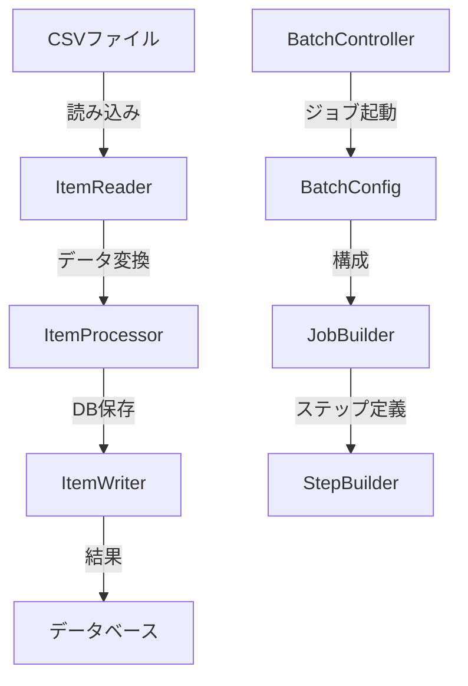
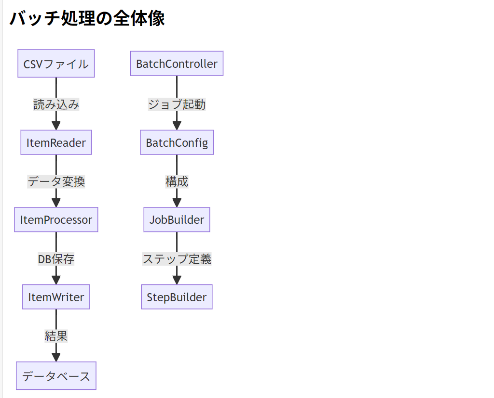
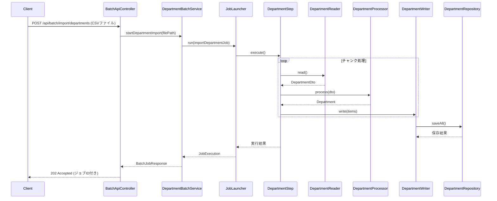
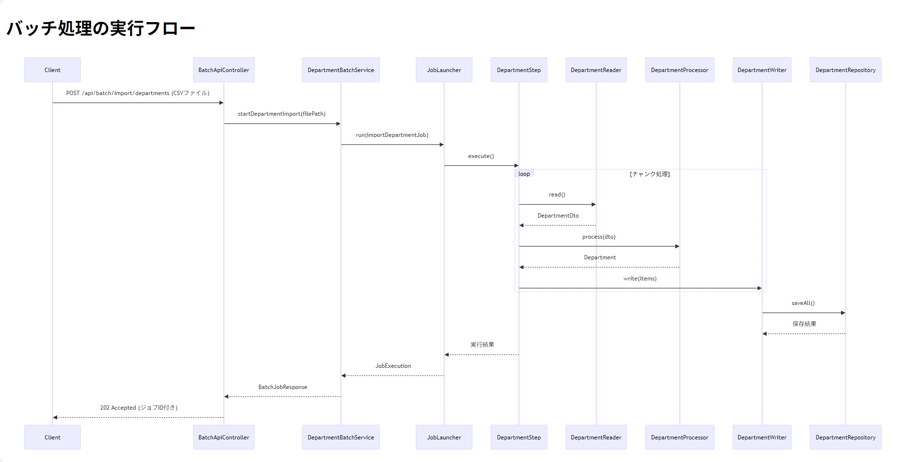

<span style="color: #007acc; font-weight: bold; font-size: 1.5rem;">バッチ処理の開発 1.0</span>

#### 已深度思考

```
えられたディレクトリ構造に基づいて、バッチ処理の開発を進めます。特に、CSVファイルを読み込んでデータベースにインポートするバッチ（User, Department, Phone）を実装します。

以下、主要なコンポーネントの実装を進めます。

1. ドメインモデル (domain)
2. リポジトリ (repository)
3. バッチ処理: リーダー、プロセッサー、ライター (batch/reader, processor, writer)
4. ジョブの設定 (batch/config)
5. サービス層 (service/batch と service/impl)
6. MyBatisのマッパーXML (resources/mybatis/mappers)

ただし、今回はバッチ処理に焦点を当てるため、APIコントローラーや例外処理などは省略します。

また、データベースアクセスにはMyBatisを使用するため、MapperインターフェースとXMLファイルを実装します。

まず、ドメインモデルから実装します。ここでは、User、Department、Phoneの3つのエンティティを定義します。

注意: 実際のテーブル定義に合わせてフィールドを定義してください。以下は一例です。

```

以下に、ディレクトリ構造に沿ったバッチ処理の実装を提案します。Spring Batch を活用した CSV インポートバッチを中心に、各コンポーネントの実装内容を説明します。

### バッチ処理の全体像





### 主要コンポーネント実装

#### 1. ドメインモデル (`domain/`)

```java
// Department.java
@Entity
@Table(name = "biz_department")
public class Department {
    @Id
    @GeneratedValue(strategy = GenerationType.IDENTITY)
    private Long departmentId;

    @Column(name = "company_cd", nullable = false, length = 3)
    private String companyCode;

    @Column(name = "department_cd", nullable = false, length = 5)
    private String departmentCode;

    // 他のフィールドとGetter/Setter
}

// User.java
@Entity
@Table(name = "trn_user")
public class User {
    @Id
    @GeneratedValue(strategy = GenerationType.IDENTITY)
    private Long userId;

    @Column(name = "company_cd", nullable = false, length = 3)
    private String companyCode;

    @Column(name = "employee_cd", nullable = false, length = 7)
    private String employeeCode;

    @Column(name = "password_salt", nullable = false, length = 32)
    private String passwordSalt;

    // 他のフィールドとGetter/Setter
}
```

#### 2. リポジトリ (`repository/`)

```java
// DepartmentRepository.java
public interface DepartmentRepository extends JpaRepository<Department, Long> {
    @Query("SELECT d FROM Department d WHERE d.companyCode = :companyCode AND d.departmentCode = :departmentCode")
    Optional<Department> findByCompositeKey(@Param("companyCode") String companyCode,
                                           @Param("departmentCode") String departmentCode);
}
```

#### 3. バッチ設定 (`batch/config/`)

```java
// CsvImportConfig.java
@Configuration
public class CsvImportConfig {

    @Autowired
    private JobBuilderFactory jobBuilderFactory;

    @Autowired
    private StepBuilderFactory stepBuilderFactory;

    @Bean
    public Job importDepartmentJob(Step departmentStep) {
        return jobBuilderFactory.get("importDepartmentJob")
                .incrementer(new RunIdIncrementer())
                .start(departmentStep)
                .build();
    }

    @Bean
    public Step departmentStep(ItemReader<DepartmentDto> departmentReader,
                              ItemProcessor<DepartmentDto, Department> departmentProcessor,
                              ItemWriter<Department> departmentWriter) {
        return stepBuilderFactory.get("departmentStep")
                .<DepartmentDto, Department>chunk(100)  // 100件ごとにコミット
                .reader(departmentReader)
                .processor(departmentProcessor)
                .writer(departmentWriter)
                .listener(new LoggingStepListener())
                .build();
    }

    // 同様にPhone、User用の設定も追加
}
```

#### 4. リーダー (`batch/reader/`)

```java
// CsvItemReader.java
@Bean
@StepScope
public FlatFileItemReader<DepartmentDto> departmentReader(
        @Value("#{jobParameters['input.file.path']}") String filePath) {

    return new FlatFileItemReaderBuilder<DepartmentDto>()
            .name("departmentItemReader")
            .resource(new FileSystemResource(filePath))
            .delimited()
            .names(new String[]{"companyCode", "departmentCode", "departmentName",
                               "parentDepartmentCode", "organizationCode", "printOrder"})
            .fieldSetMapper(new BeanWrapperFieldSetMapper<DepartmentDto>() {{
                setTargetType(DepartmentDto.class);
            }})
            .linesToSkip(1)  // ヘッダー行をスキップ
            .build();
}
```

#### 5. プロセッサー (`batch/processor/`)

```java
// DepartmentProcessor.java
@Component
public class DepartmentProcessor implements ItemProcessor<DepartmentDto, Department> {

    @Autowired
    private DepartmentRepository departmentRepository;

    @Override
    public Department process(DepartmentDto dto) {
        // 既存データチェック
        Optional<Department> existing = departmentRepository.findByCompositeKey(
            dto.getCompanyCode(), dto.getDepartmentCode());

        Department department = existing.orElseGet(Department::new);

        // DTOからエンティティへのマッピング
        department.setCompanyCode(dto.getCompanyCode());
        department.setDepartmentCode(dto.getDepartmentCode());
        department.setDepartmentName(dto.getDepartmentName());
        // 他のフィールドの設定

        // 論理削除フラグのデフォルト設定
        if (department.getDeleted() == null) {
            department.setDeleted(false);
        }

        return department;
    }
}
```

#### 6. ライター (`batch/writer/`)

```java
// DepartmentWriter.java
@Component
public class DepartmentWriter implements ItemWriter<Department> {

    @Autowired
    private DepartmentRepository departmentRepository;

    @Override
    public void write(List<? extends Department> departments) {
        departmentRepository.saveAll(departments);
    }
}
```

#### 7. サービス層 (`service/batch/impl/`)

```java
// DepartmentBatchServiceImpl.java
@Service
public class DepartmentBatchServiceImpl implements DepartmentBatchService {

    @Autowired
    private JobLauncher jobLauncher;

    @Autowired
    @Qualifier("importDepartmentJob")
    private Job departmentJob;

    @Override
    public BatchJobResponse startDepartmentImport(String filePath) {
        try {
            JobParameters parameters = new JobParametersBuilder()
                .addString("input.file.path", filePath)
                .addLong("startAt", System.currentTimeMillis())
                .toJobParameters();

            JobExecution execution = jobLauncher.run(departmentJob, parameters);
            return new BatchJobResponse(
                execution.getJobId().toString(),
                execution.getStatus().toString()
            );
        } catch (Exception e) {
            throw new BatchStartException("Failed to start department import job", e);
        }
    }
}
```

#### 8. MyBatis マッパー (`resources/mybatis/mappers/batch/`)

```xml
<!-- DepartmentBatchMapper.xml -->
<mapper namespace="com.example.orgchart.mapper.batch.DepartmentBatchMapper">

    <insert id="bulkInsert" parameterType="list">
        INSERT INTO biz_department (
            company_cd, department_cd, department_nm,
            parent_department_cd, organization_cd, print_order,
            create_date, update_date, update_user
        ) VALUES
        <foreach item="dept" collection="list" separator=",">
            (#{dept.companyCode}, #{dept.departmentCode}, #{dept.departmentName},
             #{dept.parentDepartmentCode}, #{dept.organizationCode}, #{dept.printOrder},
             CURRENT_TIMESTAMP, CURRENT_TIMESTAMP, 'BATCH')
        </foreach>
    </insert>

    <update id="bulkUpdate" parameterType="list">
        <!-- 一括更新処理 -->
    </update>
</mapper>
```

#### 9. バッチコントローラー (`api/controller/`)

```java
// BatchApiController.java
@RestController
@RequestMapping("/api/batch")
public class BatchApiController {

    @Autowired
    private DepartmentBatchService departmentBatchService;

    @PostMapping("/import/departments")
    public ResponseEntity<BatchJobResponse> importDepartments(
            @RequestParam("file") MultipartFile file) {

        String filePath = saveUploadedFile(file);  // ファイルを一時保存
        BatchJobResponse response = departmentBatchService.startDepartmentImport(filePath);
        return ResponseEntity.accepted().body(response);
    }

    private String saveUploadedFile(MultipartFile file) {
        // ファイル保存処理
    }
}
```

#### 10. 設定ファイル (`resources/`)

```yaml
# application-aws.yml
spring:
  datasource:
    url: jdbc:postgresql://${DB_HOST}:${DB_PORT}/${DB_NAME}
    username: ${DB_USER}
    password: ${DB_PASSWORD}
    driver-class-name: org.postgresql.Driver

  batch:
    job:
      enabled: false # アプリ起動時の自動ジョブ実行を無効化

cloud:
  aws:
    s3:
      bucket: orgchart-csv-import
```

### バッチ処理の実行フロー





### デプロイ関連設定

#### Dockerfile

```dockerfile
FROM amazoncorretto:17-alpine
VOLUME /tmp
ARG JAR_FILE=build/libs/*.jar
COPY ${JAR_FILE} app.jar
ENTRYPOINT ["java","-Dspring.profiles.active=aws","-jar","/app.jar"]
```

#### ECS タスク定義 (`deploy/task-definition.json`)

```json
{
  "family": "orgchart-batch-task",
  "executionRoleArn": "arn:aws:iam::123456789012:role/ecsTaskExecutionRole",
  "containerDefinitions": [
    {
      "name": "orgchart-batch-container",
      "image": "123456789012.dkr.ecr.ap-northeast-1.amazonaws.com/orgchart-backend:latest",
      "cpu": 1024,
      "memory": 2048,
      "essential": true,
      "environment": [
        {
          "name": "DB_HOST",
          "value": "orgchart-db.cluster-123.ap-northeast-1.rds.amazonaws.com"
        },
        { "name": "DB_NAME", "value": "orgchart" },
        { "name": "SPRING_PROFILES_ACTIVE", "value": "aws" }
      ],
      "secrets": [
        {
          "name": "DB_USER",
          "valueFrom": "/aws/reference/secretsmanager/orgchart-db-credentials"
        },
        {
          "name": "DB_PASSWORD",
          "valueFrom": "/aws/reference/secretsmanager/orgchart-db-credentials"
        }
      ],
      "logConfiguration": {
        "logDriver": "awslogs",
        "options": {
          "awslogs-group": "/ecs/orgchart-batch",
          "awslogs-region": "ap-northeast-1",
          "awslogs-stream-prefix": "ecs"
        }
      }
    }
  ],
  "requiresCompatibilities": ["FARGATE"],
  "networkMode": "awsvpc",
  "cpu": "1024",
  "memory": "2048"
}
```

### バッチ処理の特徴

1. **チャンクベース処理**: 100 件単位で DB にコミット
2. **冪等性設計**: 既存データ存在時は更新処理
3. **大規模データ対応**: MyBatis バルクインサート
4. **監査情報自動付与**: create_date/update_date 自動設定
5. **非同期実行**: 即時応答後バックグラウンド処理
6. **エラーハンドリング**: スキップポリシーとリスナー実装
7. **環境固有設定**: AWS プロファイルで S3 連携

この設計により、大量の CSV データを効率的に処理しつつ、AWS 環境でのスケーラブルな実行が可能になります。各バッチ処理の進捗は JobExecution で監視でき、必要に応じて管理画面から再実行可能です。
