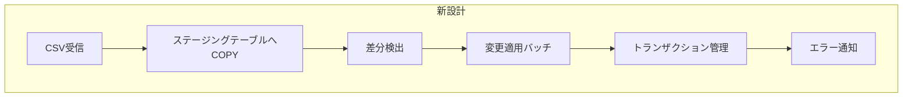
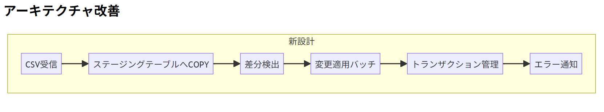
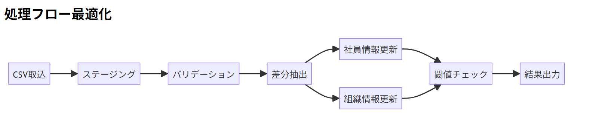

<span style="color: #007acc; font-weight: bold; font-size: 1.5rem;">003-3_2.2.4 人事情報受信バッチ処理</span>

## 2.2.4 人事情報受信

```xlsx
2.2.4 人事情報受信

    人事情報の取り込みについて
     日次でのバッチ処理にて人事情報のデータを取り込み、統合ID取込内の人事情報の最新化を行う処理。
     差分取込ではなく、毎回全件入れ替えになるので全件用意する必要があり。
     CSVデータが存在しない場合、またCSVデータが不正な場合、人事情報取込み処理が全て中止され、前日の状態に復旧される。
     日次でのバッチ処理以外にもシェルの直接起動により、随時作動させることも可能。
    （●人事情報の提供が終わったことを示すファイル）
    ※店部課コード：５桁に対応する

    処理イメージを下記に示す


            人事情報データ（CSV）														統合ID取込DB											取込後 人事情報データ（CSV）
            organization.csv														BIZ_ORGANIZATION												organization.csv_IMPORTED_YYYYMMDDHH24MISS
            department.csv														BIZ_DEPARTMENT												department.csv_IMPORTED_YYYYMMDDHH24MISS
            employee.csv														BIZ_EMPLOYEE												employee.csv_IMPORTED_YYYYMMDDHH24MISS
            ad.csv														BIZ_AD												ad.csv_IMPORTED_YYYYMMDDHH24MISS
        △	shift.csv														BIZ_SHIFT												shift.csv_IMPORTED_YYYYMMDDHH24MISS
        ●	EOFAD														(DUM_ORGANIZATION)												EOFAD_IMPORTED_YYYYMMDDHH24MISS
        ●	EOFAM														(DUM_DEPARTMENT)												EOFAM_IMPORTED_YYYYMMDDHH24MISS
                                                                    (DUM_EMPLOYEE)											退職者情報データ一覧
                                                                    (exclude_executive)												retired_users_YYYY-MM-DD.log

    ●取込前要準備データの確認　※ 運用側作業
        下記情報を取込時に使用する為、最新化とするメンテナンスが必要となる。(適時)
        ①除外役職情報
            コンプライアンス等、人事情報上では存在するが、実際に座席が設けられないような役職を除外テーブルへ登録(exclude_executive TBL)
        ②店部課ダミー情報の整備
            人事情報上存在するが実存しない店部課、またはアプリには取込をしない店部課等については事前にデータベースへ登録(DUM_DEPARTMENT TBL)
        ③社員ダミー情報の整備
            人事情報上存在するが実存しない社員、またはアプリには取込をしない社員等については事前にデータベースへ登録(DUM_EMPLOYEE TBL)
        ④組織情報の整備
            個別に管理したい組織情報（役員、室、課など）の中で、取り込みをしない組織については事前にデータベースへ登録(DUM_ORGANIZATION TBL)
        ⑤拠点－店部課 関連情報
            CSVファイルからは、拠点情報、拠点・店部課の紐付情報を得ることができない為、メンテナンスの必要があれば実行を行う。
        ⑥閾値テーブル（THRESHOLD）に入社数 ＋ 退社数 ＋ 異動数の1日に許容する処理人数を格納

    １．人事情報データをHulftにて所定位置へ格納する。 ※ 運用側作業
        上記の人事情報データCSV（6または7ファイル）を実行前に所定位置へ格納しておく必要があり、存在しない場合(Shift除く)は処理が行われない。
        (早朝6時から転送必須6ファイルの存在有無チェックを行う様にスケジュールし、時間までに処理が行われなかった場合はエラーとする）

    ２．ロックファイルを作成
        ロックファイル作成処理を呼出し、バッチ処理の実行中とする

    ３．取得データの取り込み
            処理									内容
            組織マスタ									「BIZ_ORGANIZATION」テーブルのレコードを全て削除した後に、
                                                CSVファイルから全件ロードし、ダミーデータを除外する(※)

                                                ダミーテーブル登録データを除外
                                                    DELETE FROM BIZ_ORGANIZATION
                                                    WHERE ORGANIZATION_CODE IN (
                                                      SELECT
                                                        ORGANIZATION_CODE
                                                      FROM
                                                        DUM_ORGANIZATION
                                                    )
            店部課マスタ									「BIZ_DEPARTMENT」テーブルのレコードを全て削除した後に、CSVファイルから
                                                全件ロードし、会社コード「001」「002」以外のデータの除外とダミーテーブル登録データを除外する(※)

                                                ダミーテーブル登録データを除外
                                                    DELETE FROM BIZ_DEPARTMENT
                                                    WHERE (COMPANY_CODE, DEPARTMENT_CODE) IN (
                                                      SELECT
                                                        COMPANY_CODE,
                                                        DEPARTMENT_CODE
                                                      FROM
                                                        DUM_DEPARTMENT
                                                    )
                                                会社コード「001」「002」以外のデータの除外
                                                    DELETE FROM BIZ_DEPARTMENT
                                                    WHERE COMPANY_CODE NOT IN ('001', '002')
            社員マスタ									「BIZ_EMPLOYEE」テーブルのレコードを全て削除した後に、CSVファイルから
                                                全件ロードし、会社コード「001」「002」以外のデータの除外とダミーテーブル登録データを除外、
                                                対象外役職コードテーブルに登録されている役職コードのデータも除外する(※)

                                                ダミーテーブル登録データを除外
                                                    DELETE FROM BIZ_EMPLOYEE
                                                    WHERE (COMPANY_CODE, EMPLOYEE_CODE, ASSIGN_GRADE) IN (
                                                      SELECT
                                                        COMPANY_CODE,
                                                        EMPLOYEE_CODE,
                                                        ASSIGN_GRADE
                                                      FROM
                                                        DUM_EMPLOYEE
                                                    )
                                                会社コード「001」「002」以外のデータの除外
                                                    DELETE FROM BIZ_EMPLOYEE
                                                    WHERE COMPANY_CODE NOT IN ('001', '002')
                                                対象外役職コードテーブルに登録されている役職コードのデータ除外
                                                    DELETE FROM BIZ_EMPLOYEE
                                                    WHERE EXECUTIVE_POST_CODE IN (
                                                      SELECT EXECUTIVE_POST_CODE FROM EXCLUDE_EXECUTIVE
                                                    )

            ActiveDirectory情報									「BIZ_AD」テーブルのレコードを全て削除した後に、CSVファイルを下記条件考慮してロードを行う。
                                                ※会社コードが「001」の場合に、USER_LOGON_NAMEが10桁で連携される可能性があり、
                                                 　その場合は末尾の7桁のみを使用し、
                                                　 加工後のUSER_LOGON_NAMEが重複する場合は、後に出現したデータは取り込みをしない。
                                                   (登録した社員IDを登録済みフラグを設定しておき、後出の同IDは登録しない）

            機構改革情報(存在有時のみ)									「BIZ_SHIFT」テーブルのレコードを全て削除した後に、CSVファイルから全件ロード

            ※それぞれのDUMで始まる取込除外テーブル、対象外役職コードテーブルに登録済みのダミーデータは取り込み後に一致データの削除がされる。

    ４．その他下記のチェック・更新処理等を順番に行い、人事情報を最新化する。
            処理									内容
            閾値チェック								閾値「THRESHOLD」テーブルに格納されている閾値を取得し、取込んだ 入社数 ＋ 退社数 ＋ 異動数 が
                                            閾値を超えていないことをチェックし、超えていた場合はエラーとする。

                                            入社数取得
                                                APP_USERに存在しないレコードを BIZ_EMPLOYEE, BIZ_AD から抽出
                                                    SELECT DISTINCT EMPLOYEE_CODE
                                                    FROM BIZ_EMPLOYEE
                                                    WHERE EMPLOYEE_CODE NOT IN (SELECT BIZ_EMPLOYEE_ID
                                                        FROM APP_USER
                                                        WHERE FULLTIME_EMPLOYEE IN ('0', '1'))

                                            退社数取得
                                                BIZ_EMPLOYEEには存在しないユーザーを取得
                                                    SELECT DISTINCT APP_USER_ID
                                                    FROM APP_USER
                                                    WHERE BIZ_EMPLOYEE_ID NOT IN (SELECT EMPLOYEE_CODE
                                                        FROM BIZ_EMPLOYEE)
                                                    AND FULLTIME_EMPLOYEE IN ('0', '1')

                                            異動数取得
                                                SELECT A.BIZ_EMPLOYEE_ID,
                                                    R.COMPANY_ID,
                                                    R.SECTION_ID
                                                FROM APP_USER A,
                                                    R_USER_SECTION R
                                                WHERE A.APP_USER_ID = R.APP_USER_ID
                                                AND BIZ_EMPLOYEE_ID IN (SELECT EMPLOYEE_CODE
                                                    FROM BIZ_EMPLOYEE)
                                                AND (A.BIZ_EMPLOYEE_ID, R.COMPANY_ID, LPAD(R.SECTION_ID,5,'0')) NOT IN
                                                    (SELECT
                                                        EMPLOYEE_CODE,
                                                        COMPANY_CODE,
                                                        DEPARTMENT_CODE
                                                    FROM BIZ_EMPLOYEE)

                                            それぞれの件数を取得し、合計値を閾値との比較件数とする。

            店部課マスタ追加								店部課「M_SECTION」テーブルに存在しない店部課を、
                                            取込店部課「BIZ_DEPARTMENT」テーブルから抽出し追加します。

                                            店部課「M_SECTION」テーブルに存在しない店部課を取得
                                                SELECT
                                                  COMPANY_CODE,
                                                  DEPARTMENT_CODE
                                                FROM
                                                  BIZ_DEPARTMENT
                                                WHERE
                                                  (COMPANY_CODE, DEPARTMENT_CODE) NOT IN (
                                                     SELECT
                                                       COMPANY_ID,
                                                       LPAD(SECTION_ID,5,'0')
                                                     FROM
                                                       M_SECTION
                                                  )

                                            【取得した存在しない店部課コード分処理をループ】
                                            店部課「M_SECTION」テーブルに存在しない店部課の情報を組織テーブル「Biz_Organization」と
                                            店部課「Biz_Department」テーブルから取得
                                                SELECT
                                                  D.COMPANY_CODE AS COMPANY_ID,
                                                  LPAD(D.DEPARTMENT_CODE,5,'0') AS SECTION_ID,
                                                  D.DEPARTMENT_NAME AS SECTION_NAME,
                                                  LPAD(D.PARENT_DEPARTMENT_CODE,5,'0') AS PARENT_SECTION_ID,
                                                  D.ORGANIZATION_CODE AS ORG_ID,
                                                  O.PRINT_ORDER
                                                FROM BIZ_DEPARTMENT AS D INNER JOIN BIZ_ORGANIZATION AS O
                                                ON  D.ORGANIZATION_CODE = O.ORGANIZATION_CODE
                                                WHERE D.COMPANY_CODE = 【店部課テーブルに存在しない店部課の所属会社コード】
                                                AND  D.DEPARTMENT_CODE = 【店部課テーブルに存在しない店部課 】

                                            取得できない場合はエラーとし、取得できた場合は「M_Section」テーブルへ追加する。

            店部課マスタ更新								以下のプロパティのいずれかに変更があった場合に、既存の店部課マスタのプロパティを更新します。
                                                ・店部課名
                                                ・親店部課ID
                                                ・組織コード
                                                ・表示順（BIZ_ORGANIZATIONから参照します)

                                            店部課「M_SECTION」テーブルにから店部課を取得
                                                SELECT
                                                  COMPANY_CODE,
                                                  DEPARTMENT_CODE
                                                FROM
                                                  BIZ_DEPARTMENT
                                                WHERE
                                                  (COMPANY_CODE, DEPARTMENT_CODE) IN (
                                                     SELECT
                                                       COMPANY_ID,
                                                       LPAD(SECTION_ID,5,'0')
                                                     FROM
                                                       M_SECTION
                                                  )

                                            【取得した店部課コード分処理をループ】
                                            店部課の情報を組織テーブル「Biz_Organization」と店部課「Biz_Department」テーブルから取得
                                                SELECT
                                                      D.DEPARTMENT_NAME,
                                                    　LPAD(D.PARENT_DEPARTMENT_CODE, 5, '0') AS PARENT_SECTION_ID,
                                                      D.ORGANIZATION_CODE,
                                                      O.PRINT_ORDER
                                                FROM BIZ_DEPARTMENT AS D INNER JOIN BIZ_ORGANIZATION AS O
                                                ON  D.ORGANIZATION_CODE = O.ORGANIZATION_CODE
                                                WHERE D.COMPANY_CODE = 【取得した店部課の所属会社コード】
                                                AND  D.DEPARTMENT_CODE = 【取得した店部課コード】

                                            0件の場合は(organizationが0件)エラーとし、取得できた場合は「M_Section」テーブルと
                                                DEPARTMENT_NAME
                                                PARENT_DEPARTMENT_CODE
                                                ORGANIZATION_CODE
                                                PRINT_ORDER
                                            を比較し、一つでも値の相違があった場合、「M_Section」テーブルを取得値で更新する。
                                                SELECT
                                                  SECTION_NAME,
                                                  PARENT_SECTION_ID,
                                                  ORG_ID,
                                                  PRINT_ORDER
                                                FROM M_SECTION
                                                WHERE COMPANY_ID = ?
                                                AND　SECTION_ID = 【取得した店部課コード 】
                                            更新時
                                                LASTUPDATE_DATETIME = NOW()

            退社処理								BIZ_EMPLOYEEには存在しないユーザーを退社扱いにします。
                                            APP_USER, R_USER_SECTION, R_CUCM_USER_PHONE, TEL_DIR_ASSOCIATION の削除フラグを立てる

                                            BIZ_EMPLOYEEには存在しないユーザーを取得
                                                SELECT DISTINCT APP_USER_ID
                                                FROM APP_USER
                                                WHERE BIZ_EMPLOYEE_ID NOT IN (SELECT EMPLOYEE_CODE
                                                    FROM BIZ_EMPLOYEE)
                                                AND FULLTIME_EMPLOYEE IN ('0', '1')
                                                AND ENABLE_SHARED_USE = '0'

                                            【取得したユーザID分処理をループ】
                                            ユーザ情報テーブル「APP_USER」：削除フラグ
                                                UPDATE APP_USER SET
                                                  CUCM_UPDATE_REQUEST_FLAG = '1',
                                                  DELETED = '1',
                                                  LASTUPDATE_DATETIME = NOW()
                                                WHERE APP_USER_ID  = 【取得したユーザID】

                                            ユーザと店部課の紐付テーブル「R_USER_SECTION」：削除フラグ
                                                UPDATE R_USER_SECTION SET
                                                  DELETED = '1',
                                                  LASTUPDATE_DATETIME = NOW()
                                                WHERE APP_USER_ID  = 【取得したユーザID】

                                            ユーザと電話機の紐付テーブル「R_CUCM_USER_PHONE」：削除フラグ
                                                UPDATE R_CUCM_USER_PHONE SET
                                                  CUCM_UPDATE_REQUEST_FLAG = '1',
                                                  DELETED = '1',
                                                  LASTUPDATE_DATETIME = NOW()
                                                WHERE APP_USER_ID  = 【取得したユーザID】

                                            電子電話帳テーブル「TEL_DIR_ASSOCIATION」：削除フラグ
                                                UPDATE TEL_DIR_ASSOCIATION SET
                                                  DELETED = '1',
                                                  LASTUPDATE_DATETIME = NOW()
                                                WHERE APP_USER_ID  = 【取得したユーザID】

            入社処理								APP_USERに存在しないレコードを BIZ_EMPLOYEE, BIZ_AD から抽出し、追加します。
                                            この処理では、APP_USER のみ追加され、R_USER_SECTIONへの追加は後処理となります。

                                            APP_USERに存在しないレコードを BIZ_EMPLOYEE, BIZ_AD から抽出
                                                SELECT DISTINCT EMPLOYEE_CODE
                                                FROM BIZ_EMPLOYEE
                                                WHERE EMPLOYEE_CODE NOT IN (SELECT BIZ_EMPLOYEE_ID
                                                    FROM APP_USER
                                                    WHERE FULLTIME_EMPLOYEE IN ('0', '1'))

                                            【取得した社員ID分処理をループ】
                                            0件時はエラー（AD情報無）、取得できた場合は取得情報をユーザ「APP_USER」テーブルへ追加
                                                SELECT DISTINCT
                                                    '0' AS USER_LOLE,
                                                    '0' AS ENABLED_SHARED_USE,
                                                    CASE
                                                        WHEN AD.POSITION = '_社員' THEN '1'
                                                        WHEN AD.POSITION = '_派遣社員' THEN '0'
                                                    END AS FULLTIME_EMPLOYEE,
                                                    EMP.EMPLOYEE_CODE AS LOGIN_ID,
                                                    EMP.EMPLOYEE_CODE AS BIZ_EMPLOYEE_ID,
                                                    CASE
                                                        WHEN AD.POSITION = '_社員' THEN EMP.BIRTHDAY
                                                        WHEN AD.POSITION = '_派遣社員' THEN '0' || EMP.EMPLOYEE_CODE
                                                    END AS LOGIN_PASSWORD,
                                                    EMP.EMPLOYEE_CODE AS CUCM_LOGIN_ID,
                                                    CASE
                                                        WHEN AD.POSITION = '_社員' THEN EMP.BIRTHDAY
                                                        WHEN AD.POSITION = '_派遣社員' THEN '0' || EMP.EMPLOYEE_CODE
                                                    END AS CUCM_LOGIN_PASSWORD,
                                                    EMP.EMPLOYEE_NAME_KANJI AS NAME_KANJI,
                                                    EMP.EMPLOYEE_NAME_KANA AS NAME_KANA,
                                                    EMP.BIRTHDAY AS BIRTHDAY,
                                                    COALESCE(AD.FIRST_NAME, EMP.EMPLOYEE_CODE) AS FIRST_NAME,
                                                    COALESCE(AD.LAST_NAME, EMP.EMPLOYEE_CODE) AS LAST_NAME,
                                                    '12345' AS PIN,
                                                    '1' AS ENABLE_CTI_APPLICATION_USE,
                                                    1' AS CUCM_UPDATE_REQUEST_FLAG,
                                                    '0' AS DELETED,
                                                    '0' AS ERROR_FLG
                                                FROM BIZ_EMPLOYEE EMP LEFT OUTER JOIN BIZ_AD AD
                                                     ON EMP.EMPLOYEE_CODE = AD.USER_LOGON_NAME
                                                WHERE
                                                    EMPLOYEE_CODE =
                                                    (SELECT DISTINCT EMPLOYEE_CODE
                                                    FROM BIZ_EMPLOYEE
                                                    WHERE EMPLOYEE_CODE = 【取得した社員ID】)

                                            取り込みエラーがあった場合には、メール送信

既存社員のプロパティ更新								以下のプロパティのいずれかに変更があった場合に、既存のユーザーのプロパティを更新します。
                                                ・社員区分
                                                ・ログインパスワード
                                                ・氏名（漢字）
                                                ・氏名（カナ）
                                                ・生年月日
                                                ・姓（ローマ字）
                                                ・名（ローマ字）

                                            APP_USERのレコードを取得
                                                SELECT DISTINCT EMPLOYEE_CODE
                                                FROM BIZ_EMPLOYEE
                                                WHERE EMPLOYEE_CODE IN (SELECT BIZ_EMPLOYEE_ID
                                                    FROM APP_USER
                                                    WHERE FULLTIME_EMPLOYEE IN ('0', '1'))

                                            【取得した社員ID分処理をループ】
                                            取得した社員IDの情報をBIZ_EMPLOYEE, BIZ_AD から抽出
                                                SELECT DISTINCT
                                                    CASE
                                                        WHEN AD.POSITION = '_社員' THEN '1'
                                                        WHEN AD.POSITION = '_派遣社員' THEN '0'
                                                    END AS FULLTIME_EMPLOYEE,
                                                    CASE
                                                        WHEN AD.POSITION = '_社員' THEN EMP.BIRTHDAY
                                                        WHEN AD.POSITION = '_派遣社員' THEN '0' || EMP.EMPLOYEE_CODE
                                                    END AS LOGIN_PASSWORD,
                                                    EMP.EMPLOYEE_NAME_KANJI AS NAME_KANJI,
                                                    EMP.EMPLOYEE_NAME_KANA AS NAME_KANA,
                                                    EMP.BIRTHDAY AS BIRTHDAY,
                                                    COALESCE(AD.FIRST_NAME, EMP.EMPLOYEE_CODE) AS FIRST_NAME,
                                                    COALESCE(AD.LAST_NAME, EMP.EMPLOYEE_CODE) AS LAST_NAME
                                                FROM BIZ_EMPLOYEE EMP
                                                LEFT OUTER JOIN BIZ_AD AD ON EMP.EMPLOYEE_CODE = AD.USER_LOGON_NAME
                                                WHERE EMP.EMPLOYEE_CODE = (SELECT DISTINCT EMPLOYEE_CODE
                                                    FROM BIZ_EMPLOYEE
                                                    WHERE EMPLOYEE_CODE = 【取得した社員ID】)

                                            0件の場合は(ADが0件)エラーとし、取得できた場合は「APP_USER」テーブルと
                                                FULLTIME_EMPLOYEE
                                                LOGIN_PASSWORD
                                                NAME_KANJI
                                                NAME_KANA
                                                BIRTHDAY
                                                FIRST_NAME
                                                LAST_NAME
                                            を比較し、一つでも値の相違があった場合、「APP_USER」テーブルを取得値で更新する。
                                                SELECT DISTINCT
                                                    FULLTIME_EMPLOYEE,
                                                    LOGIN_PASSWORD,
                                                    NAME_KANJI,
                                                    NAME_KANA,
                                                    BIRTHDAY,
                                                    FIRST_NAME,
                                                    LAST_NAME
                                                FROM APP_USER
                                                WHERE BIZ_EMPLOYEE_ID = 【取得した社員ID】
                                            更新時
                                                CUCM_UPDATE_REQUEST_FLAG = '1'
                                                LASTUPDATE_DATETIME = NOW()

                                            取り込みエラーがあった場合には、メール送信

            拠点統廃合								廃止店部課と変更後店部課のセットをBIZ_SHIFTから取得します。(店部課単位)
                                            廃止店部課に所属しているユーザーの所属を、変更後店部課に変更します。
                                            廃止店部課に所属している電話機の所属を、すべて変更後店部課に変更します。
                                            下記も同様に変更
                                                ・CallingSearchSpace
                                                ・PickupGroup
                                                ・課金先(廃止店部課に設定されている場合のみ)
                                                ・Location

                                            廃止店部課と変更後店部課のセットをBIZ_SHIFTから取得
                                                SELECT DISTINCT
                                                    OLD_BRANCH_CODE,
                                                    OLD_COMPANY_CODE,
                                                    OLD_DEPARTMENT_CODE,
                                                    NEW_BRANCH_CODE,
                                                    NEW_COMPANY_CODE,
                                                    NEW_DEPARTMENT_CODE
                                                FROM BIZ_SHIFT

                                            【拠点内異動の場合、取得した部署セット分処理をループ】
                                                OLD_BRANCH_CODE = NEW_BRANCH_CODE
                                            廃止店部課に所属しているユーザー一覧を取得
                                                SELECT DISTINCT
                                                    U.APP_USER_ID,
                                                    U.BIZ_EMPLOYEE_ID
                                                FROM APP_USER U,
                                                    R_USER_SECTION R
                                                WHERE U.APP_USER_ID = R.APP_USER_ID
                                                AND R.COMPANY_ID = 【取得した OLD_COMPANY_CODE】
                                                AND R.SECTION_ID = 【取得した OLD_DEPARTMENT_CODE】
                                                AND U.DELETED <> '1'
                                                AND R.DELETED <> '1'

                                                【取得したユーザ分処理をループ】
                                                新旧店部課の所属状況を確認
                                                以下を新旧の2回分取得する
                                                    SELECT COUNT(1)
                                                    FROM BIZ_EMPLOYEE
                                                    WHERE EMPLOYEE_CODE = 【取得した BIZ_EMPLOYEE_ID】
                                                    AND COMPANY_CODE = 【取得した(新・旧)会社コード】
                                                    AND LPAD(DEPARTMENT_CODE,5,'0') = LPAD(【取得した(新・旧)店部課コード】,5,'0')
                                                旧店部課の件数が0、かつ新店部課の件数が０でない場合：機構改革による異動条件に合致
                                                    R_USER_SECTIONの更新
                                                        UPDATE R_USER_SECTION
                                                        SET COMPANY_ID = 【取得した新会社コード】,
                                                            LPAD(SECTION_ID,5,'0') = LPAD(【取得した新店部課コード】,5,'0')
                                                        WHERE APP_USER_ID = 【取得した APP_USER_ID】
                                                        AND COMPANY_ID = 【取得した旧会社コード】
                                                        AND LPAD(SECTION_ID,5,'0') = LPAD(【取得した旧店部課コード】,5,'0')
                                                        AND APP_USER_ID NOT IN (
                                                            SELECT APP_USER_ID
                                                            FROM R_USER_SECTION
                                                            WHERE COMPANY_ID = 【取得した新会社コード】
                                                            AND LPAD(SECTION_ID,5,'0') = LPAD(【取得した新店部課コード】,5,'0'))
                                                    更新が有った場合、電話機の紐付も更新する
                                                        UPDATE R_CUCM_USER_PHONE
                                                        SET COMPANY_ID = 【取得した新会社コード】,
                                                            LPAD(SECTION_ID,5,'0') = LPAD(【取得した新店部課コード】,5,'0')
                                                        WHERE APP_USER_ID = 【取得した APP_USER_ID】
                                                        AND COMPANY_ID = 【取得した旧会社コード】
                                                        AND LPAD(SECTION_ID,5,'0') = LPAD(【取得した旧店部課コード】,5,'0')

                                            廃止店部課に所属している電話機一覧を取得
                                                【取得した電話機分処理をループ】
                                                    SELECT
                                                        P.CUCM_PHONE_ID,
                                                        CP.CALLING_SEARCH_SPACE_ID,
                                                        L.CUCM_LINE_ID,
                                                        CL.CALL_PICKUP_GROUP_ID
                                                    FROM
                                                        CUCM_PHONE P INNER JOIN R_CUCM_PHONE_LINE R ON P.CUCM_PHONE_ID = R.CUCM_PHONE_ID
                                                        INNER JOIN CUCM_LINE L ON R.CUCM_LINE_ID = L.CUCM_LINE_ID
                                                        INNER JOIN M_BRANCH MB ON P.BRANCH_ID = MB.BRANCH_ID
                                                        INNER JOIN M_CUCM_CLUSTER MC ON MB.CLUSTER_ID = MC.CLUSTER_ID
                                                        INNER JOIN CALLINGSEARCHSPACE CP ON MC.CLUSTER_ID = CP.CLUSTER_ID
                                                               AND P.CALLING_SEARCH_SPACE_NAME = CP.NAME
                                                        INNER JOIN PICKUPGROUP CL ON MC.CLUSTER_ID = CL.CLUSTER_ID
                                                               AND L.CALL_PICKUP_GROUP_NAME = CL.NAME
                                                    WHERE P.BRANCH_ID = 【取得した旧拠点コード】
                                                    AND P.COMPANY_ID = 【取得した旧会社コード】
                                                    AND P.SECTION_ID = 【取得した旧店部課コード】

                                                    新部署の calling_search_space_name を取得
                                                    (旧部署と同一の回線種類のCSSを新部署から取得）
                                                        SELECT T2.ID
                                                        FROM CUCM_CALLING_SEARCH_SPACE AS T1
                                                            INNER JOIN CUCM_CALLING_SEARCH_SPACE AS T2
                                                            ON LOWER(SUBSTRING(T1.NAME FROM '[_a-zA-Z]+$'))
                                                             = LOWER(SUBSTRING(T2.NAME FROM '[_a-zA-Z]+$'))
                                                        AND T1.PKID <> T2.PKID
                                                        WHERE T1.PKID = 【旧部署のCSSID】
                                                        AND T2.BRANCH_ID = 【新拠点コード】
                                                        AND T2.COMPANY_ID = 【新会社コード】
                                                        AND T2.SECTION_ID = 【新店部課コード】

                                                    電話機の所属、CallingSearchSpaceを変更
                                                        UPDATE CUCM_PHONE
                                                        SET CALLING_SEARCH_SPACE_ID = 【取得した新部署の CALLING_SEARCH_SPACE_ID】,
                                                            BRANCH_ID = 【取得した新拠点コード】,
                                                            COMPANY_ID = 【取得した新会社コード】,
                                                            SECTION_ID = 【取得した新店部課コード】,
                                                            CUCM_UPDATE_REQUEST_FLAG = '2'
                                                        WHERE CUCM_PHONE_ID = 【取得した廃止店部課に所属している電話機ID】

                                        電話機に紐付いたLINEの新部署の PickupGroup を取得
                                                    (旧部署と同一のPickupNoのPickupGroupIDを新部署から取得）
                                                        SELECT T2.PKID AS PICKUPGROUPID
                                                        FROM CUCM_PICKUP_GROUP AS T1
                                                             INNER JOIN CUCM_PICKUP_GROUP AS T2
                                                                ON LOWER(SUBSTRING(T1.NAME,1, 3))
                                                                 = LOWER(SUBSTRING(T2.NAME, 1, 3))
                                                        AND T1.PKID <> T2.PKID
                                                        WHERE T1.PKID = 【旧部署のPICKUPID】
                                                        AND T2.BRANCH_ID = 【取得した新拠点コード】
                                                        AND T2.COMPANY_ID =  【取得した新会社コード】
                                                        AND T2.SECTION_ID = 【新店部課コード】

                                                    対象LINEの PickupGroup を更新する
                                                        UPDATE CUCM_LINE SET
                                                          CALL_PICKUP_GROUP_ID = 【取得した新部署のCALL_PICKUP_GROUP_ID】,
                                                          CUCM_UPDATE_REQUEST_FLAG = '2'
                                                        WHERE
                                                          CUCM_LINE_ID = 【対象のLINEID】

                                                    新旧の親店部課コードを取得する
                                                    新旧で2回処理を行い、それぞれ取得する
                                                        SELECT PARENT_SECTION_ID
                                                        FROM M_SECTION
                                                        WHERE COMPANY_ID = 【取得した(新・旧)会社コード】,
                                                        AND SECTION_ID = 【取得した(新・旧)店部課コード】

                                                    課金先情報の更新（処理はライン毎に判定し、同IDは処理済みとして処理の実行をしない）
                                                        UPDATE CHARGE_ASSOCIATION
                                                        SET BRANCH_ID = 【取得した新拠点コード】,
                                                            COMPANY_ID = 【取得した新会社コード】,
                                                            PARENT_SECTION_ID = 【取得した新親店部課コード】,
                                                            SECTION_ID = 【取得した新店部課コード】
                                                        WHERE CUCM_LINE_ID = 【対象のLINEID】
                                                        AND BRANCH_ID = 【取得した旧拠点コード】
                                                        AND COMPANY_ID = 【取得した旧会社コード】
                                                        AND PARENT_SECTION_ID = 【取得した旧親店部課コード】
                                                        AND SECTION_ID = 【取得した旧店部課コード】

            社員の所属追加								R_USER_SECTIONに登録されていない下記のケースで、所属情報を追加します。
                                                ・入社した社員の所属を追加する
                                                ・転勤した社員の転勤先を追加する
                                                ・兼務化した社員の兼務先を追加する

                                            今回の取り込みで、統合ID取込上に登録されていない所属を取得
                                                SELECT DISTINCT
                                                    COMPANY_CODE,
                                                    DEPARTMENT_CODE,
                                                    EMPLOYEE_CODE
                                                FROM BIZ_EMPLOYEE BE INNER JOIN R_USER_SECTION R
                                                     ON BE.COMPANY_CODE <> R.COMPANY_ID
                                                     AND LPAD(BE.DEPARTMENT_CODE,5,'0') <> LPAD(R.SECTION_ID,5,'0')
                                                     INNER JOIN APP_USER AU ON BE.EMPLOYEE_CODE <> AU.BIZ_EMPLOYEE_ID

                                                統合ID取込上に登録されていない所属が取得できた場合、新しい所属なので、
                                                追加処理を実行する(取得できた部課分ループする）
                                                ①追加する店部課が、実在する店部課かどうか確認
                                                    SELECT
                                                      COMPANY_ID,
                                                      SECTION_ID
                                                    FROM M_SECTION
                                                    WHERE
                                                      COMPANY_ID = 【取得した会社コード】
                                                    AND LPAD(SECTION_ID,5,'0')  = 【取得した店部課コード】

                                                ②存在しない店部課の場合はエラー、存在した場合は下記取得情報を「r_user_section」へ追加処理
                                                    INSERT INTO R_USER_SECTION
                                                    SELECT A.APP_USER_ID,
                                                        E.COMPANY_CODE AS COMPANY_ID,
                                                        LPAD(E.DEPARTMENT_CODE,5,'0') AS SECTION_ID,
                                                        E.DEPARTMENT_NAME AS SECTION_NAME,
                                                        O.PRINT_ORDER,
                                                        '0' AS DELETE_RESERVE,
                                                        '0' AS DELETED
                                                    FROM BIZ_EMPLOYEE E,
                                                        APP_USER A,
                                                        BIZ_ORGANIZATION O
                                                    WHERE E.EMPLOYEE_CODE = A.BIZ_EMPLOYEE_ID
                                                    AND E.ORGANIZATION_CODE = O.ORGANIZATION_CODE
                                                    AND E.COMPANY_CODE = 【取得した会社コード】
                                                    AND E.DEPARTMENT_CODE = 【取得した店部課コード】
                                                    AND E.EMPLOYEE_CODE = 【取得した社員コード】
                                                    LIMIT 1

                                                取り込みエラーがあった場合には、メール送信

            社員の所属変更								社員が所属する店名が変更になったときに、社員の所属のプロパティを変更します。
                                            (店部課の名称の相違有無で判断)

                                            統合ID取込上に登録されている所属を取得
                                                SELECT DISTINCT
                                                    COMPANY_CODE,
                                                    DEPARTMENT_CODE,
                                                    EMPLOYEE_CODE
                                                FROM BIZ_EMPLOYEE BE INNER JOIN R_USER_SECTION R
                                                     ON BE.COMPANY_CODE = R.COMPANY_ID
                                                     AND LPAD(BE.DEPARTMENT_CODE,5,'0') = LPAD(R.SECTION_ID,5,'0')
                                                     INNER JOIN APP_USER AU ON BE.EMPLOYEE_CODE = AU.BIZ_EMPLOYEE_ID

                                            【取得した所属分処理をループ】
                                                SELECT *
                                                FROM (
                                                #NAME?
                                                SELECT DISTINCT
                                                    E.DEPARTMENT_NAME,
                                                    O.PRINT_ORDER
                                                FROM BIZ_EMPLOYEE E INNER JOIN BIZ_ORGANIZATION O
                                                ON E.ORGANIZATION_CODE = O.ORGANIZATION_CODE
                                                WHERE COMPANY_CODE = 【取得した会社コード】
                                                AND DEPARTMENT_CODE = 【取得した店部課コード】
                                                AND EMPLOYEE_CODE = 【取得した社員ID】
                                                ) AS BIZ
                                                INNER JOIN (
                                                #NAME?
                                                SELECT DISTINCT
                                                    R.SECTION_NAME
                                                FROM R_USER_SECTION R,
                                                    APP_USER A
                                                WHERE R.APP_USER_ID = A.APP_USER_ID
                                                AND R.COMPANY_ID = 【取得した会社コード】
                                                AND R.SECTION_ID = 【取得した店部課コード】
                                                AND A.BIZ_EMPLOYEE_ID = 【取得した社員ID】
                                                ) AS APP
                                                ON BIZ.DEPARTMENT_NAME != APP.SECTION_NAME
                                                LIMIT 1

                                上記で取得した
                                                DEPARTMENTNAME
                                                SECTIONNAME
                                            が異なるデータを更新する。
                                                UPDATE R_USER_SECTION SET
                                                    R.SECTION_NAME = 【取得したDEPARTMENT_NAME】
                                                    R.PRINT_ORDER = 【取得したPRINT_ORDER】
                                                    R.LASTUPDATE_DATETIME = NOW()
                                                WHERE R.COMPANY_ID = 【取得した会社コード】
                                                AND R.SECTION_ID = 【取得した店部課コード】
                                                AND R.APP_USER_ID = ( SELECT A.APP_USER_ID
                                                                              FROM APP_USER A
                                                                              WHERE A.BIZ_EMPLOYEE_ID = 【取得した社員ID】)

            社員の転出元所属削除								BIZ_EMPLOYEEには存在しない「ユーザーの所属」を削除予約します。（下記ケース等）
                                                ・転勤の転出元
                                                ・兼務の解消
                                            転出元にてユーザに紐付いている電話機が無い場合はユーザの所属を物理削除します。

                                            BIZ_EMPLOYEEには存在しないユーザ情報を取得
                                                SELECT DISTINCT
                                                    R.APP_USER_ID,
                                                    R.COMPANY_ID,
                                                    R.SECTION_ID,
                                                    A.BIZ_EMPLOYEE_ID
                                                FROM R_USER_SECTION R INNER JOIN APP_USER A ON R.APP_USER_ID = A.APP_USER_ID
                                                    INNER JOIN BIZ_EMPLOYEE E ON (
                                                        R.COMPANY_ID <> E.COMPANY_CODE
                                                    AND LPAD(R.SECTION_ID,5,'0') <> LPAD(E.DEPARTMENT_CODE,5,'0')
                                                    AND A.BIZ_EMPLOYEE_ID <> E.EMPLOYEE_CODE)
                                                WHERE R.DELETED <> '1'
                                                AND A.FULLTIME_EMPLOYEE IN ('0', '1')

                                            【取得したユーザ分処理をループ】
                                                転出元で電話機が紐付いていたかどうかチェック
                                                    SELECT COUNT(1)
                                                    FROM R_CUCM_USER_PHONE
                                                    WHERE APP_USER_ID = 【取得したAPP_USER_ID】
                                                    AND COMPANY_ID = 【取得したCOMPANY_ID】
                                                    AND LPAD(SECTION_ID,5,'0') = LPAD(【取得したSECTION_ID】,5,'0')
                                                    AND DELETED <> '1'

                                                0件時（転出元に紐付いた電話機がない場合）
                                                    ユーザの所属を物理削除
                                                    DELETE FROM R_USER_SECTION
                                                    WHERE APP_USER_ID = 【取得したAPP_USER_ID】
                                                    AND COMPANY_ID = 【取得したCOMPANY_ID】
                                                    AND LPAD(SECTION_ID,5,'0') = LPAD(【取得したSECTION_ID】,5,'0')

                                                0件では無かった場合
                                                    転出元でも画面表示がされるように、削除予約フラグのみ立てる
                                                    UPDATE R_USER_SECTION SET
                                                        DELETE_RESERVE = '1',
                                                        LASTUPDATE_DATETIME = NOW()
                                                    WHERE APP_USER_ID = 【取得したAPP_USER_ID】
                                                    AND COMPANY_ID = 【取得したCOMPANY_ID】
                                                    AND LPAD(SECTION_ID,5,'0') = LPAD(【取得したSECTION_ID】,5,'0')


    ５．終了処理
        取込が正常終了したCSVをリネームし、取込み済みCSVの格納場所へ保管する。
            organization.csv									organization_IMPORTED_YYYYMMDDHH24MISS.csv
            department.csv									department_IMPORTED_YYYYMMDDHH24MISS.csv
            employee.csv									employee_IMPORTED_YYYYMMDDHH24MISS.csv
            ad.csv							⇒		ad_IMPORTED_YYYYMMDDHH24MISS.csv
            shift.csv									shift_IMPORTED_YYYYMMDDHH24MISS.csv
            EOFAD									EOFAD_IMPORTED_YYYYMMDDHH24MISS
            EOFAM									EOFAM_IMPORTED_YYYYMMDDHH24MISS

        トランザクションをコミットする。

        ロックファイルを削除する
            アンロック処理を呼出し、バッチ処理の終了とする

    ６．退職者一覧情報出力
        退職者の情報を抽出し、結果をファイル出力する。
            SELECT APP_USER.LAST_NAME,
                APP_USER.FIRST_NAME,
                REPLACE(APP_USER.TELEPHONE_NUMBER, '-', ''),
                LOWER(APP_USER.LAST_NAME) || '_' || LOWER(APP_USER.FIRST_NAME)
            FROM APP_USER
            WHERE APP_USER.DELETED = '1'
            ORDER BY APP_USER.TELEPHONE_NUMBER

            上記結果を　「retired_users_YYYY-MM-DD.log」　の名前で保存する

```

#### 已深度思考

```
記の修正前設計書と修正後設計書を比較して、違いを明確にし、修正点を説明します。ただし、修正後設計書はまだ提示されていません。ユーザーが「2回分けて提出します」と述べているため、おそらく修正後設計書は次に提出される予定です。しかし、現時点では修正前のみが提示されています。

現状でわかること:
 - ユーザーは修正前の設計書を提示している。
 - 修正後設計書は次回提出予定。

しかし、このメッセージだけでは修正箇所がわからないため、修正後設計書の提出を待つ必要があります。もし、修正前の設計書に対して何か特定の修正を依頼したいのであれば、その旨を明確にする必要があります。

もし、この修正前設計書に対して何か問題点や修正すべき点を指摘してほしいという意図であれば、そのようにお伝えください。

ただし、現在のプロンプトからは、修正前設計書を提示した後、修正後設計書を提出すると述べているだけです。したがって、現時点での私の応答としては、修正後設計書の提出を待っている旨を伝えることが適切です。

もしユーザーが意図していることが別であれば、具体的に何をしてほしいのかを再確認してください。

今のところ、できること:
 1. 修正前設計書の内容を整理して概要を説明する。
 2. 修正後設計書の提出を待ち、それを基に差分を説明する。

現状では、修正前設計書の内容を整理して、この設計書が何をしているのかを説明することは可能です。

設計書の内容を整理:
 - この設計書は「人事情報受信」バッチ処理の仕様書。
 - 日次バッチで人事情報をCSVファイルからDBに取り込む処理。
 - 全件入れ替え方式。
 - 処理の流れ:
     1. 運用側がHulftでCSVファイルを所定位置に格納。
     2. ロックファイルを作成（バッチの排他制御）。
     3. CSVデータを各テーブル(BIZ_ORGANIZATION, BIZ_DEPARTMENT, BIZ_EMPLOYEE, BIZ_AD, BIZ_SHIFT)にロード（削除→挿入）。
        - ダミーデータや特定条件のデータは除外。
     4. 各種チェック・更新処理:
         - 閾値チェック（入社・退社・異動の合計が閾値内か）
         - 店部課マスタ追加（M_SECTIONに存在しない店部課を追加）
         - 店部課マスタ更新（名称等が変更された場合の更新）
         - 退社処理（BIZ_EMPLOYEEに存在しないユーザーを退職扱いに）
         - 入社処理（新規社員のAPP_USERへの追加）
         - 既存社員のプロパティ更新（社員区分、氏名などが変更された場合）
         - 拠点統廃合（BIZ_SHIFTに基づき、ユーザーや電話機の所属を変更）
         - 社員の所属追加（新規所属の追加）
         - 社員の所属変更（店部課名変更による更新）
         - 社員の転出元所属削除（転出元の所属を削除予約または物理削除）
     5. 終了処理:
         - 取り込み済みCSVのリネームと保管。
         - トランザクションコミット。
         - ロックファイル削除。
     6. 退職者一覧情報出力（retired_users_YYYY-MM-DD.logを作成）

現時点では、修正前設計書の内容を説明するにとどまります。修正後設計書の提出を待ち、それと比較して修正点を説明するように求められているのか、あるいはこの設計書自体の問題点を指摘してほしいのか、ユーザーの意図を明確にする必要があります。

もし、修正前設計書に対して何か問題があるとすれば、例えば:
 - 重複排除のロジックが十分でない（AD情報のUSER_LOGON_NAME加工で重複した場合の考慮）
 - パフォーマンスの問題（全件削除・全件挿入）
 - トランザクションの範囲（全ての処理が一つのトランザクションで行われているが、時間がかかりすぎる可能性）
 - エラー処理の詳細が不明（メール送信の内容やロールバックの範囲など）

しかし、具体的な修正指示がないため、推測で答えることは避けます。

結論:
 ユーザーに、修正後設計書を提出していただくか、または具体的に何を求めているのか（修正前設計書のレビューなのか、修正箇所の特定なのか）を確認するよう応答します。

```

## 修正前設計書の分析と主な課題

提供された修正前設計書について、主要な課題や改善点を分析しました。

### 主な課題点

1. **処理の非効率性**

   - 全テーブルで`DELETE→INSERT`方式を採用（パフォーマンス劣化の要因）
   - ループ処理が多すぎる（店部課/社員単位での個別処理）
   - 不要な重複チェック（複数箇所で重複確認）

2. **トランザクション管理の欠如**

   - コミット/ロールバック戦略が不明確
   - エラー発生時の復旧方法が不十分（前日状態への復旧と記載あるが実装不明）

3. **データ整合性リスク**

   - CSV 取り込み中の参照整合性保証がない（外部キー制約無視）
   - 削除フラグ管理が複雑（`DELETED`, `DELETE_RESERVE`の二重管理）

4. **保守性の問題**

   - 500 行超の巨大な単一処理
   - SQL が処理フローに埋め込み（可読性低）
   - マジックナンバー多用（`'001'`, `'002'`など）

5. **機能的な問題点**
   - AD 情報の 10 桁処理ロジックに抜け穴
   - 閾値チェック後に社員追加処理がある（カウント漏れの可能性）
   - 退職者抽出条件に矛盾（`DELETED=1`だが退職処理で`ENABLE_SHARED_USE=0`を条件に追加）

## 推奨修正方向性（修正後設計書に向けて）

### アーキテクチャ改善





### 具体的な修正ポイント

1. **パフォーマンス改善**

   - `MERGE`文への置き換え（削除 → 挿入の排除）
   - セットベース処理への変更（ループ処理削減）
   - 一時テーブルの活用（中間結果保持）

2. **トランザクション設計**

   ```sql
   BEGIN;
   SAVEPOINT before_update;
   -- 主要処理
   EXCEPTION
      WHEN others THEN
         ROLLBACK TO before_update;
         NOTIFY_ADMIN();
   END;
   COMMIT;
   ```

3. **データモデル改善**

   - ダミー情報管理用テーブルの統合
     ```sql
     CREATE TABLE exclusion_data (
         target_table VARCHAR(20),
         exclusion_id VARCHAR(20)
     );
     ```
   - 状態管理フラグの統合
     ```sql
     ALTER TABLE app_user ADD status VARCHAR(10)
         CHECK (status IN ('ACTIVE', 'RETIRED', 'PENDING_DELETE'));
     ```

4. **処理フロー最適化**

   ```mermaid
   flowchart LR
    A[CSV取込] --> B[ステージング]
    B --> C[バリデーション]
    C --> D[差分抽出]
    D --> E[社員情報更新]
    D --> F[組織情報更新]
    E --> G[閾値チェック]
    F --> G
    G --> H[結果出力]
   ```

   

5. **重要個別修正点**
   - **AD 情報の重複処理**:
     ```sql
     WITH cleaned_ad AS (
         SELECT DISTINCT ON (user_logon_name) *
         FROM biz_ad
         ORDER BY user_logon_name, update_timestamp DESC
     )
     ```
   - **退職者抽出条件修正**:
     ```sql
     WHERE status = 'RETIRED'
     AND deleted = '1'
     AND enable_shared_use = '0'
     ```

## 修正後設計書への期待事項

1. **パフォーマンス数値の明示**

   - 目標処理時間（例: 10 万件/5 分以内）
   - 許容エラー率（例: 0.1%未満）

2. **回復処理の明確化**

   - ロールバックシナリオの具体化
   - 自動復旧プロセスの定義

3. **テスト要件**

   - 異常系テストケースの明文化
   - パフォーマンステストの実施基準

4. **監視要件**
   - キーメトリクスの定義（例: 処理件数/時間）
   - アラート閾値の設定

> ⚠️ 修正後設計書の提出をお待ちしております。差分分析はそちら到着後即時実施いたします。特に「閾値チェックと入社処理の順序逆転」「AD 重複処理の不備」といった重大項目は最優先で確認いたします。

現在の設計書で特にリスクが高いのは**全件削除方式（DELETE+INSERT）** と**ループ処理による性能劣化**です。修正後設計書ではこれらの解消がされていることを期待します。
