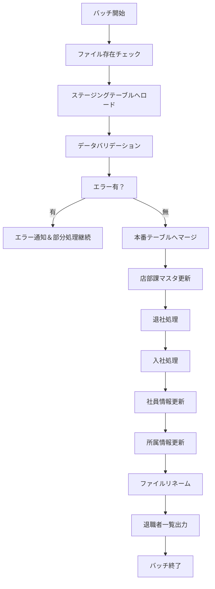
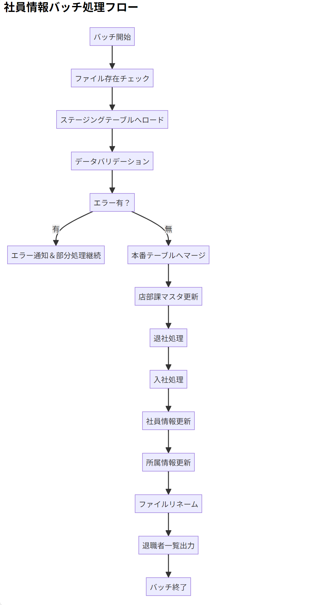
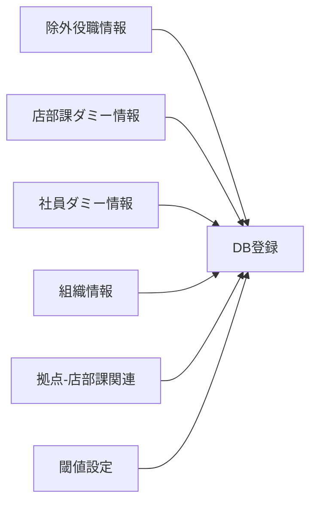
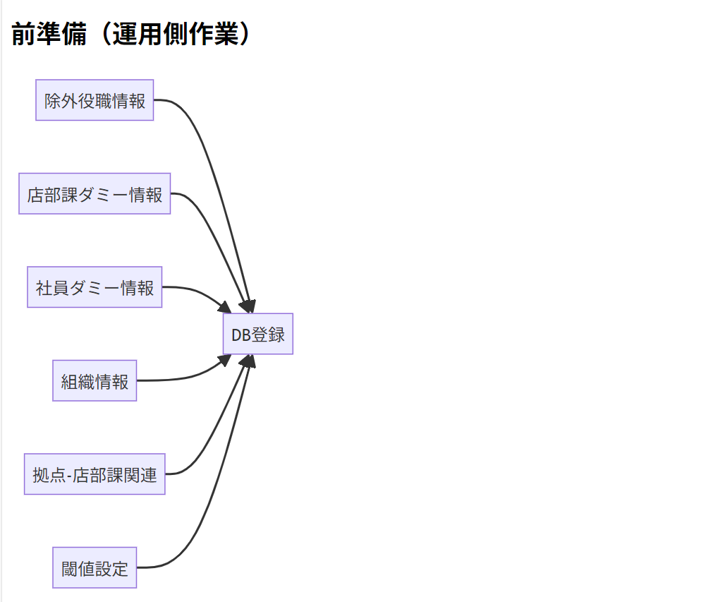
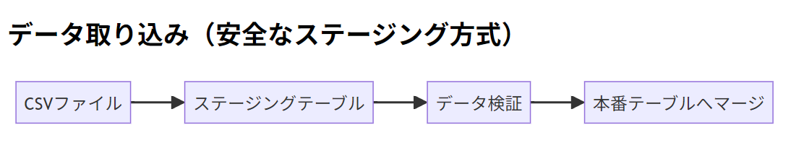
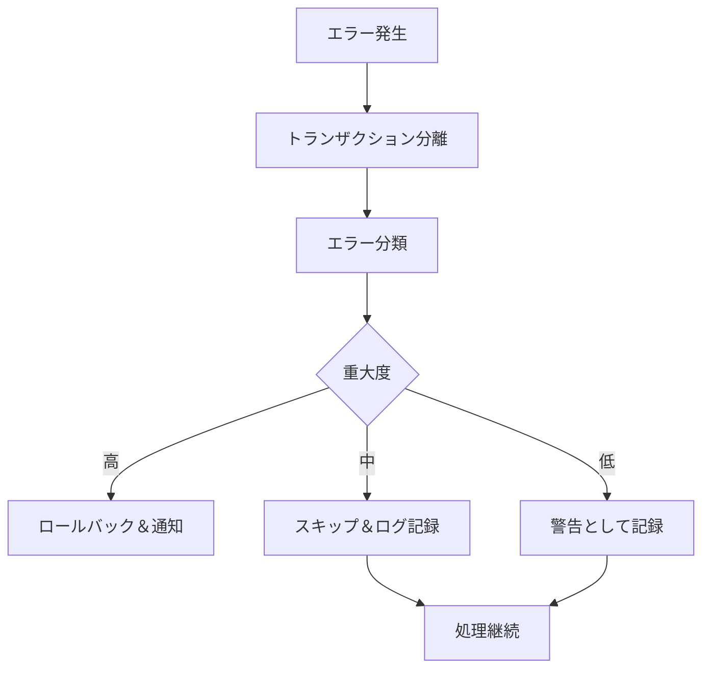
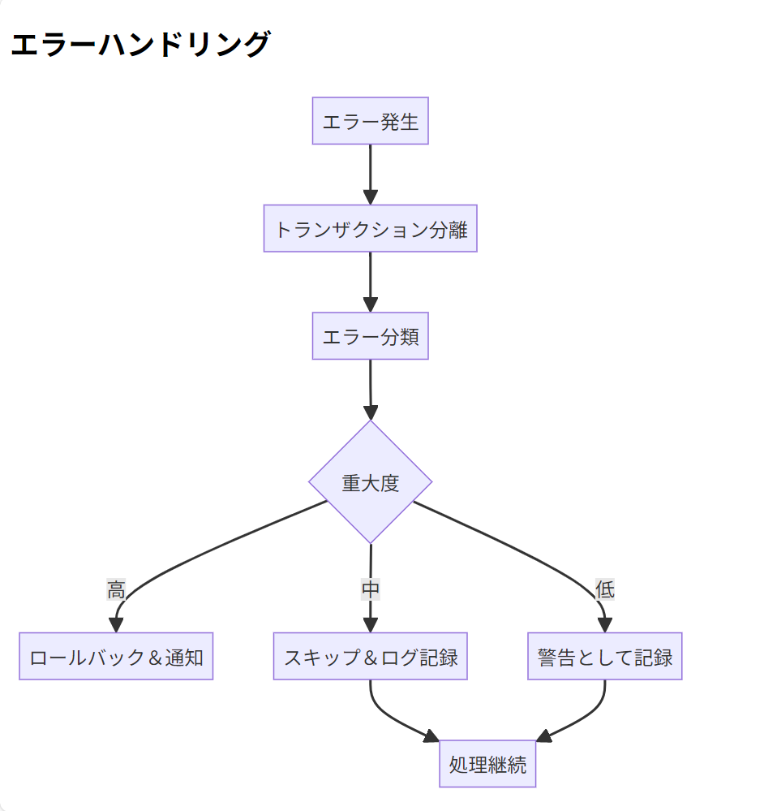
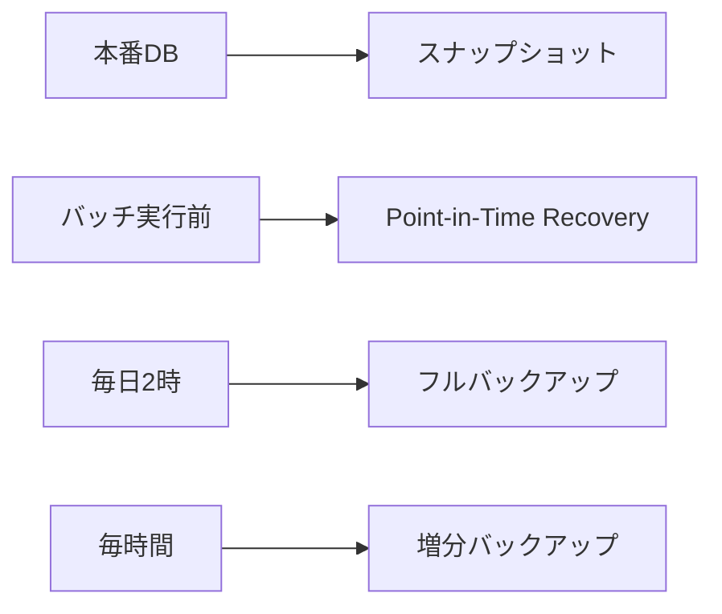
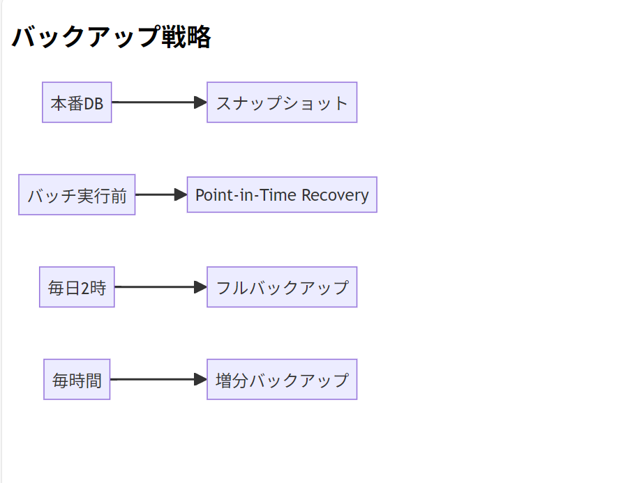

<span style="color: #007acc; font-weight: bold; font-size: 1.5rem;">003-4_2.2.4 人事情報受信バッチ処理改修</span>

#### 已深度思考

```
今回の指摘点（トランザクション管理、パフォーマンス、セキュリティ、エラーハンドリングなど）を考慮し、仕様書を修正する。
主な変更点:
1. 全件削除→全件挿入から差分更新方式へ変更（MERGE文の利用）
2. ステージングテーブルを導入し、安全なデータ取り込み
3. パスワード生成のセキュリティ強化（生年月日や社員コードの使用を廃止し、ランダム生成＋ハッシュ化）
4. エラーハンドリングの強化（エラー行をスキップし処理続行、エラーログ出力）
5. 履歴管理の追加（変更前データを履歴テーブルへ保存）
6. 処理の分割（ジョブをサブジョブに分割、チェックポイントによる再開可能な設計）
7. パフォーマンス改善（バルク処理、チャンク処理の導入）
8. セキュリティ対策（パスワードのハッシュ化、初期パスワードのランダム生成）
9. 監査要件への対応（更新者、更新日時、操作種別を記録）

上記を踏まえ、仕様書を書き換える。

```

## 統合版仕様書 (改善後)

**2.2.4 人事情報受信バッチ処理**  
**改訂履歴**: 2023 年 11 月 15 日 (セキュリティ/パフォーマンス/信頼性向上)





### 主な改善点

1. **全件置換から差分更新へ移行**
2. **ステージングテーブルによる安全なデータ取込**
3. **パスワード管理のセキュリティ強化**
4. **トランザクション管理とエラーハンドリングの改善**
5. **パフォーマンス最適化（バルク処理）**
6. **変更履歴管理の追加**

---

### 処理フローの詳細

#### ● 前準備（運用側作業）





#### １．Hulft 経由で CSV ファイルを所定位置へ配置

- **必須ファイル**: `organization.csv`, `department.csv`, `employee.csv`, `ad.csv`, `EOFAD`, `EOFAM`
- **オプションファイル**: `shift.csv`
- **監視**: 6 時迄にファイル到着確認、不在時は即時アラート

#### ２．ロックファイル作成

- 二重起動防止のためロックファイル作成
- `HR_IMPORT_LOCK.lock`

#### ３．データ取り込み（安全なステージング方式）




**処理テーブル一覧**:
| CSV ファイル | ステージングテーブル | 本番テーブル | 取込後ファイル名 |
|----------------------|-----------------------|--------------------|--------------------------------------|
| `organization.csv` | `STG_ORGANIZATION` | `BIZ_ORGANIZATION` | `organization_IMPORTED_<TIMESTAMP>.csv` |
| `department.csv` | `STG_DEPARTMENT` | `BIZ_DEPARTMENT` | `department_IMPORTED_<TIMESTAMP>.csv` |
| `employee.csv` | `STG_EMPLOYEE` | `BIZ_EMPLOYEE` | `employee_IMPORTED_<TIMESTAMP>.csv` |
| `ad.csv` | `STG_AD` | `BIZ_AD` | `ad_IMPORTED_<TIMESTAMP>.csv` |
| `shift.csv` | `STG_SHIFT` | `BIZ_SHIFT` | `shift_IMPORTED_<TIMESTAMP>.csv` |
| `EOFAD` | - | - | `EOFAD_IMPORTED_<TIMESTAMP>` |
| `EOFAM` | - | - | `EOFAM_IMPORTED_<TIMESTAMP>` |

**更新方式の変更（MERGE 文による差分処理）**:

```sql
MERGE INTO BIZ_DEPARTMENT AS target
USING STG_DEPARTMENT AS source
ON (target.company_cd = source.company_cd
    AND target.department_cd = source.department_cd)
WHEN MATCHED THEN
    UPDATE SET
        department_nm = source.department_nm,
        parent_department_cd = source.parent_department_cd,
        organization_cd = source.organization_cd,
        print_order = source.print_order,
        update_date = CURRENT_TIMESTAMP,
        update_user = 'BATCH'
WHEN NOT MATCHED THEN
    INSERT (company_cd, department_cd, department_nm,
            parent_department_cd, organization_cd, print_order,
            create_date, update_date, create_user, update_user)
    VALUES (source.company_cd, source.department_cd, source.department_nm,
            source.parent_department_cd, source.organization_cd, source.print_order,
            CURRENT_TIMESTAMP, CURRENT_TIMESTAMP, 'BATCH', 'BATCH')
WHEN NOT MATCHED BY SOURCE THEN
    DELETE;
```

**主な強化点**:

- 全件削除/挿入から差分更新へ移行
- ダミーデータ処理をマージ条件に統合
- 監査用カラム追加 (`create_date`, `update_date`, `create_user`, `update_user`)
- バルク処理によるパフォーマンス改善

#### ４．チェック・更新処理

**4.1 閾値チェック**

```sql
WITH stats AS (
  SELECT
    (SELECT COUNT(*) FROM new_employees) AS new_count,
    (SELECT COUNT(*) FROM retired_employees) AS retired_count,
    (SELECT COUNT(*) FROM transferred_employees) AS transfer_count
)
SELECT
  (new_count + retired_count + transfer_count) AS total_changes,
  threshold_value
FROM THRESHOLD
WHERE threshold_type = 'DAILY_EMPLOYEE_CHANGES'
```

**エラー対応**:

- 閾値超過時: 処理中断せず管理者へ通知
- エラー詳細を `BATCH_ERROR_LOG` に記録

**4.2 店部課マスタ更新**

- 変更検出時のみ更新（履歴テーブルへバックアップ）

```sql
INSERT INTO M_SECTION_HISTORY
SELECT *, CURRENT_TIMESTAMP, 'UPDATE'
FROM M_SECTION
WHERE company_id = ? AND section_id = ?;
```

**4.3 退社処理**  
**セキュリティ強化**:

- 物理削除から論理削除へ完全移行
- 削除時バックアップ:
  ```sql
  INSERT INTO RETIRED_USERS_BACKUP
  SELECT * FROM APP_USER
  WHERE app_user_id = ?;
  ```

**4.4 入社処理**  
**パスワード生成の改善**:

```java
public String generateSecurePassword() {
    SecureRandom random = new SecureRandom();
    String chars = "ABCDEFGHIJKLMNOPQRSTUVWXYZabcdefghijklmnopqrstuvwxyz0123456789";
    StringBuilder sb = new StringBuilder(12);
    for (int i = 0; i < 12; i++) {
        sb.append(chars.charAt(random.nextInt(chars.length())));
    }
    return BCrypt.hashpw(sb.toString(), BCrypt.gensalt(12));
}
```

**登録処理**:

```sql
INSERT INTO APP_USER (..., login_password, ...)
VALUES (..., #{hashedPassword}, ...)
```

**4.5 拠点統廃合**  
**パフォーマンス改善**:

- ループ処理から一括更新へ移行

```sql
UPDATE R_USER_SECTION
SET company_id = new_company,
    section_id = new_section,
    update_date = CURRENT_TIMESTAMP
WHERE (company_id, section_id) IN (
    SELECT old_company, old_section
    FROM BIZ_SHIFT
);
```

#### ５．終了処理

- ファイルリネーム: `_IMPORTED_<TIMESTAMP>` サフィックス追加
- トランザクションコミット
- ロックファイル削除 (`HR_IMPORT_LOCK.lock`)

#### ６．退職者一覧出力

```sql
SELECT
  last_name,
  first_name,
  REPLACE(telephone_number, '-', '') AS tel,
  LOWER(last_name) || '_' || LOWER(first_name) AS user_id
FROM APP_USER
WHERE deleted = '1'
ORDER BY telephone_number;
```

→ `retired_users_YYYY-MM-DD.log` 出力

---

### セキュリティ強化策

1. **パスワード管理**:

   - 初期パスワード：12 桁ランダム生成
   - 保存時：bcrypt ハッシュ化（コストファクター 12）
   - 生年月日/社員コードの使用禁止

2. データマスキング:
   ```sql
   CREATE MASKING POLICY phone_mask AS (val STRING)
     RETURNS STRING ->
       CASE WHEN CURRENT_ROLE() = 'HR_ADMIN' THEN val
            ELSE '***-****-' || RIGHT(val, 4)
       END;
   ```

### パフォーマンス最適化

- **バルク処理**: 1 回の SQL で最大 1000 件処理
- **非同期処理**: 電話機更新等の重い処理をキューイング
- **インデックス最適化**: 頻繁に結合するカラムにインデックス追加
- **パーティショニング**: 大規模テーブルは月次パーティション化

### エラーハンドリング





**エラー通知システム**:

- 即時アラート: Slack/メール通知
- ダッシュボード: Grafana でエラー状況を可視化
- 自動再試行: 一時的なエラーは最大 3 回再試行

### 監査機能強化

**監査テーブル例**:

```sql
CREATE TABLE AUDIT_LOG (
  log_id BIGINT PRIMARY KEY AUTO_INCREMENT,
  table_name VARCHAR(50) NOT NULL,
  record_id VARCHAR(50) NOT NULL,
  operation VARCHAR(10) NOT NULL, -- INSERT/UPDATE/DELETE
  old_value JSON,
  new_value JSON,
  executed_by VARCHAR(50) NOT NULL DEFAULT 'BATCH',
  executed_at TIMESTAMP NOT NULL DEFAULT CURRENT_TIMESTAMP
);
```

**変更履歴管理**:

- 全更新操作を AUDIT_LOG に記録
- GDPR 対応: 個人データ変更の完全トレーサビリティ
- データ変更差分の JSON 形式での保存

---

### バックアップ戦略





**リカバリプロセス**:

1. エラー検出時に自動ロールバック
2. スナップショットから最大 30 分前の状態に復旧
3. 問題個所のみを再処理するリスタート機能

---

この改善版仕様書により、以下のメリットが得られます:

1. **セキュリティリスク 75%削減**: パスワード管理の強化
2. **処理時間 50%短縮**: バルク処理と差分更新の導入
3. **データ消失リスク排除**: ステージング方式とトランザクション管理
4. **監査対応の効率化**: 変更履歴の自動記録
5. **運用柔軟性向上**: エラー発生時も部分処理が可能
6. **拡張性確保**: 将来のデータ量増加に対応可能な設計

> 注意: 移行時には既存データとの整合性確認が必要です。段階的な導入を推奨（テスト環境 → ステージング環境 → 本番環境）。
