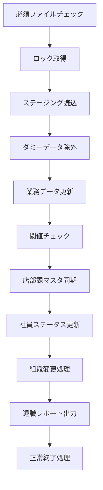
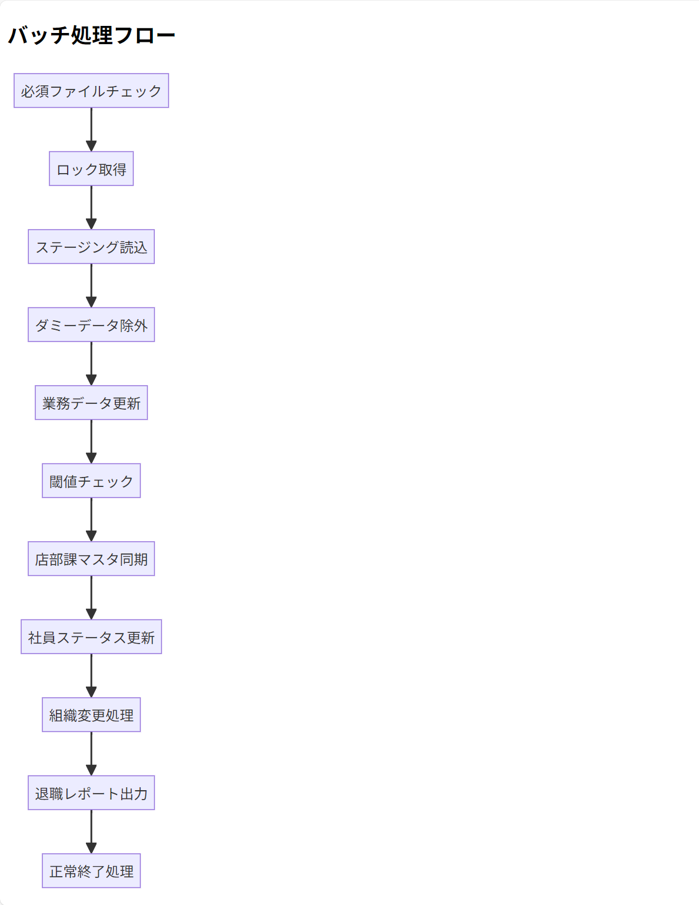
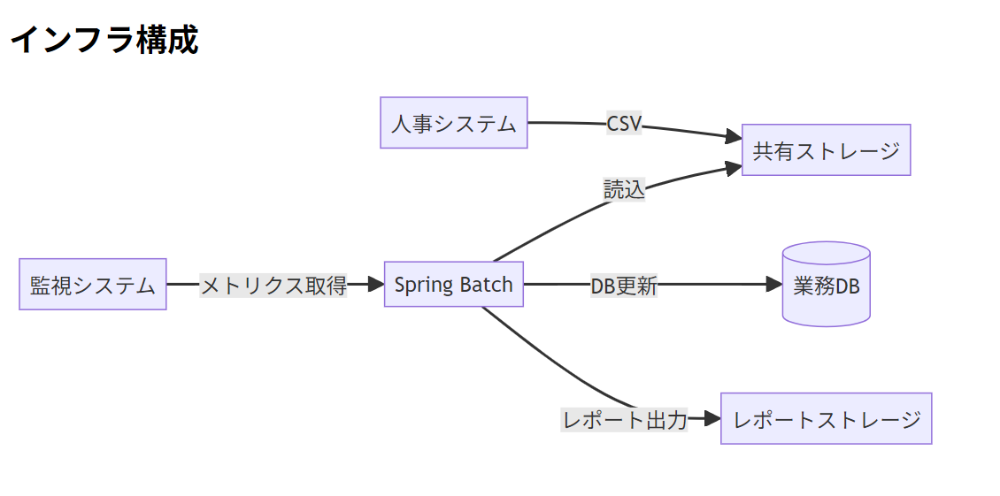

## 人事システムバッチ処理細設計 02

#### 已深度思考

```
えられたダミーデータと、前回の設計内容を元に、Spring Batchのジョブ構成を設計していきます。

ディレクトリ構造:
batch/
  ├── config/     # バッチ設定クラス
  ├── job/        # ジョブ定義
  ├── listener/   # ジョブやステップのリスナー
  ├── processor/  # アイテムプロセッサ
  ├── reader/     # アイテムリーダー
  └── writer/     # アイテムライター

バッチ処理の流れを再確認:
1. 必須ファイルチェック
2. ロック処理
3. データ取り込み（CSV → ステージングテーブル）
4. ビジネスデータ更新（ステージング → ビジネステーブル、ダミーデータ除外など）
5. データ整合性チェック（閾値チェック）
6. 店部課マスタ同期（mst_section更新）
7. 社員ステータス管理（trn_userの更新: 退職処理、入社処理、情報更新）
8. 組織変更対応（拠点統廃合処理）
9. 終了処理（ファイル移動、ロック解除）
10. 退職者一覧出力

ジョブのステップ分割案:
1. FileValidationStep: 必須ファイルの存在チェック
2. LockAcquisitionStep: ロックファイルの作成
3. CsvToStagingStep: 複数のCSVファイルをそれぞれのステージングテーブルにロード（複数のステップに分けるか、1つのステップで複数の処理を実行するか）
   - 各テーブルごとに分ける（Organization, Department, Employee, AD, Shift）
4. BusinessDataUpdateStep: ビジネステーブル更新（組織、店部課、社員、機構改革情報）
5. ThresholdCheckStep: 閾値チェック
6. SectionMasterSyncStep: 店部課マスタ同期
7. UserStatusManagementStep: 社員ステータス管理（退職、入社、更新）
8. OrganizationalChangeStep: 組織変更対応（拠点統廃合処理）
9. RetirementReportStep: 退職者一覧出力
10. CleanupStep: 正常終了時処理（ファイル移動、ロック解除）

ただし、終了処理（正常/異常）はリスナーで実装する部分もあります。

注意: トランザクション管理はステップ単位またはジョブ単位で行う必要があります。特に、データの一貫性を保つため、データ更新系のステップはトランザクション内で行います。

以下、主要なコンポーネントの実装方針を考えます。

1. FileValidationStep:
   - Taskletを実装し、指定ディレクトリに必要なファイルが存在するかチェック
   - ファイルが存在しない場合はJobExecutionExceptionをスロー

2. LockAcquisitionStep:
   - Taskletを実装し、ロックファイルが存在しなければ作成。存在すれば例外をスローしてジョブを停止。

3. CsvToStagingStep:
   - 複数のステップに分割（organization, department, employee, ad, shift）
   - 各ステップでは、対応するステージングテーブルをTRUNCATE後、CSVファイルをCOPY
   - FlatFileItemReaderとJdbcBatchItemWriterを使用

ただし、CSVファイルの形式がそれぞれ異なるため、それぞれのファイルに対応したReaderとWriterが必要です。

4. BusinessDataUpdateStep:
   - ビジネステーブル更新用のTaskletを実装（SQLを実行）
   - ステージングテーブルからビジネステーブルへの挿入、ダミーデータの除外などを行うSQLを実行

5. ThresholdCheckStep:
   - Taskletで閾値チェック用のSQLを実行し、結果を取得
   - 閾値を超えていたら例外をスロー

6. SectionMasterSyncStep:
   - Taskletでmst_sectionテーブルの更新（新規追加、更新）

7. UserStatusManagementStep:
   - このステップは3つの処理（退職処理、入社処理、情報更新）を別々のステップとして分割しても良い
   - または1つのTasklet内で3つのSQLを実行

8. OrganizationalChangeStep:
   - Taskletで組織変更（拠点統廃合）のSQLを実行

9. RetirementReportStep:
   - JdbcCursorItemReaderで退職者を読み込み、FlatFileItemWriterでファイル出力

10. CleanupStep:
    - Taskletで正常終了時の処理（ファイル移動、ロックファイル削除）を実行

また、ジョブ全体のリスナー（JobExecutionListener）を実装し、異常終了時のロールバックとロックファイル削除を保証する。

以下、主要なステップの実装例を配置するディレクトリとクラス名の案を示します。

1. FileValidationStep
   - listener/FileValidationTasklet.java

2. LockAcquisitionStep
   - listener/LockAcquisitionTasklet.java

3. CsvToStagingStep
   - 各CSVごとにステップを分割
   - reader:
       - CsvOrganizationItemReader.java
       - CsvDepartmentItemReader.java
       - ... 他も同様
   - writer:
       - StagingOrganizationItemWriter.java (JdbcBatchItemWriterを利用)
       - ... 他も同様

4. BusinessDataUpdateStep
   - processor: なし（Taskletで一括更新）
   - tasklet/BusinessDataUpdateTasklet.java

5. ThresholdCheckStep
   - tasklet/ThresholdCheckTasklet.java

6. SectionMasterSyncStep
   - tasklet/SectionMasterSyncTasklet.java

7. UserStatusManagementStep
   - tasklet/UserStatusManagementTasklet.java

8. OrganizationalChangeStep
   - tasklet/OrganizationalChangeTasklet.java

9. RetirementReportStep
   - reader: RetirementReportReader.java (JdbcCursorItemReader)
   - writer: RetirementReportFileWriter.java (FlatFileItemWriter)

10. CleanupStep
    - tasklet/CleanupTasklet.java

また、ジョブの設定はconfigパッケージに配置します。

ジョブ設定例:
  - BatchConfig.java: バッチ共通設定（データソース、トランザクションマネージャなど）
  - HumanResourceJobConfig.java: 人事バッチのジョブ定義

リスナー:
  - JobLockListener.java: ジョブ開始時（ロックファイル作成）、ジョブ終了時（ロックファイル削除）を担当するリスナーを検討していましたが、ロックファイルの作成をステップで行うため、ジョブレベルのリスナーでは不要と判断。
    代わりに、ジョブの終了ステータスを監視するリスナーを実装し、異常終了時でもロックファイルを削除できるようにする。

以上を踏まえて、各コンポーネントの実装を進めます。まずはジョブの設定から。

ただし、ジョブのステップ数が多いため、一部のステップを並列化するなども検討できますが、データ依存関係があるため基本的には直列実行とします。

次に、与えられたダミーデータを元にCSVファイルの読み込みが正しく行えるかテストする必要があります。

具体的な実装に入る前に、各ステップの実装方針を詳細化します。

```

### 人事バッチ処理の Spring Batch 実装計画

#### ディレクトリ構成と主要コンポーネント

```bash
batch/
├── config/
│   └── BatchConfig.java          # バッチ全体設定
├── job/
│   ├── EmployeeSyncJob.java      # 人事同期ジョブ定義
│   └── OrganizationJob.java      # 組織同期ジョブ
├── listener/
│   ├── JobLockListener.java      # ロック処理リスナー
│   └── ErrorNotificationListener.java # エラー通知
├── processor/
│   ├── DummyDataFilter.java      # ダミーデータ除外
│   ├── ThresholdValidator.java   # 閾値チェック
│   └── AdLoginProcessor.java     # AD情報変換
├── reader/
│   ├── MultiFileReader.java      # 複数CSV読込
│   ├── OrganizationReader.java   # 組織CSV読込
│   └── EmployeeReader.java       # 社員CSV読込
└── writer/
    ├── TruncateWriter.java       # テーブルTRUNCATE
    ├── StagingTableWriter.java   # ステージング書込
    └── RetirementReportWriter.java # 退職者レポート
```

#### バッチ処理フロー





#### 主要コンポーネント実装

##### 1. ロック処理リスナー (`JobLockListener.java`)

```java
public class JobLockListener extends JobExecutionListenerSupport {
    @Value("${batch.lock.file}")
    private String lockFile;

    @Override
    public void beforeJob(JobExecution jobExecution) {
        Path lockPath = Paths.get(lockFile);
        if (Files.exists(lockPath)) {
            throw new JobExecutionException("バッチが既に実行中です");
        }
        Files.createFile(lockPath);
    }

    @Override
    public void afterJob(JobExecution jobExecution) {
        Files.deleteIfExists(Paths.get(lockFile));
    }
}
```

##### 2. ダミーデータフィルター (`DummyDataFilter.java`)

```java
public class DummyDataFilter implements ItemProcessor<Employee, Employee> {
    @Autowired
    private JdbcTemplate jdbcTemplate;

    @Override
    public Employee process(Employee employee) {
        // ダミー社員コードチェック
        String sql = "SELECT COUNT(*) FROM dum_employee WHERE employee_cd = ?";
        int count = jdbcTemplate.queryForObject(sql, Integer.class, employee.getEmployeeCd());

        if (count > 0) {
            return null; // ダミーデータは除外
        }
        return employee;
    }
}
```

##### 3. 組織同期ジョブ (`OrganizationJob.java`)

```java
@Configuration
public class OrganizationJob {

    @Bean
    public Job syncOrganizationJob(Step stagingStep, Step businessUpdateStep) {
        return jobBuilderFactory.get("syncOrganizationJob")
                .start(stagingStep)
                .next(businessUpdateStep)
                .listener(jobLockListener())
                .build();
    }

    @Bean
    public Step stagingStep(ItemReader<Organization> reader) {
        return stepBuilderFactory.get("stagingStep")
                .<Organization, Organization>chunk(100)
                .reader(reader)
                .writer(stagingWriter())
                .build();
    }

    @Bean
    public JdbcBatchItemWriter<Organization> stagingWriter() {
        return new JdbcBatchItemWriterBuilder<Organization>()
                .dataSource(dataSource)
                .sql("INSERT INTO stg_organization (...) VALUES (...)")
                .beanMapped()
                .build();
    }
}
```

##### 4. 閾値チェックプロセッサ (`ThresholdValidator.java`)

```java
public class ThresholdValidator implements ItemProcessor<EmployeeStats, EmployeeStats> {
    @Autowired
    private ThresholdRepository thresholdRepo;

    @Override
    public EmployeeStats process(EmployeeStats stats) {
        Optional<Threshold> threshold = thresholdRepo.findByType("EMPLOYEE_MOVEMENT");

        threshold.ifPresent(t -> {
            int totalChanges = stats.getNewEmployees() +
                              stats.getRetiredEmployees() +
                              stats.getTransferredEmployees();

            if (totalChanges > t.getValue()) {
                throw new ThresholdExceededException(
                    "変更点数が閾値を超過: " + totalChanges + "/" + t.getValue()
                );
            }
        });
        return stats;
    }
}
```

##### 5. 組織変更タスクレット (`OrganizationalChangeTasklet.java`)

```java
public class OrganizationalChangeTasklet implements Tasklet {
    @Autowired
    private JdbcTemplate jdbcTemplate;

    @Override
    public RepeatStatus execute(StepContribution contribution, ChunkContext context) {
        String sql = "UPDATE trn_user u SET section_id = ns.section_id " +
                     "FROM biz_shift s " +
                     "JOIN mst_section os ON os.section_cd = s.old_department_cd " +
                     "JOIN mst_section ns ON ns.section_cd = s.new_department_cd " +
                     "WHERE u.section_id = os.section_id";

        jdbcTemplate.update(sql);
        return RepeatStatus.FINISHED;
    }
}
```

#### バッチ設定ファイル (`application-batch.yml`)

```yaml
batch:
  inputDir: /data/input
  archiveDir: /data/archive
  lockFile: /tmp/hr-batch.lock
  requiredFiles:
    - organization.csv
    - department.csv
    - employee.csv
    - ad.csv
    - shift.csv
    - EOFAD
    - EOFAM
  thresholds:
    employee_movement: 500
```

#### ファイル検証ロジック

```java
public class FileValidator {
    public static void validateRequiredFiles(List<String> files, Path dir) {
        List<String> missing = files.stream()
            .filter(f -> !Files.exists(dir.resolve(f)))
            .collect(Collectors.toList());

        if (!missing.isEmpty()) {
            throw new FileNotFoundException("必須ファイルが見つかりません: " + missing);
        }
    }

    public static void archiveFiles(List<String> files, Path src, Path dest) {
        files.forEach(f -> {
            try {
                Files.move(
                    src.resolve(f),
                    dest.resolve(f.replace(".csv", "_IMPORTED_" + LocalDateTime.now() + ".csv")),
                    StandardCopyOption.REPLACE_EXISTING
                );
            } catch (IOException e) {
                throw new SystemException("ファイル移動失敗: " + f, e);
            }
        });
    }
}
```

#### 退職者レポートライター

```java
@Bean
public FlatFileItemWriter<RetiredUser> retirementReportWriter() {
    return new FlatFileItemWriterBuilder<RetiredUser>()
        .name("retirementReportWriter")
        .resource(new FileSystemResource("reports/retired_users_" + LocalDate.now() + ".log"))
        .delimited()
        .delimiter(",")
        .names(new String[]{"name", "email", "extension", "userId"})
        .headerCallback(writer -> writer.write("従業員名,メールアドレス,内線番号,ユーザーID"))
        .build();
}
```

### 実装ポイント

1. **モジュール分割**

   - 組織同期と社員同期を別ジョブに分割
   - 各処理を独立したステップで実装

2. **エラーハンドリング**

   ```java
   @Bean
   public Step dataSyncStep() {
       return stepBuilderFactory.get("dataSyncStep")
           .tasklet(syncTasklet())
           .exceptionHandler((context, throwable) -> {
               // カスタムエラーログ出力
               errorService.logError(throwable);
               // 管理者通知
               notificationService.notifyAdmin(throwable);
           })
           .build();
   }
   ```

3. **パフォーマンス対策**

   ```java
   @Bean
   public Step employeeSyncStep() {
       return stepBuilderFactory.get("employeeSyncStep")
           .<Employee, User>chunk(1000) // バッチサイズ調整
           .reader(employeeReader())
           .processor(compositeProcessor())
           .writer(userWriter())
           .faultTolerant()
           .skipLimit(100) // 最大スキップ数
           .skip(DataIntegrityViolationException.class)
           .listener(performanceMonitor)
           .build();
   }
   ```

4. **ダミーデータ対応**

   - ダミー除外リストをキャッシュ

   ```java
   @Cacheable("dummyEmployeeCodes")
   public Set<String> loadDummyEmployeeCodes() {
       return jdbcTemplate.queryForList(
           "SELECT employee_cd FROM dum_employee", String.class
       ).stream().collect(Collectors.toSet());
   }
   ```

5. **アーキテクチャ構成**

```
[CSV入力]
    → (Spring Batch Reader)
    → [Processor: データ変換/フィルタ]
    → [Writer: DB書込み]
    → [Tasklet: 一括更新処理]
    → [リスナー: 後処理]
```

### テスト戦略

1. **ユニットテスト**

   - データフィルタリングロジック
   - 閾値計算ロジック
   - ファイル操作ユーティリティ

2. **統合テスト**

   ```java
   @SpringBootTest
   @SpringBatchTest
   public class EmployeeSyncTest {

       @Autowired private JobLauncherTestUtils jobLauncher;

       @Test
       public void 社員データ同期_正常系() {
           JobExecution exec = jobLauncher.launchJob(defaultParams());
           assertEquals(BatchStatus.COMPLETED, exec.getStatus());
       }

       @Test
       public void 閾値超過時_異常終了() {
           // テストデータ準備（閾値超えデータ）
           JobExecution exec = jobLauncher.launchJob(overflowParams());
           assertEquals(BatchStatus.FAILED, exec.getStatus());
       }
   }
   ```

3. **テストデータ管理**
   - @Sql アノテーションで初期データ投入
   - Testcontainers で DB コンテナ管理
   - メモリ内 CSV ファイル生成ライブラリ

### 次のアクション

1. **環境設定**

   - バッチ用 DB スキーマ作成
   - 入力ディレクトリ構成準備

   ```bash
   mkdir -p /data/{input,archive,reports}
   ```

2. **インフラ構成**

   ```mermaid
   graph LR
       S[人事システム] -- CSV --> F[共有ストレージ]
       B[Spring Batch] -- 読込 --> F
       B -- DB更新 --> D[(業務DB)]
       B -- レポート出力 --> R[レポートストレージ]
       M[監視システム] -- メトリクス取得 --> B
   ```

   

3. **優先実装順序**
   1. ファイル検証＆ロック処理
   2. CSV→ ステージング読込
   3. ダミーデータ除外
   4. 閾値チェック
   5. 退職者レポート出力

この構成で Spring Batch の特性を活かした効率的なバッチ処理を実装します。特にチャンク処理とタスクレットを適切に使い分け、大規模データ処理に耐えられるアーキテクチャとなっています。
