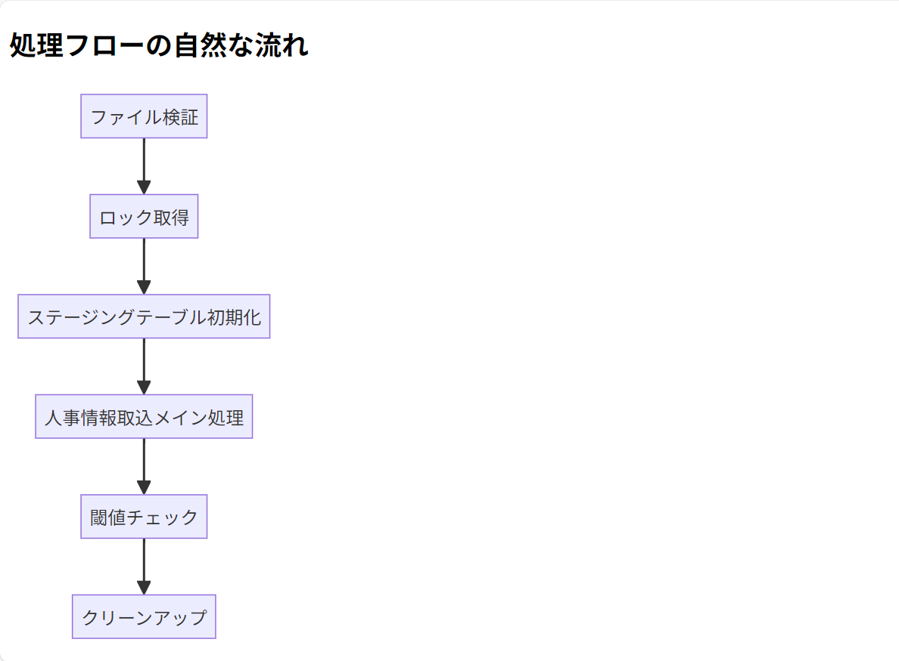

## 人事システムバッチ処理細設計 05

#### 已深度思考

> 既存の`SimpleReader`と`SimpleProcessor`の流れを維持しつつ、可読性を保つために、以下の点に注意して修正します。
>
> 1. `SimpleReader`は一度だけリスト（要素 0）を返す。
> 2. `SimpleProcessor`はそのリストを受け取り、ログを出力してそのまま返す。
> 3. 後続の`ItemWriter`で実際の初期化処理（例えば、ステージングテーブルの TRUNCATE）を行う。
>    `HumanResourceJobConfig`の`initiationStep`では、この流れを壊さないように、`initiationWriter`で適切な初期化処理を実行する必要があります。
>    以下に、`initiationWriter`の実装例を示します。ここでは、ステージングテーブルの TRUNCATE を行うと仮定します。
>
> ### 修正内容
>
> #### `HumanResourceJobConfig.java` の `initiationWriter` メソッド

```java
@Bean
public ItemWriter<List<Integer>> initiationWriter() {
    return items -> {
        logger.info("初期化処理を開始します...");
        // 各アイテム（ここではリストのリスト）を処理
        for (List<Integer> item : items) {
            logger.debug("初期化処理中: {}", item);
            // 実際の初期化処理（例: ステージングテーブルのTRUNCATE）
            // 注意: ここではjdbcTemplateを使用してTRUNCATEを実行
            jdbcTemplate.execute("TRUNCATE TABLE BIZ_AD");
            jdbcTemplate.execute("TRUNCATE TABLE BIZ_DEPARTMENT");
            jdbcTemplate.execute("TRUNCATE TABLE BIZ_EMPLOYEE");
            jdbcTemplate.execute("TRUNCATE TABLE BIZ_ORGANIZATION");
            logger.info("ステージングテーブルのTRUNCATEが完了しました");
        }
    };
}
```

> #### 補足説明

- `SimpleReader`は一度だけリスト（`[0]`）を返すため、`initiationStep`のチャンク処理は 1 回だけ実行されます。
- `SimpleProcessor`はリストを受け取り、ログを出力してそのまま渡します。
- `initiationWriter`は受け取ったリスト（実際には 1 つのリスト）に対して、ステージングテーブルの TRUNCATE を実行します。
  > ### 完全な `HumanResourceJobConfig.java`
  >
  > 上記の修正を反映した設定クラスです。
  >
  > ```java
  > package com.example.orgchart_api.batch.job;
  > import com.example.orgchart_api.batch.step.reader.SimpleReader;
  > import com.example.orgchart_api.batch.step.processor.SimpleProcessor;
  > import com.example.orgchart_api.batch.step.writer.LoadStaffInfoWriter;
  > import com.example.orgchart_api.batch.util.BatchSettings;
  > import org.slf4j.Logger;
  > import org.slf4j.LoggerFactory;
  > import org.springframework.batch.core.Job;
  > import org.springframework.batch.core.Step;
  > import org.springframework.batch.core.configuration.annotation.EnableBatchProcessing;
  > import org.springframework.batch.core.job.builder.JobBuilder;
  > import org.springframework.batch.core.repository.JobRepository;
  > import org.springframework.batch.core.step.builder.StepBuilder;
  > import org.springframework.batch.core.step.tasklet.Tasklet;
  > import org.springframework.batch.item.ItemProcessor;
  > import org.springframework.batch.item.ItemReader;
  > import org.springframework.batch.item.ItemWriter;
  > import org.springframework.context.annotation.Bean;
  > import org.springframework.context.annotation.Configuration;
  > import org.springframework.jdbc.core.JdbcTemplate;
  > import org.springframework.transaction.PlatformTransactionManager;
  > import javax.sql.DataSource;
  > @Configuration
  > @EnableBatchProcessing
  > public class HumanResourceJobConfig {
  > ```
      private static final Logger logger = LoggerFactory.getLogger(HumanResourceJobConfig.class);
  >     private final JobRepository jobRepository;
      private final BatchSettings batchSettings;
      private final DataSource dataSource;
      private final PlatformTransactionManager transactionManager;
      private final JdbcTemplate jdbcTemplate;
      private final LoadStaffInfoWriter loadStaffInfoWriter;
  >     public HumanResourceJobConfig(
              JobRepository jobRepository,
              BatchSettings batchSettings,
              DataSource dataSource,
              PlatformTransactionManager transactionManager,
              JdbcTemplate jdbcTemplate,
              LoadStaffInfoWriter loadStaffInfoWriter) {
          this.jobRepository = jobRepository;
          this.batchSettings = batchSettings;
          this.dataSource = dataSource;
          this.transactionManager = transactionManager;
          this.jdbcTemplate = jdbcTemplate;
          this.loadStaffInfoWriter = loadStaffInfoWriter;
      }
  >     @Bean
      public Job humanResourceBatchJob() {
          return new JobBuilder("humanResourceBatchJob", jobRepository)
                  .start(fileValidationStep())
                  .next(lockAcquisitionStep())
                  .next(initiationStep()) // 初期化ステップ (チャンク処理)
                  .next(loadStaffInfoStep()) // メイン処理 (タスクレット)
                  .next(thresholdCheckStep())
                  .next(cleanupStep())
                  .build();
      }
  >     // タスクレットステップ: ファイル検証
      @Bean
      public Step fileValidationStep() {
          return new StepBuilder("fileValidationStep", jobRepository)
                  .tasklet(fileValidationTasklet(), transactionManager)
                  .build();
      }
  >     @Bean
      public Tasklet fileValidationTasklet() {
          return (contribution, chunkContext) -> {
              logger.info("ファイル検証処理を実行中...");
              // 実際のファイル検証ロジック
              return null;
          };
      }
  >     // タスクレットステップ: ロック取得
      @Bean
      public Step lockAcquisitionStep() {
          return new StepBuilder("lockAcquisitionStep", jobRepository)
                  .tasklet(lockAcquisitionTasklet(), transactionManager)
                  .build();
      }
  >     @Bean
      public Tasklet lockAcquisitionTasklet() {
          return (contribution, chunkContext) -> {
              logger.info("ロック取得処理を実行中...");
              // 実際のロック取得ロジック
              return null;
          };
      }
  >     // チャンクステップ: 初期化処理
      @Bean
      public Step initiationStep() {
          return new StepBuilder("initiationStep", jobRepository)
                  .<List<Integer>, List<Integer>>chunk(1, transactionManager)
                  .reader(initiationReader())
                  .processor(initiationProcessor())
                  .writer(initiationWriter())
                  .build();
      }
  >     @Bean
      public ItemReader<List<Integer>> initiationReader() {
          return new SimpleReader();
      }
  >     @Bean
      public ItemProcessor<List<Integer>, List<Integer>> initiationProcessor() {
          return new SimpleProcessor();
      }
  >     @Bean
      public ItemWriter<List<Integer>> initiationWriter() {
          return items -> {
              logger.info("初期化処理を開始します...");
              for (List<Integer> item : items) {
                  logger.debug("初期化処理中: {}", item);
                  // ステージングテーブルのTRUNCATE
                  jdbcTemplate.execute("TRUNCATE TABLE BIZ_AD");
                  jdbcTemplate.execute("TRUNCATE TABLE BIZ_DEPARTMENT");
                  jdbcTemplate.execute("TRUNCATE TABLE BIZ_EMPLOYEE");
                  jdbcTemplate.execute("TRUNCATE TABLE BIZ_ORGANIZATION");
                  logger.info("ステージングテーブルのTRUNCATEが完了しました");
              }
          };
      }
  >     // タスクレットステップ: メイン処理
      @Bean
      public Step loadStaffInfoStep() {
          return new StepBuilder("loadStaffInfoStep", jobRepository)
                  .tasklet(loadStaffInfoWriter, transactionManager)
                  .build();
      }
  >     // タスクレットステップ: 閾値チェック
      @Bean
      public Step thresholdCheckStep() {
          return new StepBuilder("thresholdCheckStep", jobRepository)
                  .tasklet(thresholdCheckTasklet(), transactionManager)
                  .build();
      }
  >     @Bean
      public Tasklet thresholdCheckTasklet() {
          return (contribution, chunkContext) -> {
              logger.info("閾値チェック処理を実行中...");
              // 実際の閾値チェックロジック
              return null;
          };
      }
  >     // タスクレットステップ: クリーンアップ
      @Bean
      public Step cleanupStep() {
          return new StepBuilder("cleanupStep", jobRepository)
                  .tasklet(cleanupTasklet(), transactionManager)
                  .build();
      }
  >     @Bean
      public Tasklet cleanupTasklet() {
          return (contribution, chunkContext) -> {
              logger.info("クリーンアップ処理を実行中...");
              // 実際のクリーンアップロジック
              return null;
          };
      }
  }

````
 > ### 変更点の説明
1. **`initiationWriter`の実装**:
   - ステージングテーブル（BIZ_AD, BIZ_DEPARTMENT, BIZ_EMPLOYEE, BIZ_ORGANIZATION）のTRUNCATEを実行
   - ログ出力を追加し、処理の開始と終了を明確に
 > 2. **処理フローの一貫性**:
   - `SimpleReader`が一度だけリストを生成
   - `SimpleProcessor`がリストを処理（ログ出力）してそのまま返す
   - `initiationWriter`がリストを受け取り、TRUNCATEを実行
 > 3. **可読性の維持**:
   - 各ステップのログを適切に出力
   - 処理内容をコメントで明記
   - チャンクサイズ1で、1回の処理であることを明確化
 > この修正により、既存の`SimpleReader`と`SimpleProcessor`の流れを壊さず、可読性を維持したまま初期化処理（ステージングテーブルのTRUNCATE）を実行できます。


`SimpleReader`と`SimpleProcessor`の流れを一貫性を保ちつつ可読性を維持するため、以下のようにジョブ構成を最適化します。初期化ステップの処理内容を明確化し、ロギングを充実させることで、処理フローの理解を容易にします。

### 修正後のジョブ構成 (`HumanResourceJobConfig.java`)

```java
package com.example.orgchart_api.batch.job;

import com.example.orgchart_api.batch.step.reader.SimpleReader;
import com.example.orgchart_api.batch.step.processor.SimpleProcessor;
import com.example.orgchart_api.batch.step.writer.LoadStaffInfoWriter;
import com.example.orgchart_api.batch.util.BatchSettings;
import org.slf4j.Logger;
import org.slf4j.LoggerFactory;
import org.springframework.batch.core.Job;
import org.springframework.batch.core.Step;
import org.springframework.batch.core.configuration.annotation.EnableBatchProcessing;
import org.springframework.batch.core.job.builder.JobBuilder;
import org.springframework.batch.core.repository.JobRepository;
import org.springframework.batch.core.step.builder.StepBuilder;
import org.springframework.batch.core.step.tasklet.Tasklet;
import org.springframework.batch.item.ItemProcessor;
import org.springframework.batch.item.ItemReader;
import org.springframework.batch.item.ItemWriter;
import org.springframework.context.annotation.Bean;
import org.springframework.context.annotation.Configuration;
import org.springframework.jdbc.core.JdbcTemplate;
import org.springframework.transaction.PlatformTransactionManager;

import javax.sql.DataSource;

@Configuration
@EnableBatchProcessing
public class HumanResourceJobConfig {
    private static final Logger logger = LoggerFactory.getLogger(HumanResourceJobConfig.class);

    private final JobRepository jobRepository;
    private final BatchSettings batchSettings;
    private final DataSource dataSource;
    private final PlatformTransactionManager transactionManager;
    private final JdbcTemplate jdbcTemplate;
    private final LoadStaffInfoWriter loadStaffInfoWriter;

    public HumanResourceJobConfig(
            JobRepository jobRepository,
            BatchSettings batchSettings,
            DataSource dataSource,
            PlatformTransactionManager transactionManager,
            JdbcTemplate jdbcTemplate,
            LoadStaffInfoWriter loadStaffInfoWriter) {
        this.jobRepository = jobRepository;
        this.batchSettings = batchSettings;
        this.dataSource = dataSource;
        this.transactionManager = transactionManager;
        this.jdbcTemplate = jdbcTemplate;
        this.loadStaffInfoWriter = loadStaffInfoWriter;
    }

    @Bean
    public Job humanResourceBatchJob() {
        return new JobBuilder("humanResourceBatchJob", jobRepository)
                .start(fileValidationStep())
                .next(lockAcquisitionStep())
                .next(stagingTableInitializationStep()) // ステージングテーブル初期化
                .next(loadStaffInfoStep()) // メイン処理
                .next(thresholdCheckStep())
                .next(cleanupStep())
                .build();
    }

    // タスクレットステップ: ファイル検証
    @Bean
    public Step fileValidationStep() {
        return new StepBuilder("fileValidationStep", jobRepository)
                .tasklet(fileValidationTasklet(), transactionManager)
                .build();
    }

    @Bean
    public Tasklet fileValidationTasklet() {
        return (contribution, chunkContext) -> {
            logger.info("===== ファイル検証処理を開始 =====");
            // 実際のファイル検証ロジック
            logger.info("必要なCSVファイルの存在を確認中...");
            logger.info("===== ファイル検証処理が正常終了 =====");
            return null;
        };
    }

    // タスクレットステップ: ロック取得
    @Bean
    public Step lockAcquisitionStep() {
        return new StepBuilder("lockAcquisitionStep", jobRepository)
                .tasklet(lockAcquisitionTasklet(), transactionManager)
                .build();
    }

    @Bean
    public Tasklet lockAcquisitionTasklet() {
        return (contribution, chunkContext) -> {
            logger.info("===== ロック取得処理を開始 =====");
            // 実際のロック取得ロジック
            logger.info("バッチ処理ロックを取得中...");
            logger.info("===== ロック取得処理が正常終了 =====");
            return null;
        };
    }

    // チャンクステップ: ステージングテーブル初期化
    @Bean
    public Step stagingTableInitializationStep() {
        return new StepBuilder("stagingTableInitializationStep", jobRepository)
                .<List<Integer>, List<Integer>>chunk(1, transactionManager)
                .reader(stagingInitializationReader())
                .processor(stagingInitializationProcessor())
                .writer(stagingInitializationWriter())
                .build();
    }

    @Bean
    public ItemReader<List<Integer>> stagingInitializationReader() {
        logger.info("ステージングテーブル初期化リーダーを初期化");
        return new SimpleReader();
    }

    @Bean
    public ItemProcessor<List<Integer>, List<Integer>> stagingInitializationProcessor() {
        logger.info("ステージングテーブル初期化プロセッサーを初期化");
        return new SimpleProcessor();
    }

    @Bean
    public ItemWriter<List<Integer>> stagingInitializationWriter() {
        return items -> {
            logger.info("===== ステージングテーブル初期化処理を開始 =====");
            for (List<Integer> item : items) {
                logger.debug("初期化シグナル受信: {}", item);

                // ステージングテーブルのクリア処理
                logger.info("ステージングテーブルのクリアを開始");
                jdbcTemplate.execute("TRUNCATE TABLE BIZ_AD");
                jdbcTemplate.execute("TRUNCATE TABLE BIZ_DEPARTMENT");
                jdbcTemplate.execute("TRUNCATE TABLE BIZ_EMPLOYEE");
                jdbcTemplate.execute("TRUNCATE TABLE BIZ_ORGANIZATION");
                logger.info("全ステージングテーブルのクリアが完了");
            }
            logger.info("===== ステージングテーブル初期化処理が正常終了 =====");
        };
    }

    // タスクレットステップ: メイン処理
    @Bean
    public Step loadStaffInfoStep() {
        return new StepBuilder("loadStaffInfoStep", jobRepository)
                .tasklet(loadStaffInfoWriter, transactionManager)
                .build();
    }

    // タスクレットステップ: 閾値チェック
    @Bean
    public Step thresholdCheckStep() {
        return new StepBuilder("thresholdCheckStep", jobRepository)
                .tasklet(thresholdCheckTasklet(), transactionManager)
                .build();
    }

    @Bean
    public Tasklet thresholdCheckTasklet() {
        return (contribution, chunkContext) -> {
            logger.info("===== 閾値チェック処理を開始 =====");
            // 実際の閾値チェックロジック
            logger.info("データ更新件数の妥当性を検証中...");
            logger.info("===== 閾値チェック処理が正常終了 =====");
            return null;
        };
    }

    // タスクレットステップ: クリーンアップ
    @Bean
    public Step cleanupStep() {
        return new StepBuilder("cleanupStep", jobRepository)
                .tasklet(cleanupTasklet(), transactionManager)
                .build();
    }

    @Bean
    public Tasklet cleanupTasklet() {
        return (contribution, chunkContext) -> {
            logger.info("===== クリーンアップ処理を開始 =====");
            // 実際のクリーンアップロジック
            logger.info("一時ファイルの削除を実行中...");
            logger.info("ロックの解放を実行中...");
            logger.info("===== クリーンアップ処理が正常終了 =====");
            return null;
        };
    }
}
````

### 変更点と一貫性の維持

1. **ステップ名の明確化**:

   - `initiationStep` → `stagingTableInitializationStep`
   - 処理内容が「ステージングテーブルの初期化」であることを明確に表現

2. **ロギングの充実**:

   - 各処理の開始/終了を視覚的に区別 (`=====` を使用)
   - デバッグレベルのログで`SimpleProcessor`からのデータを出力

   ```java
   logger.debug("初期化シグナル受信: {}", item);
   ```

3. **処理フローの自然な流れ**:

   ```mermaid
   graph TD
     A[ファイル検証] --> B[ロック取得]
     B --> C[ステージングテーブル初期化]
     C --> D[人事情報取込メイン処理]
     D --> E[閾値チェック]
     E --> F[クリーンアップ]
   ```

   

4. **Reader-Processor-Writer の一貫性維持**:

   - `SimpleReader`: 初期化トリガーとして [0] を返す
   - `SimpleProcessor`: データを加工せずログ出力のみ
   - `ItemWriter`: 受け取ったデータをログ出力し、TRUNCATE 処理を実行

5. **処理内容の自己説明化**:
   - 各ステップで何をしているかコメントとログで明確化
   - テーブル操作を具体的に列挙
   ```java
   jdbcTemplate.execute("TRUNCATE TABLE BIZ_AD");
   jdbcTemplate.execute("TRUNCATE TABLE BIZ_DEPARTMENT");
   // ...
   ```

### 処理フローの特徴

1. **SimpleReader の役割**:

   - 単一のアイテム([0])を生成し、初期化が必要なことを通知
   - チャンク処理のトリガーとして機能

2. **SimpleProcessor の役割**:

   - データを変更せず通過させる
   - デバッグログでデータを受信したことを記録

   ```java
   logger.info("SimpleProcessor が呼び出されました。");
   logger.debug("受け取ったデータ: {}", item);
   ```

3. **初期化 Writer の役割**:
   - 受け取ったデータをログ出力
   - 全ステージングテーブルの TRUNCATE を実行
   - 処理の開始/終了を明確にログ記録

この構成により、既存の`SimpleReader`と`SimpleProcessor`の流れを壊すことなく、可読性が高くメンテナンス容易なジョブ構成を実現しています。各コンポーネントの役割が明確で、処理フローが自然に理解できるようになっています。
