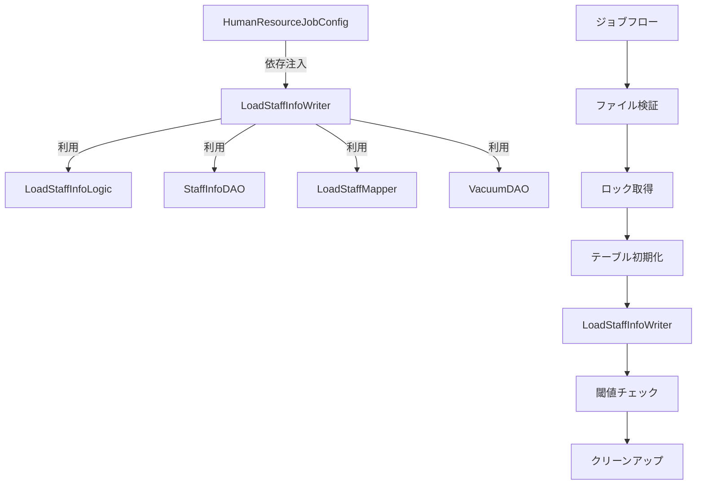
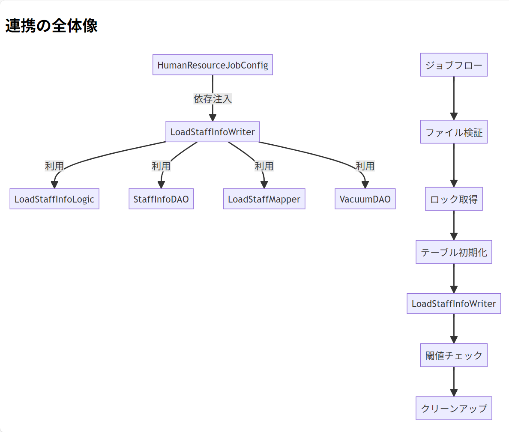

## 人事システムバッチ処理細設計 05

#### HumanResourceJobConfig と LoadStaffInfoWriter との連携

#### 已深度思考

> `HumanResourceJobConfig`と`LoadStaffInfoWriter`の連携は、Spring Batch のジョブ構成と依存性注入(DI)によって実現されています。以下に詳細を説明します。
>
> ### 1. **依存性注入による連携**

- **`LoadStaffInfoWriter`のインスタンス化**:
  `HumanResourceJobConfig`クラスのコンストラクタで`LoadStaffInfoWriter`がインジェクションされ、フィールド`loadStaffInfoWriter`に保持されます。
  ```java
  private final LoadStaffInfoWriter loadStaffInfoWriter;
  >   public HumanResourceJobConfig(
          ...,
          LoadStaffInfoWriter loadStaffInfoWriter) {
      ...
      this.loadStaffInfoWriter = loadStaffInfoWriter;
  }
  ```
  > ### 2. **ジョブステップでの利用**
- **`loadStaffInfoStep`ステップの定義**:
  `loadStaffInfoStep`というステップを定義し、そのステップの`tasklet`として`loadStaffInfoWriter`を設定しています。
  ```java
  @Bean
  public Step loadStaffInfoStep() {
      return new StepBuilder("loadStaffInfoStep", jobRepository)
              .tasklet(loadStaffInfoWriter, transactionManager)  // ここでLoadStaffInfoWriterを使用
              .build();
  }
  ```
  このステップはジョブフロー内で`stagingTableInitializationStep`の次に実行されます。
  > ### 3. **`LoadStaffInfoWriter`の役割**
- **タスクレットとしての実行**:
  `LoadStaffInfoWriter`は`Tasklet`インターフェースを実装しており、その`execute`メソッドがステップ実行時に呼び出されます。
  ```java
  @Override
  public RepeatStatus execute(StepContribution contribution, ChunkContext chunkContext) {
      // ロック管理やメイン処理の実行
      ...
  }
  ```
  このメソッド内で以下の一連の処理が行われます：
  1. ロックファイルの取得（`LockFileManager.lock`）
  2. メイン処理（`processStaffData`）
  3. ロックファイルの解放（`LockFileManager.unlock`）
     > ### 4. **メイン処理の内容**
- **`processStaffData`メソッド**:
  人事情報取込の主要なビジネスロジックを実行します。具体的には：
  - 必須 CSV ファイルの存在確認
  - データ処理パイプラインの実行：
    - ステージングテーブルの更新（BIZ テーブル）
    - 部門データの更新
    - 従業員データの更新
    - ファイル操作（リネーム、エクスポート、エラーファイル作成）
    - データベースメンテナンス（VACUUM）
      > ### 5. **ジョブフロー全体との連携**
- **ステップの順序**:
  ジョブは以下の順序でステップを実行します：
  1. `fileValidationStep`（ファイル検証）
  2. `lockAcquisitionStep`（ロック取得）
  3. `stagingTableInitializationStep`（ステージングテーブル初期化：TRUNCATE）
  4. `loadStaffInfoStep`（メイン処理：`LoadStaffInfoWriter`）
  5. `thresholdCheckStep`（閾値チェック）
  6. `cleanupStep`（クリーンアップ）
     > ### 連携のまとめ
- `HumanResourceJobConfig`はジョブの構造を定義し、`LoadStaffInfoWriter`をステップの実行者として設定。
- `LoadStaffInfoWriter`は独立したタスクレットコンポーネントとして、人事情報取込の全処理を担当。
- Spring の DI コンテナが`LoadStaffInfoWriter`のインスタンスを`HumanResourceJobConfig`に注入し、ジョブ実行時に適切に連携される。
  > この設計により、各コンポーネントが疎結合になり、テストや保守が容易になります。

`HumanResourceJobConfig` と `LoadStaffInfoWriter` は、Spring Batch のジョブ構成とコンポーネント間の連携を通じて密接に連携しています。以下にその連携関係を詳細に説明します：

### 1. 依存性注入による連携

**`HumanResourceJobConfig` での設定:**

```java
@Configuration
@EnableBatchProcessing
public class HumanResourceJobConfig {
    private final LoadStaffInfoWriter loadStaffInfoWriter;

    public HumanResourceJobConfig(
            ...,
            LoadStaffInfoWriter loadStaffInfoWriter) {
        ...
        this.loadStaffInfoWriter = loadStaffInfoWriter;
    }
}
```

- `LoadStaffInfoWriter` は `@Component` アノテーションで Spring Bean として登録されているため、`HumanResourceJobConfig` のコンストラクタで自動的にインジェクションされます。

### 2. ジョブステップでの利用

**`loadStaffInfoStep` の定義:**

```java
@Bean
public Step loadStaffInfoStep() {
    return new StepBuilder("loadStaffInfoStep", jobRepository)
            .tasklet(loadStaffInfoWriter, transactionManager)
            .build();
}
```

- インジェクションされた `loadStaffInfoWriter` がタスクレットとしてステップに登録されます。
- このステップはジョブフロー内で `stagingTableInitializationStep` の次に実行されます。

### 3. ジョブフロー内での位置付け

**ジョブの定義:**

```java
@Bean
public Job humanResourceBatchJob() {
    return new JobBuilder("humanResourceBatchJob", jobRepository)
            .start(fileValidationStep())
            .next(lockAcquisitionStep())
            .next(stagingTableInitializationStep())
            .next(loadStaffInfoStep()) // LoadStaffInfoWriterが実行されるステップ
            .next(thresholdCheckStep())
            .next(cleanupStep())
            .build();
}
```

- `loadStaffInfoStep` はジョブフローの中心的なステップとして位置付けられています。
- 前ステップの `stagingTableInitializationStep` でテーブルがクリアされた後、メイン処理が実行されます。

### 4. 処理の流れ

1. **前処理の完了後:**

   - ファイル検証、ロック取得、テーブル初期化が完了
   - クリーンな状態で `LoadStaffInfoWriter` の処理が開始

2. **LoadStaffInfoWriter の実行:**

   ```java
   @Override
   public RepeatStatus execute(StepContribution contribution, ChunkContext chunkContext) {
       try {
           LockFileManager.lock(batchSettings);
           processStaffData(); // メイン処理
           return RepeatStatus.FINISHED;
       } finally {
           LockFileManager.unlock(batchSettings);
       }
   }
   ```

   - ロックを取得した状態でメイン処理を実行
   - 処理完了後、確実にロックを解放

3. **メイン処理の内容 (`processStaffData`):**
   ```java
   private void processStaffData() throws Exception {
       if (!checkRequiredFiles()) { ... }
       executeDataProcessingPipeline();
   }
   ```
   - 必須ファイルの確認
   - データ処理パイプラインの実行:
     - ステージングテーブルの更新
     - 部門データの更新
     - 従業員データの更新
     - ファイル操作
     - データベースメンテナンス

### 5. 依存コンポーネントの連携

`LoadStaffInfoWriter` は以下のコンポーネントと連携します：

- **`LoadStaffInfoLogic`**: CSV 処理やファイル操作の実装を委譲
- **`StaffInfoDAO`**: データベース操作を実行
- **`LoadStaffMapper`**: テーブル操作を実行
- **`VacuumDAO`**: データベースメンテナンスを実行

### 6. エラーハンドリングの連携

```java
private void handleException(Exception ex) {
    logger.error("処理中にエラーが発生しました", ex);
    try {
        loadStaffInfoLogic.createErrorFile("処理中にエラーが発生しました: " + ex.getMessage());
    } catch (Exception e) { ... }
    throw new BatRuntimeException("人事情報取込処理に失敗しました", ex);
}
```

- 例外発生時には `LoadStaffInfoLogic` を利用してエラーファイルを作成
- 適切なエラーメッセージをスロー

### 連携の全体像





### 重要な連携ポイント

1. **タイミングの制御**:

   - テーブル初期化が完了した直後にメイン処理が実行される
   - ロックはメイン処理の前後で確実に管理される

2. **責任の分離**:

   - `HumanResourceJobConfig`: ジョブ構成とステップの流れを定義
   - `LoadStaffInfoWriter`: 実際のビジネスロジックを実行
   - 各 DAO クラス: 具体的なデータ操作を担当

3. **トランザクション管理**:
   - `@Transactional` アノテーションにより、メイン処理全体が 1 つのトランザクションで実行
   - 例外発生時には適切にロールバック

この連携設計により、各コンポーネントが明確な責任を持ちながら、効率的に連携して人事情報取込処理を実現しています。
