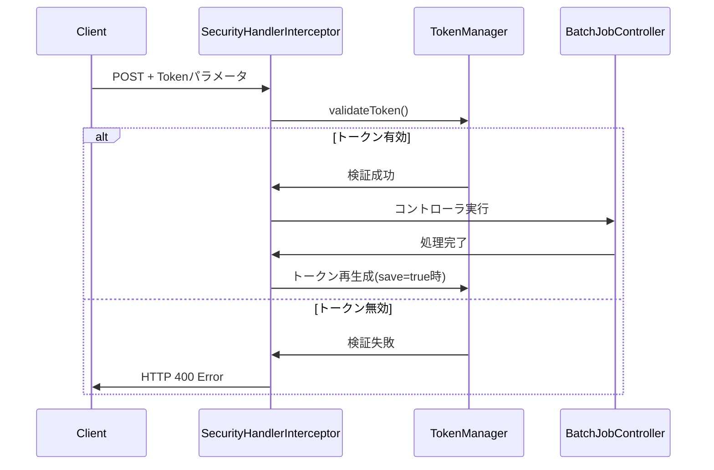
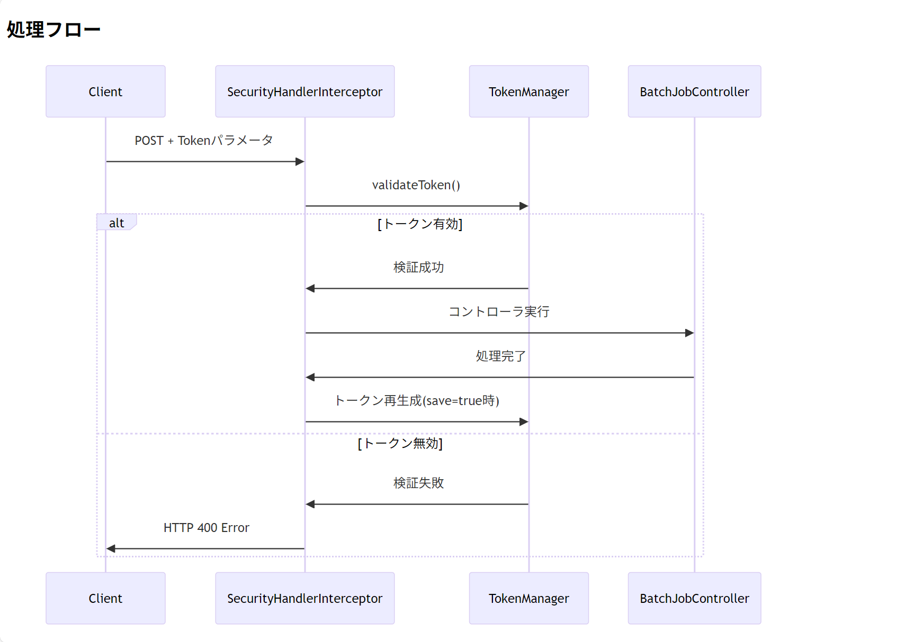
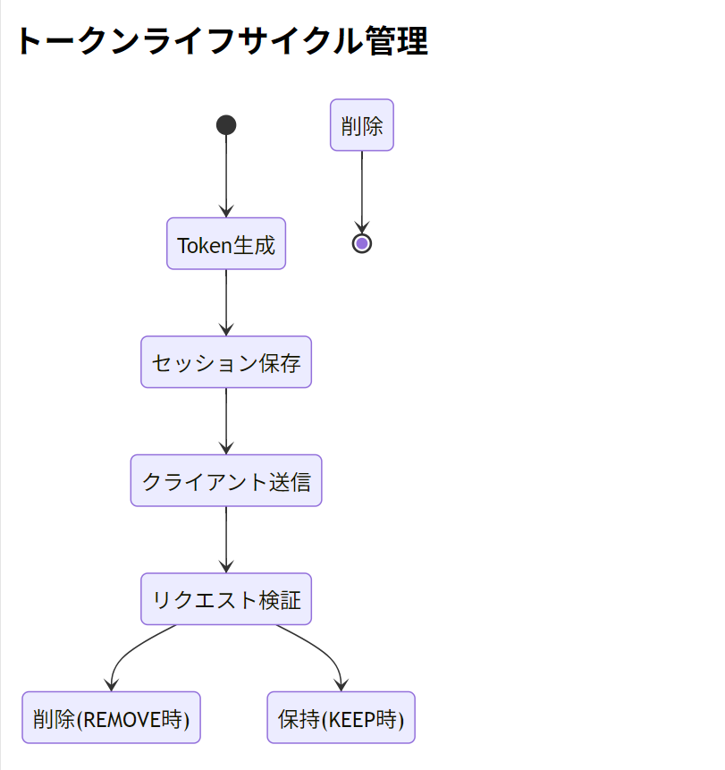

# バッチ実行 API に対して「認証」「ワンタイムトークン検証」「非同期処理」の連携

#### 已深度思考

> このコード群は、Spring Boot アプリケーションにおいて、バッチジョブの実行とセキュリティ（特にワンタイムトークンによる CSRF 対策）を連携させる仕組みを実装しています。以下にファイルごとの役割と全体の流れを説明します。
>
> ### 1. `BatchJobController` (バッチジョブの実行を制御するコントローラ)

- エンドポイント `/api/batch/run-human-resource-job` を提供し、バッチジョブを起動します。
- `@TokenHandler`アノテーションで、このメソッドがワンタイムトークンの検証と削除を行うことを指定しています。
  - `save = true`: リクエスト時に新しいトークンを生成してセッションに保存（ただし、このメソッドでは save=true ですが、実際にはバッチ起動のエンドポイントなので、トークンの保存は通常不要かもしれません。しかし、フォーム表示などの場合は保存が必要です。この例では、おそらくバッチ起動リクエストが POST でトークン検証が必要なため、検証のみ行い保存は不要と考えるべきですが、アノテーションの設定は save=true になっています。これはおそらく、同じアノテーションを複数の場面で使っているためです。実際の動作は後述のインターセプタで制御されます。）
  - `validate = TokenValidateType.REMOVE`: トークンを検証し、検証後は削除します。
  - `handleError = true`: トークン検証エラーが発生した場合、インターセプタがエラーハンドリングを行います（ここではエラーレスポンスを返す）。
- バッチジョブの起動には`JobLauncher`を使用し、パラメータとして現在時刻を渡しています。
  > ### 2. `BatchConfig` (バッチ処理に関する設定)
- `BatchSettings` Bean: アプリケーションのプロパティを集約してバッチ設定を提供します。
- `ErrorFileManager` Bean: エラーファイルを管理するユーティリティです。出力ディレクトリとファイル名のプレフィックスをプロパティから取得します。
- `TaskExecutor` Bean: バッチ処理を非同期で実行するためのスレッドプールを設定します。
- `collectAllProperties`メソッド: 環境プロパティを収集し、OS に応じたサフィックスを付加するなどの処理を行います（ただし、このコードでは収集したプロパティをそのまま返しており、OS サフィックスは使われていません）。
  > ### 3. `SecurityConfig` (セキュリティ設定)
- `SecurityFilterChain` Bean:
  - CSRF 保護を無効化（`csrf(AbstractHttpConfigurer::disable)`）。ただし、ワンタイムトークンで代用しているためです。
  - 認可設定: Swagger UI と認証関連エンドポイントは認証不要、それ以外は認証必須。
  - HTTP Basic 認証を設定（テスト用と思われます）。
- `UserDetailsService` Bean: メモリ内にユーザー（admin/password）を定義。
- `PasswordEncoder` Bean: パスワードエンコーダー（BCrypt）を定義。
  > ### 4. `SecurityHandlerInterceptor` (トークン処理のインターセプタ)
- `preHandle`メソッド:
  - クリックジャッキング対策のため`X-FRAME-OPTIONS`ヘッダを設定。
  - ハンドラメソッドに`@TokenHandler`が付いていて、検証タイプが`NONE`でない場合、トークンの検証を実行。
    - 検証失敗時は、`handleError`が true ならエラーレスポンス（400 Bad Request）を返す。
- `postHandle`メソッド:
  - トークンを保存する必要がある場合（`save=true`）、新しいトークンを生成してセッションに保存し、ビュー（JSON または HTML）にトークンを追加。
  - フォームバリデーションエラーが発生した場合は、トークンを再保存（REMOVE タイプの場合、検証でトークンが削除されるため、再表示用に再生成）。
    > ### 5. `TokenHandler` (アノテーション)
- メソッドに付与して、トークンの保存・検証の挙動を定義します。
  > ### 6. `TokenManager` (トークンの生成・保存・検証を行うユーティリティ)
- `save`: トークンを生成し、セッションに保存。必要に応じて ModelAndView にも追加（HTML フォームや JSON レスポンス用）。
- `validate`: セッションのトークンとリクエストパラメータのトークンを比較。一致すれば検証成功。`removeToken`が true ならセッションからトークン削除。
  > ### 7. `TokenValidateType` (トークン検証タイプの列挙型)
- `NONE`, `REMOVE`, `KEEP`の 3 種類。
  > ### 全体の流れ（バッチジョブ実行リクエスト時）

1. クライアントが`/api/batch/run-human-resource-job`に POST リクエスト（トークンをパラメータ`_RequestVerificationToken`として付加）。
2. `SecurityHandlerInterceptor`の`preHandle`が実行:
   - クリックジャッキング対策ヘッダを設定。
   - コントローラメソッドの`@TokenHandler`により、トークン検証（REMOVE タイプ）を実行。
     - セッション内のトークンとリクエストのトークンを比較。
     - 一致しない、またはトークンがない場合はエラーレスポンス（400）を返す。
     - 一致した場合はトークンをセッションから削除。
3. トークン検証成功後、コントローラメソッドが実行:
   - `JobLauncher`でバッチジョブを起動。
   - 受理したことを示す 202 応答を返す。
4. トークン保存の必要がある場合（このエンドポイントでは`@TokenHandler(save=true)`のため保存が必要）:
   - `postHandle`メソッドが新しいトークンを生成し、セッションに保存。ただし、このエンドポイントのレスポンスは JSON ではないため、`ModelAndView`にトークンを追加する処理は行われない（HTML ビューではないため）。
     > ### 補足

- バッチ起動エンドポイントは、通常は同じトークンを連続で使用できないように`REMOVE`タイプを使用します。そのため、連続実行するには毎回新しいトークンを取得する必要があります（最初にトークンを取得するための GET リクエストなど）。
- この例では、バッチ起動エンドポイントに対して`save=true`が設定されているため、ジョブ起動リクエストの後で新しいトークンがセッションに保存されます。しかし、このエンドポイントが HTML フォームを返すわけではないので、クライアントは次のリクエスト用のトークンをどこから取得するかが問題になります。通常、バッチ起動のような操作は連続で実行することは少ないため、この設計でも問題ないかもしれません。または、クライアントがトークンを取得するための別のエンドポイント（例えば、トークン取得用の GET メソッド）を用意する必要があるかもしれません。
  > 以上が、提供されたコードの連携方法と流れの説明です。

以下に、提供されたファイル群の連携方法と処理フローを包括的に説明します。主要コンポーネントは「バッチ処理」「セキュリティ認証」「ワンタイムトークン管理」の 3 つで構成されています。

### 全体アーキテクチャ図

```
[クライアント]
       │
       ▼ (POST /api/batch/run-human-resource-job)
[SecurityFilterChain] ← Basic認証
       │
       ▼
[SecurityHandlerInterceptor] ← トークン検証
       │
       ▼
[BatchJobController] → バッチ起動リクエスト受付
       │
       ▼
[JobLauncher] → バッチジョブ実行
       │
       ▼
[BatchConfig] → スレッドプール/エラー処理設定
```

### 各コンポーネントの役割と連携

---

#### **1. バッチ処理システム**

**BatchJobController**

- エンドポイント: `/api/batch/run-human-resource-job`
- 処理フロー:
  1. `@TokenHandler`でトークン検証を有効化（REMOVE モード）
  2. タイムスタンプ付きパラメータ生成
  3. `JobLauncher`でバッチジョブを非同期起動
  4. 結果を HTTP レスポンスで返却（成功: 202 Accepted, 失敗: 500 Error）

**BatchConfig**

- バッチ基盤設定:
  - `ThreadPoolTaskExecutor`: バッチ実行用スレッドプール（最大 10 スレッド）
  - `ErrorFileManager`: エラーファイル出力設定（プロパティから取得）
  - 環境変数収集: OS 判別（Windows/Linux）しプロパティを動的ロード

---

#### **2. セキュリティシステム**

**SecurityConfig**

- セキュリティポリシー:
  - Basic 認証（ユーザー: admin/password）
  - CSRF 無効化（代わりにワンタイムトークン使用）
  - Swagger UI と認証 API はアクセス許可
  - その他 API は認証必須

```java
http
  .csrf(AbstractHttpConfigurer::disable)
  .authorizeHttpRequests(auth -> auth
      .requestMatchers("/swagger-ui/**", "/v3/api-docs/**").permitAll()
      .requestMatchers("/api/auth/**").permitAll()
      .anyRequest().authenticated()
  )
```

---

#### **3. ワンタイムトークンシステム**

**処理フロー:**




**主要コンポーネント:**

- **TokenHandler アノテーション**

  - `save`: トークン生成フラグ
  - `validate`: 検証モード（REMOVE/KEEP/NONE）
  - `name`: トークン名（デフォルト:`_RequestVerificationToken`）

- **TokenManager**

  - トークン生成: `UUID.randomUUID()`
  - セッション管理: 生成/検証/削除
  - 検証時動作:
    ```java
    if(removeToken){
      session.removeAttribute(tokenName) // REMOVEモード時
    }
    ```

- **SecurityHandlerInterceptor**
  - `preHandle()`:
    - クリックジャッキング対策ヘッダ設定
    - トークン検証（Controller 実行前）
  - `postHandle()`:
    - トークン再生成（save=true 時）
    - バリデーションエラー時のトークン再発行

---

### リクエスト処理の完全フロー

1. **クライアントリクエスト**

   - POST `/api/batch/run-human-resource-job`
   - パラメータ: `_RequestVerificationToken=生成トークン`

2. **セキュリティフィルタ**

   - Basic 認証（admin/password）
   - Swagger パスは認証スキップ

3. **インターセプタ処理（前処理）**

   - `X-FRAME-OPTIONS: SAMEORIGIN` 設定
   - トークン検証（セッション vs リクエスト）
   - 無効トークン → 400 エラー返却

4. **コントローラ実行**

   - バリッドトークン時のみ到達
   - バッチジョブ非同期起動

   ```java
   jobLauncher.run(humanResourceBatchJob, jobParameters);
   ```

5. **インターセプタ処理（後処理）**

   - `@TokenHandler(save=true)`設定時:
     - 新トークン生成 → セッション保存
     - JSON レスポンス時はモデルにも追加

6. **レスポンス返却**
   - 成功: `202 Accepted` + メッセージ
   - 失敗: `500 Internal Error` + エラー詳細

---

### 重要な設計ポイント

1. **CSRF 対策**

   - Spring 標準 CSRF を無効化
   - 代わりに独自トークンシステムを採用
   - トークン使い捨て（REMOVE モード）で二重送信防止

2. **バッチ実行分離**

   - スレッドプールによる非同期処理
   - タイムスタンプパラメータでジョブ識別

3. **環境適応設定**

   - OS 判別（Windows/Linux）
   - プロパティ動的ロード
   - エラーファイル出力先の外部設定

4. **トークンライフサイクル管理**
   ```mermaid
   stateDiagram-v2
       [*] --> Token生成
       Token生成 --> セッション保存
       セッション保存 --> クライアント送信
       クライアント送信 --> リクエスト検証
       リクエスト検証 --> 削除(REMOVE時)
       削除 --> [*]
       リクエスト検証 --> 保持(KEEP時)
   ```
   

この設計により、バッチ実行 API に対して「認証」「ワンタイムトークン検証」「非同期処理」を効率的に連携させています。
