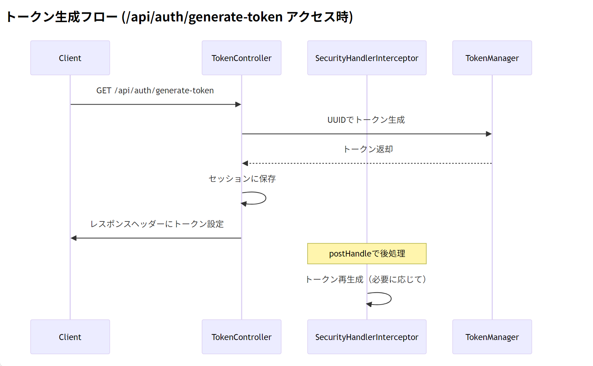

# 各コンポーネントの連携フロー

以下に、各コンポーネントの連携フローを整理します。トークン生成・検証の全体的な流れをステップバイステップで説明します。

### 1. トークン生成フロー (`/api/auth/generate-token` アクセス時)




### 2. バッチジョブ実行フロー (`/api/batch/run-human-resource-job` アクセス時)


### 3. コンポーネント間の依存関係


### 4. 具体的な連携ステップ

#### トークン生成時

1. **クライアント**が`/api/auth/generate-token`にリクエスト
2. **TokenController**が直接トークン生成
   ```java
   String token = UUID.randomUUID().toString();
   request.getSession().setAttribute("_RequestVerificationToken", token);
   response.setHeader("_RequestVerificationToken", token);
   ```
3. **SecurityHandlerInterceptor**の`postHandle`が後処理
   - 必要に応じてトークンを再生成（二重設定防止）

#### バッチジョブ実行時

1. **クライアント**がヘッダーにトークン付与してリクエスト
   ```http
   POST /api/batch/run-human-resource-job
   Headers: _RequestVerificationToken: [token]
   ```
2. **SecurityHandlerInterceptor**の`preHandle`が検証
   ```java
   TokenManager.validate(request, "_RequestVerificationToken", true);
   ```
3. 検証成功時のみ**BatchJobController**の処理実行

#### セキュリティ設定

- **SecurityConfig**で CORS と CSRF を設定
  ```java
  .headers(headers -> headers
      .addHeaderWriter(new StaticHeadersWriter(
          "Access-Control-Expose-Headers",
          "_RequestVerificationToken"
      ))
  )
  ```

### 5. 注意点

1. **トークン競合**:

   - TokenController と Interceptor の両方でトークン生成する場合、二重設定が発生しないようロジックを調整

2. **セッション管理**:

   ```java
   .sessionManagement(session -> session
       .sessionCreationPolicy(SessionCreationPolicy.IF_REQUIRED)
   )
   ```

   セッションが確実に作成されるよう設定

3. **デバッグ方法**:
   ```properties
   # application.properties
   logging.level.com.example.orgchart_api=DEBUG
   logging.level.org.springframework.web=TRACE
   ```

この連携により、以下のセキュリティフローが実現されます：

1. 初回アクセスでトークン生成
2. 重要操作時にトークン検証
3. ワンタイムトークンによる CSRF 対策
4. CORS 対応したヘッダー伝搬
