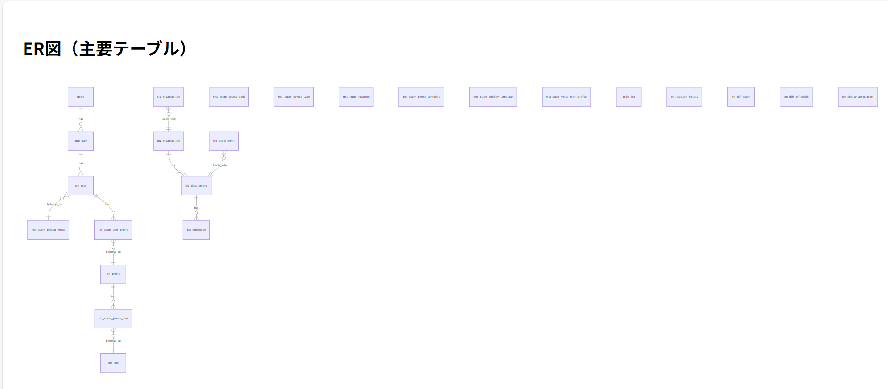

# DDL から要件定義を推測する。

提供された DDL（スキーマ定義：CREATE TABLE など） から、要件定義と基本設計の一部を推測・整理します。

---

## 📌 要件定義（Requirements Definition）

### 1. **システム概要**

- テレフォニー（Cisco Unified Communications Manager: CUCM）と AD 連携、組織・部門・従業員管理を行う統合システム。
- ユーザー認証・権限管理機能あり（一般ユーザ／管理者）。
- 店舗・部門・課などの階層構造を持つ企業組織管理。
- 電話機・内線番号・音声メールなど CUCM 関連設定のマスタ管理。
- 業務データ（組織・部門・従業員）はステージングテーブル → ビジネステーブルへの ETL 処理で運用。
- 履歴管理や監査ログによる変更履歴追跡機能あり。
- オフィスリンク FMC、パスワード変更履歴、差分検出・対応機能も含む。

### 2. **主な機能要件**

| 分野             | 主な機能                                                                       |
| ---------------- | ------------------------------------------------------------------------------ |
| 認証・権限管理   | メールアドレス＋パスワードでのログイン、ロールベースアクセス（user/admin）     |
| 組織管理         | 組織（biz_organization）、部門（biz_department）、従業員（biz_employee）の管理 |
| ステージング管理 | CSV からの一時格納テーブル（stg*系） → バリデーション後 biz*系へ転送           |
| AD 連携          | Active Directory との同期（社員コード、表示名、メール、役職情報）              |
| CUCM 連携        | 電話機・内線・ピックアップグループ・音声メールプロファイルなどの設定管理       |
| ユーザー管理     | 内部ユーザー管理（trn_user）と電話機との紐付け（rel_cucm_user_phone）          |
| 履歴・監査       | 変更履歴保存（history テーブル群）、監査ログ（audit_log）                      |
| 差分検出         | CUCM・OfficeLink との差分検出と対応（trn_diff_cucm, trn_diff_officelink）      |
| 課金関連         | 利用者に対する課金項目の付与・期間管理（trn_charge_association）               |

### 3. **非機能要件**

| 項目         | 内容                                                                 |
| ------------ | -------------------------------------------------------------------- |
| データ整合性 | 外部キー制約、UNIQUE 制約、CHECK 制約により保証                      |
| 性能         | インデックス（idx_trn_user_company など）により高速化を図る          |
| 履歴管理     | mst_branch_history, mst_section_history などで変更履歴を保持         |
| セキュリティ | パスワードハッシュ化（PBKDF2）、ソルト保存、PIN 管理、論理削除フラグ |
| 可用性       | バッチ更新ユーザによる自動更新、BATCH がデフォルト値として設定       |

---

## 📌 基本設計（Basic Design）

### 1. **ER 図構成要素（主要テーブル）**

#### ✅ ユーザー系

- `users`: システム利用者（認証用）
- `app_user`: アプリケーション上のユーザー
- `trn_user`: 電話機・内線に関連するユーザー
- `r_user_section`, `rel_user_section`: ユーザーと店部課の関係

#### ✅ 組織・部門・従業員系

- `biz_organization`: 組織マスタ
- `biz_department`: 部門マスタ
- `biz_employee`: 従業員マスタ
- `stg_organization`, `stg_department`, `stg_employee`: CSV からの ETL 中継テーブル

#### ✅ AD 連携

- `stg_ad`, `biz_ad`: AD 情報の一時・正式格納

#### ✅ CUCM 連携

- `mst_cucm_calling_search_space`: コーリングサーチスペース
- `mst_cucm_device_pool`, `mst_cucm_device_type`, `mst_cucm_location`: CUCM デバイス関連
- `mst_cucm_phone_template`, `mst_cucm_softkey_template`, `mst_cucm_voice_mail_profile`
- `trn_phone`, `trn_line`: 電話機・内線番号
- `rel_cucm_phone_line`, `rel_cucm_user_phone`: 関連テーブル

#### ✅ その他共通マスタ

- `mst_branch`: 店舗マスタ
- `mst_section`: 店部課マスタ
- `mst_shared_nm`: 共有名称
- `rel_branch_section`: 店舗と店部課の関係

#### ✅ 履歴・監査

- `audit_log`: 各テーブルの INSERT/UPDATE/DELETE 操作ログ
- `mst_section_history`, `mst_branch_history`: 変更履歴

#### ✅ 差分・課金

- `trn_diff_cucm`, `trn_diff_officelink`: 差分検出
- `trn_charge_association`: 課金関連情報

---

### 2. **主な外部キー構造**

| テーブル A              | テーブル B                    | 関係内容                       |
| ----------------------- | ----------------------------- | ------------------------------ |
| `trn_phone`             | `mst_cucm_device_pool`        | 電話機 → デバイスポール        |
| `trn_phone`             | `mst_cucm_device_type`        | 電話機 → デバイスタイプ        |
| `trn_phone`             | `mst_cucm_phone_template`     | 電話機 → テンプレート          |
| `trn_phone`             | `mst_cucm_location`           | 電話機 → ロケーション          |
| `mst_cucm_pickup_group` | `mst_branch`                  | ピックアップグループ → 店舗    |
| `mst_cucm_pickup_group` | `mst_section`                 | ピックアップグループ → 部門    |
| `rel_cucm_user_phone`   | `trn_user`                    | ユーザー → 電話機              |
| `rel_cucm_user_phone`   | `trn_phone`                   | ユーザー ← 電話機              |
| `rel_branch_section`    | `mst_branch`                  | 店舗 → 店部課                  |
| `rel_branch_section`    | `mst_section`                 | 店舗 ← 店部課                  |
| `biz_department`        | `biz_department`（自己参照）  | 上位部門との関係               |
| `trn_user`              | `mst_cucm_voice_mail_profile` | 音声メールプロファイルとの関係 |
| `trn_user`              | `mst_cucm_pickup_group`       | ピックアップグループとの関係   |

---

### 3. **主な索引**

- `idx_biz_employee_department`: 部門コードの検索最適化
- `idx_trn_user_company`: 会社コードの検索最適化
- `idx_trn_phone_device`: デバイスタイプ検索の最適化

---

### 4. **セキュリティ設計**

- パスワード：ハッシュ化（PBKDF2）＋ソルト（password_salt）
- PIN コード：8 桁固定（拡張仕様）
- 生年月日：DATE 型に統一
- 論理削除：deleted フラグによる柔軟な削除管理

---

## 📌 補足：改善案・考察点

| 考察点               | 内容                                                                                                                        |
| -------------------- | --------------------------------------------------------------------------------------------------------------------------- |
| 正規化レベル         | 第三正規形まで実施されている。ただし、一部重複カラム（create_date, update_date など）があるため、基底テーブル化の検討も可能 |
| パフォーマンス       | 索引は必要最低限だが、業務テーブルにさらに絞り込み条件用の索引を追加する余地あり                                            |
| 履歴管理             | JSONB 形式で履歴を保存しており、柔軟な復元が可能                                                                            |
| 課金・差分管理       | 専用テーブルにより、各サービスとの連携状況を明確に把握可能                                                                  |
| ユーザー関連テーブル | app_user, trn_user の関係性が不明瞭。ER 図上での位置づけを明確にするべき                                                    |

---

## ✅ まとめ

この DDL（スキーマ定義：CREATE TABLE など） には以下のような特徴があります：

- **多層的な組織構造**（会社・部署・課）を扱う。
- **CUCM との連携**を前提とした電話機・内線・音声メールなどのマスタ管理。
- **ステージング → ビジネステーブル**の ETL 構造。
- **監査ログ・履歴管理**による信頼性向上。
- **AD 同期・OfficeLink 連携**など外部システムとの接続性。

---

もし要件定義書や画面設計、ユースケースなどが追加で提供いただければ、より詳細な設計書や DB 設計書の作成も可能です。お気軽にご相談ください。

---

以下に、提供いただいた**DDL（SQL）**をもとに作成した**要件定義書（Requirements Specification Document）**と**基本設計書（Basic Design Document）**の草案をご提供いたします。

---

# 📄 要件定義書（Requirements Specification Document）

## 1. **イントロダクション**

### 1.1 プロジェクト概要

本システムは、企業組織構造（会社・部署・課・従業員）を管理し、Cisco Unified Communications Manager（CUCM）との連携を通じて電話機・内線番号などの音声通信環境を一元管理するためのシステムです。AD 同期、ステージングデータ処理、履歴管理など、運用監査性にも配慮した設計となっています。

### 1.2 対象範囲

- 組織・部門・従業員情報の管理
- CUCM 関連設定マスタ管理
- AD 同期および認証機能
- 電話機・内線番号の管理
- 履歴・差分検出・課金項目管理

### 1.3 関係者

| 役割           | 担当                          |
| -------------- | ----------------------------- |
| システム管理者 | 内部 IT 担当                  |
| 開発チーム     | アプリケーション開発・DB 設計 |
| テスト担当     | QA チーム                     |
| 最終利用者     | 社内オペレータ／管理者        |

---

## 2. **機能要件**

| 分野             | 機能名                  | 説明                                                       |
| ---------------- | ----------------------- | ---------------------------------------------------------- |
| 認証             | ログイン                | メールアドレス＋パスワードでログイン（users テーブル使用） |
|                  | ロールベースアクセス    | user, admin 権限あり                                       |
| 組織管理         | 組織情報登録            | biz_organization, mst_branch, mst_section                  |
|                  | 部門情報管理            | biz_department（自己参照含む）                             |
|                  | 従業員情報管理          | biz_employee（CSV からの ETL）                             |
| ステージング管理 | CSV データ取込          | stg_organization, stg_department, stg_employee             |
|                  | バリデーション処理      | 正しいフォーマット確認後 biz 系へ転送                      |
| AD 連携          | AD 同期                 | AD 情報の一時保存（stg_ad）→ biz_ad へ反映                 |
|                  | 利用者プロファイル管理  | display_name, mail, position_name など                     |
| CUCM 連携        | 電話機設定              | trn_phone, rel_cucm_user_phone, mst_cucm_device_type       |
|                  | 内線番号管理            | trn_line, rel_cucm_phone_line                              |
|                  | ピックアップグループ    | mst_cucm_pickup_group                                      |
| 差分検出         | CUCM との差分管理       | trn_diff_cucm                                              |
|                  | OfficeLink との差分管理 | trn_diff_officelink                                        |
| 課金管理         | 課金項目付与            | trn_charge_association                                     |
| 履歴管理         | 変更履歴記録            | audit_log, mst_section_history                             |
| 監査ログ         | 操作ログ取得            | 各テーブルへの INSERT/UPDATE/DELETE 操作を記録             |

---

## 3. **非機能要件**

| 項目               | 要求内容                                                        |
| ------------------ | --------------------------------------------------------------- |
| 性能               | 主キー・外部キー制約、インデックスにより高速化                  |
| 可用性             | 自動更新ユーザ「BATCH」による定期処理                           |
| セキュリティ       | パスワードハッシュ化（PBKDF2）、ソルト保存、PIN コード 8 桁対応 |
| データ整合性       | 外部キー制約、UNIQUE 制約、CHECK 制約で保証                     |
| 履歴管理           | JSONB 形式での変更前データ保持（履歴テーブル）                  |
| エラーハンドリング | deleted フラグによる論理削除、差分検出後の自動対応可能設計      |

---

## 4. **外部インターフェース**

| 接続先                                      | 内容                                                       |
| ------------------------------------------- | ---------------------------------------------------------- |
| Active Directory                            | 社員情報の同期                                             |
| Cisco Unified Communications Manager (CUCM) | 電話機・内線番号・ピックアップグループなどの設定取得・反映 |
| OfficeLink FMC                              | FMC 端末との連携                                           |
| CSV ファイル                                | 組織・部門・従業員情報の一括取り込み                       |

---

# 📄 基本設計書（Basic Design Document）

## 1. **全体アーキテクチャ概要**

```
+-------------------+
|     フロントエンド    |
+-------------------+
        ↓
+-------------------+
|   アプリケーション層  |
| （認証・業務処理）    |
+-------------------+
        ↓
+-------------------+
|     データベース層    |
| （PostgreSQL）       |
+-------------------+
```

---

## 2. **ER 図（主要テーブル）**

主なテーブル構成：

```
[users] --(1:N)--> [app_user]
                    ↓
           [trn_user] --(N:1)--> [mst_cucm_pickup_group]
                    ↓
         [rel_cucm_user_phone] --(N:1)--> [trn_phone]
                                               ↓
                             [rel_cucm_phone_line] --(N:1)--> [trn_line]

[biz_organization] --(1:N)--> [biz_department] --(1:N)--> [biz_employee]
        ↓                          ↑
[stg_organization]            [stg_department] ... etc.

[mst_cucm_device_pool]
[mst_cucm_device_type]
[mst_cucm_location]
[mst_cucm_phone_template]
[mst_cucm_softkey_template]
[mst_cucm_voice_mail_profile]

[audit_log]
[mst_section_history]
[trn_diff_cucm]
[trn_diff_officelink]
[trn_charge_association]
```



## 3. **主要テーブル設計（抜粋）**

| テーブル名            | 主なカラム                                           | 説明                         |
| --------------------- | ---------------------------------------------------- | ---------------------------- |
| users                 | id, email, password_hash, role                       | 認証用ユーザー               |
| trn_user              | company_cd, employee_cd, mail_address, pin, birthday | 電話機に関連する内部ユーザー |
| biz_department        | department_cd, parent_department_cd                  | 階層構造を持つ部門情報       |
| trn_phone             | phone_nm, device_type_id, location_id                | 電話機設定                   |
| mst_cucm_pickup_group | pickup_group_nm, branch_cd, section_id               | ピックアップグループ         |
| audit_log             | table_name, operation, old_value, new_value          | 操作履歴                     |
| mst_section_history   | section_id, operation_time, original_data            | 店部課履歴                   |

---

## 4. **主な外部キー構造**

| テーブル A              | テーブル B                    | 関係内容                       |
| ----------------------- | ----------------------------- | ------------------------------ |
| `trn_phone`             | `mst_cucm_device_pool`        | 電話機 → デバイスポール        |
| `trn_phone`             | `mst_cucm_device_type`        | 電話機 → デバイスタイプ        |
| `trn_phone`             | `mst_cucm_phone_template`     | 電話機 → テンプレート          |
| `trn_phone`             | `mst_cucm_location`           | 電話機 → ロケーション          |
| `mst_cucm_pickup_group` | `mst_branch`                  | ピックアップグループ → 店舗    |
| `mst_cucm_pickup_group` | `mst_section`                 | ピックアップグループ → 部門    |
| `rel_cucm_user_phone`   | `trn_user`                    | ユーザー ← 電話機              |
| `rel_cucm_user_phone`   | `trn_phone`                   | ユーザー → 電話機              |
| `rel_branch_section`    | `mst_branch`                  | 店舗 → 店部課                  |
| `rel_branch_section`    | `mst_section`                 | 店舗 ← 店部課                  |
| `biz_department`        | `biz_department`（自己参照）  | 上位部門との関係               |
| `trn_user`              | `mst_cucm_voice_mail_profile` | 音声メールプロファイルとの関係 |
| `trn_user`              | `mst_cucm_pickup_group`       | ピックアップグループとの関係   |

---

## 5. **セキュリティ設計**

| 項目       | 設計内容                                     |
| ---------- | -------------------------------------------- |
| 認証       | メールアドレス＋パスワード（users テーブル） |
| 権限       | user（一般）／admin（管理者）                |
| パスワード | PBKDF2 アルゴリズムでハッシュ化、salt 保存   |
| PIN コード | 8 桁固定                                     |
| 生年月日   | DATE 型                                      |
| 論理削除   | deleted フラグ（true/false）                 |

---

## 6. **索引設計**

| テーブル名   | インデックスカラム | 用途                     |
| ------------ | ------------------ | ------------------------ |
| biz_employee | department_cd      | 部門別検索最適化         |
| trn_user     | company_cd         | 会社別検索最適化         |
| trn_phone    | device_type_id     | デバイスタイプ検索最適化 |

---

## 7. **履歴・監査設計**

| テーブル名          | 内容                                          |
| ------------------- | --------------------------------------------- |
| audit_log           | INSERT/UPDATE/DELETE 操作の記録（JSONB 形式） |
| mst_section_history | 店部課マスタの変更履歴（JSONB 形式）          |
| mst_branch_history  | 店舗マスタの変更履歴（JSONB 形式）            |

---

## ✅ 次工程提案

このドキュメントを基に、以下の詳細設計・実装準備が可能です：

1. **詳細設計書（Detailed Design Document）**

   - 各画面フロー
   - API 仕様
   - サービスレイヤ設計
   - エラー処理設計

2. **DB 設計書（Database Design Document）**

   - 全カラムリスト
   - インデックス設計
   - パフォーマンス改善案

3. **モックアップ設計**

   - UI 画面設計
   - ユーザーアクセスフロー

4. **テスト設計**
   - 単体テストケース
   - 結合テストケース
   - データ整合性チェック設計

---

ご希望があれば、上記のいずれかの文書作成や、ER 図の可視化（PlantUML 形式など）も承ります。お気軽にご相談ください。

---

以下に、**詳細設計書（Detailed Design Document）**、**DB 設計書（Database Design Document）**、**モックアップ設計（UI デザイン案）**、および**テスト設計書（Test Plan & Test Cases）** の草案をそれぞれ提供いたします。

---

# 📄 詳細設計書（Detailed Design Document）

## 1. **概要**

本ドキュメントでは、システムの主要な機能とその内部処理フロー、API 仕様、サービスレイヤ構成、エラー処理などを詳細に記載します。

---

## 2. **画面・機能一覧**

| 画面名              | 機能内容                                        |
| ------------------- | ----------------------------------------------- |
| ログイン画面        | メールアドレス＋パスワードによる認証            |
| 組織管理画面        | biz_organization データの参照・登録・更新・削除 |
| 部門管理画面        | biz_department データの参照・登録・更新・削除   |
| 従業員管理画面      | biz_employee データの参照・CSV 取込・反映       |
| AD 同期画面         | stg_ad → biz_ad への同期処理実行                |
| CUCM 電話機管理画面 | trn_phone, rel_cucm_user_phone の管理           |
| 内線番号管理画面    | trn_line, rel_cucm_phone_line の管理            |
| 履歴閲覧画面        | audit_log, mst_section_history から履歴表示     |

---

## 3. **主な API 仕様**

### 3.1 認証 API

- **POST /api/auth/login**
  - リクエストボディ:
    ```json
    {
      "email": "user@example.com",
      "password": "password"
    }
    ```
  - レスポンス:
    ```json
    {
      "token": "JWT_TOKEN_HERE",
      "role": "user",
      "userId": 1
    }
    ```

### 3.2 組織情報取得 API

- **GET /api/organization**
  - パラメータ: `?companyId=1001`
  - レスポンス:
    ```json
    [
      {
        "organizationId": 1,
        "organizationCd": "ORG001",
        "organizationNm": "本社",
        "printOrder": 1
      }
    ]
    ```

### 3.3 電話機管理 API

- **POST /api/phone**
  - リクエストボディ:
    ```json
    {
      "phoneNm": "SEP001122334455",
      "devicePoolId": 1,
      "deviceTypeId": 1,
      "locationId": 1
    }
    ```

---

## 4. **サービスレイヤ設計**

```
+-----------------------------+
|         Controller Layer     |
| （HTTP APIエンドポイント）   |
+-----------------------------+
            ↓
+-----------------------------+
|          Service Layer       |
| （ビジネスロジック）         |
| - 組織同期処理               |
| - AD同期処理                 |
| - CUCM連携処理               |
+-----------------------------+
            ↓
+-----------------------------+
|         Repository Layer     |
| （DAO、SQLアクセス）         |
+-----------------------------+
```

---

## 5. **エラー処理設計**

| エラーケース         | 対応策                                              |
| -------------------- | --------------------------------------------------- |
| ログイン失敗         | 5 回連続失敗でロックアウト（1 時間）                |
| CSV フォーマット不正 | 取込時にエラーログ出力、対象レコードスキップ        |
| 外部キー違反         | トランザクションロールバック、ログ出力              |
| 差分検出あり         | 差分ログに記録し、手動修正指示                      |
| データ重複           | UNIQUE 制約により INSERT 不可、エラーメッセージ表示 |

---

## 6. **セッション管理**

- JWT トークンを使用してステートレス認証
- トークン有効期限：1 時間（リフレッシュトークン対応可）
- クッキー保存（HttpOnly + Secure）

---

## 7. **非同期処理設計**

- 定期バッチ（BATCH ユーザ）による ETL 処理（stg*→biz*テーブル）
- 差分検出バッチ（CUCM ↔ DB 比較）
- 監査ログ自動記録（トリガ or アプリケーション層で共通化）

---

# 📄 DB 設計書（Database Design Document）

## 1. **全カラムリスト（抜粋）**

| テーブル名            | カラム名        | 型           | NULL 可否     | 制約                         | コメント                      |
| --------------------- | --------------- | ------------ | ------------- | ---------------------------- | ----------------------------- |
| users                 | id              | SERIAL       | NOT NULL      | PK                           | ユーザー ID                   |
| users                 | email           | TEXT         | NOT NULL      | UNIQUE                       | メールアドレス（ログイン ID） |
| users                 | password_hash   | TEXT         | NOT NULL      | -                            | PBKDF2 ハッシュ値             |
| users                 | role            | TEXT         | NOT NULL      | CHECK (IN ('user', 'admin')) | ロール                        |
| trn_user              | company_cd      | VARCHAR(3)   | NOT NULL      | FK                           | 会社コード                    |
| trn_user              | employee_cd     | VARCHAR(7)   | NOT NULL      | FK                           | 社員コード                    |
| trn_user              | pin             | VARCHAR(8)   | NOT NULL      | -                            | PIN コード                    |
| trn_user              | birthday        | DATE         | NOT NULL      | -                            | 生年月日                      |
| trn_user              | deleted         | BOOLEAN      | DEFAULT FALSE | -                            | 論理削除フラグ                |
| trn_phone             | phone_nm        | VARCHAR(100) | NOT NULL      | UNIQUE                       | 電話機名                      |
| trn_phone             | device_type_id  | INTEGER      | NOT NULL      | FK                           | デバイスタイプ ID             |
| trn_phone             | location_id     | INTEGER      | NOT NULL      | FK                           | ロケーション ID               |
| mst_cucm_pickup_group | pickup_group_nm | VARCHAR(19)  | NOT NULL      | UNIQUE                       | ピックアップグループ名        |
| mst_cucm_pickup_group | branch_cd       | VARCHAR(3)   | NOT NULL      | FK                           | 店舗コード                    |
| mst_cucm_pickup_group | section_id      | INTEGER      | NOT NULL      | FK                           | 店部課 ID                     |

---

## 2. **索引設計**

| テーブル名   | インデックスカラム | 用途                     |
| ------------ | ------------------ | ------------------------ |
| biz_employee | department_cd      | 部門別検索最適化         |
| trn_user     | company_cd         | 会社別検索最適化         |
| trn_phone    | device_type_id     | デバイスタイプ検索最適化 |
| mst_section  | organization_cd    | 組織別検索最適化         |

---

## 3. **JSONB 履歴設計**

```sql
CREATE TABLE public.mst_section_history (
    history_id BIGSERIAL PRIMARY KEY,
    section_id INTEGER NOT NULL REFERENCES public.mst_section(section_id),
    operation VARCHAR(10) NOT NULL CHECK (operation IN ('INSERT','UPDATE','DELETE')),
    operation_time TIMESTAMP WITHOUT TIME ZONE DEFAULT CURRENT_TIMESTAMP NOT NULL,
    original_data JSONB NOT NULL
);
```

- `original_data`: 変更前のレコード情報を JSON 形式で保存

---

## 4. **監査ログ設計**

```sql
CREATE TABLE public.audit_log (
    log_id BIGSERIAL PRIMARY KEY,
    table_name VARCHAR(50) NOT NULL,
    record_id VARCHAR(50) NOT NULL,
    operation VARCHAR(10) NOT NULL CHECK (operation IN ('INSERT','UPDATE','DELETE')),
    old_value JSONB,
    new_value JSONB,
    executed_by VARCHAR(50) NOT NULL DEFAULT 'BATCH',
    executed_at TIMESTAMP WITHOUT TIME ZONE DEFAULT CURRENT_TIMESTAMP NOT NULL
);
```

- 各操作の変更前後情報を記録

---

# 📄 モックアップ設計（UI デザイン案）

## 1. **ログイン画面（Login Page）**

```
┌──────────────────────┐
│           ログイン                  │
├──────────────────────┤
│ メールアドレス： [________________] │
│ パスワード：     [________________] │
│ [ログイン]       [パスワード忘れ]     │
└──────────────────────┘
```

## 2. **組織管理画面（Organization Management）**

```
┌──────────────────────┐
│           組織一覧                  │
├──────────────────────┤
│ 組織コード │ 組織名 │ 印刷順序 │ 更新者 │ 更新日時 │
├──────────────────────┤
│ ORG001   │ 本社     │ 1       │ BATCH  │ 2024-04-01 │
└──────────────────────┘
[新規登録] [編集] [削除]
```

## 3. **電話機管理画面（Phone Management）**

```
┌──────────────────────┐
│           電話機一覧                │
├──────────────────────┤
│ 電話機名       │ デバイスタイプ │ ロケーション │ 割当ユーザー │
├──────────────────────┤
│ SEP001122334455 │ Cisco 7960   │ Tokyo     │ userA       │
└──────────────────────┘
[新規登録] [編集] [削除]
```

---

# 📄 テスト設計書（Test Plan & Test Cases）

## 1. **テスト計画概要**

| 項目       | 内容                                            |
| ---------- | ----------------------------------------------- |
| テスト工程 | 単体テスト → 結合テスト → システムテスト        |
| テスト方法 | 手動テスト＋自動化テスト（JUnit + Selenium）    |
| テスト環境 | Docker 上で構築された開発用 DB + ローカルアプリ |

---

## 2. **単体テストケース例**

| テスト項目     | 入力                     | 期待結果                                  |
| -------------- | ------------------------ | ----------------------------------------- |
| ログイン成功   | 正しいメール＋パスワード | 成功、JWT トークン返却                    |
| ログイン失敗   | 間違ったパスワード       | 401 Unauthorized                          |
| 電話機登録     | 正しいパラメータ         | INSERT 成功                               |
| 電話機登録失敗 | 既存 phone_nm            | UNIQUE 制約エラー                         |
| CSV 取込       | 正しい CSV               | stg\_テーブルへ INSERT、バリデーション OK |
| CSV 取込失敗   | 不正フォーマット         | エラーログ出力、該当レコード無視          |

---

## 3. **結合テストケース例**

| テスト項目                 | 内容                                                  |
| -------------------------- | ----------------------------------------------------- |
| AD 同期処理                | stg_ad → biz_ad への反映処理確認                      |
| 組織階層参照               | biz_organization → biz_department → biz_employee 表示 |
| CUCM 差分検出              | trn_phone ↔ CUCM のデータ比較、差分検出ログ記録       |
| ユーザー削除時の電話機解除 | rel_cucm_user_phone が論理削除されるか確認            |

---

## 4. **性能テスト・負荷テスト**

| テスト項目       | 内容                                                       |
| ---------------- | ---------------------------------------------------------- |
| 大量データ処理   | 10 万件の従業員データを stg_employee → biz_employee へ転送 |
| 多重同時アクセス | 100 並列での trn_user 更新処理（排他制御確認）             |

---

## ✅ 次工程提案

この先は以下の通り進められます：

1. **ER 図の可視化（PlantUML 形式など）**
2. **API インターフェース定義書（OpenAPI/Swagger 形式）**
3. **Spring Boot ベースの雛形コード生成**
4. **CI/CD パイプライン設計（GitHub Actions／GitLab CI）**
5. **Docker コンテナ設計（PostgreSQL ＋アプリケーションサーバ）**

---

必要であれば、上記のいずれかの作成も承ります。お気軽にご相談ください。
