# ER 図

> ### 1. **組織・部門・従業員階層**

```mermaid
erDiagram
    biz_organization ||--o{ mst_section : "1対多"
    biz_department ||--o{ biz_department : "自己参照（親子関係）"
    biz_department ||--o{ biz_employee : "1対多"
    mst_section ||--o{ biz_employee : "1対多（非直接）"
      biz_organization {
        VARCHAR(17) organization_cd PK
        VARCHAR(100) organization_nm
    }
    mst_section {
        INTEGER section_id PK
        VARCHAR(3) company_cd
        VARCHAR(5) section_cd
        VARCHAR(17) organization_cd FK
    }
    biz_department {
        VARCHAR(3) company_cd
        VARCHAR(5) department_cd PK
        VARCHAR(5) parent_department_cd FK
    }
    biz_employee {
        VARCHAR(3) company_cd
        VARCHAR(7) employee_cd PK
        VARCHAR(5) department_cd
    }
```


> ### 2. **ユーザー管理システム**

```mermaid
erDiagram
    users ||--o{ trn_user : "アプリ認証"
    biz_employee ||--o{ trn_user : "1対1"
    biz_employee ||--o{ app_user : "1対1"
    trn_user ||--o{ trn_password_change_tracking : "1対多"
      users {
        INTEGER id PK
        TEXT email
    }
    biz_employee {
        VARCHAR(7) employee_cd PK
    }
    trn_user {
        INTEGER user_id PK
        VARCHAR(3) company_cd
        VARCHAR(7) employee_cd
    }
    app_user {
        INTEGER app_user_id PK
        VARCHAR(7) biz_employee_id
    }
```


> ### 3. **CUCM 電話システム**

```mermaid
erDiagram
    mst_cucm_device_type ||--o{ mst_cucm_phone_template : "1対多"
    mst_cucm_device_type ||--o{ mst_cucm_softkey_template : "1対多"
    trn_phone }|--|| mst_cucm_device_pool : "多対1"
    trn_phone }|--|| mst_cucm_device_type : "多対1"
    trn_phone }|--|| mst_cucm_phone_template : "多対1"
    trn_phone }|--|| mst_cucm_location : "多対1"
    trn_line }|--|| mst_cucm_calling_search_space : "多対1"
    rel_cucm_phone_line }|--|| trn_phone : "多対1"
    rel_cucm_phone_line }|--|| trn_line : "多対1"
    rel_cucm_user_phone }|--|| trn_user : "多対1"
    rel_cucm_user_phone }|--|| trn_phone : "多対1"
      mst_cucm_device_type {
        INTEGER device_type_id PK
    }
    mst_cucm_phone_template {
        INTEGER phone_template_id PK
        INTEGER device_type_id FK
    }
    trn_phone {
        INTEGER phone_id PK
        INTEGER device_pool_id FK
        INTEGER device_type_id FK
        INTEGER phone_template_id FK
        INTEGER location_id FK
    }
    trn_line {
        INTEGER line_id PK
        INTEGER cucm_calling_search_space_id FK
    }
    rel_cucm_phone_line {
        INTEGER phone_line_id PK
        INTEGER phone_id FK
        INTEGER line_id FK
    }
    rel_cucm_user_phone {
        INTEGER user_phone_id PK
        INTEGER user_id FK
        INTEGER phone_id FK
    }
```


> ### 4. **バッチ処理フロー**

```mermaid
flowchart TD
    stg_organization -->|バッチ処理| biz_organization
    stg_department -->|バッチ処理| biz_department
    stg_employee -->|バッチ処理| biz_employee
    stg_ad -->|バッチ処理| biz_ad
    stg_shift -->|バッチ処理| biz_shift
    biz_employee -->|データ連携| trn_user
    biz_ad -->|データ連携| trn_user
```

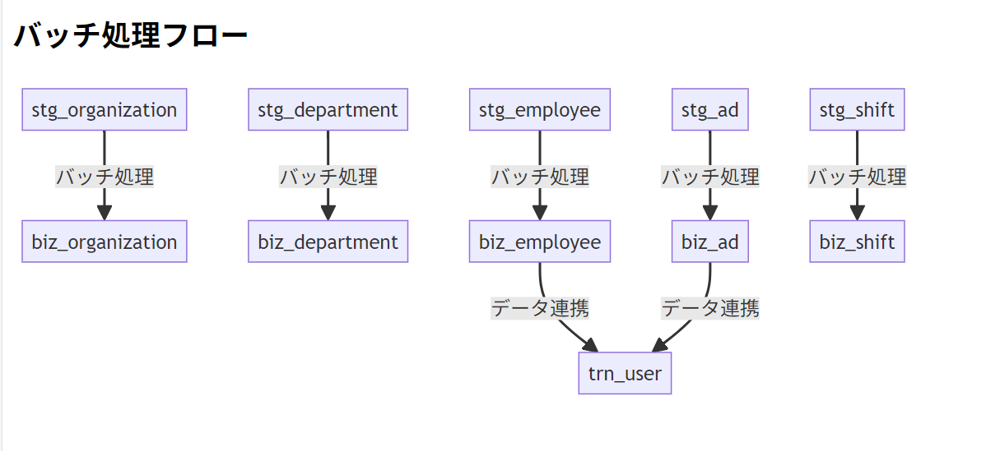


> ### 5. **監査・履歴システム**

```mermaid
erDiagram
    audit_log ||--o{ mst_branch_history : "汎用監査"
    mst_section ||--o{ mst_section_history : "履歴専用"
    trn_user ||--o{ trn_password_change_tracking : "パスワード変更追跡"
      audit_log {
        BIGINT log_id PK
        VARCHAR(50) table_name
    }
    mst_section_history {
        BIGINT history_id PK
        INTEGER section_id FK
    }
    trn_password_change_tracking {
        INTEGER tracking_id PK
        INTEGER user_id FK
    }
```


> ### 6. **店舗・店部課関連**

```mermaid
erDiagram
    mst_branch ||--o{ rel_branch_section : "1対多"
    mst_section ||--o{ rel_branch_section : "1対多"
    mst_section ||--o{ mst_cucm_pickup_group : "1対多"
      mst_branch {
        INTEGER branch_id PK
    }
    mst_section {
        INTEGER section_id PK
    }
    rel_branch_section {
        INTEGER branch_section_id PK
        INTEGER branch_id FK
        INTEGER section_id FK
    }
    mst_cucm_pickup_group {
        INTEGER pickup_group_id PK
        INTEGER section_id FK
    }
```

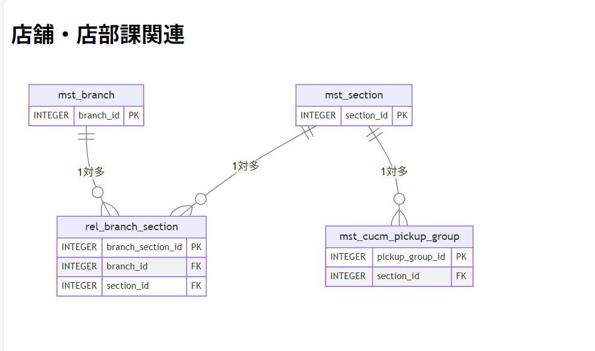

> ### 全体のデータフロー

```mermaid
flowchart LR
    AD[Active Directory] -->|データ取り込み| stg_ad
    HR[人事システム] -->|データ取り込み| stg_organization
    HR --> stg_department
    HR --> stg_employee
    stg_organization --> biz_organization
    stg_department --> biz_department
    stg_employee --> biz_employee
    stg_ad --> biz_ad
    biz_employee --> trn_user
    biz_ad --> trn_user
    trn_user --> CUCM[CUCMシステム]
    trn_user --> OfficeLink[OfficeLink]
```


> この構造により：

- 基幹システム（人事/AD）からステージングを経てビジネステーブルへデータ連携
- ビジネステーブルから電話システム（CUCM/OfficeLink）向けトランザクションデータ生成
- 全変更は監査テーブルで追跡
  という流れが実現されています。

以下にデータベース全体の関係性を体系化して整理します。主要エンティティとその関連性を中心に、階層構造で説明します。

### 全体関係図


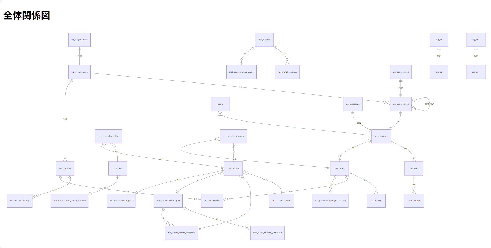


### 主要エンティティの詳細関係

#### 1. 組織構造階層

```mermaid
flowchart TD
    A[biz_organization] --> B[mst_section]
    A --> C[biz_department]
    C --> D[biz_employee]
    C --> C[自己参照: 親子階層]
    B --> E[rel_branch_section]
    E --> F[mst_branch]
```


#### 2. ユーザー認証フロー


#### 3. CUCM 電話システム構成


#### 4. データ連携フロー

```mermaid
flowchart TB
    ext[外部システム] --> stg[ステージングテーブル]
    stg --> biz[ビジネステーブル]
    biz --> trn[トランザクションテーブル]
    trn --> cucm[CUCMシステム]
    trn --> officelink[OfficeLink]

    subgraph stg [ステージング]
        stg_organization
        stg_department
        stg_employee
        stg_ad
        stg_shift
    end

    subgraph biz [ビジネス]
        biz_organization
        biz_department
        biz_employee
        biz_ad
        biz_shift
    end

    subgraph trn [トランザクション]
        trn_user
        trn_phone
        trn_line
        trn_officelink_fmc
    end
```


### 主要リレーションシップの説明

1. **組織-部門-従業員**

   - `biz_organization` → `mst_section` (1:N)
   - `biz_department` → `biz_employee` (1:N)
   - `biz_department` 自己参照で階層構造を実現

2. **認証連携**

   - `biz_employee`が基幹情報となり、`trn_user`(電話システム)と`app_user`(アプリケーション)に展開
   - `users`テーブルは Spring Security 認証専用

3. **CUCM 構成**

   - 電話機(`trn_phone`)は 4 つのマスタテーブルを参照
   - リレーションテーブルで「電話機-内線」「ユーザー-電話機」を多対多で関連付け

4. **店部課管理**

   - `mst_section`を中心に、`rel_user_section`でユーザー所属を管理
   - `rel_branch_section`で店舗と店部課を関連付け

5. **バッチ処理**

   - 全ステージングテーブル(`stg_*`)は対応するビジネステーブル(`biz_*`)に 1:1 で変換
   - バッチ実行後、トランザクションテーブルで運用データを管理

6. **変更管理**
   - `audit_log`で全テーブルの変更を監査
   - `*_history`テーブルで重要なマスタの変更履歴を保持
   - `trn_diff_*`テーブルでシステム間差分を管理

## この構造により、人事データを基盤とし、電話システム・アプリケーション認証・組織管理が連携する統合データモデルが構築されています。特に CUCM 関連のテーブル群が複雑に連携している点が特徴的です。

---

## ✅ Mermaid のシーケンス図を **SVG 画像に変換**するには、以下のような方法があります。目的や環境によっておすすめが異なりますので、順を追って説明します。

---

## ✅ 方法一覧（おすすめ順）

| 方法                                                 | 特徴                                                    |
| ---------------------------------------------------- | ------------------------------------------------------- |
| ① [Mermaid Live Editor](https://mermaid.live) を使う | **一番簡単**。描いた図をその場で SVG エクスポートできる |
| ② `mmdc` CLI ツール（Mermaid CLI）を使う             | **ローカルで変換できる**。バッチ処理も可能              |
| ③ VS Code + Mermaid プラグイン                       | VS Code 内で編集＆SVG 出力可能                          |
| ④ Puppeteer + Mermaid 手動描画 → SVG 抽出            | Node.js スクリプトによる自動化に使える（上級者向け）    |

---

## ✅ 方法 ①：**Mermaid Live Editor を使う（最も簡単）**

1. 公式サイトへアクセス
   👉 [https://mermaid.live](https://mermaid.live)

2. 左のエディタに以下を貼り付けます：

```mermaid
sequenceDiagram
    participant F as フロント (React)
    participant C as BatchJobController
    participant S as BatchJobService
    participant B as Spring Batch (JobLauncher)
    participant W as LoadStaffInfoWriter
    participant E as GlobalExceptionHandler
    participant R as Repository (JobExplorer)

    title ジョブID ライフサイクル管理フロー

    F->>C: POST /api/batch/run-human-resource-job
    activate C
    ...
    opt エラー発生時
        C->>E: throw new EntityNotFoundException("指定されたジョブIDは存在しません")
        E-->>F: ResponseEntity.status(HttpStatus.NOT_FOUND).body(ApiResponse.error(...))
    end
```

3. 表示された図の右上メニューから：

👉 **\[Download > SVG]** を選択すると、SVG として保存できます。

---

## ✅ 方法 ②：CLI で変換（大量生成や自動処理向け）

1. Node.js をインストール済みであることを確認

2. Mermaid CLI をインストール

```bash
npm install -g @mermaid-js/mermaid-cli
```

3. `.mmd` ファイルを用意（例：`diagram.mmd`）

```mmd
sequenceDiagram
    participant A as ユーザー
    participant B as サーバー
    A->>B: リクエスト送信
    B-->>A: レスポンス返却
```

4. SVG に変換：

```bash
mmdc -i diagram.mmd -o diagram.svg
```

---

## ✅ 方法 ③：VS Code 内で SVG として保存

1. VS Code に以下拡張をインストール：

   - [Markdown Preview Mermaid Support](https://marketplace.visualstudio.com/items?itemName=bierner.markdown-mermaid)

2. `.mmd` or `.md` ファイルを作成して Mermaid 記法を記入

3. プレビュー表示して右クリック → SVG 保存

---

## ✅ どれを使うべき？

| 目的                            | おすすめ                      |
| ------------------------------- | ----------------------------- |
| 一度だけ、簡単に SVG を作りたい | ✅ 方法 ① Mermaid Live Editor |
| 複数図を自動変換したい          | ✅ 方法 ② Mermaid CLI         |
| VS Code で作業したい            | ✅ 方法 ③ Mermaid プラグイン  |

---

## ✅ 最後に

必要であれば、あなたの現在の Mermaid コード（ライフサイクル図）を `.mmd` ファイルに変換したサンプルをこちらで用意することもできます。ご希望があればお知らせください。

## ✅ html サンプル

```html
<!DOCTYPE html>
<html lang="ja">
  <head>
    <meta charset="UTF-8" />
    <title>組織・部門・従業員階層</title>
    <script src="https://cdn.jsdelivr.net/npm/mermaid@10/dist/mermaid.min.js"></script>
    <script>
      window.addEventListener("DOMContentLoaded", () => {
        mermaid.initialize({ startOnLoad: true, theme: "default" });
      });
    </script>
  </head>
  <body>
    <h2>組織・部門・従業員階層</h2>

    <pre class="mermaid">
erDiagram
    audit_log ||--o{ mst_branch_history : "汎用監査"
    mst_section ||--o{ mst_section_history : "履歴専用"
    trn_user ||--o{ trn_password_change_tracking : "パスワード変更追跡"
      audit_log {
        BIGINT log_id PK
        VARCHAR(50) table_name
    }
    mst_section_history {
        BIGINT history_id PK
        INTEGER section_id FK
    }
    trn_password_change_tracking {
        INTEGER tracking_id PK
        INTEGER user_id FK
    }
  </pre
    >
  </body>
</html>
```
