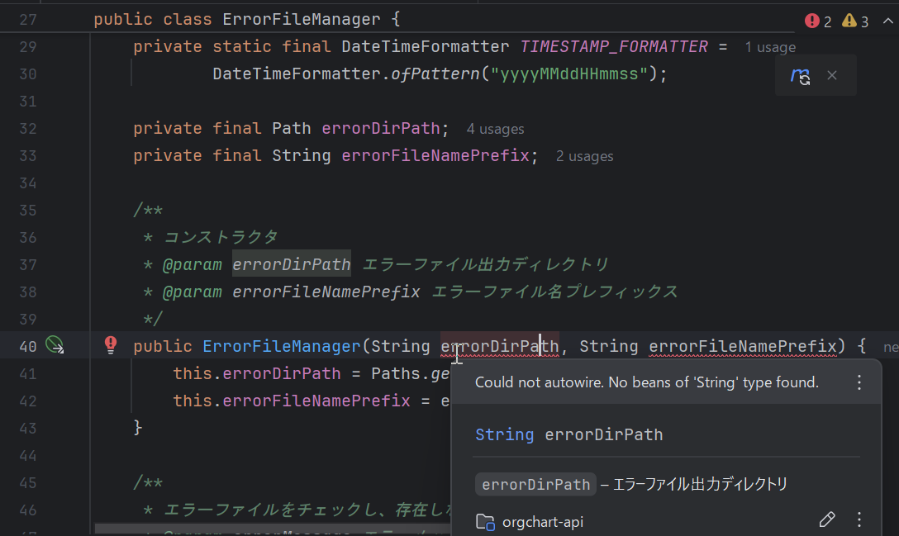

# Bean 登録問題の解決

`src/main/java/com/example/orgchart_api/batch/persistence/ErrorMailMapper.java`

- 以下のエラーが発生

### 「Could not autowire. No beans of 'String' type found. 」



#### 已深度思考

> このエラーは、Spring が`ErrorFileManager`のコンストラクタを自動注入（autowire）しようとしたが、必要な String 型のビーン（`errorDirPath`と`errorFileNamePrefix`）がコンテキストに存在しないために発生しています。

### エラーが発生する理由と解決策

| 問題点                               | 原因                                        | 解決策                                   |
| ------------------------------------ | ------------------------------------------- | ---------------------------------------- |
| **Could not autowire**               | Spring が String 型の bean を見つけられない | `@Value`アノテーションでプロパティを注入 |
| **No beans of 'String' type**        | 文字列リテラルは Spring で管理されない      | 設定ファイルから値を読み込む             |
| **コンストラクタパラメータ解決不可** | 依存性注入の設定がない                      | プロパティ経由で値を渡す                 |

#### 已深度思考

> エラーメッセージ「Could not autowire. No beans of 'String' type found.」は、ErrorFileManager のコンストラクタが 2 つの String 引数を要求しているが、Spring がそれらを注入できないために発生しています。
> 解決策としては、ErrorFileManager のコンストラクタ引数を Spring のプロパティから注入するように設定します。具体的には、@Value アノテーションを使用してプロパティキーを指定します。
> ただし、現在の BatchConfig クラスでは、OS 依存のプロパティを共通キー（例: InputDir）にマッピングしています。したがって、ErrorFileManager に必要なプロパティ（エラーファイル出力ディレクトリとファイル名プレフィックス）も、同様にプロパティファイルで定義し、共通キーでアクセスできるようにする必要があります。
> 以下に修正案を示します。
>
> 1. プロパティファイルに ErrorFileManager 用の設定を追加します。
> 2. ErrorFileManager のコンストラクタに@Value アノテーションを追加して、プロパティを注入します。
>    修正例：
>    **ErrorFileManager.java**

```java
@Component
public class ErrorFileManager {
    // ... 既存のコード ...
 >     public ErrorFileManager(
            @Value("${batch.error.dir}") String errorDirPath,
            @Value("${batch.error.file-prefix}") String errorFileNamePrefix) {
        this.errorDirPath = Paths.get(errorDirPath);
        this.errorFileNamePrefix = errorFileNamePrefix;
    }
 >     // ... 既存のコード ...
}
```

> **environment.properties (例)**

```properties
# エラーファイル設定
batch.error.dir=/var/log/batch/errors
batch.error.file-prefix=error_log
```

> しかし、BatchConfig クラスでは OS 依存のプロパティを共通キーにマッピングしています。ErrorFileManager の設定も OS 依存にする必要があるかどうかは要件によります。もし OS 依存の設定にする場合、プロパティキーを`batch.error.dir.Win32`と`batch.error.dir.Linux`のように定義し、BatchConfig で共通キー`batch.error.dir`にマッピングする必要があります。
> ただし、ErrorFileManager の設定を OS 依存にしない場合は、上記の単純な@Value 注入で問題ありません。
> ここでは、ErrorFileManager の設定を OS 依存にしないと仮定して進めます（エラーログの出力先は OS によって変えないと想定）。もし OS 依存にする場合は、BatchConfig のマッピング対象に追加する必要があります。
> また、BatchConfig クラスでは、OS 依存のプロパティをマッピングしていますが、`batch.error.dir`や`batch.error.file-prefix`は OS 依存のキーではないので、そのまま props に設定されます。
> したがって、ErrorFileManager のコンストラクタを上記のように@Value で修正すれば、Spring はプロパティから値を注入できるようになります。
> もし、ErrorFileManager の設定を OS 依存にしたい場合は、以下のようにします。
> **environment.properties**

```properties
# OS固有の設定
batch.error.dir.Win32=C:\\logs\\errors
batch.error.dir.Linux=/var/log/batch/errors
batch.error.file-prefix=error_log  # ファイルプレフィックスはOS依存でないとする
```

> そして、BatchConfig クラスのマッピング対象に`batch.error.dir`を追加します（現在の実装では、プロパティ名が`.Win32`または`.Linux`で終わるものだけをマッピングしているので、`batch.error.dir`がマッピング対象になります）。
> ただし、現在の BatchConfig の実装では、プロパティ名の最後が`.Win32`または`.Linux`で終わる場合にのみ、基本キー（サフィックスを除いた部分）にマッピングしています。したがって、`batch.error.dir.Win32`というプロパティがあれば、`batch.error.dir`というキーで値が設定されます。
> ErrorFileManager では、`@Value("${batch.error.dir}")`で注入できるようになります。
> しかし、ErrorFileManager のコンストラクタ引数が 2 つとも String であるため、Spring はプロパティから値を取得して注入します。
> まとめると、以下のいずれかの方法を取ります。
> **方法 1: OS 依存にしない場合**

- プロパティファイルに共通の設定を記述
- ErrorFileManager のコンストラクタを@Value で修飾
  > **方法 2: OS 依存にする場合**
- プロパティファイルに OS 依存の設定を記述（例: `batch.error.dir.Win32`, `batch.error.dir.Linux`）
- BatchConfig のマッピングにより共通キー`batch.error.dir`が設定される
- ErrorFileManager では`@Value("${batch.error.dir}")`で注入
  > 今回は、ErrorFileManager の設定を OS 依存にしないと仮定して、方法 1 で進めます。
  > ErrorFileManager の修正：

```java
@Component
public class ErrorFileManager {
    // ... 既存のコード ...
 >     public ErrorFileManager(
            @Value("${batch.error.dir}") String errorDirPath,
            @Value("${batch.error.file-prefix}") String errorFileNamePrefix) {
        this.errorDirPath = Paths.get(errorDirPath);
        this.errorFileNamePrefix = errorFileNamePrefix;
    }
 >     // ... 既存のコード ...
}
```

> また、プロパティファイル（environment.properties）に以下を追加：

```properties
batch.error.dir=/var/log/batch/errors
batch.error.file-prefix=error_log
```

> これで、Spring はプロパティから値を取得して ErrorFileManager のコンストラクタに注入できるようになり、エラーは解消されます。
> もし、BatchConfig クラスで OS 依存のマッピングをしているために、ErrorFileManager で使用するプロパティがマッピングの対象外であれば、BatchConfig の修正は不要です（ErrorFileManager 用のプロパティは OS 依存ではないため）。
> ただし、BatchConfig クラスで OS 依存のプロパティをマッピングする際に、元のプロパティ（OS 依存のサフィックスがついていないもの）を上書きしている点に注意してください。ErrorFileManager 用のプロパティが OS 依存のマッピング対象となるキー（例えば、`batch.error.dir`というキーが OS 依存のマッピングで上書きされる）と重複する場合は、意図しない値が注入される可能性があります。その場合は、プロパティキーの命名を注意深く行う必要があります。
> 今回のケースでは、ErrorFileManager 用のプロパティキーを`batch.error.dir`と`batch.error.file-prefix`とし、これらは OS 依存のマッピング対象とはしないため、問題ありません。
> 以上でエラーは解消されるはずです。

`ErrorFileManager` の依存性注入エラーを解決するために、`BatchConfig` クラスを修正します。問題は Spring が `String` 型のビーンを自動注入できないことです。以下の手順で解決します：

### 修正後の BatchConfig クラス

#### (src/main/java/com/example/orgchart_api/config/BatchConfig.java)

```java
package com.example.orgchart_api.config;

import com.example.orgchart_api.batch.util.BatchSettings;
import com.example.orgchart_api.batch.util.ErrorFileManager;
import org.springframework.context.annotation.Bean;
import org.springframework.context.annotation.Configuration;
import org.springframework.core.env.AbstractEnvironment;
import org.springframework.core.env.Environment;
import org.springframework.core.env.MutablePropertySources;

import java.util.Properties;

@Configuration
public class BatchConfig {

    private final Environment env;

    public BatchConfig(Environment env) {
        this.env = env;
    }

    @Bean
    public BatchSettings batchSettings() {
        return new BatchSettings(collectAllProperties());
    }

    @Bean
    public Properties applicationProperties() {
        return collectAllProperties();
    }

    // ErrorFileManager をビーンとして定義
    @Bean
    public ErrorFileManager errorFileManager(BatchSettings batchSettings) {
        String errorDir = batchSettings.getOutPutErrFileDir(); // プロパティから取得
        String errorPrefix = batchSettings.getOutPutErrFileNm(); // プロパティから取得
        return new ErrorFileManager(errorDir, errorPrefix);
    }

    private Properties collectAllProperties() {
        Properties props = new Properties();
        MutablePropertySources propertySources = ((AbstractEnvironment) env).getPropertySources();

        // OSを判別
        boolean isWindows = System.getProperty("os.name").toLowerCase().contains("win");
        String osSuffix = isWindows ? ".Win32" : ".Linux";

        propertySources.stream()
            .filter(ps -> ps instanceof org.springframework.core.env.EnumerablePropertySource)
            .forEach(ps -> {
                org.springframework.core.env.EnumerablePropertySource<?> enumerablePs =
                        (org.springframework.core.env.EnumerablePropertySource<?>) ps;

                for (String propName : enumerablePs.getPropertyNames()) {
                    Object value = enumerablePs.getProperty(propName);
                    if (value != null) {
                        // OS依存プロパティを解決
                        if (propName.endsWith(".Win32") || propName.endsWith(".Linux")) {
                            if (propName.endsWith(osSuffix)) {
                                // 基本キー名に変換 (例: InputDir.Win32 -> InputDir)
                                String baseKey = propName.substring(0, propName.lastIndexOf('.'));
                                props.setProperty(baseKey, value.toString());
                            }
                        } else {
                            props.setProperty(propName, value.toString());
                        }
                    }
                }
            });

        return props;
    }
}
```

### BatchSettings クラスに追加するメソッド

`BatchSettings` クラスにエラーファイル関連のプロパティアクセサを追加します：

#### (src/main/java/com/example/orgchart_api/batch/util/BatchSettings.java)

```java
public class BatchSettings {
    // ... 既存のコード ...

    public String getOutPutErrFileDir() {
        return getOsDependentProperty("OutputErrFileDir", "OutputErrFileDir");
    }

    public String getOutPutErrFileNm() {
        return getRequiredProperty("OutputErrFileNm", "OutputErrFileNm");
    }
}
```

### environment.properties に追加する設定

#### (src/main/resources/environment.properties)

```properties
# エラーファイル設定
OutputErrFileDir.Win32=C:\\logs\\errors
OutputErrFileDir.Linux=/var/log/batch/errors
OutputErrFileNm=system_error
```

### 変更点の説明

1. **ErrorFileManager ビーンの定義追加**:

#### (src/main/java/com/example/orgchart_api/batch/util/ErrorFileManager.java)

```java
@Bean
public ErrorFileManager errorFileManager(BatchSettings batchSettings) {
    String errorDir = batchSettings.getOutPutErrFileDir();
    String errorPrefix = batchSettings.getOutPutErrFileNm();
    return new ErrorFileManager(errorDir, errorPrefix);
}
```

- `BatchSettings` を依存関係として注入
- プロパティからエラーファイルのディレクトリとプレフィックスを取得
- `ErrorFileManager` インスタンスを生成して返却

2. **BatchSettings の拡張**:

   ```java
   public String getOutPutErrFileDir() {
       return getOsDependentProperty("OutputErrFileDir", "OutputErrFileDir");
   }

   public String getOutPutErrFileNm() {
       return getRequiredProperty("OutputErrFileNm", "OutputErrFileNm");
   }
   ```

   - OS 依存のディレクトリパス取得メソッド
   - 固定のファイル名プレフィックス取得メソッド

3. **プロパティ設定の追加**:
   ```properties
   OutputErrFileDir.Win32=C:\\logs\\errors
   OutputErrFileDir.Linux=/var/log/batch/errors
   OutputErrFileNm=system_error
   ```
   - OS ごとのディレクトリパスを設定
   - エラーファイル名のプレフィックスを設定

### 依存関係の流れ

```
ApplicationContext
├── Environment
├── BatchConfig
│   ├── batchSettings() → BatchSettings インスタンス
│   └── errorFileManager() → ErrorFileManager インスタンス
│       ├── 引数1: batchSettings.getOutPutErrFileDir()
│       └── 引数2: batchSettings.getOutPutErrFileNm()
└── Other Beans...
```

### 解決される問題点

1. **文字列ビーンの欠如**:

   - `String` 型の直接的なビーン定義を回避
   - プロパティ値は `BatchSettings` 経由で取得

2. **OS 依存設定の統合**:

   - 既存の OS 判別ロジックを再利用
   - エラーファイルのパスも OS ごとに自動切り替え

3. **設定の一元管理**:
   - 全てのプロパティを `environment.properties` で管理
   - ビジネスロジックから設定詳細を分離

この修正により、Spring の依存性注入システムが正しく機能し、`ErrorFileManager` が必要なパラメータを適切に受け取れるようになります。`BatchSettings` クラスの既存のプロパティ取得ロジックを活用することで、コードの一貫性も維持されています。
