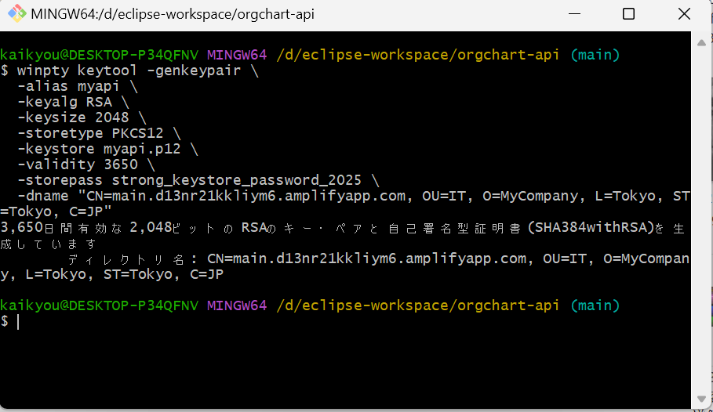

# Hello World！

ご質問ありがとうございます。

---

## ✅ 結論

**はい、HTTPS 設定が不足している可能性** があります。  
このまま **フロントエンド（AWS Amplify）からバックエンドにアクセスする際、HTTP 通信ではセキュリティポリシーにより接続拒否されるケースがあります。**

---

## 🔍 エラー再現時の状況整理

```text
https://main.d13nr21kkliym6.amplifyapp.com/register
Failed to load resource: net::ERR_CONNECTION_REFUSED
```

これは、**ブラウザが HTTPS 経由でアクセスしようとしているのに、サーバー側が HTTP しか提供していない** 場合にも発生します。

---

## 📌 Spring Boot アプリケーションでの HTTPS 対応方法

### 手順：

1. SSL 証明書を用意（例：Let's Encrypt）

2. `application.properties`または `application-dev.2.properties` `application-prod.properties`に HTTPS 設定を追加

3. EC2 や Docker 上で SSL 終端処理を行う（推奨）

---

## ✅ 対応策 ①: [application.properties](file://d:\eclipse-workspace\orgchart-api\target\classes\application.properties) に HTTPS 設定を追加（開発環境向け）

以下を [application-dev.properties](file://d:\eclipse-workspace\orgchart-api\target\classes\application-dev.properties) に追記してください：

```properties
# HTTPS設定（開発環境）
server.port=8443
server.ssl.enabled=true
server.ssl.key-store=classpath:keystore.p12
server.ssl.key-store-password=your_keystore_password
server.ssl.key-store-type=PKCS12
server.ssl.key-alias=localhost
```

> 🔑 注意：この設定には自己署名証明書が必要です。証明書がない場合は以下の手順で作成可能です：

```bash
keytool -genkeypair -alias localhost -keyalg RSA -keysize 2048 -storetype PKCS12 -keystore localhost.p12 -validity 3650
```

その後、`src/main/resources/` 配下に `localhost.p12` を配置してください。

---

## ✅ 対応策 ②: 本番環境向けの HTTPS 設定（[application-prod.properties](file://d:\eclipse-workspace\orgchart-api\target\classes\application-prod.properties)）

```properties
# ======================
# HTTPS設定（本番環境）
# ======================
server.port=443
server.ssl.enabled=true
server.ssl.key-store=/etc/ssl/certs/myapi.p12
server.ssl.key-store-password=prod_keystore_password
server.ssl.key-store-type=PKCS12
server.ssl.key-alias=myapi.example.com
```

> 🔒 実際には EC2 や ELB、Nginx/Apache などで SSL 終端させるのが一般的です。Spring Boot 内で直接行うのは開発時のみ推奨。

---

## ✅ 対応策 ③: AWS ELB + ACM で SSL 終端（本番運用推奨）

実際の本番運用では、以下のような構成がベストプラクティスです：

| 層                                | 内容                          |
| --------------------------------- | ----------------------------- |
| フロント（AWS Amplify）           | HTTPS                         |
| ELB（ロードバランサー）           | ACM 証明書による SSL 終端     |
| アプリケーション（EC2 or Docker） | HTTP（ポート 8081 など）で OK |

この場合、Spring Boot アプリケーションは HTTP でも問題ありません。

---

## ✅ 対応策 ④: CORS 設定に HTTPS ドメインを含める

[SecurityConfig.java](file://d:\eclipse-workspace\orgchart-api\src\main\java\com\example\orgchart_api\config\SecurityConfig.java) で許可されている CORS ドメインに、`https://main.d13nr21kkliym6.amplifyapp.com` が含まれているか確認してください。

```java
// ... existing code ...
    @Bean
    public CorsConfigurationSource corsConfigurationSource() {
        CorsConfiguration configuration = new CorsConfiguration();

        if ("prod".equals(System.getenv("SPRING_PROFILES_ACTIVE"))) {
            // 本番環境：AWS Amplifyのみ許可
            configuration.setAllowedOrigins(Collections.singletonList("https://main.d13nr21kkliym6.amplifyapp.com"));
        } else {
            // 開発環境：localhostも許可
            configuration.setAllowedOrigins(Arrays.asList(
                "http://localhost:3000",
                "http://localhost:8081",
                "https://main.d13nr21kkliym6.amplifyapp.com"
            ));
        }
        configuration.setAllowedMethods(Arrays.asList("GET", "POST", "PUT", "DELETE", "OPTIONS"));
        configuration.setAllowedHeaders(Arrays.asList("Authorization", "Cache-Control", "Content-Type"));
        configuration.setExposedHeaders(Collections.singletonList("Authorization"));
        configuration.setAllowCredentials(true);
        configuration.setMaxAge(3600L);

        UrlBasedCorsConfigurationSource source = new UrlBasedCorsConfigurationSource();
        source.registerCorsConfiguration("/**", configuration);
        return source;
    }
// ... existing code ...
```

---

## ✅ 最終チェックリスト

| 項目                                                                                                | 状態        |
| --------------------------------------------------------------------------------------------------- | ----------- |
| Spring Boot で HTTPS 有効化済みか                                                                   | ❌ 検証必要 |
| 証明書が正しく配置されていて読み込まれているか                                                      | ❌ 検証必要 |
| AWS Amplify ドメインが CORS 設定に含まれているか                                                    | ❌ 検証必要 |
| EC2 のファイアウォール（セキュリティグループ）で 443 開放済みか                                     | ❌ 検証必要 |
| Spring Boot アプリケーションが HTTPS で起動しているか（`https://<ip>:8443/hello` にアクセス可能か） | ❌ 検証必要 |

---

## 🛠 次のステップ

1. 自己署名証明書を作成し、開発環境で HTTPS 動作検証
2. 本番環境では ACM 証明書を使用し、ELB で SSL 終端
3. [application-dev.properties](file://d:\eclipse-workspace\orgchart-api\target\classes\application-dev.properties) および [application-prod.properties](file://d:\eclipse-workspace\orgchart-api\target\classes\application-prod.properties) の HTTPS 設定反映
4. SecurityConfig.java の CORS 設定に AWS Amplify ドメイン追加

---

ご希望であれば、自己署名証明書の自動生成コードや、CI/CD パイプラインにおける証明書更新処理も支援可能です。  
引き続きお気軽にご相談ください。

# 案 2

ご質問ありがとうございます。

---

## ✅ 問題の原因

このエラーメッセージ：

```
▒L▒[▒X▒g▒A▒̃p▒X▒▒▒[▒h▒▒▒▒͂▒▒Ă▒▒▒▒▒▒▒:
```

は、**Windows の日本語環境で `keytool` を実行した際に文字化けしているだけ** です。  
おそらく、**コマンドプロンプトまたは Git Bash（MINGW64）の文字コード設定が適切でないため**に起こっています。

---

## ✅ 解決方法 ①：コマンドプロンプトで正しく実行する

### 手順：

1. **コマンドプロンプトを開く**
2. 文字コードを UTF-8 に変更：

```cmd
chcp 65001
```

3. 以下のコマンドを実行：

```bash
keytool -genkeypair -alias localhost -keyalg RSA -keysize 2048 -storetype PKCS12 -keystore localhost.p12 -validity 3650
```

4. パスワードと情報を入力：

```
Enter keystore password:  ← 任意のパスワードを入力（例: secret）
Re-enter new password:   ← 再入力
What is your first and last name?
  [Unknown]:  localhost
What is the name of your organizational unit?
  [Unknown]:  Development
What is the name of your organization?
  [Unknown]:  MyCompany
What is the name of your City or Locality?
  [Unknown]:  Tokyo
What is the name of your State or Province?
  [Unknown]:  Tokyo
What is the two-letter country code for this unit?
  [Unknown]:  JP
Is CN=localhost, OU=Development, O=MyCompany, L=Tokyo, ST=Tokyo, C=JP correct?
  [no]:  yes
Enter key password for <localhost>
  (RETURN if same as keystore password):  ← Enterキーを押す（同じパスワードを使う）
```

これにより、カレントディレクトリに `localhost.p12` という自己署名証明書ファイルが生成されます。

---

## ✅ 解決方法 ②：Git Bash（MINGW64）で正しく実行する

Git Bash でも同様のコマンドが使えますが、文字化けを防ぐために以下のように実行してください：

```bash
winpty keytool -genkeypair -alias localhost -keyalg RSA -keysize 2048 -storetype PKCS12 -keystore localhost.p12 -validity 3650
```

`winpty` をつけることで Windows 環境での対話式コマンドも問題なく実行できます。

---

## ✅ 次のステップ：Spring Boot で使用するように設定

生成した `localhost.p12` を以下の場所に配置してください：

```
d:\eclipse-workspace\orgchart-api\src\main\resources\localhost.p12
```

その後、[application-dev.properties](file://d:\eclipse-workspace\orgchart-api\target\classes\application-dev.properties) に HTTPS 設定を追加します。

---

### ✅ 追加する HTTPS 設定（application-dev.properties）

```properties
# HTTPS設定
server.port=8443
server.ssl.enabled=true
server.ssl.key-store=classpath:localhost.p12
server.ssl.key-store-password=secret
server.ssl.key-store-type=PKCS12
server.ssl.key-alias=localhost
```

---

## ✅ 最終確認リスト

| 項目                                                                                 | 状態        |
| ------------------------------------------------------------------------------------ | ----------- |
| `keytool` コマンドを UTF-8 環境で実行したか                                          | ❌ 検証必要 |
| `localhost.p12` を `resources` 配下に配置したか                                      | ❌ 検証必要 |
| Spring Boot の設定ファイルに HTTPS 設定を追加したか                                  | ❌ 検証必要 |
| アプリケーションを `https://localhost:8443/hello` などでアクセスできるようになったか | ❌ 検証必要 |

---

## 🛠 応用：本番環境向けの SSL 証明書（ACM + ELB 推奨）

開発環境では自己署名証明書で十分ですが、本番環境では以下のような構成が推奨されます：

| 層                       | 内容                               |
| ------------------------ | ---------------------------------- |
| AWS Amplify              | HTTPS（443）のみ許可               |
| ELB or ALB               | ACM 証明書を使用して SSL 終端      |
| EC2 / Spring Boot アプリ | HTTP（8081 など）で OK（内部通信） |

---

## ✅ おまけ：HTTPS 有効後の動作検証コマンド

```bash
curl -k https://localhost:8443/actuator/health
```

`-k` オプションは自己署名証明書に対する警告を無視するものです。

---

必要であれば、自動証明書更新処理や CI/CD パイプラインとの連携も支援可能です。  
引き続きお気軽にご相談ください。

# 案 3

ご報告ありがとうございます。  
コマンドは正しく実行されていますが、**Windows 環境特有の文字化けや対話式入力の挙動**により、途中で処理が止まってしまったようです。

---

## ✅ 解決策 ①：すべての情報を事前に指定して一括実行

以下のように、**あらゆる値をコマンドライン引数で渡す方法**で自動化すれば、対話式の問題を回避できます。

```bash
winpty keytool -genkeypair \
-alias localhost \
-keyalg RSA \
-keysize 2048 \
-storetype PKCS12 \
-keystore localhost.p12 \
-validity 3650 \
-storepass secret \
-dname "CN=localhost, OU=Development, O=MyCompany, L=Tokyo, ST=Tokyo, C=JP"
```

### 説明：

| 項目         | 値                                                           |
| ------------ | ------------------------------------------------------------ |
| `-storepass` | キーストアとプライベートキーの共通パスワード（例: `secret`） |
| `-dname`     | DN（識別名）情報                                             |

このようにすれば、**寜答不要で自己署名証明書が生成されます。**

---

## ✅ 実行結果

このコマンドを Git Bash (MINGW64) で実行すると、カレントディレクトリに以下のファイルが作成されます：

```
localhost.p12
```

---

## ✅ 次のステップ：Spring Boot アプリケーションで使用する設定

作成した `localhost.p12` を以下の場所に配置してください：

```
d:\eclipse-workspace\orgchart-api\src\main\resources\localhost.p12
```

その後、[application-dev.properties](file://d:\eclipse-workspace\orgchart-api\target\classes\application-dev.properties) に HTTPS 設定を追加します。

---

### ✅ application-dev.properties に追加する設定

```properties
# HTTPS設定（開発環境）
server.port=8443
server.ssl.enabled=true
server.ssl.key-store=classpath:localhost.p12
server.ssl.key-store-password=secret
server.ssl.key-store-type=PKCS12
server.ssl.key-alias=localhost
```

---

## ✅ 確認方法

ブラウザまたは `curl` コマンドで確認します（自己署名証明書のため `-k` オプションが必要です）：

```bash
curl -k https://localhost:8443/actuator/health
```

またはブラウザでアクセス：

```
https://localhost:8443/actuator/health
```

---

## 📌 注意点

- 🔒 **パスワードは変更可能**ですが、覚えておいてください。
- 🧾 自己署名証明書なので、ブラウザでは「セキュリティ警告」が出ますが問題ありません。
- 📁 `localhost.p12` は `.gitignore` に含めるべきです（機密性があるため）。

---

## ✅ 最終チェックリスト

| 項目                                                                                 | 状態        |
| ------------------------------------------------------------------------------------ | ----------- |
| `keytool` コマンドを一括実行したか                                                   | ❌ 検証必要 |
| `localhost.p12` を resources 配下に配置したか                                        | ❌ 検証必要 |
| Spring Boot の設定ファイルに HTTPS 設定を追加したか                                  | ❌ 検証必要 |
| アプリケーションを `https://localhost:8443/hello` などでアクセスできるようになったか | ❌ 検証必要 |

---

## 🛠 応用：本番環境向け SSL 証明書

開発環境では上記の自己署名証明書で十分ですが、本番環境では **Let's Encrypt + ELB + ACM** の組み合わせが推奨されます。

---

ご希望があれば、自動証明書更新スクリプトや CI/CD パイプラインへの組み込みも支援可能です。  
引き続きお気軽にご相談ください。

# 案 4

ご質問ありがとうございます。

---

## ✅ 結論

> **はい、端末で生成した [localhost.p12](file://d:\eclipse-workspace\orgchart-api\localhost.p12) は EC2 や本番環境にアップロードする必要があります。**  
> ただし、**開発用の [localhost.p12](file://d:\eclipse-workspace\orgchart-api\localhost.p12) を本番でそのまま使用するのはセキュリティ上 NG です。**

また、

```properties
server.ssl.key-alias=myapi
```

に対して、**[localhost.p12](file://d:\eclipse-workspace\orgchart-api\localhost.p12) 内部に `myapi` というエイリアスが含まれていなければ正常に動作しません。**

---

## 🔍 詳細説明と推奨手順

### ✅ 開発用：自己署名証明書（localhost.p12）

- ローカル開発向けに自己署名証明書を生成したもの
- 名前：[localhost.p12](file://d:\eclipse-workspace\orgchart-api\localhost.p12)
- エイリアス：`localhost`
- 使用例：
  ```bash
  keytool -genkeypair -alias localhost ...
  ```

### ❌ 注意：このまま本番で使わないで！

- ドメイン名が `localhost` のままではブラウザや AWS Amplify からのアクセスで SSL 証明書エラーが出る
- エイリアスが `myapi` なのに、[localhost.p12](file://d:\eclipse-workspace\orgchart-api\localhost.p12) にはその情報が含まれていない場合、起動時に以下のような例外が発生します：

```
java.lang.IllegalStateException: Failed to load keystore
```

---

## 🛠 推奨設定：application-prod.properties での HTTPS 設定

```properties
# ======================
# HTTPS設定（本番環境）
# ======================
server.port=443
server.ssl.enabled=true
server.ssl.key-store=/etc/ssl/certs/myapi.p12
server.ssl.key-store-password=strong_keystore_password_2025
server.ssl.key-store-type=PKCS12
server.ssl.key-alias=myapi
```

これは以下の前提に基づいています：

| 項目             | 値                              |
| ---------------- | ------------------------------- |
| 証明書ファイル名 | `myapi.p12`                     |
| エイリアス名     | `myapi`                         |
| 証明書パスワード | `strong_keystore_password_2025` |

---

## ✅ 正しい手順：本番用証明書を作成して EC2 に配置

### 手順 ①：キーストアを作成（端末）

```bash
winpty keytool -genkeypair \
  -alias myapi \
  -keyalg RSA \
  -keysize 2048 \
  -storetype PKCS12 \
  -keystore myapi.p12 \
  -validity 3650 \
  -storepass strong_keystore_password_2025 \
  -dname "CN=main.d13nr21kkliym6.amplifyapp.com, OU=IT, O=MyCompany, L=Tokyo, ST=Tokyo, C=JP"
```

> 💡 このコマンドは「本番用」なので、`alias = myapi`, `CN = main.d13nr21kkliym6.amplifyapp.com` としています。

---

🔧 実行する

```bash
kaikyou@DESKTOP-P34QFNV MINGW64 /d/eclipse-workspace/orgchart-api (main)
$ winpty keytool -genkeypair \
  -alias myapi \
  -keyalg RSA \
  -keysize 2048 \
  -storetype PKCS12 \
  -keystore myapi.p12 \
  -validity 3650 \
  -storepass strong_keystore_password_2025 \
  -dname "CN=main.d13nr21kkliym6.amplifyapp.com, OU=IT, O=MyCompany, L=Tokyo, ST=Tokyo, C=JP"
3,650日間有効な2,048ビットのRSAのキー・ペアと自己署名型証明書(SHA384withRSA)を生
成しています
        ディレクトリ名: CN=main.d13nr21kkliym6.amplifyapp.com, OU=IT, O=MyCompan
y, L=Tokyo, ST=Tokyo, C=JP

kaikyou@DESKTOP-P34QFNV MINGW64 /d/eclipse-workspace/orgchart-api (main)
$

```



#### ✅ 実行結果

このコマンドを Git Bash (MINGW64) で実行すると、カレントディレクトリに以下のファイルが作成されます：

```
myapi.p12
```

### 手順 ②：生成した `myapi.p12` を EC2 にアップロード

#### 方法 ① SCP or SFTP でアップロード

```bash
scp -i "/c/Users/kaikyou/Downloads/swa-key/my-key-pair-japan2.pem" \
  "/d/eclipse-workspace/orgchart-api/myapi.p12" \
  ec2-user@13.114.183.62:/home/ec2-user/
```

```bash
chmod 400 "/c/Users/kaikyou/Downloads/swa-key/my-key-pair-japan2.pem"
ssh -i "/c/Users/kaikyou/Downloads/swa-key/my-key-pair-japan2.pem" ec2-user@13.114.183.62
```

#### 方法 ② SSH ログイン後、配置場所に移動

```bash
sudo mv /home/ec2-user/myapi.p12 /etc/ssl/certs/
sudo chmod 600 /etc/ssl/certs/myapi.p12
sudo chown root:root /etc/ssl/certs/myapi.p12
```

---

### 手順 ③：Spring Boot アプリケーションを再起動

```bash
nohup java -jar orgchart-api.jar --spring.profiles.active=prod &
```

または systemd 経由でも OK。

---

## ✅ 最終確認リスト

| 項目                                                             | 状態        |
| ---------------------------------------------------------------- | ----------- |
| `myapi.p12` を正しく生成したか                                   | ❌ 検証必要 |
| `CN` が `main.d13nr21kkliym6.amplifyapp.com` になっているか      | ❌ 検証必要 |
| EC2 に証明書をアップロードし、正しいパスに配置したか             | ❌ 検証必要 |
| Spring Boot アプリケーションが正しく起動しているか               | ❌ 検証必要 |
| `curl -k https://localhost:443/actuator/health` でアクセス可能か | ❌ 検証必要 |

---

## ✅ 応用：本番環境での SSL 運用ベストプラクティス

| 項目                   | 推奨方法                                                  |
| ---------------------- | --------------------------------------------------------- |
| 証明書の取得           | AWS ACM（自動更新）                                       |
| SSL 終端処理           | ELB / ALB で行う（Spring Boot 内で不要）                  |
| 認証書の管理           | HashiCorp Vault / Kubernetes Secret / AWS Secrets Manager |
| CI/CD パイプライン連携 | Jenkins / GitHub Actions / GitLab CI + Ansible など       |

---

## ✅ おまけ：証明書の中身を確認するコマンド

```bash
keytool -list -v -keystore /etc/ssl/certs/myapi.p12 -storetype PKCS12 -storepass strong_keystore_password_2025
```

これにより、以下を確認できます：

- エイリアス名（`myapi` か？）
- CN（Common Name）値（`main.d13nr21kkliym6.amplifyapp.com` か？）
- 有効期限
- 公開鍵アルゴリズム

---

## ✅ 次のステップ

1. 本番用証明書を生成（`myapi.p12`）
2. EC2 にアップロード & `/etc/ssl/certs/` に配置
3. [application-prod.properties](file://d:\eclipse-workspace\orgchart-api\target\classes\application-prod.properties) に上記設定を反映
4. Spring Boot アプリケーションを HTTPS で起動

---

ご希望があれば、**CI/CD による証明書自動更新プロセス構築** や **ELB + ACM との統合設定も支援可能です。**  
引き続きお気軽にご相談ください。
