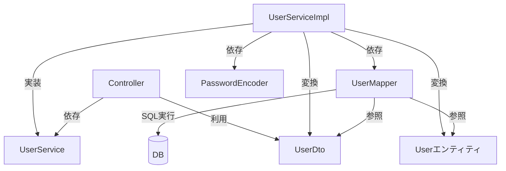
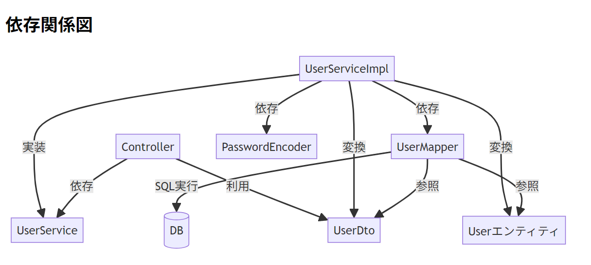
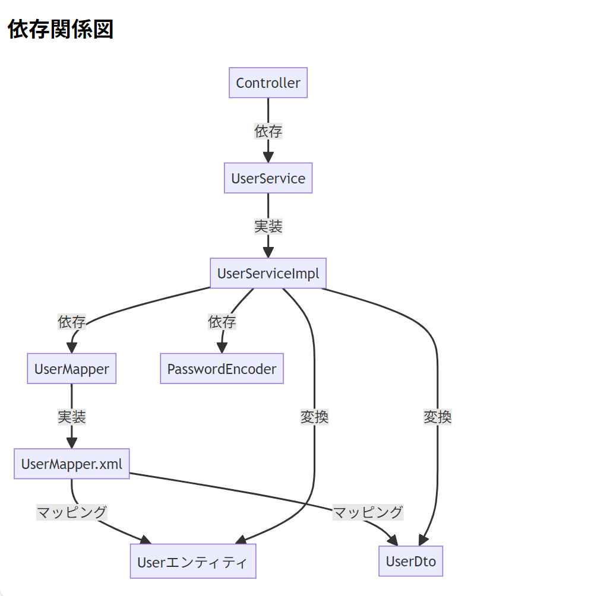
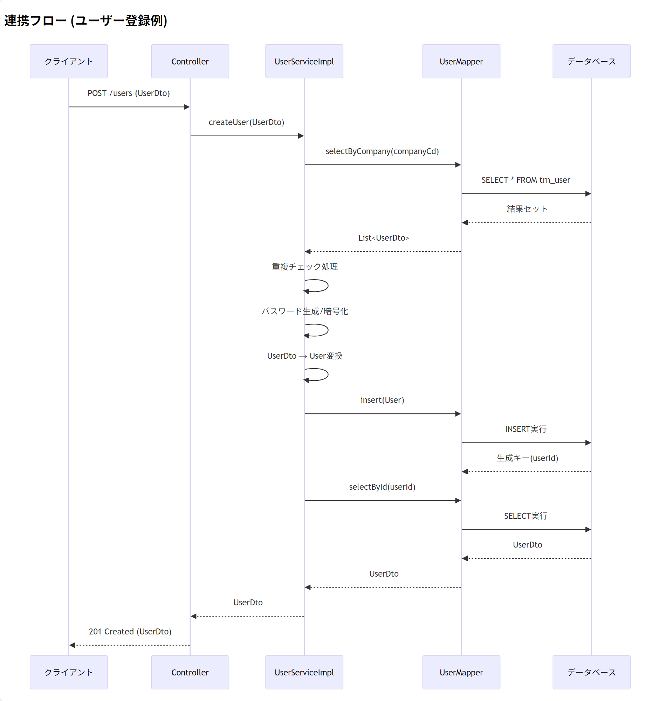

<span style="color: #007acc; font-weight: bold; font-size: 1.5rem;">重大問題見直す ✅</span>

注意点: MyBatis と JPA が混在していますが、実際のプロジェクトではどちらかを統一することが一般的です。特に UserRepository では JPA インターフェースを定義しながら、XML マッパーで実装するのは非標準です。整合性を取るためには:

1.MyBatis 採用時: Repository インターフェースを MyBatis 用に定義

2.JPA 採用時: UserMapper.xml を削除し、クエリを JPA 方式で実装

#### 已深度思考

```
JPAリポジトリをやめてMyBatisのみを使用する場合の依存関係と連携フローを整理します。

### 修正後の依存関係

1. **エンティティ (User.java)**
  - データベースのテーブルと直接マッピングされるクラス
  - 依存先: なし（ただしMyBatisが内部的に参照）

2. **DTO (UserDto.java)**
  - レイヤー間のデータ転送用オブジェクト
  - 依存先: なし

3. **Mapperインターフェース (UserMapper.java)**
  - MyBatisのMapperとしてSQL操作を定義するインターフェース
  - 依存先: エンティティ(User)、DTO(UserDto)

4. **Mapper XML (UserMapper.xml)**
  - Mapperインターフェースに対応するSQLを実装
  - 依存先: エンティティ(User)、DTO(UserDto)

5. **サービスインターフェース (UserService)**
  - ビジネスロジックのインターフェース
  - 依存先: DTO(UserDto)

6. **サービス実装 (UserServiceImpl)**
  - ビジネスロジックの実装
  - 依存先:
    - Mapperインターフェース(UserMapper)
    - DTO(UserDto)
    - エンティティ(User)（変換用）
    - PasswordEncoder（セキュリティ）

7. **コントローラー (UserController)**
  - HTTPリクエストの処理
  - 依存先: サービスインターフェース(UserService)

```

### 依存関係図





### 各コンポーネントの役割

1. **Controller**

   - クライアントからリクエストを受信（DTO を受け取る）
   - サービスを呼び出し、結果をクライアントに返す（DTO を返す）
   - バリデーションなど

2. **Service (UserServiceImpl)**

   - ビジネスロジックの実装
   - 重複チェックやパスワード加工などの処理
   - DTO とエンティティの相互変換
   - Mapper を呼び出してデータベース操作を実行

3. **Mapper (UserMapper)**

   - データベース操作の具体的な SQL を提供（XML またはアノテーション）
   - エンティティをデータベースに保存
   - クエリ結果を DTO やエンティティにマッピング

4. **Entity (User)**

   - データベースのテーブル構造をオブジェクトとして表現
   - MyBatis がデータベースとのマッピングに使用

5. **DTO (UserDto)**
   - コントローラーとサービスの間でデータを転送
   - クライアントに公開する情報のみを持つ

### 主な変更点

- **JPA リポジトリの削除**: `UserRepository`インターフェース（JPA）を削除し、MyBatis の`UserMapper`インターフェースに統一
- **サービスの修正**: `UserServiceImpl`が`UserRepository`ではなく`UserMapper`に依存するように変更
- **Mapper インターフェースの導入**: MyBatis の Mapper インターフェースを定義し、XML で SQL を実装

### コード修正例

#### Mapper インターフェース (`UserMapper.java`)

```java
package com.example.orgchart_api.repository;

import com.example.orgchart_api.domain.User;
import com.example.orgchart_api.dto.UserDto;
import org.apache.ibatis.annotations.Mapper;
import java.util.List;

@Mapper
public interface UserMapper {
    void insert(User user);
    UserDto selectById(Long userId);
    List<UserDto> selectByCompany(String companyCd);
    void update(User user);
    void softDelete(Long userId, String updateUser);
}
```

#### サービス実装 (`UserServiceImpl.java`)

```java
@Service
@RequiredArgsConstructor
public class UserServiceImpl implements UserService {
    // 変更: UserRepository -> UserMapper
    private final UserMapper userMapper;
    private final PasswordEncoder passwordEncoder;

    @Override
    @Transactional
    public UserDto createUser(UserDto userDto) {
        // 重複チェック（Mapperを使用）
        if (userMapper.selectByCompany(userDto.getCompanyCd()).stream()
            .anyMatch(u -> u.getEmployeeCd().equals(userDto.getEmployeeCd()))) {
            throw new DuplicateKeyException("社員番号が重複しています");
        }

        // ...（パスワード処理など）

        // DTO → エンティティ変換
        User user = User.builder()
            // ...（フィールド設定）
            .build();

        userMapper.insert(user); // Mapperで挿入

        // 登録したユーザーを取得して返す
        return userMapper.selectById(user.getUserId());
    }
    // 他のメソッドも同様にMapperを使用するように修正
}
```

#### Mapper XML (`UserMapper.xml`)

- 既存の XML を維持（名前空間を Mapper インターフェースに合わせて変更）

```xml
<mapper namespace="com.example.orgchart_api.repository.UserMapper">
    <!-- 既存のマッピングを維持 -->
</mapper>
```

これにより、JPA と MyBatis の混在が解消され、一貫性のあるデータアクセス層を構築できます。

````

## JPAリポジトリ排除後の依存関係と連携フロー

JPAインターフェースを排除し、MyBatisベースの実装に統一した場合の依存関係を整理します。

### 依存関係図
```mermaid
graph TD
    A[Controller] -->|依存| B[UserService]
    B -->|実装| C[UserServiceImpl]
    C -->|依存| D[UserMapper]
    C -->|依存| E[PasswordEncoder]
    D -->|実装| F[UserMapper.xml]
    F -->|マッピング| G[Userエンティティ]
    F -->|マッピング| H[UserDto]
    C -->|変換| G
    C -->|変換| H
````



### 主要コンポーネントと依存関係

| コンポーネント        | 依存先                          | 役割                             |
| --------------------- | ------------------------------- | -------------------------------- |
| **Controller**        | UserService インターフェース    | リクエスト受信/レスポンス返却    |
| **UserService**       | なし (インターフェース)         | サービスの契約定義               |
| **UserServiceImpl**   | UserMapper/PasswordEncoder      | ビジネスロジック実装             |
| **UserMapper**        | なし (MyBatis インターフェース) | データ操作メソッド定義           |
| **UserMapper.xml**    | User エンティティ/UserDto       | SQL 実装とオブジェクトマッピング |
| **User エンティティ** | なし                            | データベーステーブル表現         |
| **UserDto**           | なし                            | レイヤー間データ転送             |

### 連携フロー (ユーザー登録例)

```mermaid
sequenceDiagram
    participant Client as クライアント
    participant Controller
    participant UserServiceImpl
    participant UserMapper
    participant DB as データベース

    Client->>Controller: POST /users (UserDto)
    Controller->>UserServiceImpl: createUser(UserDto)

    UserServiceImpl->>UserMapper: selectByCompany(companyCd)
    UserMapper->>DB: SELECT * FROM trn_user
    DB-->>UserMapper: 結果セット
    UserMapper-->>UserServiceImpl: List<UserDto>

    UserServiceImpl->>UserServiceImpl: 重複チェック処理
    UserServiceImpl->>UserServiceImpl: パスワード生成/暗号化
    UserServiceImpl->>User: UserDto → User変換

    UserServiceImpl->>UserMapper: insert(User)
    UserMapper->>DB: INSERT実行
    DB-->>UserMapper: 生成キー(userId)

    UserServiceImpl->>UserMapper: selectById(userId)
    UserMapper->>DB: SELECT実行
    DB-->>UserMapper: UserDto
    UserMapper-->>UserServiceImpl: UserDto
    UserServiceImpl-->>Controller: UserDto
    Controller-->>Client: 201 Created (UserDto)
```



### 修正後のコンポーネント実装例

#### 1. Mapper インターフェース (`UserMapper.java`)

```java
package com.example.orgchart_api.repository;

import com.example.orgchart_api.domain.User;
import com.example.orgchart_api.dto.UserDto;
import org.apache.ibatis.annotations.Mapper;

import java.util.List;

@Mapper
public interface UserMapper {
    void insert(User user);
    UserDto selectById(Long userId);
    List<UserDto> selectByCompany(String companyCd);
    void update(User user);
    void softDelete(Long userId, String updateUser);
}
```

#### 2. サービス実装 (`UserServiceImpl.java`)

```java
@Service
@RequiredArgsConstructor
public class UserServiceImpl implements UserService {

    private final UserMapper userMapper; // MyBatis Mapper
    private final PasswordEncoder passwordEncoder;

    @Override
    @Transactional
    public UserDto createUser(UserDto userDto) {
        // 重複チェック（Mapperを使用）
        List<UserDto> companyUsers = userMapper.selectByCompany(userDto.getCompanyCd());
        if (companyUsers.stream().anyMatch(u -> u.getEmployeeCd().equals(userDto.getEmployeeCd()))) {
            throw new DuplicateKeyException("社員番号が重複しています");
        }

        // エンティティ作成
        User user = User.builder()
            .companyCd(userDto.getCompanyCd())
            .employeeCd(userDto.getEmployeeCd())
            .userNm(userDto.getUserNm())
            .userNmKana(userDto.getUserNmKana())
            .mailAddress(userDto.getMailAddress())
            .passwordHash("") // 仮設定
            .passwordSalt("") // 仮設定
            .pin(generateRandomPin())
            .birthday(userDto.getBirthday())
            .voiceMailProfileId(userDto.getVoiceMailProfileId())
            .pickupGroupId(userDto.getPickupGroupId())
            .deleted(false)
            .build();

        // パスワード設定
        user.updatePassword(userDto.getPasswordHash(), passwordEncoder);

        // DB登録
        userMapper.insert(user);

        // 登録したデータを返却
        return userMapper.selectById(user.getUserId());
    }

    // 他のメソッドも同様にMapperを使用
}
```

#### 3. コントローラー例 (`UserController.java`)

```java
@RestController
@RequestMapping("/api/users")
@RequiredArgsConstructor
public class UserController {

    private final UserService userService;

    @PostMapping
    public ResponseEntity<UserDto> createUser(@RequestBody UserDto userDto) {
        UserDto createdUser = userService.createUser(userDto);
        return ResponseEntity.created(URI.create("/api/users/" + createdUser.getUserId()))
                             .body(createdUser);
    }

    @GetMapping("/{id}")
    public ResponseEntity<UserDto> getUserById(@PathVariable Long id) {
        return ResponseEntity.ok(userService.getUserById(id));
    }
}
```

#### 4. Mapper XML (`UserMapper.xml`) - 変更点

```xml
<!-- namespaceをMapperインターフェースに変更 -->
<mapper namespace="com.example.orgchart_api.repository.UserMapper">
    <!-- 既存のマッピングを維持 -->
</mapper>
```

### メリットと注意点

**メリット:**

- データアクセス方法が MyBatis のみに統一され、実装がシンプルに
- SQL の細かい制御が可能
- パフォーマンスチューニングが容易

**注意点:**

1. **トランザクション管理**: `@Transactional`アノテーションはサービス層に残す
2. **エンティティ-DTO 変換**: サービス層で明示的に変換処理を実装
3. **依存関係注入**: MyBatis Mapper は`@Mapper`アノテーションで自動的に Bean 登録
4. **ID 生成戦略**: `useGeneratedKeys`で INSERT 後の ID 取得を保証
   ```xml
   <insert id="insert" useGeneratedKeys="true" keyProperty="userId">
       <!-- INSERT文 -->
   </insert>
   ```

この構成により、JPA と MyBatis の混在による複雑さが解消され、一貫性のあるデータアクセス層を構築できます。
