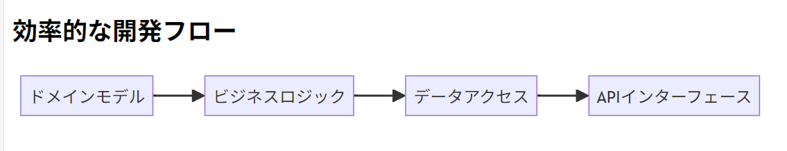

<span style="color: #007acc; font-weight: bold; font-size: 1.5rem;">コンポーネント実装の優先順位と理由 ✅</span>

#### 已深度思考

```
なDDD（ドメイン駆動設計）やクリーンアーキテクチャの観点から、コンポーネント実装の優先順位を考えます。
ただし、実際の開発では要件やアプローチ（ドメインファーストかデータベースファーストかなど）によって変わります。

ここでは、ドメインモデルを中心に据えた開発を前提とした場合の優先順位を提案します。

優先順位の考え方:
1. ドメイン知識（ビジネスルール）を表現するエンティティを最初に定義
2. アプリケーションのユースケース（サービス）を定義
3. 外部とのデータ転送オブジェクト（DTO）を定義
4. データ永続化のためのリポジトリ（Mapper）を定義
5. プレゼンテーション層（Controller）を最後に実装

つまり、内部のビジネスロジックから外部のインターフェースに向かって実装を進める方法です。

推奨する実装順序:

1. `User` エンティティ（ビジネスルールの中核）
   - ユーザーに関するビジネスルール（例：パスワード更新ロジック）を含む

2. `UserService` インターフェースと `UserServiceImpl` 実装クラス
   - ユーザー管理に関するユースケース（登録、更新、削除など）を定義
   - ここでエンティティを操作するロジックを実装

3. `UserDto`
   - ユースケースで必要となる入出力データ構造を定義
   - コントローラーとサービスの間で転送されるデータ

4. `UserMapper.java` インターフェースと `UserMapper.xml`
   - サービス層から呼び出される永続化のインターフェース
   - エンティティを永続化するためのSQLを定義

5. `UserController`
   - 外部（クライアント）からのリクエストを受け取り、サービスを呼び出し、結果を返す
   - DTOを使ってクライアントとのデータ転送を行う

理由:
- ドメインモデル（エンティティ）がアプリケーションのコアであり、ビジネスルールを表現するため、最初に定義すべき。
- サービス層はドメインオブジェクトを用いてユースケースを実装するため、エンティティの次に実装。
- 永続化（Mapper）はサービス層から利用されるため、サービスの実装に先立ってインターフェースだけを定義し、詳細は後回しにすることも可能（テストのためにモックできる）。
- コントローラーはアプリケーションの入り口であるが、内部のロジックが固まってから実装するのが効率的。

ただし、データベース設計が先行している場合は、永続化層（Mapper）を先に実装することもあります。

この順序で進めることの利点:
 - ビジネスロジックに集中できる
 - データベースやフレームワークへの依存を後回しにできる（テスト容易性の向上）

一方、データベース中心のアプリケーション開発では、以下の順番もありえます:
 1. UserMapper.xml（SQLとマッピング定義）
 2. Userエンティティ（データベーステーブルに対応する構造）
 3. UserDto（画面などに渡すデータ構造）
 4. UserService（トランザクションスクリプト）
 5. UserController

しかし、現在の主流はドメインモデルを重視した設計ですので、最初の順序を推奨します。

補足: TDD（テスト駆動開発）を行う場合は、テストを最初に書くため、インターフェース（`UserService`）から始めることもあります。

結論として、プロジェクトの性質に応じて柔軟に選択すべきですが、一般的な優先順位は次の通りです：

1. Userエンティティ
2. UserServiceインターフェース
3. UserServiceImpl（サービスの骨格）
4. UserDto
5. UserMapperインターフェース
6. UserMapper.xml（SQLマッピング）
7. UserServiceImpl（永続化処理の詳細）
8. UserController

サービスの実装中に永続化のインターフェース（UserMapper）が必要になるため、インターフェースだけは早めに定義しておきます。
その後、実際のSQLマッピング（UserMapper.xml）は後から実装しても、モックを使ってテストが進められます。

```

## コンポーネント実装の優先順位と理由

以下の順序での実装を推奨します。ビジネスロジック中心のアプローチで、ドメインモデルから外部インターフェースに向かって実装します。

### 推奨実装順序

1. **User エンティティ**

   - 理由：アプリケーションのコアとなるドメインモデル
   - 実装内容：
     ```java
     public class User {
         // エンティティの基本構造とビジネスロジック
         public void updatePassword(...) {
             // パスワード更新ロジック
         }
     }
     ```

2. **UserService インターフェース**

   - 理由：ビジネスロジックの契約定義
   - 実装内容：
     ```java
     public interface UserService {
         UserDto createUser(UserDto userDto);
         UserDto getUserById(Long userId);
         // 他のビジネス操作
     }
     ```

3. **UserMapper インターフェース**

   - 理由：データアクセス層の契約定義
   - 実装内容：
     ```java
     @Mapper
     public interface UserMapper {
         void insert(User user);
         UserDto selectById(Long userId);
         // 他のデータ操作メソッド
     }
     ```

4. **UserMapper.xml**

   - 理由：データアクセスの具体的実装
   - 実装内容：
     ```xml
     <mapper namespace="com.example...UserMapper">
         <insert id="insert" useGeneratedKeys="true" keyProperty="userId">
             <!-- SQL実装 -->
         </insert>
     </mapper>
     ```

5. **UserDto**

   - 理由：サービス層の入力/出力形式定義
   - 実装内容：
     ```java
     @Getter @Setter
     public class UserDto {
         // コントローラー-サービス間で受け渡すデータ構造
     }
     ```

6. **UserServiceImpl**

   - 理由：ビジネスロジックの実装
   - 実装内容：

     ```java
     @Service
     public class UserServiceImpl implements UserService {
         private final UserMapper userMapper;

         @Override
         public UserDto createUser(UserDto dto) {
             // エンティティ変換→ビジネスロジック→Mapper呼び出し
         }
     }
     ```

7. **UserController**

   - 理由：外部インターフェース（最後に実装）
   - 実装内容：

     ```java
     @RestController
     public class UserController {
         private final UserService userService;

         @PostMapping("/users")
         public ResponseEntity<UserDto> createUser(@RequestBody UserDto dto) {
             // サービス呼び出し
         }
     }
     ```

### 優先順位の根拠

1. **ドメイン駆動設計(DDD)の原則**

   - ビジネスロジック（エンティティ/サービス）を基盤として構築
   - 技術的詳細（DB アクセス/Web 層）は後回し

2. **テスト容易性**

   - コアロジックを先に実装 → 単体テスト可能

   ```
   Userエンティティ → ビジネスルールテスト
   UserService → ユースケーステスト
   ```

3. **変更への強い設計**

   - 外部インターフェース（Controller/DB）に依存しない
   - プレゼンテーション層や永続化層の変更影響を最小化

4. **効率的な開発フロー**
   ```mermaid
   graph LR
     A[ドメインモデル] --> B[ビジネスロジック]
     B --> C[データアクセス]
     C --> D[APIインターフェース]
   ```
   

### 特殊ケースでの順序変更

1. **DB 中心設計の場合**

   - UserMapper.xml → User エンティティ → その他
   - 既存 DB スキーマが決まっている場合に有効

2. **API ファースト開発の場合**

   - UserDto → UserController → その他
   - OpenAPI 仕様などが先行している場合

3. **スパイク開発（試作）**
   - UserController → UserServiceImpl → 必要最低限の実装
   - プロトタイピングや概念実証向け

### 各レイヤーの役割と依存関係

| レイヤー                        | 役割                     | 依存先           |
| ------------------------------- | ------------------------ | ---------------- |
| ドメイン (User)                 | ビジネスルールと状態管理 | なし             |
| サービス (Service)              | ユースケースの調整と実行 | ドメイン・Mapper |
| データアクセス (Mapper)         | 永続化操作               | ドメイン・DB     |
| プレゼンテーション (Controller) | 外部インターフェース     | サービス・DTO    |
| DTO                             | レイヤー間データ転送     | なし             |

この順序で実装することで、ビジネス価値の高い部分から開発を進められ、技術的変更への耐性が高い設計になります。
