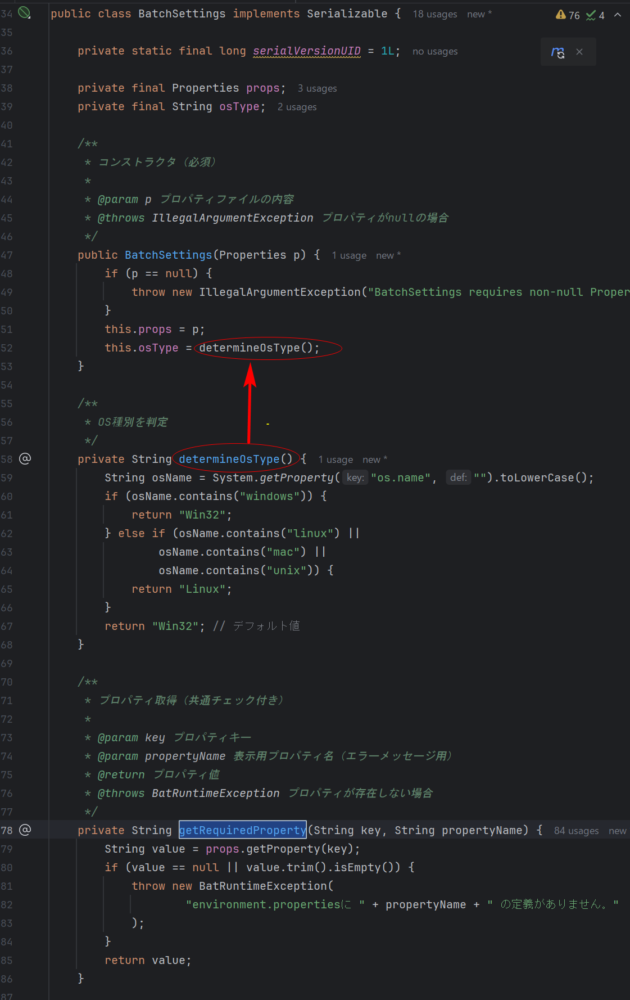
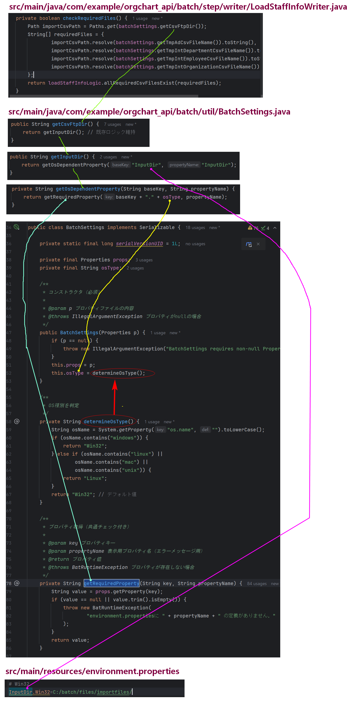

## environment.properties と BatchSettings.java との連携

#### (src/main/resources/environment.properties)

```properties
################################################################
# MasterParameter (TypeModel) 取込対象Name ","区切りで列挙
################################################################
typemodel.name=Cisco 6941, Cisco 7911,Cisco 7912, Cisco 7936, Cisco 7937, Cisco 7942, Cisco 7960, Cisco 7962, Cisco 9971

################################################################
#FTPディレクトリ
################################################################
# Win32
InputDir.Win32=C:/batch/files/importfiles/
InputCompDir.Win32=C:/batch/files/complatedfiles/
OutputDir.Win32=C:/var/www/download/data/export/batch/
OutputDir2.Win32=C:/batch/db/
OutputDir3.Win32=C:/batch/associate/
OutputDir4.Win32=C:/batch/circuitlist/
OutputRetireDir.Win32=C:/var/www/download/logs/batch/

# Linux
InputDir.Linux=/home/batchuser/files/importfiles/
InputCompDir.Linux=/home/batchuser/files/complatedfiles/
OutputDir.Linux=/var/www/download/data/export/batch/
OutputDir2.Linux=/batch/db/
OutputDir3.Linux=/batch/associate/
OutputDir4.Linux=/batch/circuitlist/
OutputRetireDir.Linux=/var/www/download/logs/batch/

##################################################################
#ロックファイルのパス
##################################################################
# Win32
LockFile.Win32=C:\\var\\www\\download\\tmp\\cucm.lock
LockFile=/var/www/download/tmp/cucm.lock
# Linux
LockFile.Linux=/var/www/download/tmp/cucm_app_is_updating.lock

##################################################################
# エラーファイル設定
##################################################################
OutputErrFileDir.Win32=C:\\logs\\errors
OutputErrFileDir.Linux=/var/log/batch/errors
OutputErrFileNm=system_error

##################################################################
#人事情報取り込み
##################################################################
BizOrganizationTableName=BIZ_ORGANIZATION
BizDepartmentTableName=BIZ_DEPARTMENT
BizEmployeeTableName=BIZ_EMPLOYEE
BizAdTableName=BIZ_AD
BizShiftTableName=BIZ_SHIFT

TmpBizOrganizationTableName=TMP_INTEGRATEDID_ORGANIZATION

BizOrganizationCsvFileName=organization.csv
BizDepartmentCsvFileName=department.csv
BizEmployeeCsvFileName=employee.csv
BizAdCsvFileName=ad.csv
BizShiftCsvFileName=shift.csv

Eof.Ad=EOFAD
Eof.Am=EOFAM

DumOrganizationCsvFileName=dum_organization.csv
DumDepartmentCsvFileName=dum_department.csv
DumEmployeeCsvFileName=dum_employee.csv

#RetiredUserFileName=retired_users.log
TmpIntOrganizationCsvFileName=organization.csv
TmpAdCsvFileName=biz_ad.csv
TmpIntDepartmentCsvFileName=bizdepartment.csv
TmpIntEmployeeCsvFileName=biz_employee.csv
RetiredUserFileName=retired_user.csv
JoinedUserFileName=joined_user.csv
ReceiveDir=

#################################################################
#人事情報取り込み(CSV Header)
#################################################################
BizAdCsvHeader=USER_LOGON_NAME,DISP_NAME,LAST_NAME,FIRST_NAME,MAIL,POSITION
BizDepartmentCsvHeader=ORGANIZATION_CODE,COMPANY_CODE,COMPANY_NAME,CONTROL_CODE,CONTROL_NAME,CHARGE_CODE,CHARGE_NAME,PARENT_DEPARTMENT_CODE,PARENT_DEPARTMENT_NAME,DEPARTMENT_CODE,DEPARTMENT_NAME,DEPARTMENT_NAME_ENGLISH,ZIP_CODE,ADDRESS,TELEPHONE_NUMBER,FAX_NUMBER,EXTENSION_NUMBER,CLASS_SALES,CLASS_DATA_INPUT,UPDATE_DATE
BizEmployeeCsvHeader=ORGANIZATION_CODE,COMPANY_CODE,DEPARTMENT_CODE,DEPARTMENT_NAME,EMPLOYEE_CODE,EMPLOYEE_NAME_KANJI,EMPLOYEE_NAME_KANA,EXECUTIVE_POST_CODE,POST_LINEAGE_CODE,CLASS,SEX_CODE,BIRTHDAY,MAIL_ADDRESS,ASSIGN_GRADE,CLASS_TEL_ADDRESSBOOK,CLASS_TEMPORARY_TRANSFER,MAIL_ADDRESS_AUTOMADE_FLAG,CLASS_DATA_INPUT,UPDATE_DATE
BizOrganizationCsvHeader=ORGANIZATION_CODE,ORGANIZATION_NAME,ORGANIZATION_NUMBER,ORGANIZATION_ABBREVIATED_NAME,PRINT_ORDER,CLASS_SALES,CLASS_DATA_INPUT,UPDATE_DATE
BizShiftCsvHeader=OLD_BRANCH_CODE,OLD_COMPANY_CODE,OLD_DEPARTMENT_CODE,NEW_BRANCH_CODE,NEW_COMPANY_CODE,NEW_DEPARTMENT_CODE

TmpBizOrganizationCsvHeader=ORGANIZATION_CD,ORGANIZATION_NM,ORGANIZATION_NO,ORGANIZATION_ABBREVIATED_NM,PRINT_ORDER,CLASS_SALES,CLASS_DATA_INPUT,UPDATE_DATE

#################################################################
#CSV EXPORT IMPORT NAME
#################################################################
VoiceCsvHeader=DIRECTORY NUMBER,LOGGER_DATA
ChargeCsvHeader=H,CCMGRP,department,division.teInum,6,7,8
CUCCsvHeader=last_name,first_name,directory_number,mail_address,CUC_data
TeIDirCsvHeader=biz_employee_id,section_id,external_phone_number,directory_number,call_pickup_group_no
ADCsvHeader=user_logon_name,disp_name,last_name,first_name,mail,position,directory_number
LineListCsvHeader=statusname,directorynumber,dialinnumber,lineindex,kanjiusername,sectionusername,pickupgroupno,voicemailflg,busydestination,chargeassociationbranchid,chargeassociationparentsectionid,chargeassociationsectionid,chargeremarks,loggerdataname,teldirdata,teltypemodel,macaddress,phonebuttontemplete,branchtelname,sectiontelname,callingsearchspacename,orgaddonmodulenamel,orgaddonmodulename2,orgringsettingname,tellineremarks,linetextlabel,noansdestination,externalphonenumbermask

VoiceTableName=VOICE_LOGGER_ASSOCIATION
CsvImport.Voice=VOICE.csv

CsvExport.Voice=EXPORT_VOICE.csv
CsvExport.CUC=EXPORT_CUC.csv
CsvExport.Charge=EXPORT_CHARGE.csv
CsvExport.TelDir=EXPORT_TELDIR.csv
CsvExport.AD=EXPORT_AD.csv
CsvExport.LineList=EXPORT_LINE_LIST.csv

#################################################################
# ALL TABLE NAME 全TBL一括EXPIMP対象
#################################################################
AllTable=app_user,biz_ad,biz_department,biz_employee,biz_organization,biz_shift,c_cucm_line,c_cucm_phone,c_cucm_phone_line,calling_search_space,charge_association,unity_association,cucm_line,cucm_master_last_update,cucm_phone,devicepool,dum_department,dum_employee,dum_organization,exclude_executive,line_reflected_cluster,location,m_branch,m_cluster,m_enduser_config,m_enduser_config_access_group,m_line_config,m_phone_config,m_phone_vendor_config,m_section,phone_reflected_cluster,phone_template,pickup_group,f_cucm_phone_line,r_cucm_user_phone,r_section_branch,r_user_section,tel_dir_association,threshold,type_model,voice_logger_association

```

#### (src/main/java/com/example/orgchart_api/batch/util/BatchSettings.java)

```java
 /*
 * Copyright (c) 2014, NET MARKS COMPANY, LIMITED All Rights Reserved.
 *
 * BatchSettings.java
 *
 * @date 2013/09/12
 * @version 1.0
 * @author Yao Kaikyou
 */
package com.example.orgchart_api.batch.util;

import java.io.Serializable;
import java.util.Properties;

import com.example.orgchart_api.batch.exception.BatRuntimeException;

/**
 * <pre>
 * バッチの挙動に関する設定を保持するクラス
 *
 * Spring Boot 3.5.0対応変更点:
 * 1. フィールドインジェクション廃止
 * 2. デフォルトコンストラクタ廃止
 * 3. OS判定ロジックの共通化
 * 4. プロパティ取得処理の堅牢化
 *
 * &lt;MODIFICATION HISTORY&gt;
 * 1.0 2013/09/12 KSC Hiroaki Endo 新規作成
 * </pre>
 *
 * @author KSC Hiroaki Endo
 * @version 1.0 2013/09/12
 */
public class BatchSettings implements Serializable {

    private static final long serialVersionUID = 1L;

    private final Properties props;
    private final String osType;

    /**
     * コンストラクタ（必須）
     *
     * @param p プロパティファイルの内容
     * @throws IllegalArgumentException プロパティがnullの場合
     */
    public BatchSettings(Properties p) {
        if (p == null) {
            throw new IllegalArgumentException("BatchSettings requires non-null Properties");
        }
        this.props = p;
        this.osType = determineOsType();
    }

    /**
     * OS種別を判定
     */
    private String determineOsType() {
        String osName = System.getProperty("os.name", "").toLowerCase();
        if (osName.contains("windows")) {
            return "Win32";
        } else if (osName.contains("linux") ||
                osName.contains("mac") ||
                osName.contains("unix")) {
            return "Linux";
        }
        return "Win32"; // デフォルト値
    }

    /**
     * プロパティ取得（共通チェック付き）
     *
     * @param key プロパティキー
     * @param propertyName 表示用プロパティ名（エラーメッセージ用）
     * @return プロパティ値
     * @throws BatRuntimeException プロパティが存在しない場合
     */
    private String getRequiredProperty(String key, String propertyName) {
        String value = props.getProperty(key);
        if (value == null || value.trim().isEmpty()) {
            throw new BatRuntimeException(
                    "environment.propertiesに " + propertyName + " の定義がありません。"
            );
        }
        return value;
    }

    /**
     * OS依存プロパティ取得
     */
    private String getOsDependentProperty(String baseKey, String propertyName) {
        return getRequiredProperty(baseKey + "." + osType, propertyName);
    }

    /**
     * プロパティファイルの特定KEY情報を取得
     * @param key プロパティキー
     * @return プロパティ値（存在しない場合はnull）
     */
    public String getProperty(String key) {
        return props.getProperty(key);
    }

    // === プロパティ取得メソッド群 ===
    // 各メソッドで重複していたチェック処理を共通化

    public String getLockFile() {
        return getOsDependentProperty("LockFile", "LockFile");
    }

    public String getInputDir() {
        return getOsDependentProperty("InputDir", "InputDir");
    }

    public String getCsvFtpDir() {
        return getInputDir(); // 既存ロジック維持
    }

    public String getInputCompDir() {
        return getOsDependentProperty("InputCompDir", "InputCompDir");
    }

    public String getReceiveDir() {
        return getOsDependentProperty("ReceiveDir", "ReceiveDir");
    }

    public String getOutputDir() {
        return getOsDependentProperty("OutputDir", "OutputDir");
    }

    public String getOutputDirDB() {
        String baseDir = getOutputDir();
        String subDir = getOsDependentProperty("OutputDir2", "OutputDir2");
        return baseDir + subDir;
    }

    public String getOutputDirAssociate() {
        String baseDir = getOutputDir();
        String subDir = getOsDependentProperty("OutputDir3", "OutputDir3");
        return baseDir + subDir;
    }

    public String getOutputDirCircuitlist() {
        String baseDir = getOutputDir();
        String subDir = getOsDependentProperty("OutputDir4", "OutputDir4");
        return baseDir + subDir;
    }

    public String getReceiveStDir() {
        return getOsDependentProperty("ReceiveDir", "ReceiveStDir");
    }

    public String getOutPutRetireDir() {
        return getOsDependentProperty("OutputRetireDir", "OutputRetireDir");
    }

    public String getOutPutNewUsersDir() {
        return getOsDependentProperty("OutputNewUsersDir", "OutputNewUsersDir");
    }

    public String getOutPutErrFileDir() {
        return getOsDependentProperty("OutputErrFileDir", "OutputErrFileDir");
    }

    public String getOutPutErrFileNm() {
        return getRequiredProperty("OutputErrFileNm", "OutputErrFileNm");
    }

    public String getErrMessage() {
        return getRequiredProperty("BT_000_E007", "BT_000_E007");
    }

    public String getManageSearchCsvDir() {
        return getOsDependentProperty("ManageSearchCsvDir", "ManageSearchCsvDir");
    }

    public String getFileSeparetor() {
        return System.getProperty("file.separator");
    }

    // CSVファイル名取得メソッド群
    public String getBizOrganizationCsvFileName() {
        return getRequiredProperty("BizOrganizationCsvFileName", "BizOrganizationCsvFileName");
    }

    public String getBizDepartmentCsvFileName() {
        return getRequiredProperty("BizDepartmentCsvFileName", "BizDepartmentCsvFileName");
    }

    public String getBizEmployeeCsvFileName() {
        return getRequiredProperty("BizEmployeeCsvFileName", "BizEmployeeCsvFileName");
    }

    public String getBizAdCsvFileName() {
        return getRequiredProperty("BizAdCsvFileName", "BizAdCsvFileName");
    }

    public String getTmpIntEmployeeCsvFileName() {
        return getRequiredProperty("TmpIntEmployeeCsvFileName", "TmpIntEmployeeCsvFileName");
    }

    public String getTmpIntDepartmentCsvFileName() {
        return getRequiredProperty("TmpIntDepartmentCsvFileName", "TmpIntDepartmentCsvFileName");
    }

    public String getTmpAdCsvFileName() {
        return getRequiredProperty("TmpAdCsvFileName", "TmpAdCsvFileName");
    }

    public String getBizShiftCsvFileName() {
        return getRequiredProperty("BizShiftCsvFileName", "BizShiftCsvFileName");
    }

    public String getDumOrganizationCsvFileName() {
        return getRequiredProperty("DumOrganizationCsvFileName", "DumOrganizationCsvFileName");
    }

    public String getTmpIntOrganizationCsvFileName() {
        return getRequiredProperty("TmpIntOrganizationCsvFileName", "TmpIntOrganizationCsvFileName");
    }

    // === 共通化されたメソッドを使用してリファクタリング ===

    public String getDumDepartmentCsvFileName() {
        return getRequiredProperty("DumDepartmentCsvFileName", "DumDepartmentCsvFileName");
    }

    public String getDumEmployeeCsvFileName() {
        return getRequiredProperty("DumEmployeeCsvFileName", "DumEmployeeCsvFileName");
    }

    ////////////////////////////////////////////////////////////////////////////////////////////////////
//  一括入出力用CSVファイル -----------------------------------------------------
    public String getDbAppUserCsvFileName() {
        return getRequiredProperty("DbAppUserCsvFileName", "DbAppUserCsvFileName");
    }

    public String getDbBizAdFileName() {
        return getRequiredProperty("DbBizAdFileName", "DbBizAdFileName");
    }

    public String getDbBizDepartmentCsvFileName() {
        return getRequiredProperty("DbBizDepartmentCsvFileName", "DbBizDepartmentCsvFileName");
    }

    public String getDbBizEmployeeCsvFileName() {
        return getRequiredProperty("DbBizEmployeeCsvFileName", "DbBizEmployeeCsvFileName");
    }

    public String getDbBizOrganizationCsvFileName() {
        return getRequiredProperty("DbBizOrganizationCsvFileName", "DbBizOrganizationCsvFileName");
    }

    public String getDbBizShiftCsvFileName() {
        return getRequiredProperty("DbBizShiftCsvFileName", "DbBizShiftCsvFileName");
    }

    public String getDbCcmLineCsvFileName() {
        return getRequiredProperty("DbCcmLineCsvFileName", "DbCcmLineCsvFileName");
    }

    public String getDbChargeAssociationCsvFileName() {
        return getRequiredProperty("DbChargeAssociationCsvFileName", "DbChargeAssociationCsvFileName");
    }

    public String getDbDumDepartmentCsvFileName() {
        return getRequiredProperty("DbDumDepartmentCsvFileName", "DbDumDepartmentCsvFileName");
    }

    public String getDbDumEmployeeCsvFileName() {
        return getRequiredProperty("DbDumEmployeeCsvFileName", "DbDumEmployeeCsvFileName");
    }

    public String getDbDumOrganizationCsvFileName() {
        return getRequiredProperty("DbDumOrganizationCsvFileName", "DbDumOrganizationCsvFileName");
    }

    public String getDbMBranchCsvFileName() {
        return getRequiredProperty("DbMBranchCsvFileName", "DbMBranchCsvFileName");
    }

    public String getDbMSectionCsvFileName() {
        return getRequiredProperty("DbMSectionCsvFileName", "DbMSectionCsvFileName");
    }

    public String getDbRCcmPhoneLineCsvFileName() {
        return getRequiredProperty("DbRCcmPhoneLineCsvFileName", "DbRCcmPhoneLineCsvFileName");
    }

    public String getDbCcmPhoneCsvFileName() {
        return getRequiredProperty("DbCcmPhoneCsvFileName", "DbCcmPhoneCsvFileName");
    }

    public String getDbRCcmUserPhoneCsvFileName() {
        return getRequiredProperty("DbRCcmUserPhoneCsvFileName", "DbRCcmUserPhoneCsvFileName");
    }

    public String getDbRSectionBranchCsvFileName() {
        return getRequiredProperty("DbRSectionBranchCsvFileName", "DbRSectionBranchCsvFileName");
    }

    public String getDbRUserRoleCsvFileName() {
        return getRequiredProperty("DbRUserRoleCsvFileName", "DbRUserRoleCsvFileName");
    }

    public String getDbRUserSectionCsvFileName() {
        return getRequiredProperty("DbRUserSectionCsvFileName", "DbRUserSectionCsvFileName");
    }

    public String getDbSysScheduleCsvFileName() {
        return getRequiredProperty("DbSysScheduleCsvFileName", "DbSysScheduleCsvFileName");
    }

    public String getDbTelDirAssociationCsvFileName() {
        return getRequiredProperty("DbTelDirAssociationCsvFileName", "DbTelDirAssociationCsvFileName");
    }

    public String getDbCUCAssociationCsvFileName() {
        return getRequiredProperty("DbCUCAssociationCsvFileName", "DbCUCAssociationCsvFileName");
    }

    public String getDbVoiceLoggerAssociationCsvFileName() {
        return getRequiredProperty("DbVoiceLoggerAssociationCsvFileName", "DbVoiceLoggerAssociationCsvFileName");
    }

    public String getDbCcmCallingSearchSpaceCsvFileName() {
        return getRequiredProperty("DbCcmCallingSearchSpaceCsvFileName", "DbCcmCallingSearchSpaceCsvFileName");
    }

    public String getDbCcmPickupGroupCsvFileName() {
        return getRequiredProperty("DbCcmPickupGroupCsvFileName", "DbCcmPickupGroupCsvFileName");
    }

    public String getDbExcludeExecutiveCsvFileName() {
        return getRequiredProperty("DbExcludeExecutiveCsvFileName", "DbExcludeExecutiveCsvFileName");
    }

    public String getDbThresholdCsvFileName() {
        return getRequiredProperty("DbThresholdCsvFileName", "DbThresholdCsvFileName");
    }

    public String getDbCcmTypeProductCsvFileName() {
        return getRequiredProperty("DbCcmTypeProductCsvFileName", "DbCcmTypeProductCsvFileName");
    }

    ////////////////////////////////////////////////////////////////////////////////////////////////////
// Export CSV 系
    public String getExportTelDir() {
        return getRequiredProperty("CsvExport.TelDir", "CsvExport.TelDir");
    }

    public String getExportCUC() {
        return getRequiredProperty("CsvExport.CUC", "CsvExport.CUC");
    }

    public String getExportVoice() {
        return getRequiredProperty("CsvExport.Voice", "CsvExport.Voice");
    }

    public String getImportVoice() {
        return getRequiredProperty("CsvImport.Voice", "CsvImport.Voice");
    }

    public String getExportCharge() {
        return getRequiredProperty("CsvExport.Charge", "CsvExport.Charge");
    }

    public String getExportAD() {
        return getRequiredProperty("CsvExport.AD", "CsvExport.AD");
    }

    public String getExportLineList() {
        return getRequiredProperty("CsvExport.LineList", "CsvExport.LineList");
    }

    public String getExportManage() {
        return getRequiredProperty("CsvExport.Manage", "CsvExport.Manage");
    }
    ////////////////////////////////////////////////////////////////////////////////////////////////////

    public String getBatchJudgeDir() {
        return getOsDependentProperty("BatchJudgeDir", "BatchJudgeDir");
    }

    public String getBatchJudgeFileName(String propName) {
        return getRequiredProperty(propName, propName);
    }

    public String getMaintenanceFileName(String propName) {
        return getRequiredProperty(propName, propName);
    }

    public String getLoginDir() {
        return getOsDependentProperty("LoginDir", "LoginDir");
    }

    public String getMaintenanceLoginDir() {
        return getOsDependentProperty("MaintenanceLoginDir", "MaintenanceLoginDir");
    }

    public String getWebXmlDir() {
        return getOsDependentProperty("WebXmlDir", "WebXmlDir");
    }
    ////////////////////////////////////////////////////////////////////////////////////////////////////
// 人事情報取込バッチ用
    public String getEofAd() {
        return getRequiredProperty("Eof.Ad", "Eof.Ad");
    }

    public String getEofAm() {
        return getRequiredProperty("Eof.Am", "Eof.Am");
    }

    public String getBizOrganizationCsvHeader() {
        return getRequiredProperty("BizOrganizationCsvHeader", "BizOrganizationCsvHeader");
    }

    public String getBizDepartmentCsvHeader() {
        return getRequiredProperty("BizDepartmentCsvHeader", "BizDepartmentCsvHeader");
    }

    public String getBizEmployeeCsvHeader() {
        return getRequiredProperty("BizEmployeeCsvHeader", "BizEmployeeCsvHeader");
    }

    public String getBizAdCsvHeader() {
        return getRequiredProperty("BizAdCsvHeader", "BizAdCsvHeader");
    }

    public String getBizShiftCsvHeader() {
        return getRequiredProperty("BizShiftCsvHeader", "BizShiftCsvHeader");
    }

    public String getBizOrganizationTableName() {
        return getRequiredProperty("BizOrganizationTableName", "BizOrganizationTableName");
    }

    public String getBizDepartmentTableName() {
        return getRequiredProperty("BizDepartmentTableName", "BizDepartmentTableName");
    }

    public String getBizEmployeeTableName() {
        return getRequiredProperty("BizEmployeeTableName", "BizEmployeeTableName");
    }

    public String getBizAdTableName() {
        return getRequiredProperty("BizAdTableName", "BizAdTableName");
    }

    public String getBizShiftTableName() {
        return getRequiredProperty("BizShiftTableName", "BizShiftTableName");
    }

    public String getRetiredUserFileName() {
        return getRequiredProperty("RetiredUserFileName", "RetiredUserFileName");
    }

    public String getJoinedUserFileName() {
        return getRequiredProperty("JoinedUserFileName", "JoinedUserFileName");
    }

    public String getTmpBizOrganizationTableName() {
        return getRequiredProperty("TmpBizOrganizationTableName", "TmpBizOrganizationTableName");
    }

    public String getTmpBizDepartmentTableName() {
        return getRequiredProperty("TmpBizDepartmentTableName", "TmpBizDepartmentTableName");
    }

    public String getTmpBizEmployeeTableName() {
        return getRequiredProperty("TmpBizEmployeeTableName", "TmpBizEmployeeTableName");
    }

    public String getTmpBizAdTableName() {
        return getRequiredProperty("TmpBizAdTableName", "TmpBizAdTableName");
    }

    public String getTmpBizOrganizationCsvHeader() {
        return getRequiredProperty("TmpBizOrganizationCsvHeader", "TmpBizOrganizationCsvHeader");
    }

    public String getTmpBizEmployeeCsvHeader() {
        return getRequiredProperty("TmpBizEmployeeCsvHeader", "TmpBizEmployeeCsvHeader");
    }

    public String getTmpBizDepartmentCsvHeader() {
        return getRequiredProperty("TmpBizDepartmentCsvHeader", "TmpBizDepartmentCsvHeader");
    }

    public String getTmpBizAdCsvHeader() {
        return getRequiredProperty("TmpBizAdCsvHeader", "TmpBizAdCsvHeader");
    }
    ////////////////////////////////////////////////////////////////////////////////////////////////////
    public String getChargeCsvHeader() {
        return getRequiredProperty("ChargeCsvHeader", "ChargeCsvHeader");
    }

    public String getCUCCsvHeader() {
        return getRequiredProperty("CUCCsvHeader", "CUCCsvHeader");
    }

    public String getADCsvHeader() {
        return getRequiredProperty("ADCsvHeader", "ADCsvHeader");
    }

    public String getTelDirCsvHeader() {
        return getRequiredProperty("TelDirCsvHeader", "TelDirCsvHeader");
    }

    public String getLineListCsvHeader() {
        return getRequiredProperty("LineListCsvHeader", "LineListCsvHeader");
    }

    public String getManageHeader() {
        return getRequiredProperty("ManageCsvHeader", "ManageCsvHeader");
    }

    public String getVoiceCsvHeader() {
        return getRequiredProperty("VoiceCsvHeader", "VoiceCsvHeader");
    }

    public String getVoiceTableName() {
        return getRequiredProperty("VoiceTableName", "VoiceTableName");
    }

    public String getAllTableName() {
        return getRequiredProperty("AllTable", "AllTable");
    }
}

```

> 連携方法の例

プロパティ `InputDir.Win32=C:/batch/files/importfiles/` と `BatchSettings` クラスのコードの紐づけは、**OS 依存のプロパティ取得ロジック**によって実現されています。具体的な仕組みを解説します。

---

## **1. プロパティとコードの紐づけフロー**

### **(1) プロパティファイルの構造**

プロパティファイル（例: `environment.properties`）には、以下のような **OS ごとの設定** が定義されています：

```properties
# Windows用設定
InputDir.Win32=C:/batch/files/importfiles/
# Linux用設定
InputDir.Linux=/opt/batch/files/importfiles/
```

### **(2) `BatchSettings` クラスの動作**

1. **OS 種別の自動判定**  
   `determineOsType()` メソッドで、実行環境の OS を判定します：

   ```java
   private String determineOsType() {
       String osName = System.getProperty("os.name", "").toLowerCase();
       if (osName.contains("windows")) {
           return "Win32";  // Windows環境では "Win32" を返す
       } else {
           return "Linux";  // それ以外は "Linux"
       }
   }
   ```

2. **OS 依存プロパティの取得**  
   `getOsDependentProperty()` メソッドが、OS 種別に応じたプロパティキーを動的に生成します：

   ```java
   private String getOsDependentProperty(String baseKey, String propertyName) {
       // baseKey = "InputDir", osType = "Win32" → "InputDir.Win32" に変換
       return getRequiredProperty(baseKey + "." + osType, propertyName);
   }
   ```

3. **プロパティ値の取得**  
   `getInputDir()` メソッドが `InputDir.Win32` の値を返します：
   ```java
   public String getInputDir() {
       return getOsDependentProperty("InputDir", "InputDir");
   }
   ```

---



## **2. 具体的な紐づけ例**

### **Windows 環境での動作**

1. **OS 判定**  
   `osType = "Win32"` と判定されます。

2. **プロパティキーの生成**  
   `getInputDir()` → `getOsDependentProperty("InputDir", "InputDir")`  
   → 内部で `"InputDir.Win32"` というキーが生成されます。

3. **値の取得**  
   `props.getProperty("InputDir.Win32")` が呼び出され、  
   `C:/batch/files/importfiles/` が返されます。

### **Linux 環境での動作**

1. **OS 判定**  
   `osType = "Linux"` と判定されます。

2. **プロパティキーの生成**  
   `"InputDir.Linux"` がキーとして使用されます。

3. **値の取得**  
   `/opt/batch/files/importfiles/` が返されます。

---

## **3. 設計のメリット**

### **クロスプラットフォーム対応**

- 同じコードで **Windows/Linux のパス違いを自動解決**  
  （例: `C:/batch/` vs `/opt/batch/`）

### **保守性の向上**

- OS ごとの設定をプロパティファイルで一元管理  
  → コード変更なしでパスを修正可能

### **拡張性**

- 新しい OS（例: `Mac`）を追加する場合、プロパティファイルに `InputDir.Mac` を追加するだけで対応可能。

---

## **4. 関連メソッドの全体像**

### **主要メソッドの役割**

| メソッド名                 | 役割                                                               |
| -------------------------- | ------------------------------------------------------------------ |
| `determineOsType()`        | OS 種別（`Win32`/`Linux`）を判定                                   |
| `getOsDependentProperty()` | `[ベースキー].[OS種別]` のプロパティを取得（例: `InputDir.Win32`） |
| `getInputDir()`            | OS に応じた入力ディレクトリパスを返す                              |

### **他の OS 依存プロパティ例**

```java
public String getOutputDir() {
    return getOsDependentProperty("OutputDir", "OutputDir");
}

public String getLockFile() {
    return getOsDependentProperty("LockFile", "LockFile");
}
```

---

## **5. 例外ケースへの対応**

### **プロパティが未定義の場合**

`getRequiredProperty()` が `BatRuntimeException` をスロー：

```java
private String getRequiredProperty(String key, String propertyName) {
    String value = props.getProperty(key);
    if (value == null) {
        throw new BatRuntimeException(propertyName + " が未定義"
        );
    }
    return value;
}
```

## **6. プロパティ取得の詳細フロー（続き）**

### **プロパティが未定義の場合の挙動**

`getRequiredProperty()` メソッドは、**プロパティが存在しないか空の場合に例外をスロー**します。  
これにより、設定漏れを早期に検出できます。

```java
private String getRequiredProperty(String key, String propertyName) {
    String value = props.getProperty(key);
    if (value == null || value.trim().isEmpty()) {
        throw new BatRuntimeException(
            "environment.propertiesに " + propertyName + " の定義がありません。"
        );
    }
    return value;
}
```

#### **エラー例**

プロパティファイルに `InputDir.Win32` が未定義の場合：

```
BatRuntimeException: environment.propertiesに InputDir の定義がありません。
```

---

## **7. 他のプロパティ取得メソッドとの連携**

### **`getCsvFtpDir()` の特殊な挙動**

`InputDir` をそのまま返す実装になっています（歴史的経緯によるものと推測）：

```java
public String getCsvFtpDir() {
    return getInputDir(); // 既存ロジック維持
}
```

#### **使用例**

```java
// プロパティファイル:
// InputDir.Win32=C:/batch/files/importfiles/

String csvDir = batchSettings.getCsvFtpDir();
// → "C:/batch/files/importfiles/" が返される
```

---

## **8. パス結合の実装例**

### **サブディレクトリを追加するケース**

`getOutputDirDB()` では、ベースパスとサブパスを結合しています：

```java
public String getOutputDirDB() {
    String baseDir = getOutputDir();          // 例: "C:/batch/output/"
    String subDir = getOsDependentProperty("OutputDir2", "OutputDir2"); // 例: "db/"
    return baseDir + subDir;                 // → "C:/batch/output/db/"
}
```

#### **プロパティファイル例**

```properties
OutputDir.Win32=C:/batch/output/
OutputDir2.Win32=db/
```

---

## **9. OS 依存プロパティの命名規則**

### **キーの命名パターン**

| プロパティ種別  | 例                 | 説明                         |
| --------------- | ------------------ | ---------------------------- |
| **基本キー**    | `InputDir`         | すべての OS で共通のキー名   |
| **OS 依存キー** | `InputDir.Win32`   | `[基本キー].[OS種別]` の形式 |
| **サブキー**    | `OutputDir2.Win32` | 追加のパスコンポーネント用   |

---

## **10. 拡張ケース：新しい OS の追加**

### **macOS をサポートする場合**

1. **OS 判定ロジックの拡張**

   ```java
   private String determineOsType() {
       String osName = System.getProperty("os.name", "").toLowerCase();
       if (osName.contains("windows")) {
           return "Win32";
       } else if (osName.contains("mac")) {
           return "Mac";  // 追加
       } else {
           return "Linux";
       }
   }
   ```

2. **プロパティファイルの追加定義**
   ```properties
   InputDir.Mac=/Users/shared/batch/files/
   OutputDir.Mac=/Users/shared/batch/output/
   ```

---

## **11. テストケースの例**

### **Windows 環境を模擬したテスト**

```java
@Test
void testGetInputDir_Windows() {
    Properties props = new Properties();
    props.setProperty("InputDir.Win32", "C:/batch/files/");

    BatchSettings settings = new BatchSettings(props);
    assertEquals("C:/batch/files/", settings.getInputDir());
}
```

### **Linux 環境を模擬したテスト**

```java
@Test
void testGetInputDir_Linux() {
    Properties props = new Properties();
    props.setProperty("InputDir.Linux", "/opt/batch/files/");

    BatchSettings settings = new BatchSettings(props);
    assertEquals("/opt/batch/files/", settings.getInputDir());
}
```

---

## **12. まとめ**

| ポイント               | 説明                                                                 |
| ---------------------- | -------------------------------------------------------------------- |
| **OS 判定**            | `os.name` から `Win32`/`Linux` を自動判定                            |
| **動的プロパティキー** | `[基本キー].[OS種別]` 形式でプロパティを解決（例: `InputDir.Win32`） |
| **例外処理**           | 未定義プロパティは即時例外で検出                                     |
| **拡張性**             | 新しい OS の追加が容易                                               |

この設計により、**環境依存のパス設定をプロパティファイルで柔軟に管理**しつつ、**コードの変更なしに複数 OS に対応**できるようになっています。

## 呼び出し流れ


