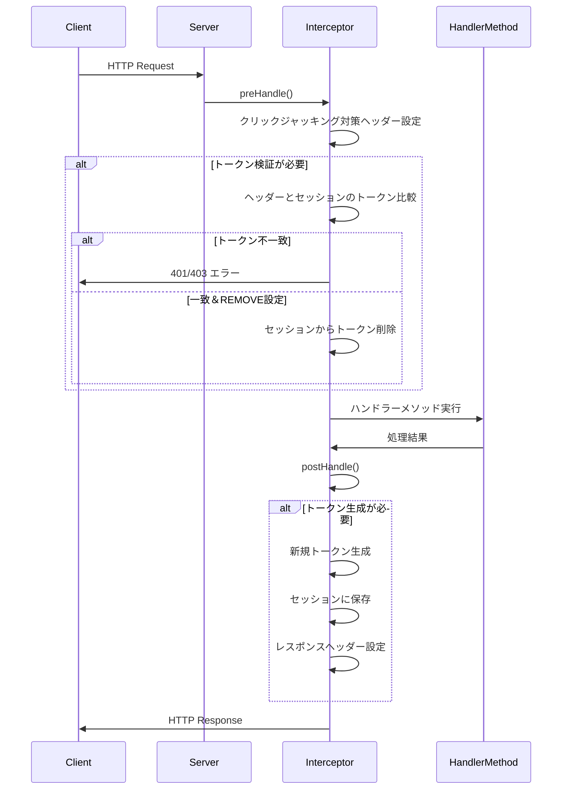
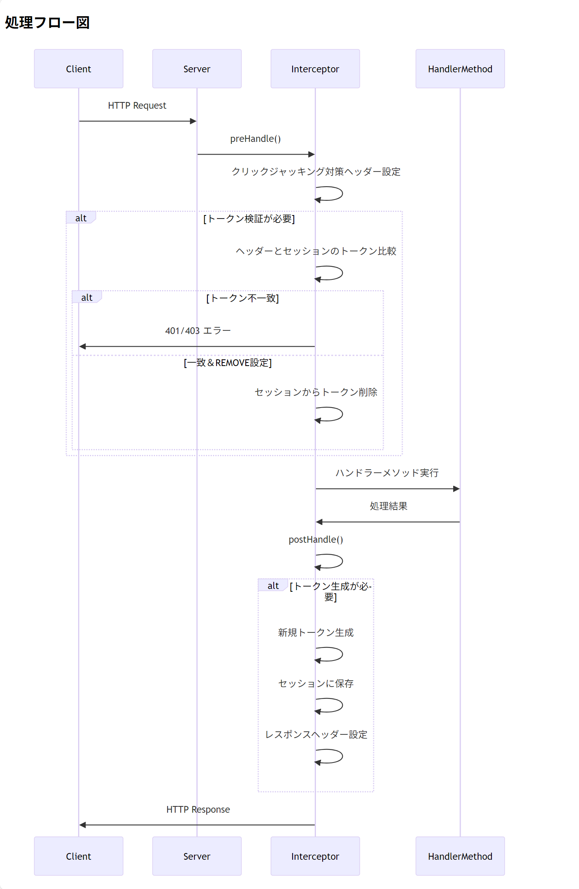

# 02_SecurityHandlerInterceptor インターセプター セキュリティのハンドラークラス

### (/orgchart-api/src/main/java/com/example/orgchart_api/security/SecurityHandlerInterceptor.java)

```java
package com.example.orgchart_api.security;

import jakarta.servlet.http.HttpServletRequest;
import jakarta.servlet.http.HttpServletResponse;
import org.apache.commons.lang3.StringUtils;
import org.slf4j.Logger;
import org.slf4j.LoggerFactory;
import org.springframework.stereotype.Component;
import org.springframework.validation.BindingResult;
import org.springframework.web.method.HandlerMethod;
import org.springframework.web.servlet.HandlerInterceptor;
import org.springframework.web.servlet.ModelAndView;
import org.springframework.web.servlet.view.json.MappingJackson2JsonView;

import java.util.Map;

/**
 * セキュリティのハンドラークラス
 * トークン保存・検証・エラー処理およびクリックジャッキング対策対応
 *
 * @author Yao Kaikyou
 * @version 1.0 (original), updated for Spring Boot 3.5.0
 */
@Component
public class SecurityHandlerInterceptor implements HandlerInterceptor {
    private static final Logger log = LoggerFactory.getLogger(SecurityHandlerInterceptor.class);

    @Override
    public boolean preHandle(HttpServletRequest request, HttpServletResponse response, Object handler) throws Exception {
        if (!(handler instanceof HandlerMethod handlerMethod)) {
            log.debug("preHandle: Handler is not HandlerMethod");
            return true;
        }
        log.debug("preHandle for method: {}", handlerMethod.getMethod().getName());

        // クリックジャッキング対策
        response.setHeader("X-FRAME-OPTIONS", "SAMEORIGIN");

        // ワンタイムトークンの検証
        TokenValidateType type = getValidateTokenType(handlerMethod);
        if (!type.equals(TokenValidateType.NONE)) {
            String tokenName = getTokenName(handlerMethod);
            String requestToken = request.getHeader(tokenName);

            if (StringUtils.isBlank(requestToken)) {
                log.warn("Token required but not provided for {}", tokenName);
                if (!shouldHandleError(handlerMethod)) {
                    response.sendError(HttpServletResponse.SC_UNAUTHORIZED, "Token required");
                    return false;
                }
                return true;
            }

            // セッションからトークン取得
            String sessionToken = (String) request.getSession().getAttribute(tokenName);

            if (!StringUtils.equals(sessionToken, requestToken)) {
                log.warn("Invalid token provided for {} (Session: {}, Request: {})",
                        tokenName, sessionToken, requestToken);
                if (!shouldHandleError(handlerMethod)) {
                    response.sendError(HttpServletResponse.SC_FORBIDDEN, "Invalid token");
                    return false;
                }
                return true;
            }

            if (type.equals(TokenValidateType.REMOVE)) {
                log.debug("Removing token after validation: {}", tokenName);
                request.getSession().removeAttribute(tokenName);
            }
        }
        return true;
    }

    @Override
    public void postHandle(HttpServletRequest request, HttpServletResponse response, Object handler, ModelAndView mav) throws Exception {
        if (!(handler instanceof HandlerMethod handlerMethod)) {
            return;
        }

        if (shouldSaveToken(handlerMethod)) {
            String tokenName = getTokenName(handlerMethod);
            String token = TokenManager.generateToken(); // TokenManagerを使用

            // セッションに保存
            request.getSession().setAttribute(tokenName, token);

            // レスポンスヘッダーに設定
            response.setHeader(tokenName, token);
            response.setHeader("Access-Control-Expose-Headers", tokenName);

            log.debug("Generated and set token: {}={}", tokenName, token);
        }
    }


    private boolean isJsonResponse(HttpServletResponse response) {
        return response.getContentType() != null && response.getContentType().contains("application/json");
    }

    private void handleJsonResponse(HttpServletRequest request, HttpServletResponse response, HandlerMethod handlerMethod) {
        String tokenName = getTokenName(handlerMethod);
        String token = generateToken();
        setSessionToken(request, tokenName, token);
        response.setHeader(tokenName, token);  // トークンをヘッダーで返す
    }

    // すべてのレスポンスタイプでトークンを設定するように変更
    private void handleTokenResponse(HttpServletRequest request, HttpServletResponse response, HandlerMethod handlerMethod) {
        String tokenName = getTokenName(handlerMethod);
        String token = generateToken();
        setSessionToken(request, tokenName, token);
        response.setHeader(tokenName, token);
        response.setHeader("Access-Control-Expose-Headers", tokenName); // CORS対応
        log.info("Generated token for {}: {}", tokenName, token);
    }

    private String getTokenName(HandlerMethod handlerMethod) {
        TokenHandler annotation = handlerMethod.getMethodAnnotation(TokenHandler.class);
        return (annotation == null || StringUtils.isEmpty(annotation.name()))
                ? TokenManager.DEFAULT_TOKEN_NAME
                : annotation.name();
    }

    private boolean shouldSaveToken(HandlerMethod handlerMethod) {
        TokenHandler annotation = handlerMethod.getMethodAnnotation(TokenHandler.class);
        return annotation != null && annotation.save();
    }

    private TokenValidateType getValidateTokenType(HandlerMethod handlerMethod) {
        TokenHandler annotation = handlerMethod.getMethodAnnotation(TokenHandler.class);
        return annotation != null ? annotation.validate() : TokenValidateType.NONE;
    }

    private boolean shouldHandleError(HandlerMethod handlerMethod) {
        TokenHandler annotation = handlerMethod.getMethodAnnotation(TokenHandler.class);
        return annotation != null && annotation.handleError();
    }

    private boolean hasFormErrors(ModelAndView mav) {
        String keyPrefix = BindingResult.MODEL_KEY_PREFIX;
        for (Map.Entry<String, Object> entry : mav.getModel().entrySet()) {
            if (entry.getKey().startsWith(keyPrefix) && entry.getValue() instanceof BindingResult result) {
                if (result.hasErrors()) {
                    return true;
                }
            }
        }
        return false;
    }

    // トークン生成・保存用ヘルパー（TokenManagerに統一する場合は削除可）
    private String generateToken() {
        return java.util.UUID.randomUUID().toString();
    }

    private void setSessionToken(HttpServletRequest request, String tokenName, String token) {
        request.getSession().setAttribute(tokenName, token);
    }
}


```

#### 已深度思考

> このクラスは Spring MVC のインタセプターとして機能し、主に以下の役割を担います：

1. クリックジャッキング対策（X-FRAME-OPTIONS ヘッダーの設定）
2. ワンタイムトークン（CSRF トークンに類似）の生成・検証
3. トークンのセッション管理とレスポンスヘッダーへの設定
   > 各メソッドの詳細な分析を行います。
   >
   > ### クラスの役割

- **セキュリティ対策**: クリックジャッキング対策のため、すべてのレスポンスに`X-FRAME-OPTIONS: SAMEORIGIN`を設定。
- **トークンベースのセキュリティ**: メソッド単位でトークンの生成・検証を行う。トークンはセッションに保存され、リクエストヘッダーでクライアントとやり取りされる。
- **アノテーションベースの設定**: `@TokenHandler`アノテーションが付与されたメソッドに対してトークン関連の処理を適用。
  > ### メソッド分析
  >
  > #### 1. `preHandle`メソッド

```java
@Override
public boolean preHandle(HttpServletRequest request, HttpServletResponse response, Object handler) throws Exception {
    // ハンドラがHandlerMethodでない場合はスキップ
    if (!(handler instanceof HandlerMethod handlerMethod)) {
        log.debug("preHandle: Handler is not HandlerMethod");
        return true;
    }
    log.debug("preHandle for method: {}", handlerMethod.getMethod().getName());
 >     // クリックジャッキング対策
    response.setHeader("X-FRAME-OPTIONS", "SAMEORIGIN");
 >     // ワンタイムトークンの検証
    TokenValidateType type = getValidateTokenType(handlerMethod);
    if (!type.equals(TokenValidateType.NONE)) {
        String tokenName = getTokenName(handlerMethod);
        String requestToken = request.getHeader(tokenName);
 >         // トークンがリクエストに含まれていない場合
        if (StringUtils.isBlank(requestToken)) {
            log.warn("Token required but not provided for {}", tokenName);
            if (!shouldHandleError(handlerMethod)) {
                response.sendError(HttpServletResponse.SC_UNAUTHORIZED, "Token required");
                return false;
            }
            return true;
        }
 >         // セッションからトークン取得
        String sessionToken = (String) request.getSession().getAttribute(tokenName);
 >         // トークンの一致を検証
        if (!StringUtils.equals(sessionToken, requestToken)) {
            log.warn("Invalid token provided for {} (Session: {}, Request: {})",
                    tokenName, sessionToken, requestToken);
            if (!shouldHandleError(handlerMethod)) {
                response.sendError(HttpServletResponse.SC_FORBIDDEN, "Invalid token");
                return false;
            }
            return true;
        }
 >         // 検証後にトークンを削除する設定の場合
        if (type.equals(TokenValidateType.REMOVE)) {
            log.debug("Removing token after validation: {}", tokenName);
            request.getSession().removeAttribute(tokenName);
        }
    }
    return true;
}
```

- **役割**: リクエストがコントローラーメソッドに到達する前に実行される処理。
- **処理内容**:
  1. **クリックジャッキング対策**: レスポンスヘッダーに`X-FRAME-OPTIONS: SAMEORIGIN`を設定。
  2. **トークン検証**:
     - `@TokenHandler`アノテーションの`validate`属性が`NONE`でない場合、トークンの検証を行う。
     - トークン名はアノテーションの`name`属性から取得（デフォルトは`TokenManager.DEFAULT_TOKEN_NAME`）。
     - リクエストヘッダーからトークンを取得し、セッションに保存されているトークンと比較。
     - トークンが存在しない、または一致しない場合はエラーレスポンスを返す（`handleError`属性が`false`の場合）。
     - 検証後にトークンを削除する設定（`REMOVE`）の場合はセッションからトークンを削除。
- **戻り値**: 検証エラーで中断する場合は`false`、それ以外は`true`（処理継続）。
  > #### 2. `postHandle`メソッド

```java
@Override
public void postHandle(HttpServletRequest request, HttpServletResponse response, Object handler, ModelAndView mav) throws Exception {
    if (!(handler instanceof HandlerMethod handlerMethod)) {
        return;
    }
 >     if (shouldSaveToken(handlerMethod)) {
        String tokenName = getTokenName(handlerMethod);
        String token = TokenManager.generateToken(); // TokenManagerを使用
 >         // セッションに保存
        request.getSession().setAttribute(tokenName, token);
 >         // レスポンスヘッダーに設定
        response.setHeader(tokenName, token);
        response.setHeader("Access-Control-Expose-Headers", tokenName);
 >         log.debug("Generated and set token: {}={}", tokenName, token);
    }
}
```

- **役割**: コントローラーメソッドの実行後、ビューのレンダリング前に実行される処理。
- **処理内容**:
  - `@TokenHandler`アノテーションの`save`属性が`true`の場合、新しいトークンを生成。
  - トークン名はアノテーションの`name`属性から取得。
  - 生成したトークンをセッションに保存し、レスポンスヘッダーに設定。
  - CORS 対応のため`Access-Control-Expose-Headers`にもトークン名を設定（クライアントがヘッダーを読み取れるように）。
    > #### プライベートヘルパーメソッド群
    >
    > ##### `getTokenName(HandlerMethod handlerMethod)`

```java
private String getTokenName(HandlerMethod handlerMethod) {
    TokenHandler annotation = handlerMethod.getMethodAnnotation(TokenHandler.class);
    return (annotation == null || StringUtils.isEmpty(annotation.name()))
            ? TokenManager.DEFAULT_TOKEN_NAME
            : annotation.name();
}
```

- **役割**: メソッドの`@TokenHandler`アノテーションからトークン名を取得。未指定の場合はデフォルト名を返す。
  > ##### `shouldSaveToken(HandlerMethod handlerMethod)`

```java
private boolean shouldSaveToken(HandlerMethod handlerMethod) {
    TokenHandler annotation = handlerMethod.getMethodAnnotation(TokenHandler.class);
    return annotation != null && annotation.save();
}
```

- **役割**: メソッドに`@TokenHandler`が付与され、かつ`save`属性が`true`かどうかを判定。
  > ##### `getValidateTokenType(HandlerMethod handlerMethod)`

```java
private TokenValidateType getValidateTokenType(HandlerMethod handlerMethod) {
    TokenHandler annotation = handlerMethod.getMethodAnnotation(TokenHandler.class);
    return annotation != null ? annotation.validate() : TokenValidateType.NONE;
}
```

- **役割**: メソッドの`@TokenHandler`アノテーションからトークン検証タイプを取得。未指定の場合は`NONE`を返す。
  > ##### `shouldHandleError(HandlerMethod handlerMethod)`

```java
private boolean shouldHandleError(HandlerMethod handlerMethod) {
    TokenHandler annotation = handlerMethod.getMethodAnnotation(TokenHandler.class);
    return annotation != null && annotation.handleError();
}
```

- **役割**: メソッドに`@TokenHandler`が付与され、かつ`handleError`属性が`true`かどうかを判定。これが`true`の場合、トークンエラーが発生しても処理を続行（コントローラー内でエラー処理を行う）。
  > ##### `hasFormErrors(ModelAndView mav)`

```java
private boolean hasFormErrors(ModelAndView mav) {
    String keyPrefix = BindingResult.MODEL_KEY_PREFIX;
    for (Map.Entry<String, Object> entry : mav.getModel().entrySet()) {
        if (entry.getKey().startsWith(keyPrefix) && entry.getValue() instanceof BindingResult result) {
            if (result.hasErrors()) {
                return true;
            }
        }
    }
    return false;
}
```

- **役割**: モデルにバインディングエラー（`BindingResult`）が含まれているかチェック。このメソッドは現在`postHandle`では使用されていないが、バリデーションエラー時にトークンを再生成しないなどの用途が考えられる。
  > ##### トークン生成・保存用ヘルパー

```java
private String generateToken() {
    return java.util.UUID.randomUUID().toString();
}
 > private void setSessionToken(HttpServletRequest request, String tokenName, String token) {
    request.getSession().setAttribute(tokenName, token);
}
```

- **役割**: トークンの生成（UUID）とセッションへの保存。ただし、`postHandle`では`TokenManager.generateToken()`を使用しているため、これらのメソッドは現在使用されていない可能性がある。
  > ### クラスのまとめ
- **セキュリティ対策**: クリックジャッキング対策とカスタムトークンによる CSRF 対策を実施。
- **柔軟な設定**: `@TokenHandler`アノテーションにより、メソッド単位でトークンの生成・検証を制御。
- **ステートフルなトークン管理**: トークンをセッションに保存し、リクエストヘッダーを介してクライアントと同期。
- **エラーハンドリング**: トークンエラー時の処理をアノテーション設定に基づいて制御（即時エラーレスポンス or コントローラーでの処理）。
  > ### 注意点
- `TokenManager`クラスが存在する場合、トークン生成は`TokenManager.generateToken()`で行われている。ヘルパーメソッドの`generateToken()`は使用されていない可能性がある。
- `postHandle`メソッドでトークンを生成する際、`TokenManager`を使用しているが、このクラスの実装は提供されていない。
- `hasFormErrors`メソッドは現在使用されていない。バリデーションエラー時のトークン再生成などのロジックが必要な場合に使用できる。

## SecurityHandlerInterceptor クラスの分析

### クラスの役割

このクラスは Spring MVC の**ハンドラーインターセプター**として実装されており、主に以下のセキュリティ機能を提供します：

1. **クリックジャッキング対策**：全レスポンスに X-FRAME-OPTIONS ヘッダーを設定
2. **ワンタイムトークン管理**：
   - CSRF 対策トークンの生成と検証
   - トークンのセッション保存とレスポンスヘッダーへの設定
3. **アノテーションベースのセキュリティ制御**：
   - `@TokenHandler`アノテーションによるメソッド単位の設定
4. **CORS 対応**：カスタムヘッダーのクライアント公開設定

### 主要メソッドの詳細分析

---

#### 1. `preHandle()` メソッド

```java
@Override
public boolean preHandle(HttpServletRequest request, HttpServletResponse response, Object handler) {
    // 実装内容
}
```

- **呼び出しタイミング**: コントローラーメソッド実行前
- **主な機能**:
  - クリックジャッキング対策ヘッダー設定
    ```java
    response.setHeader("X-FRAME-OPTIONS", "SAMEORIGIN");
    ```
  - `@TokenHandler`アノテーションに基づくトークン検証
    - リクエストヘッダーとセッションのトークン比較
    - トークン検証タイプ（`TokenValidateType`）による処理分岐
    - エラー時の HTTP ステータス返却（401/403）
- **処理フロー**:
  1. ハンドラーが`HandlerMethod`か確認
  2. X-FRAME-OPTIONS ヘッダー設定
  3. トークン検証が必要な場合：
     - リクエストからトークン取得
     - セッションのトークンと比較
     - 不一致時はエラーレスポンス返却
  4. 検証後にトークン削除（REMOVE タイプの場合）

---

#### 2. `postHandle()` メソッド

```java
@Override
public void postHandle(HttpServletRequest request, HttpServletResponse response,
                      Object handler, ModelAndView mav) {
    // 実装内容
}
```

- **呼び出しタイミング**: コントローラーメソッド実行後、ビュー描画前
- **主な機能**:
  - `@TokenHandler(save=true)`指定時に新しいトークン生成
  - トークンのセッション保存とレスポンスヘッダー設定
  - CORS 対応ヘッダー追加
    ```java
    response.setHeader("Access-Control-Expose-Headers", tokenName);
    ```
- **処理フロー**:
  1. トークン生成が必要なメソッドか判定
  2. `TokenManager`でトークン生成
  3. セッションにトークン保存
  4. レスポンスヘッダーにトークン設定
  5. CORS 対応ヘッダー追加

---

### プライベートヘルパーメソッド群

#### トークン関連メソッド

```java
private String getTokenName(HandlerMethod handlerMethod) {
    // @TokenHandlerからトークン名取得（デフォルト値あり）
}

private boolean shouldSaveToken(HandlerMethod handlerMethod) {
    // @TokenHandler.save値の取得
}

private TokenValidateType getValidateTokenType(HandlerMethod handlerMethod) {
    // @TokenHandler.validate値の取得
}

private boolean shouldHandleError(HandlerMethod handlerMethod) {
    // @TokenHandler.handleError値の取得
}
```

- **役割**: `@TokenHandler`アノテーションの属性値取得
- **デフォルト動作**:
  - トークン名: `TokenManager.DEFAULT_TOKEN_NAME`
  - 検証タイプ: `TokenValidateType.NONE`

---

#### トークン操作メソッド

```java
private String generateToken() {
    return UUID.randomUUID().toString();
}

private void setSessionToken(HttpServletRequest request, String tokenName, String token) {
    request.getSession().setAttribute(tokenName, token);
}
```

- **役割**: トークンの生成とセッション保存
- **注意**: `postHandle()`では`TokenManager.generateToken()`を使用しているため、これらのメソッドは現在使用されていない可能性あり

---

#### エラーチェックメソッド

```java
private boolean hasFormErrors(ModelAndView mav) {
    // BindingResultからフォームエラーの有無をチェック
}
```

- **役割**: モデルにバリデーションエラーが含まれているか確認
- **キー識別**: `BindingResult.MODEL_KEY_PREFIX`（"org.springframework.validation.BindingResult."）で始まる属性
- **現在の使用箇所**: クラス内で呼び出されていない（将来の拡張用？）

---

### アノテーション連携の仕組み

クラスの動作は`@TokenHandler`アノテーションと強く連携：

```java
@Target(ElementType.METHOD)
@Retention(RetentionPolicy.RUNTIME)
public @interface TokenHandler {
    String name() default "";
    boolean save() default false;
    TokenValidateType validate() default TokenValidateType.NONE;
    boolean handleError() default false;
}
```

- **属性の役割**:
  - `name`: カスタムトークン名（デフォルトは共通トークン）
  - `save`: トークン生成フラグ
  - `validate`: トークン検証タイプ（NONE/STANDARD/REMOVE）
  - `handleError`: エラーをコントローラーで処理するか

---

### 処理フロー図





### 特筆すべき設計特徴

1. **柔軟なトークン管理**
   - メソッド単位で異なるトークン名を設定可能
   - 検証後のトークン削除オプション（REMOVE）
2. **エラーハンドリングの選択肢**

   - インターセプター即時返却 vs コントローラー処理

3. **CORS 対応の組み込み**

   - `Access-Control-Expose-Headers`の自動設定

4. **拡張性の考慮**
   - フォームエラーチェックメソッド（未使用）
   - カスタムトークン生成ロジックの分離ポイント

> **注意点**: 一部のヘルパーメソッド（`generateToken()`, `setSessionToken()`）は`TokenManager`クラスと機能が重複しており、実装の統一性に注意が必要です。
