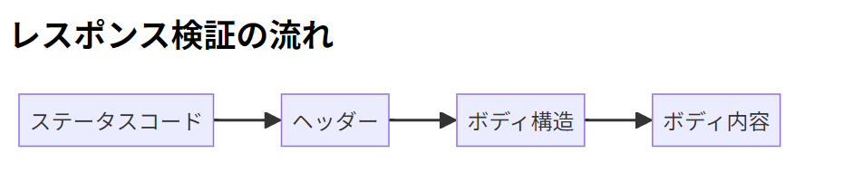
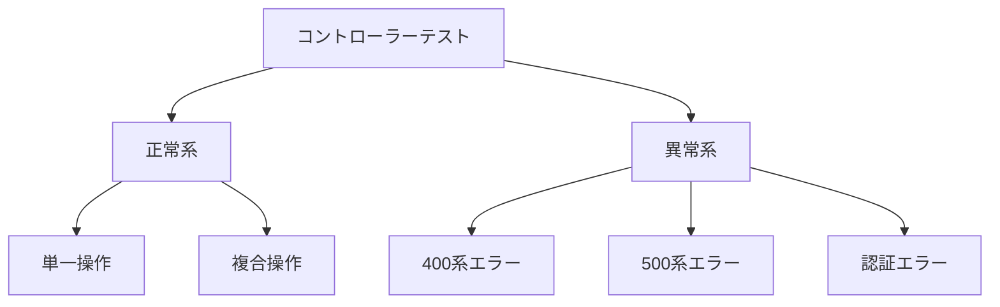
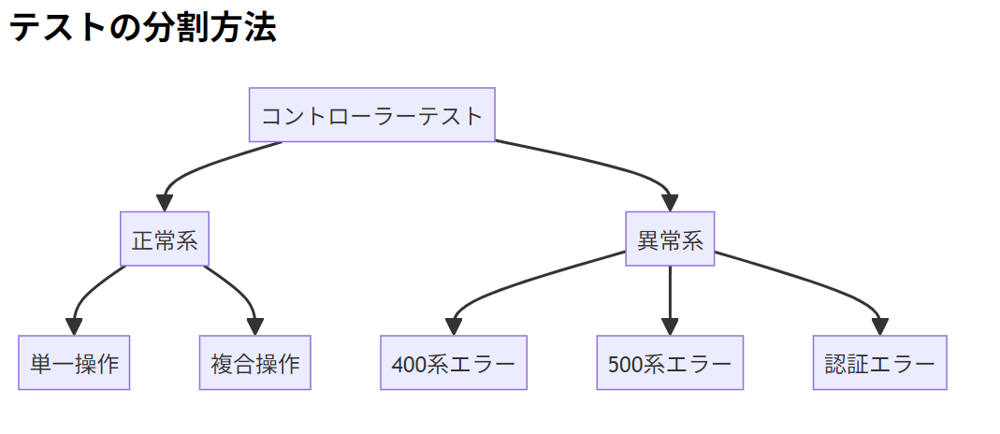

<span style="color: #007acc; font-weight: bold; font-size: 1.5rem;">UserControllerIntegrationTest のテスト（統合テスト）</span>

まずは`src/test/resources/application-test.properties`を更新する

```properties
# PostgreSQL接続設定
spring.datasource.url=jdbc:postgresql://localhost:5432/testirdb
spring.datasource.username=postgres
spring.datasource.password=AM2013japan
spring.datasource.driver-class-name=org.postgresql.Driver

# テスト用設定
spring.test.database.replace=none

# UserControllerIntegrationTestテスト用セキュリティ設定
spring.security.user.name=admin
spring.security.user.password=password
spring.security.user.roles=ADMIN

```

## UserControllerIntegrationTest のテスト（統合テスト）完成版

`src/test/java/com/example/orgchart_api/controller/UserControllerIntegrationTest.java`

```java
package com.example.orgchart_api.controller;

import com.example.orgchart_api.dto.UserDto;
import org.junit.jupiter.api.AfterEach;
import org.junit.jupiter.api.BeforeEach;
import org.junit.jupiter.api.Test;
import org.springframework.beans.factory.annotation.Autowired;
import org.springframework.boot.test.context.SpringBootTest;
import org.springframework.boot.test.web.client.TestRestTemplate;
import org.springframework.http.*;
import org.springframework.jdbc.core.JdbcTemplate;
import org.springframework.test.context.ActiveProfiles;
import java.net.URI;
import java.time.LocalDate;
import java.util.Base64;
import java.util.List;
import static org.junit.jupiter.api.Assertions.*;

@SpringBootTest(webEnvironment = SpringBootTest.WebEnvironment.RANDOM_PORT)
@ActiveProfiles("test")
public class UserControllerIntegrationTest {

    @Autowired
    private TestRestTemplate restTemplate;

    @Autowired
    private JdbcTemplate jdbcTemplate;

    private UserDto testUserDto1;
    private UserDto testUserDto2;
    private HttpHeaders authHeaders;

    @BeforeEach
    public void setUp() {
        // 認証ヘッダーの作成（Basic認証）
        authHeaders = new HttpHeaders();
        String credentials = "admin:password"; // application-test.properties と一致
        String base64Credentials = Base64.getEncoder().encodeToString(credentials.getBytes());
        authHeaders.set("Authorization", "Basic " + base64Credentials);

        // テストユーザー1の設定
        testUserDto1 = new UserDto();
        testUserDto1.setCompanyCd("001");
        testUserDto1.setEmployeeCd("E000001");
        testUserDto1.setUserNm("テストユーザー1");
        testUserDto1.setUserNmKana("てすとゆーざー1");
        testUserDto1.setMailAddress("user1@example.com");
        testUserDto1.setPassword("Password1!");
        testUserDto1.setPin("12345678");
        testUserDto1.setBirthday(LocalDate.of(1990, 1, 1));

        // テストユーザー2の設定
        testUserDto2 = new UserDto();
        testUserDto2.setCompanyCd("002");
        testUserDto2.setEmployeeCd("E000002");
        testUserDto2.setUserNm("テストユーザー2");
        testUserDto2.setUserNmKana("てすとゆーざー2");
        testUserDto2.setMailAddress("user2@example.com");
        testUserDto2.setPassword("Password2@");
        testUserDto2.setPin("87654321");
        testUserDto2.setBirthday(LocalDate.of(1995, 5, 15));
    }

    @AfterEach
    public void tearDown() {
        // 各テスト後にDBクリーンアップ
        jdbcTemplate.execute("TRUNCATE TABLE trn_user RESTART IDENTITY CASCADE");
    }

    @Test
    public void createUser_shouldReturn201WithLocationHeader() {
        // 認証付きリクエストの作成
        HttpEntity<UserDto> request = new HttpEntity<>(testUserDto1, authHeaders);
        ResponseEntity<UserDto> response = restTemplate.exchange(
                "/api/users",
                HttpMethod.POST,
                request,
                UserDto.class
        );

        // レスポンス検証
        assertEquals(HttpStatus.CREATED, response.getStatusCode());
        assertNotNull(response.getHeaders().getLocation());

        UserDto createdUser = response.getBody();
        assertNotNull(createdUser);
        assertNotNull(createdUser.getUserId());
        assertEquals("テストユーザー1", createdUser.getUserNm());

        // Locationヘッダから取得したユーザー情報を検証（認証付き）
        URI location = response.getHeaders().getLocation();
        HttpEntity<?> getRequest = new HttpEntity<>(authHeaders);
        ResponseEntity<UserDto> getResponse = restTemplate.exchange(
                location,
                HttpMethod.GET,
                getRequest,
                UserDto.class
        );
        assertEquals(HttpStatus.OK, getResponse.getStatusCode());
        assertEquals(createdUser.getUserId(), getResponse.getBody().getUserId());
    }

    @Test
    public void getUserById_shouldReturn200WithUserDetails() {
        // 認証付きでユーザー作成
        HttpEntity<UserDto> createRequest = new HttpEntity<>(testUserDto1, authHeaders);
        ResponseEntity<UserDto> createResponse = restTemplate.exchange(
                "/api/users",
                HttpMethod.POST,
                createRequest,
                UserDto.class
        );
        UserDto createdUser = createResponse.getBody();
        Long createdUserId = createdUser.getUserId();

        // 認証付きでユーザー取得
        HttpEntity<?> getRequest = new HttpEntity<>(authHeaders);
        ResponseEntity<UserDto> response = restTemplate.exchange(
                "/api/users/" + createdUserId,
                HttpMethod.GET,
                getRequest,
                UserDto.class
        );

        // レスポンス検証
        assertEquals(HttpStatus.OK, response.getStatusCode());
        UserDto user = response.getBody();
        assertNotNull(user);
        assertEquals("user1@example.com", user.getMailAddress());
        assertEquals(LocalDate.of(1990, 1, 1), user.getBirthday());
    }

    @Test
    public void getActiveUsersByCompany_shouldReturnOnlyActiveUsers() {
        // 認証付きでユーザー作成
        HttpEntity<UserDto> request1 = new HttpEntity<>(testUserDto1, authHeaders);
        HttpEntity<UserDto> request2 = new HttpEntity<>(testUserDto2, authHeaders);
        restTemplate.exchange("/api/users", HttpMethod.POST, request1, UserDto.class);
        restTemplate.exchange("/api/users", HttpMethod.POST, request2, UserDto.class);

        // 認証付きでユーザーリスト取得
        HttpEntity<?> getRequest = new HttpEntity<>(authHeaders);
        ResponseEntity<List> response = restTemplate.exchange(
                "/api/users/company/001",
                HttpMethod.GET,
                getRequest,
                List.class
        );

        // レスポンス検証
        assertEquals(HttpStatus.OK, response.getStatusCode());
        List<?> users = response.getBody();
        assertNotNull(users);
        assertEquals(1, users.size()); // 会社001のユーザー1件のみ
    }

    @Test
    public void updateUser_shouldUpdateAllFieldsSuccessfully() {
        // 認証付きでユーザー作成
        HttpEntity<UserDto> createRequest = new HttpEntity<>(testUserDto1, authHeaders);
        ResponseEntity<UserDto> createResponse = restTemplate.exchange(
                "/api/users",
                HttpMethod.POST,
                createRequest,
                UserDto.class
        );
        UserDto createdUser = createResponse.getBody();
        Long createdUserId = createdUser.getUserId();

        // 更新データ準備
        UserDto updateDto = new UserDto();
        updateDto.setUserId(createdUserId);
        updateDto.setCompanyCd("001");
        updateDto.setEmployeeCd("E000001");
        updateDto.setUserNm("更新ユーザー");
        updateDto.setUserNmKana("こうしんゆーざー");
        updateDto.setMailAddress("updated@example.com");
        updateDto.setPassword("NewPassword123");
        updateDto.setPin("99998888");
        updateDto.setBirthday(LocalDate.of(2000, 1, 1));

        // PUTリクエスト（認証付き）
        HttpEntity<UserDto> requestEntity = new HttpEntity<>(updateDto, authHeaders);
        ResponseEntity<UserDto> response = restTemplate.exchange(
                "/api/users/" + createdUserId,
                HttpMethod.PUT,
                requestEntity,
                UserDto.class
        );

        // レスポンス検証
        assertEquals(HttpStatus.OK, response.getStatusCode());
        UserDto updatedUser = response.getBody();
        assertNotNull(updatedUser);
        assertEquals("更新ユーザー", updatedUser.getUserNm());
        assertEquals("updated@example.com", updatedUser.getMailAddress());
    }

    @Test
    public void deleteUser_shouldReturn204AndMarkAsDeleted() {
        // 認証付きでユーザー作成
        HttpEntity<UserDto> createRequest = new HttpEntity<>(testUserDto1, authHeaders);
        ResponseEntity<UserDto> createResponse = restTemplate.exchange(
                "/api/users",
                HttpMethod.POST,
                createRequest,
                UserDto.class
        );
        UserDto createdUser = createResponse.getBody();
        Long createdUserId = createdUser.getUserId();

        // DELETEリクエスト（認証付き）
        HttpEntity<?> deleteRequest = new HttpEntity<>(authHeaders);
        ResponseEntity<Void> deleteResponse = restTemplate.exchange(
                "/api/users/" + createdUserId + "?updateUser=ADMIN",
                HttpMethod.DELETE,
                deleteRequest,
                Void.class
        );

        // レスポンス検証
        assertEquals(HttpStatus.NO_CONTENT, deleteResponse.getStatusCode());

        // 削除済みユーザーが取得できないことを確認（認証付き）
        HttpEntity<?> getRequest = new HttpEntity<>(authHeaders);
        ResponseEntity<String> getResponse = restTemplate.exchange(
                "/api/users/" + createdUserId,
                HttpMethod.GET,
                getRequest,
                String.class
        );
        assertEquals(HttpStatus.NOT_FOUND, getResponse.getStatusCode());
    }

    @Test
    public void resetPassword_shouldReturn204() {
        // 認証付きでユーザー作成
        HttpEntity<UserDto> createRequest = new HttpEntity<>(testUserDto1, authHeaders);
        ResponseEntity<UserDto> createResponse = restTemplate.exchange(
                "/api/users",
                HttpMethod.POST,
                createRequest,
                UserDto.class
        );
        UserDto createdUser = createResponse.getBody();
        Long createdUserId = createdUser.getUserId();

        // POSTリクエスト（パスワードリセット、認証付き）
        HttpEntity<?> resetRequest = new HttpEntity<>(authHeaders);
        ResponseEntity<Void> response = restTemplate.exchange(
                "/api/users/" + createdUserId + "/reset-password",
                HttpMethod.POST,
                resetRequest,
                Void.class
        );

        // レスポンス検証
        assertEquals(HttpStatus.NO_CONTENT, response.getStatusCode());
    }

    // === 異常系テスト ===
    @Test
    public void getUserById_shouldReturn404WhenNotFound() {
        // 認証付きで存在しないIDをリクエスト
        HttpEntity<?> getRequest = new HttpEntity<>(authHeaders);
        ResponseEntity<String> response = restTemplate.exchange(
                "/api/users/999",
                HttpMethod.GET,
                getRequest,
                String.class
        );

        assertEquals(HttpStatus.NOT_FOUND, response.getStatusCode());
        // 実際のメッセージに合わせて修正: "ユーザーが見つかりません: 999" を含むかどうか
        assertTrue(response.getBody().contains("ユーザーが見つかりません: 999"));
    }

    @Test
    public void createUser_shouldReturn409WhenDuplicateEmail() {
        // 初回登録（認証付き）
        HttpEntity<UserDto> firstRequest = new HttpEntity<>(testUserDto1, authHeaders);
        restTemplate.exchange("/api/users", HttpMethod.POST, firstRequest, UserDto.class);

        // メール重複で登録試行
        UserDto duplicateUser = new UserDto();
        duplicateUser.setCompanyCd("003");
        duplicateUser.setEmployeeCd("E000003"); // 異なる社員コード
        duplicateUser.setUserNm("重複ユーザー");
        duplicateUser.setMailAddress("user1@example.com"); // 重複メール
        duplicateUser.setPassword("Pass1234");
        duplicateUser.setPin("11223344");
        duplicateUser.setBirthday(LocalDate.of(2000, 1, 1));

        // 重複リクエスト送信（認証付き）
        HttpEntity<UserDto> duplicateRequest = new HttpEntity<>(duplicateUser, authHeaders);
        ResponseEntity<String> response = restTemplate.exchange(
                "/api/users",
                HttpMethod.POST,
                duplicateRequest,
                String.class
        );

        assertEquals(HttpStatus.CONFLICT, response.getStatusCode());
        // 実際のエラーメッセージに合わせて修正
        assertTrue(response.getBody().contains("このメールアドレスは既に使用されています"));
    }

    @Test
    public void updateUser_shouldReturn400WhenIdMismatch() {
        // 認証付きでユーザー作成
        HttpEntity<UserDto> createRequest = new HttpEntity<>(testUserDto1, authHeaders);
        ResponseEntity<UserDto> createResponse = restTemplate.exchange(
                "/api/users",
                HttpMethod.POST,
                createRequest,
                UserDto.class
        );
        UserDto createdUser = createResponse.getBody();
        Long createdUserId = createdUser.getUserId();

        // 必須フィールドを含む更新用DTOを作成（不正ID）
        UserDto updateDto = new UserDto();
        updateDto.setUserId(999L); // 不正ID
        // 必須フィールドを設定（作成したユーザーの情報をコピーし、重複しないように一部変更）
        updateDto.setCompanyCd(createdUser.getCompanyCd());
        updateDto.setEmployeeCd(createdUser.getEmployeeCd());
        updateDto.setUserNm(createdUser.getUserNm());
        updateDto.setMailAddress("updated_" + createdUser.getMailAddress()); // メールアドレスを変更して重複回避
        updateDto.setPassword(createdUser.getPassword()); // パスワードも設定

        // PUTリクエスト（認証付き）
        HttpEntity<UserDto> requestEntity = new HttpEntity<>(updateDto, authHeaders);
        ResponseEntity<String> response = restTemplate.exchange(
                "/api/users/" + createdUserId,
                HttpMethod.PUT,
                requestEntity,
                String.class
        );

        // ステータスコードが400であることを確認
        assertEquals(HttpStatus.BAD_REQUEST, response.getStatusCode());
        // 実際のエラーメッセージに基づいてアサーション
        assertTrue(response.getBody().contains("ユーザーIDが不正です"));
    }

    @Test
    public void deleteUser_shouldReturn404WhenAlreadyDeleted() {
        // 認証付きでユーザー作成
        HttpEntity<UserDto> createRequest = new HttpEntity<>(testUserDto1, authHeaders);
        ResponseEntity<UserDto> createResponse = restTemplate.exchange(
                "/api/users",
                HttpMethod.POST,
                createRequest,
                UserDto.class
        );
        UserDto createdUser = createResponse.getBody();
        Long createdUserId = createdUser.getUserId();

        // 1回目の削除（認証付き）
        HttpEntity<?> deleteRequest = new HttpEntity<>(authHeaders);
        restTemplate.exchange(
                "/api/users/" + createdUserId + "?updateUser=ADMIN",
                HttpMethod.DELETE,
                deleteRequest,
                Void.class
        );

        // 削除済みユーザーを再度削除
        ResponseEntity<String> response = restTemplate.exchange(
                "/api/users/" + createdUserId + "?updateUser=ADMIN",
                HttpMethod.DELETE,
                deleteRequest,
                String.class
        );

        assertEquals(HttpStatus.NOT_FOUND, response.getStatusCode());
    }
}

```

#### 已深度思考

````
コードが複雑に感じる主な原因：
1. 認証ヘッダーの設定
2. HTTPリクエストの構築
3. レスポンスの検証（ステータスコード、ヘッダー、ボディ）
4. データベースの状態検証

初心者向け段階的実装手順：

### ステップ1: テスト環境の理解（1日）
- `TestRestTemplate`の基本的使用法
- HTTPステータスコードの基礎知識（200, 201, 400など）
- Basic認証の仕組み

### ステップ2: テストデータ準備の共通化（1日）
- テストユーザー作成メソッドをヘルパー化
```java
private UserDto createTestUserDto(String companyCd, String employeeCd, String email) {
   UserDto dto = new UserDto();
   dto.setCompanyCd(companyCd);
   dto.setEmployeeCd(employeeCd);
   dto.setUserNm("テストユーザー");
   dto.setUserNmKana("てすとゆーざー");
   dto.setMailAddress(email);
   dto.setPassword("Pass1234!");
   dto.setPin("12345678");
   dto.setBirthday(LocalDate.of(1990, 1, 1));
   return dto;
}
````

### ステップ 3: 単純な GET テストから実装（2 日）

```java
@Test
public void 健康チェックエンドポイントのテスト() {
    ResponseEntity<String> response = restTemplate.getForEntity("/actuator/health", String.class);
    assertEquals(HttpStatus.OK, response.getStatusCode());
    assertTrue(response.getBody().contains("UP"));
}
```

### ステップ 4: POST によるリソース作成（2 日）

```java
@Test
public void ユーザー作成の基本テスト() {
    // リクエスト準備
    HttpEntity<UserDto> request = new HttpEntity<>(testUserDto1, authHeaders);

    // 実行
    ResponseEntity<UserDto> response = restTemplate.postForEntity(
        "/api/users",
        request,
        UserDto.class
    );

    // 検証
    assertEquals(HttpStatus.CREATED, response.getStatusCode());
    assertNotNull(response.getBody().getUserId());
}
```

### ステップ 5: レスポンス詳細の検証（1 日）

- レスポンスボディの各フィールドをアサーション
- ロケーションヘッダの検証

### ステップ 6: 異常系テストの追加（2 日）

- 重複登録時の 409 コンフリクト
- 存在しないリソースへのアクセス時の 404

### テスト実装のコツ

1. **1 テストメソッド 1 アサーション原則**
   複数のアサーションが必要な場合は、関連するものだけに

2. **レスポンス検証の流れ**

   ```mermaid
   graph LR
   A[ステータスコード] --> B[ヘッダー]
   B --> C[ボディ構造]
   C --> D[ボディ内容]
   ```

   

3. **デバッグ用出力**

   ```java
   System.out.println("レスポンスボディ: " + response.getBody());
   ```

4. **段階的テスト対象拡大**
   - 正常系 → 異常系
   - 単機能 → 複合機能
   - 単体操作 → ワークフロー

### 具体例：シンプルな GET テスト分解

```java
@Test
public void testGetUserById() {
    // Step1: テストユーザー作成（POST）
    UserDto createdUser = createUserViaApi(testUserDto1);

    // Step2: GETリクエスト
    ResponseEntity<UserDto> response = restTemplate.exchange(
        "/api/users/" + createdUser.getUserId(),
        HttpMethod.GET,
        new HttpEntity<>(authHeaders), // 認証ヘッダ付き
        UserDto.class
    );

    // Step3: ステータスコード検証
    assertEquals(HttpStatus.OK, response.getStatusCode());

    // Step4: ボディ内容検証
    UserDto user = response.getBody();
    assertEquals(createdUser.getUserId(), user.getUserId());
    assertEquals("テストユーザー1", user.getUserNm());
}
```

### テストデータ管理アドバイス

1. **テスト毎に独立したデータ**

   - `@AfterEach`でのデータ削除を徹底
   - テスト実行順序に依存しない設計

2. **認証情報の一元管理**

   ```java
   private HttpHeaders createAuthHeaders(String username, String password) {
       HttpHeaders headers = new HttpHeaders();
       String credentials = username + ":" + password;
       String base64Creds = Base64.getEncoder().encodeToString(credentials.getBytes());
       headers.set("Authorization", "Basic " + base64Creds);
       return headers;
   }
   ```

3. **API 呼び出しのヘルパーメソッド化**
   ```java
   private UserDto createUserViaApi(UserDto userDto) {
       HttpEntity<UserDto> request = new HttpEntity<>(userDto, authHeaders);
       ResponseEntity<UserDto> response = restTemplate.postForEntity(
           "/api/users", request, UserDto.class);
       return response.getBody();
   }
   ```

### 学習ロードマップ

| 週  | 目標                      | 内容例                          |
| --- | ------------------------- | ------------------------------- |
| 1   | 環境構築・単純 GET テスト | ヘルスチェック API テスト       |
| 2   | POST テスト               | ユーザー作成 API の正常系テスト |
| 3   | レスポンス詳細検証        | 作成後のユーザー取得テスト      |
| 4   | 異常系テスト              | 400 エラー・404 エラーのテスト  |
| 5   | ワークフローテスト        | 作成 → 更新 → 削除の連携テスト  |

これらのステップを踏まえて、焦らず少しずつテスト範囲を広げていくことをお勧めします。
テストが失敗した場合は、原因を特定するプロセス自体が重要な学習体験になります。

````

## コントローラーテスト段階的実装ガイド

コントローラーテストは初めての方には確かに複雑ですが、以下の手順で進めれば確実にマスターできます。1ヶ月計画でステップバイステップで学びましょう。

### ステップバイステップ実装計画（4週間）

#### 第1週: テスト環境の基本理解
1. **TestRestTemplateの基本（2日）**
   ```java
   @Test
   void RestTemplate基本操作() {
       // GETリクエスト
       ResponseEntity<String> response = restTemplate.getForEntity("/", String.class);
       assertEquals(200, response.getStatusCodeValue());
   }
````

2. **認証ヘッダーの作成（2 日）**

   ```java
   @BeforeEach
   void setupAuth() {
       HttpHeaders headers = new HttpHeaders();
       String credentials = "user:password";
       String base64Creds = Base64.getEncoder().encodeToString(credentials.getBytes());
       headers.set("Authorization", "Basic " + base64Creds);
       authHeaders = headers;
   }
   ```

3. **テストデータの作成（1 日）**
   ```java
   private UserDto createTestUser(String companyCd, String employeeCd, String email) {
       UserDto user = new UserDto();
       user.setCompanyCd(companyCd);
       user.setEmployeeCd(employeeCd);
       user.setMailAddress(email);
       // ...その他のフィールド
       return user;
   }
   ```

#### 第 2 週: 基本 CRUD 操作のテスト

1. **GET リクエストのテスト（2 日）**

   ```java
   @Test
   void ユーザー取得テスト() {
       HttpEntity<?> request = new HttpEntity<>(authHeaders);
       ResponseEntity<UserDto> response = restTemplate.exchange(
           "/api/users/1",
           HttpMethod.GET,
           request,
           UserDto.class);

       assertEquals(200, response.getStatusCodeValue());
   }
   ```

2. **POST リクエストのテスト（3 日）**

   ```java
   @Test
   void ユーザー作成テスト() {
       UserDto newUser = createTestUser("001", "E001", "new@example.com");
       HttpEntity<UserDto> request = new HttpEntity<>(newUser, authHeaders);

       ResponseEntity<UserDto> response = restTemplate.exchange(
           "/api/users",
           HttpMethod.POST,
           request,
           UserDto.class);

       assertEquals(201, response.getStatusCodeValue());
       assertNotNull(response.getHeaders().getLocation());
   }
   ```

#### 第 3 週: 応用操作と異常系テスト

1. **PUT/DELETE のテスト（2 日）**

   ```java
   @Test
   void ユーザー更新テスト() {
       // まずユーザー作成
       UserDto created = createUserViaAPI(testUserDto1);

       // 更新データ準備
       UserDto updateData = createTestUser("001", "E001", "updated@example.com");
       updateData.setUserId(created.getUserId());

       HttpEntity<UserDto> request = new HttpEntity<>(updateData, authHeaders);
       ResponseEntity<UserDto> response = restTemplate.exchange(
           "/api/users/" + created.getUserId(),
           HttpMethod.PUT,
           request,
           UserDto.class);

       assertEquals(200, response.getStatusCodeValue());
   }
   ```

2. **異常系テスト（3 日）**

   ```java
   @Test
   void 存在しないユーザー取得() {
       HttpEntity<?> request = new HttpEntity<>(authHeaders);
       ResponseEntity<String> response = restTemplate.exchange(
           "/api/users/999",
           HttpMethod.GET,
           request,
           String.class);

       assertEquals(404, response.getStatusCodeValue());
       assertTrue(response.getBody().contains("見つかりません"));
   }
   ```

#### 第 4 週: 統合テストとリファクタリング

1. **フルライフサイクルテスト（3 日）**

   ```java
   @Test
   void ユーザーライフサイクル() {
       // 作成
       UserDto created = createUserViaAPI(testUserDto1);

       // 取得
       UserDto retrieved = getUserViaAPI(created.getUserId());
       assertEquals(created.getUserId(), retrieved.getUserId());

       // 更新
       UserDto updated = updateUserViaAPI(retrieved);
       assertEquals("更新後名前", updated.getUserNm());

       // 削除
       deleteUserViaAPI(updated.getUserId());

       // 削除確認
       assertThrows(ResourceNotFoundException.class, () ->
           getUserViaAPI(updated.getUserId()));
   }
   ```

2. **ヘルパーメソッドの作成（2 日）**

   ```java
   private UserDto createUserViaAPI(UserDto user) {
       HttpEntity<UserDto> request = new HttpEntity<>(user, authHeaders);
       return restTemplate.postForObject("/api/users", request, UserDto.class);
   }

   private UserDto getUserViaAPI(Long userId) {
       HttpEntity<?> request = new HttpEntity<>(authHeaders);
       return restTemplate.exchange(
           "/api/users/" + userId,
           HttpMethod.GET,
           request,
           UserDto.class).getBody();
   }
   ```

### 初心者向け重要なコツ

#### テストの分割方法





#### HTTP リクエスト構築パターン

**GET リクエストの基本形:**

```java
HttpEntity<?> request = new HttpEntity<>(認証ヘッダー);
ResponseEntity<型> response = restTemplate.exchange(
    "URL",
    HttpMethod.GET,
    request,
    レスポンス型.class);
```

**POST リクエストの基本形:**

```java
HttpEntity<リクエスト型> request = new HttpEntity<>(リクエストボディ, 認証ヘッダー);
ResponseEntity<レスポンス型> response = restTemplate.exchange(
    "URL",
    HttpMethod.POST,
    request,
    レスポンス型.class);
```

#### アサーションの優先順位

1. **ステータスコード**: `assertEquals(201, response.getStatusCodeValue())`
2. **レスポンスヘッダ**: `assertNotNull(response.getHeaders().getLocation())`
3. **レスポンスボディ構造**: `assertNotNull(response.getBody().getUserId())`
4. **レスポンス内容**: `assertEquals("期待値", response.getBody().getField())`

### デバッグとトラブルシューティング

**よくあるエラーと解決策:**

1. **401 Unauthorized**

   - 認証ヘッダーが正しいか確認
   - テスト用認証情報を application-test.properties で確認

2. **404 Not Found**

   - エンドポイント URL が正しいか確認
   - アプリケーションが正しく起動しているか確認

3. **500 Internal Server Error**
   - サービス層のログを確認
   - リクエストボディの必須フィールドがすべて設定されているか確認

**デバッグ用コード:**

```java
@Test
void デバッグ用テスト() {
    // リクエスト前のDB状態
    System.out.println("### テスト開始前のユーザー数: " + getUserCount());

    // リクエスト実行
    ResponseEntity<?> response = // ... リクエストコード ...

    // レスポンス詳細出力
    System.out.println("ステータスコード: " + response.getStatusCodeValue());
    System.out.println("レスポンスボディ: " + response.getBody());

    // リクエスト後のDB状態
    System.out.println("### テスト後のユーザー数: " + getUserCount());
}

private int getUserCount() {
    return jdbcTemplate.queryForObject("SELECT COUNT(*) FROM trn_user", Integer.class);
}
```

### 学習リソース

- [Spring Boot TestRestTemplate Docs](https://docs.spring.io/spring-boot/docs/current/api/org/springframework/boot/test/web/client/TestRestTemplate.html)
- [REST API Testing with Spring Boot](https://spring.io/guides/gs/testing-web/)
- [HTTP Status Codes](https://httpstatuses.com/)

### 実践的なアドバイス

1. **小さく始める**: 最初は最もシンプルな GET テストから
2. **1 日 1 エンドポイント**: 1 日に 1 つの API エンドポイントのテストに集中
3. **ヘルパーを活用**: 重複コードは即座にメソッド化
4. **ログを読む**: エラーメッセージを丁寧に解析
5. **チームメンバーと相談**: 行き詰まったら早期にサポートを求める

コントローラーテストは「書いて、実行して、失敗して、修正する」のサイクルが最も効果的な学習方法です。各テストが成功した時の達成感を味わいながら、焦らず確実に進めてください。
