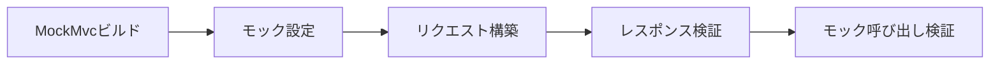
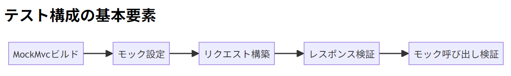

<span style="color: #007acc; font-weight: bold; font-size: 1.5rem;">UserControllerMockTest のテスト（ユニットテスト - Mockito）</span>

`src/test/java/com/example/orgchart_api/controller/UserControllerMockTest.java`

```java
package com.example.orgchart_api.controller;

import com.example.orgchart_api.dto.UserDto;
import com.example.orgchart_api.exception.DuplicateResourceException;
import com.example.orgchart_api.exception.ResourceNotFoundException;
import com.example.orgchart_api.service.UserService;
import org.junit.jupiter.api.BeforeEach;
import org.junit.jupiter.api.Test;
import org.junit.jupiter.api.extension.ExtendWith;
import org.mockito.InjectMocks;
import org.mockito.Mock;
import org.mockito.junit.jupiter.MockitoExtension;
import org.springframework.http.HttpStatus;
import org.springframework.http.MediaType;
import org.springframework.mock.web.MockHttpServletResponse;
import org.springframework.test.web.servlet.MockMvc;
import org.springframework.test.web.servlet.setup.MockMvcBuilders;

import java.time.LocalDate;
import java.util.Arrays;
import java.util.List;

import static org.mockito.ArgumentMatchers.any;
import static org.mockito.ArgumentMatchers.anyLong;
import static org.mockito.ArgumentMatchers.anyString;
import static org.mockito.Mockito.*;
import static org.springframework.test.web.servlet.request.MockMvcRequestBuilders.*;
import static org.springframework.test.web.servlet.result.MockMvcResultMatchers.*;
import static org.assertj.core.api.Assertions.assertThat;

@ExtendWith(MockitoExtension.class)
public class UserControllerMockTest {
    private MockMvc mockMvc;

    @Mock
    private UserService userService;

    @InjectMocks
    private UserController userController;

    private UserDto testUserDto;
    private final String SAMPLE_USER_JSON = """
        {
          "companyCd": "001",
          "employeeCd": "E000001",
          "userNm": "テストユーザー",
          "userNmKana": "てすとゆーざー",
          "mailAddress": "test@example.com",
          "password": "password123",
          "pin": "12345678",
          "birthday": "1990-01-01"
        }
        """;

    @BeforeEach
    public void setUp() {
        mockMvc = MockMvcBuilders.standaloneSetup(userController).build();

        testUserDto = new UserDto();
        testUserDto.setUserId(1L);
        testUserDto.setCompanyCd("001");
        testUserDto.setEmployeeCd("E000001");
        testUserDto.setUserNm("テストユーザー");
        testUserDto.setUserNmKana("てすとゆーざー");
        testUserDto.setMailAddress("test@example.com");
        testUserDto.setPassword("password123");
        testUserDto.setPin("12345678");
        testUserDto.setBirthday(LocalDate.of(1990, 1, 1));
    }

    //===== 正常系テスト =====

    @Test
    public void createUser_shouldReturn201Created() throws Exception {
        when(userService.createUser(any(UserDto.class))).thenReturn(testUserDto);

        mockMvc.perform(post("/api/users")
                        .contentType(MediaType.APPLICATION_JSON)
                        .content(SAMPLE_USER_JSON))
                .andExpect(status().isCreated())
                .andExpect(header().exists("Location"))
                .andExpect(jsonPath("$.userId").value(1))
                .andExpect(jsonPath("$.userNm").value("テストユーザー"))
                .andExpect(jsonPath("$.mailAddress").value("test@example.com"));

        verify(userService).createUser(any(UserDto.class));
    }

    @Test
    public void getUserById_shouldReturn200Ok() throws Exception {
        when(userService.getUserById(1L)).thenReturn(testUserDto);

        mockMvc.perform(get("/api/users/1"))
                .andExpect(status().isOk())
                .andExpect(jsonPath("$.userId").value(1))
                .andExpect(jsonPath("$.employeeCd").value("E000001"));
    }

    @Test
    public void getActiveUsersByCompany_shouldReturn200Ok() throws Exception {
        UserDto user2 = new UserDto();
        user2.setUserId(2L);
        user2.setCompanyCd("001");
        user2.setUserNm("ユーザー2");

        List<UserDto> users = Arrays.asList(testUserDto, user2);
        when(userService.getActiveUsersByCompany("001")).thenReturn(users);

        mockMvc.perform(get("/api/users/company/001"))
                .andExpect(status().isOk())
                .andExpect(jsonPath("$[0].userNm").value("テストユーザー"))
                .andExpect(jsonPath("$[1].userNm").value("ユーザー2"))
                .andExpect(jsonPath("$.length()").value(2));
    }

    @Test
    public void updateUser_shouldReturn200Ok() throws Exception {
        testUserDto.setUserNm("更新ユーザー");
        when(userService.updateUser(eq(1L), any(UserDto.class))).thenReturn(testUserDto);

        mockMvc.perform(put("/api/users/1")
                        .contentType(MediaType.APPLICATION_JSON)
                        .content(SAMPLE_USER_JSON))
                .andExpect(status().isOk())
                .andExpect(jsonPath("$.userNm").value("更新ユーザー"));
    }

    @Test
    public void deleteUser_shouldReturn204NoContent() throws Exception {
        doNothing().when(userService).deleteUser(1L, "admin");

        mockMvc.perform(delete("/api/users/1")
                        .param("updateUser", "admin"))
                .andExpect(status().isNoContent());

        verify(userService).deleteUser(1L, "admin");
    }

    @Test
    public void resetPassword_shouldReturn204NoContent() throws Exception {
        doNothing().when(userService).resetPassword(1L);

        mockMvc.perform(post("/api/users/1/reset-password"))
                .andExpect(status().isNoContent());

        verify(userService).resetPassword(1L);
    }

    //===== 異常系テスト =====

    @Test
    public void handleResourceNotFoundException() throws Exception {
        when(userService.getUserById(anyLong()))
                .thenThrow(new ResourceNotFoundException("User not found"));

        mockMvc.perform(get("/api/users/999"))
                .andExpect(status().isNotFound())
                .andExpect(content().string("User not found"));
    }

    @Test
    public void handleDuplicateResourceException() throws Exception {
        when(userService.createUser(any(UserDto.class)))
                .thenThrow(new DuplicateResourceException("Email already exists"));

        MockHttpServletResponse response = mockMvc.perform(post("/api/users")
                        .contentType(MediaType.APPLICATION_JSON)
                        .content(SAMPLE_USER_JSON))
                .andExpect(status().isConflict())
                .andReturn().getResponse();

        assertThat(response.getContentAsString()).isEqualTo("Email already exists");
    }

    @Test
    public void handleIllegalArgumentException() throws Exception {
        doThrow(new IllegalArgumentException("Invalid ID"))
                .when(userService).updateUser(eq(1L), any(UserDto.class));

        mockMvc.perform(put("/api/users/1")
                        .contentType(MediaType.APPLICATION_JSON)
                        .content(SAMPLE_USER_JSON))
                .andExpect(status().isBadRequest())
                .andExpect(content().string("Invalid ID"));
    }
}

```

#### 已深度思考

````
テストコードはコントローラーの単体テスト（モックテスト）です。サービス層をモックして、コントローラーのロジックのみをテストします。初心者にとって難しいポイントは以下の通りです：

1. MockMvcのセットアップ
2. サービスのモック化（Mockito）
3. HTTPリクエストの構築とレスポンスの検証
4. 正常系と異常系のテストの書き方

段階的な実装手順とコツを説明します。

### ステップ1: テストの基本構造を理解する
- `@ExtendWith(MockitoExtension.class)`：Mockitoを使用するための設定
- `@Mock`：モックオブジェクト（ここではUserService）
- `@InjectMocks`：テスト対象のコントローラー（モックを注入）
- `MockMvc`：コントローラーテストのためのモックフレームワーク

### ステップ2: テスト前のセットアップ（@BeforeEach）
各テストメソッドの前に実行される設定です：
```java
@BeforeEach
public void setUp() {
   mockMvc = MockMvcBuilders.standaloneSetup(userController).build();
   // テスト用のDTOオブジェクトを初期化
   testUserDto = new UserDto();
   // ...フィールド設定...
}
````

### ステップ 3: 正常系テストから始める

まずは正常に動作する場合のテストを書きます。例：ユーザー作成 API のテスト

#### 例：ユーザー作成 API のテスト

```java
@Test
public void createUser_shouldReturn201Created() throws Exception {
    // サービスのモック設定（createUserが呼ばれたらtestUserDtoを返す）
    when(userService.createUser(any(UserDto.class))).thenReturn(testUserDto);

    // リクエスト送信とレスポンス検証
    mockMvc.perform(post("/api/users") // POSTリクエスト
            .contentType(MediaType.APPLICATION_JSON) // JSON形式のリクエストボディ
            .content(SAMPLE_USER_JSON)) // 送信データ
        .andExpect(status().isCreated()) // ステータス201を期待
        .andExpect(header().exists("Location")) // Locationヘッダの存在を期待
        .andExpect(jsonPath("$.userId").value(1)) // レスポンスボディのuserIdが1であること
        .andExpect(jsonPath("$.userNm").value("テストユーザー")); // レスポンスボディのuserNmを検証

    // サービスメソッドが1回呼ばれたことを検証
    verify(userService).createUser(any(UserDto.class));
}
```

### ステップ 4: 異常系テストを書く

例外が発生した場合のテストです。例：重複エラーが発生した場合のテスト

#### 例：重複エラーのテスト

```java
@Test
public void handleDuplicateResourceException() throws Exception {
    // サービスのモック設定（createUserが呼ばれたら例外をスロー）
    when(userService.createUser(any(UserDto.class)))
        .thenThrow(new DuplicateResourceException("Email already exists"));

    // リクエスト送信し、レスポンスの内容を取得
    MockHttpServletResponse response = mockMvc.perform(post("/api/users")
            .contentType(MediaType.APPLICATION_JSON)
            .content(SAMPLE_USER_JSON))
        .andExpect(status().isConflict()) // 409 Conflictを期待
        .andReturn().getResponse();

    // レスポンスボディの内容を検証
    assertThat(response.getContentAsString()).isEqualTo("Email already exists");
}
```

### ステップ 5: よく使う検証メソッドを覚える

- `status().isXxx()`: ステータスコードの検証
- `header().exists(ヘッダ名)`: ヘッダの存在検証
- `jsonPath("$.フィールド名").value(期待値)`: JSON ボディの検証
- `content().string(期待値)`: レスポンスボディ全体の検証
- `verify(モックオブジェクト).メソッド`: メソッドが呼ばれたかの検証

### コツ

1. **まずは正常系から**: 正常系のテストを書きながら、MockMvc の使い方に慣れる
2. **サービスのモック化を理解**: サービスのメソッドが何を返すか、例外を投げるかを`when().thenReturn()`や`when().thenThrow()`で設定
3. **JSON のテスト**: `jsonPath`を使えば JSON の中身を簡単に検証できます
4. **テストデータの管理**: `@BeforeEach`で共通のテストデータを準備
5. **リファクタリング**: 似たようなリクエスト構築部分はメソッドに分けると管理しやすい

### 学習順序の提案

1. `@BeforeEach`でのセットアップ方法を理解
2. 正常系テスト（GET、POST、PUT、DELETE）を書く
3. サービスのメソッドが呼ばれたことを検証（`verify`）するテストを書く
4. 異常系テスト（例外発生時のテスト）を書く
5. JSON レスポンスの詳細な検証（`jsonPath`）を練習

例のように、1 つの API について正常系と異常系のテストをセットで書いていくことをおすすめします。

````

## MockMvcを使ったコントローラーテストの段階的実装ガイド

このテストはMockMvcを使ったコントローラーの単体テストです。実際のサーバーを起動せずにコントローラーの動作をテストする方法で、初心者にはいくつかの新しい概念が含まれていますが、段階的に進めれば確実に理解できます。

### 実装手順（2週間プラン）

#### 第1週: 基礎固め
1. **MockMvcの基本構造を理解（1日）**
```java
@ExtendWith(MockitoExtension.class)
public class ControllerTest {
    private MockMvc mockMvc;

    @Mock
    private Service service;

    @InjectMocks
    private Controller controller;

    @BeforeEach
    void setup() {
        mockMvc = MockMvcBuilders.standaloneSetup(controller).build();
    }
}
````

2. **GET リクエストのテスト（2 日）**

```java
@Test
void 基本的なGETテスト() throws Exception {
    when(service.getData()).thenReturn(new DataDto("テストデータ"));

    mockMvc.perform(get("/api/data"))
           .andExpect(status().isOk())
           .andExpect(jsonPath("$.name").value("テストデータ"));
}
```

3. **POST リクエストのテスト（2 日）**

```java
@Test
void 基本的なPOSTテスト() throws Exception {
    String requestJson = "{ \"name\": \"テスト\" }";

    mockMvc.perform(post("/api/data")
               .contentType(MediaType.APPLICATION_JSON)
               .content(requestJson))
           .andExpect(status().isCreated());
}
```

#### 第 2 週: 応用と異常系

1. **レスポンス内容の詳細検証（2 日）**

```java
@Test
void JSONレスポンスの詳細検証() throws Exception {
    // モック設定
    DataDto data = new DataDto(1L, "テスト", "詳細");
    when(service.getData(anyLong())).thenReturn(data);

    // 実行＆検証
    mockMvc.perform(get("/api/data/1"))
           .andExpect(status().isOk())
           .andExpect(jsonPath("$.id").value(1))
           .andExpect(jsonPath("$.name").value("テスト"))
           .andExpect(jsonPath("$.description").value("詳細"));
}
```

2. **異常系テスト（3 日）**

```java
@Test
void 存在しないリソース取得時のエラーテスト() throws Exception {
    when(service.getData(anyLong()))
        .thenThrow(new ResourceNotFoundException("見つかりません"));

    mockMvc.perform(get("/api/data/999"))
           .andExpect(status().isNotFound())
           .andExpect(content().string("見つかりません"));
}
```

3. **複雑なワークフローのテスト（2 日）**

```java
@Test
void 作成更新削除の一連テスト() throws Exception {
    // 作成
    String createJson = "{ /* 作成用JSON */ }";
    mockMvc.perform(post("/api/data").content(createJson))
           .andExpect(status().isCreated());

    // 更新
    String updateJson = "{ /* 更新用JSON */ }";
    mockMvc.perform(put("/api/data/1").content(updateJson))
           .andExpect(status().isOk());

    // 削除
    mockMvc.perform(delete("/api/data/1"))
           .andExpect(status().isNoContent());
}
```

### 初心者向け重要なコツ

#### テスト構成の基本要素





#### JSON 処理のテクニック

1. **JSON 文字列の宣言**

```java
private final String SAMPLE_JSON = """
{
  "id": 1,
  "name": "テスト"
}""";
```

2. **JSON パスでの検証**

```java
.andExpect(jsonPath("$.id").value(1))
.andExpect(jsonPath("$.name").value("テスト"))
```

3. **配列要素の検証**

```java
.andExpect(jsonPath("$[0].id").value(1))
.andExpect(jsonPath("$[1].name").value("二番目"))
.andExpect(jsonPath("$.length()").value(2))
```

#### モックの設定パターン

**モック処理の基本形:**

```java
// メソッド呼び出し時に値を返す
when(service.method(引数)).thenReturn(戻り値);

// メソッド呼び出し時に例外をスロー
when(service.method(引数)).thenThrow(例外クラス);

// voidメソッドのモック
doNothing().when(service).voidMethod(引数);
```

**引数マッチャーの活用:**

```java
when(service.getData(anyLong())) // 任意のLong型引数
when(service.create(any(UserDto.class))) // 任意のUserDto
when(service.update(eq(1L), any(UserDto.class))) // 第一引数は1L、第二引数は任意
```

### デバッグとトラブルシューティング

**よくあるエラーと解決策:**

1. **NullPointerException**

   - `@Mock`と`@InjectMocks`のアノテーションが正しく付与されているか確認
   - MockMvc の初期化を`@BeforeEach`で行っているか確認

2. **予期しない HTTP ステータス**

   - モック設定が期待通りに行われているか確認
   - リクエストの Content-Type が正しいか確認

3. **JSON パス検証の失敗**
   - 実際のレスポンスを出力して確認
   ```java
   MvcResult result = mockMvc.perform(...).andReturn();
   System.out.println(result.getResponse().getContentAsString());
   ```

**デバッグ用コード:**

```java
@Test
void デバッグ用テスト() throws Exception {
    MvcResult result = mockMvc.perform(get("/api/data/1"))
                              .andReturn();

    System.out.println("ステータス: " + result.getResponse().getStatus());
    System.out.println("レスポンス: " + result.getResponse().getContentAsString());
}
```

### 実践的アドバイス

1. **小さなステップから始める**

   - 最初は単純な GET リクエストのテストから
   - 徐々に複雑なシナリオに移行

2. **テストの構造を統一する**

   ```java
   @Test
   void テスト名() throws Exception {
       // 1. モック設定: when(...).thenReturn(...)
       // 2. リクエスト構築: mockMvc.perform(...)
       // 3. レスポンス検証: .andExpect(...)
       // 4. モック呼び出し検証: verify(...).method(...)
   }
   ```

3. **便利なアノテーションを活用**

   ```java
   // テストデータをフィールドに定義
   @Autowired
   private ObjectMapper objectMapper; // JSON変換用

   // テストデータをメソッドで生成
   private UserDto createTestUser() {
       return new UserDto(...);
   }
   ```

4. **失敗したらまずレスポンス内容を確認**
   ```java
   MvcResult result = mockMvc.perform(...).andReturn();
   System.out.println("Failed response: " + result.getResponse().getContentAsString());
   ```

### 学習ロードマップ

| 日数 | タスク       | 内容例                          |
| ---- | ------------ | ------------------------------- |
| 1-2  | 環境構築     | MockMvc の基本設定              |
| 3-4  | 正常系テスト | 基本的な GET/POST テスト        |
| 5-6  | JSON 検証    | jsonPath を使ったレスポンス検証 |
| 7-8  | 異常系テスト | 例外ハンドリングのテスト        |
| 9-10 | 複合テスト   | 複数メソッドの連携テスト        |

### 追加リソース

- [Spring MockMvc Documentation](https://docs.spring.io/spring-framework/docs/current/reference/html/testing.html#spring-mvc-test-framework)
- [JSONPath Syntax Guide](https://github.com/json-path/JsonPath)
- [Mockito Documentation](https://site.mockito.org/)

MockMvc テストは最初は難しく感じますが、パターンを覚えれば非常に強力なツールです。1 つのテストメソッドを完成させるごとに休憩を入れ、焦らず確実に進めてください。各ステップで学んだことをメモに残すと理解が深まります。
