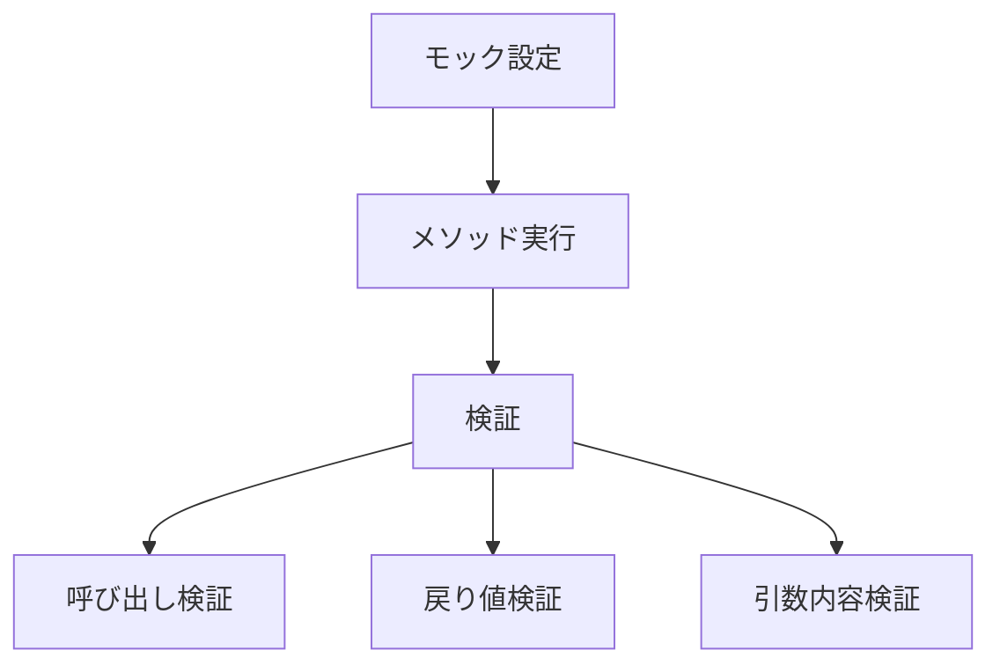
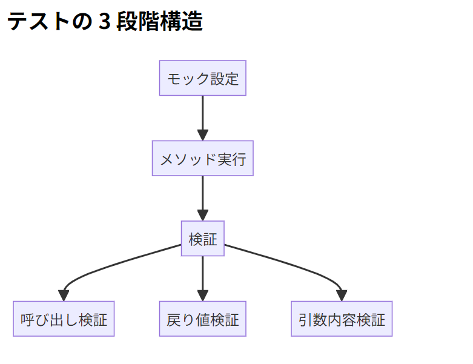

<span style="color: #007acc; font-weight: bold; font-size: 1.5rem;">UserMapperMockTest のテスト（ユニットテスト - Mockito）</span>

## UserMapperMockTest のテスト（ユニットテスト - Mockito）完成版

`src/test/java/com/example/orgchart_api/mapper/UserMapperMockTest.java`

```java
package com.example.orgchart_api.mapper;

import com.example.orgchart_api.domain.User;
import org.junit.jupiter.api.BeforeEach;
import org.junit.jupiter.api.Test;
import org.junit.jupiter.api.extension.ExtendWith;
import org.mockito.Mock;
import org.mockito.junit.jupiter.MockitoExtension;
import org.mybatis.spring.boot.test.autoconfigure.MybatisTest;
import static org.mockito.Mockito.*;
import static org.junit.jupiter.api.Assertions.*;

import java.time.LocalDate;
import java.time.LocalDateTime;
import java.util.List;
import java.util.Optional;

@ExtendWith(MockitoExtension.class)
public class UserMapperMockTest {
    @Mock
    private UserMapper userMapper;

    private User testUser;
    private User testUser2;

    @BeforeEach
    void setUp() {
        testUser = new User();
        testUser.setUserId(1L);
        testUser.setCompanyCd("001");
        testUser.setEmployeeCd("E0001");
        testUser.setUserNm("テストユーザー");
        testUser.setUserNmKana("てすとゆーざー");
        testUser.setMailAddress("test@example.com");
        testUser.setPasswordHash("hashedPassword");
        testUser.setPasswordSalt("saltValue");
        testUser.setPin("12345678");
        testUser.setBirthday(LocalDate.of(1990, 1, 1));
        testUser.setDeleted(false);
        testUser.setCreateDate(LocalDateTime.now());
        testUser.setUpdateDate(LocalDateTime.now());
        testUser.setUpdateUser("TEST_USER");

        testUser2 = new User();
        testUser2.setUserId(2L);
        testUser2.setCompanyCd("001");
        testUser2.setEmployeeCd("E0002");
        testUser2.setDeleted(false);
    }

    @Test
    void insert_shouldCallMapperWithCorrectUser() {
        // 実行
        userMapper.insert(testUser);

        // 検証
        verify(userMapper, times(1)).insert(testUser);
        verify(userMapper, times(1)).insert(argThat(user ->
                user.getCompanyCd().equals("001") &&
                        user.getEmployeeCd().equals("E0001") &&
                        user.getPin().equals("12345678")
        ));
    }

    @Test
    void update_shouldCallMapperWithCorrectUser() {
        // テストデータ更新
        testUser.setUserNm("更新ユーザー");
        testUser.setUpdateUser("UPDATER");

        // 実行
        userMapper.update(testUser);

        // 検証
        verify(userMapper, times(1)).update(testUser);
        verify(userMapper, times(1)).update(argThat(user ->
                user.getUserId() == 1L &&
                        user.getUserNm().equals("更新ユーザー") &&
                        user.getUpdateUser().equals("UPDATER")
        ));
    }

    @Test
    void findById_shouldReturnUserWhenExists() {
        // モック設定
        when(userMapper.findById(1L)).thenReturn(Optional.of(testUser));

        // 実行
        Optional<User> result = userMapper.findById(1L);

        // 検証
        assertTrue(result.isPresent());
        assertEquals("test@example.com", result.get().getMailAddress());
        assertEquals(LocalDate.of(1990, 1, 1), result.get().getBirthday());
        verify(userMapper, times(1)).findById(1L);
    }

    @Test
    void findById_shouldReturnEmptyWhenNotFound() {
        // モック設定
        when(userMapper.findById(999L)).thenReturn(Optional.empty());

        // 実行
        Optional<User> result = userMapper.findById(999L);

        // 検証
        assertTrue(result.isEmpty());
        verify(userMapper, times(1)).findById(999L);
    }

    @Test
    void findByCompanyCdAndNotDeleted_shouldReturnNonDeletedUsers() {
        // モック設定
        when(userMapper.findByCompanyCdAndNotDeleted("001"))
                .thenReturn(List.of(testUser, testUser2));

        // 実行
        List<User> users = userMapper.findByCompanyCdAndNotDeleted("001");

        // 検証
        assertEquals(2, users.size());
        assertFalse(users.get(0).isDeleted());
        assertFalse(users.get(1).isDeleted());
        verify(userMapper, times(1)).findByCompanyCdAndNotDeleted("001");
    }

    @Test
    void existsByMailAddress_shouldReturnTrueWhenDuplicateExists() {
        // モック設定（除外IDなし）
        when(userMapper.existsByMailAddress("test@example.com", null))
                .thenReturn(true);

        // モック設定（除外IDあり）
        when(userMapper.existsByMailAddress("test@example.com", 100L))
                .thenReturn(false);

        // 検証1: null除外ID
        assertTrue(userMapper.existsByMailAddress("test@example.com", null));

        // 検証2: 除外ID指定
        assertFalse(userMapper.existsByMailAddress("test@example.com", 100L));

        verify(userMapper, times(2)).existsByMailAddress(anyString(), any());
    }

    @Test
    void existsByCompanyCdAndEmployeeCd_shouldDetectDuplicatesCorrectly() {
        // モック設定
        when(userMapper.existsByCompanyCdAndEmployeeCd("001", "E0001", null))
                .thenReturn(true);

        when(userMapper.existsByCompanyCdAndEmployeeCd("001", "E0001", 1L))
                .thenReturn(false);

        // 検証1: 新規登録時の重複
        assertTrue(userMapper.existsByCompanyCdAndEmployeeCd("001", "E0001", null));

        // 検証2: 更新時の重複（自IDを除外）
        assertFalse(userMapper.existsByCompanyCdAndEmployeeCd("001", "E0001", 1L));

        verify(userMapper, times(2)).existsByCompanyCdAndEmployeeCd(
                eq("001"), eq("E0001"), any()
        );
    }
}

```

#### 已深度思考

````
テストコードは、MyBatisのMapperインターフェースをモックしてテストする例です。Mockitoを使用して、Mapperのメソッドが正しく呼び出されることや、期待した引数で呼び出されることを検証します。

初心者向けの段階的実装手順とコツ：

### 1. テストクラスの基本的な構造を理解する
- `@ExtendWith(MockitoExtension.class)`: Mockitoの機能を有効化
- `@Mock`: テスト対象のMapperインターフェースのモックを作成
- `@BeforeEach`: 各テストメソッドの前に実行される設定用メソッド。ここでテストデータを初期化

### 2. テストデータの準備（`setUp`メソッド）
各テストで使用するユーザーオブジェクトを事前に作成します。ここでは`testUser`と`testUser2`を作成。

### 3. テストメソッドの実装ステップ
テストメソッドは通常、以下の3ステップで構成されます：
1. **モックの設定（必要な場合）**: モックのメソッドが呼ばれたときの動作を定義（`when(...).thenReturn(...)`など）
2. **テスト対象メソッドの実行**: Mapperのメソッドを呼び出す
3. **検証**: メソッドが期待通りに呼ばれたか、期待した引数で呼ばれたかを検証（`verify`）

### 例：`insert_shouldCallMapperWithCorrectUser` メソッドの解説
```java
@Test
void insert_shouldCallMapperWithCorrectUser() {
   // 実行: userMapper.insertを呼び出す
   userMapper.insert(testUser);

   // 検証1: insertメソッドが1回呼ばれたこと
   verify(userMapper, times(1)).insert(testUser);

   // 検証2: 特定のプロパティを持つUserオブジェクトで呼ばれたこと
   verify(userMapper, times(1)).insert(argThat(user ->
       user.getCompanyCd().equals("001") &&
       user.getEmployeeCd().equals("E0001") &&
       user.getPin().equals("12345678")
   ));
}
````

### 各テストメソッドのポイント

#### 挿入（insert）テスト

- モック設定は不要（戻り値が void のため）
- `verify`でメソッド呼び出し回数と引数を検証
- `argThat`を使って引数のプロパティを検証

#### 更新（update）テスト

- insert テストと同様のパターン
- 更新内容が正しく引数に含まれているか検証

#### 検索（findById）テスト

- `when(...).thenReturn(...)`でモックの戻り値を設定
- 戻り値の Optional を検証
- メソッドが 1 回呼ばれたことを検証

#### 会社コードでの検索テスト

- 複数件の戻り値をモック設定
- 戻り値のリストのサイズと内容を検証

#### メール重複チェックテスト

- 複数の引数パターンでモック設定
- 各パターンで期待する戻り値が返ることを検証
- メソッドが 2 回呼ばれたことを検証

### コツとベストプラクティス

1. **テストごとに 1 つの責務**: 1 つのテストメソッドで 1 つの機能をテスト
2. **モックの設定は必要最小限に**: テストに必要な部分だけモック設定
3. **検証は具体的に**: `verify`でメソッド呼び出し回数と引数の内容を検証
4. **テストデータの再利用**: `@BeforeEach`で共通のテストデータを準備
5. **引数の検証**: `argThat`で柔軟な引数検証（ラムダ式で条件を記述）

### 学習のためのステップバイステップ

**ステップ 1: セットアップと簡単な挿入テスト**

1. テストクラスの基本的なアノテーションを理解
2. `@BeforeEach`でテストデータを準備
3. 挿入メソッドの呼び出しを検証するテストを書く

**ステップ 2: 検索系のテスト**

1. `when().thenReturn()`を使ったモック設定の練習
2. 戻り値の検証（`Optional`やリスト）
3. メソッド呼び出し回数の検証

**ステップ 3: 複雑な引数検証**

1. `argThat`を使った引数内容の検証
2. 異なる引数での複数回の呼び出し検証

**ステップ 4: 複数条件のテスト**

1. 複数のテストパターンを 1 つのメソッドで検証（例：重複チェックのテスト）
2. 複数回のメソッド呼び出しを検証

### デバッグのコツ

- テストが失敗した場合は、`verify`の期待値と実際の呼び出し回数や引数を確認
- モック設定が正しいか再確認
- テストデータの内容をコンソールに出力して確認

例：

```java
@Test
void debugExample() {
    System.out.println(testUser); // テストデータの内容を確認
    // ...
}
```

このように、モックを使った Mapper のテストは、実際のデータベースアクセスを伴わずにロジックを検証できるため高速に動作します。まずは簡単なメソッドからテストを書き始め、徐々に複雑なケースに挑戦していくことをおすすめします。

````

## MyBatis Mapperのモックテスト段階的実装ガイド

このテストコードはMyBatisのMapperインターフェースをモック化してテストするものです。データベース接続なしにMapperのロジックを検証できるため、高速なテストが可能です。以下の手順で段階的に実装していきましょう。

### 実装手順（2週間プラン）

#### 第1週: 基礎固め
1. **基本構造の理解（1日）**
```java
@ExtendWith(MockitoExtension.class) // Mockitoを有効化
public class UserMapperMockTest {
    @Mock // テスト対象のMapperをモック化
    private UserMapper userMapper;

    @BeforeEach
    void setUp() {
        // テストデータの初期化
    }
}
````

2. **簡単な検証テスト（2 日）**

```java
@Test
void insert_呼び出し検証() {
    // テスト実行
    userMapper.insert(testUser);

    // 呼び出し回数の検証
    verify(userMapper, times(1)).insert(any(User.class));
}
```

3. **引数検証テスト（2 日）**

```java
@Test
void insert_引数内容検証() {
    userMapper.insert(testUser);

    // argThatで引数の内容を検証
    verify(userMapper).insert(argThat(user ->
        user.getCompanyCd().equals("001") &&
        user.getEmployeeCd().equals("E0001")
    ));
}
```

#### 第 2 週: 応用と複雑なケース

1. **戻り値のモック設定（2 日）**

```java
@Test
void findById_正常系() {
    // モック戻り値の設定
    when(userMapper.findById(1L)).thenReturn(Optional.of(testUser));

    Optional<User> result = userMapper.findById(1L);

    assertTrue(result.isPresent());
    assertEquals("test@example.com", result.get().getMailAddress());
}
```

2. **空の戻り値テスト（1 日）**

```java
@Test
void findById_データ不存在() {
    when(userMapper.findById(999L)).thenReturn(Optional.empty());

    Optional<User> result = userMapper.findById(999L);

    assertFalse(result.isPresent());
}
```

3. **複雑な条件のテスト（2 日）**

```java
@Test
void existsByMailAddress_複数ケース検証() {
    // 異なる引数で異なる結果を返すモック設定
    when(userMapper.existsByMailAddress("test@example.com", null))
        .thenReturn(true);

    when(userMapper.existsByMailAddress("test@example.com", 100L))
        .thenReturn(false);

    // ケース1: 除外IDなし
    assertTrue(userMapper.existsByMailAddress("test@example.com", null));

    // ケース2: 除外IDあり
    assertFalse(userMapper.existsByMailAddress("test@example.com", 100L));
}
```

### 初心者向け重要なコツ

#### テストの 3 段階構造





#### モック設定のパターン

**基本形:**

```java
// メソッド呼び出し時に値を返す
when(mapper.method(引数)).thenReturn(戻り値);

// メソッド呼び出し時に例外をスロー
when(mapper.method(引数)).thenThrow(例外クラス);

// voidメソッドのモック
doNothing().when(mapper).voidMethod(引数);
```

**引数マッチャーの活用:**

```java
// 任意の引数
when(mapper.method(any())).thenReturn(...);

// 特定の値とマッチ
when(mapper.method(eq(123))).thenReturn(...);

// カスタム条件
when(mapper.method(argThat(arg -> arg.getId() > 100))).thenReturn(...);
```

#### 検証パターン

**呼び出し検証:**

```java
// 呼び出し回数
verify(mapper, times(2)).method(any());

// 最低1回呼び出し
verify(mapper, atLeastOnce()).method(any());

// 呼び出しなし
verify(mapper, never()).method(any());
```

**引数内容検証:**

```java
verify(mapper).method(argThat(arg ->
    arg.getField1().equals("value") &&
    arg.getField2() > 100
));
```

### デバッグとトラブルシューティング

**よくある問題と解決策:**

1. **NullPointerException**

   - `@Mock`アノテーションが付与されているか確認
   - モック設定が正しく行われているか確認（`when().thenReturn()`）

2. **想定外の呼び出し回数**

   - 実際の呼び出し回数を確認

   ```java
   verify(userMapper, times(1)).insert(any()); // 失敗時は詳細を出力
   ```

3. **引数内容の不一致**
   - `ArgumentCaptor`で実際の引数をキャプチャ
   ```java
   ArgumentCaptor<User> captor = ArgumentCaptor.forClass(User.class);
   verify(userMapper).insert(captor.capture());
   System.out.println("Actual: " + captor.getValue());
   ```

**デバッグ用コード:**

```java
@Test
void デバッグ用テスト() {
    // モック設定
    when(userMapper.findById(1L)).thenReturn(Optional.of(testUser));

    // 実行
    Optional<User> result = userMapper.findById(1L);

    // デバッグ出力
    System.out.println("Result present: " + result.isPresent());
    result.ifPresent(user ->
        System.out.println("User name: " + user.getUserNm())
    );

    // 検証
    assertTrue(result.isPresent());
}
```

### 実践的アドバイス

1. **テストケースを小さく分割**

   - 1 テストメソッドで 1 つのシナリオのみ検証
   - 複数ケースが必要な場合はテストメソッドを分ける

2. **意味のあるテスト名**

   ```java
   // 良い例
   @Test
   void findById_存在するIDを指定した場合_ユーザー情報を返す()

   // 悪い例
   @Test
   void testFindById()
   ```

3. **テストデータの共通化**

   ```java
   private User createTestUser(Long id, String companyCd, String employeeCd) {
       User user = new User();
       user.setUserId(id);
       user.setCompanyCd(companyCd);
       user.setEmployeeCd(employeeCd);
       // ...その他のフィールド
       return user;
   }
   ```

4. **段階的なアサーション**

   ```java
   @Test
   void 段階的アサーション例() {
       Optional<User> result = userMapper.findById(1L);

       // 1. 存在チェック
       assertTrue(result.isPresent(), "ユーザーが存在しない");

       User user = result.get();
       // 2. 個別フィールドチェック
       assertEquals("001", user.getCompanyCd(), "会社コード不一致");
       assertEquals("E0001", user.getEmployeeCd(), "社員コード不一致");
   }
   ```

### 学習ロードマップ

| 日数 | 目標           | 内容例                        |
| ---- | -------------- | ----------------------------- |
| 1-2  | 基本構造       | モックの作成と簡単な検証      |
| 3-4  | 引数検証       | argThat を使った詳細な検証    |
| 5-6  | 戻り値制御     | when().thenReturn()の活用     |
| 7-8  | 複数呼び出し   | verify による呼び出し回数検証 |
| 9-10 | 複雑なシナリオ | 複数ケースのテスト実装        |

Mapper のモックテストは、データベースアクセスを伴うテストよりも高速で、ビジネスロジックに集中できます。最初は難しく感じるかもしれませんが、基本パターンを押さえれば体系的なテストが書けるようになります。1 つずつ確実にステップを踏んで、実装スキルを高めてください。
