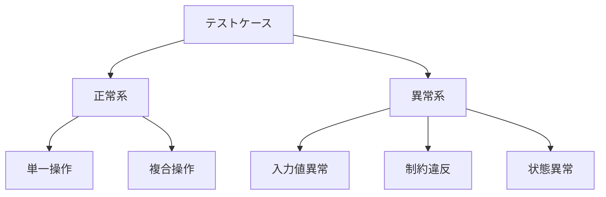
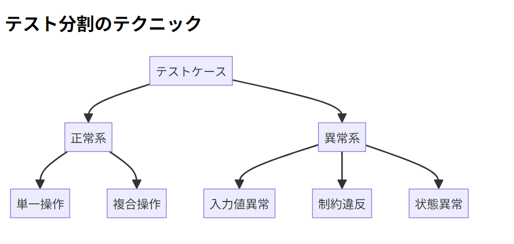

<span style="color: #007acc; font-weight: bold; font-size: 1.5rem;">UserServiceImpl のテスト（統合テスト）</span>

`Testcontainers` を使用して **PostgreSQL 用のコンテナを立ち上げるための依存関係**は、次のように **追加**する必要があります：

### ✅ 追加例（`pom.xml` 内）：

```xml
	<dependencyManagement>
		<dependencies>
			<dependency>
				<groupId>org.testcontainers</groupId>
				<artifactId>testcontainers-bom</artifactId>
				<version>${testcontainers.version}</version>
				<type>pom</type>
				<scope>import</scope>
			</dependency>
		</dependencies>
	</dependencyManagement>
```

これにより、JUnit テストで `PostgreSQLContainer` を使って簡単に PostgreSQL のテスト用コンテナを起動できます。

---

### テスト用データベースに接続する設定

`src/test/resources/application-test.properties`

```properties
# PostgreSQL接続設定
spring.datasource.url=jdbc:postgresql://localhost:5432/testirdb
spring.datasource.username=postgres
spring.datasource.password=AM2013japan
spring.datasource.driver-class-name=org.postgresql.Driver

# テスト用設定
spring.test.database.replace=none
```

## サービス層のビジネスロジックを検証（統合テスト）完成版

`src/test/java/com/example/orgchart_api/service/UserServiceIntegrationTest.java`

```java
package com.example.orgchart_api.service;

import com.example.orgchart_api.domain.User;
import com.example.orgchart_api.dto.UserDto;
import com.example.orgchart_api.exception.DuplicateResourceException;
import com.example.orgchart_api.exception.ResourceNotFoundException;
import com.example.orgchart_api.mapper.UserMapper;
import org.junit.jupiter.api.AfterEach;
import org.junit.jupiter.api.BeforeEach;
import org.junit.jupiter.api.Test;
import org.springframework.beans.factory.annotation.Autowired;
import org.springframework.boot.test.context.SpringBootTest;
import org.springframework.jdbc.core.JdbcTemplate;
import org.springframework.security.crypto.password.PasswordEncoder;
import org.springframework.test.context.ActiveProfiles;

import java.time.LocalDate;

import static org.junit.jupiter.api.Assertions.*;

@SpringBootTest
@ActiveProfiles("test")
public class UserServiceIntegrationTest {

    @Autowired
    private UserService userService;

    @Autowired
    private PasswordEncoder passwordEncoder;

    @Autowired
    private JdbcTemplate jdbcTemplate;

    private UserDto testUserDto1;
    private UserDto testUserDto2;
    @Autowired
    private UserMapper userMapper;

    @BeforeEach
    public void setUp() {
        // テストデータ1
        testUserDto1 = new UserDto();
        testUserDto1.setCompanyCd("001");
        testUserDto1.setEmployeeCd("E000001");
        testUserDto1.setUserNm("ユーザー1");
        testUserDto1.setUserNmKana("ゆーざー1");
        testUserDto1.setMailAddress("user1@example.com");
        testUserDto1.setPassword("Password1!");
        testUserDto1.setPin("12345678");
        testUserDto1.setBirthday(LocalDate.of(1990, 1, 1));

        // テストデータ2
        testUserDto2 = new UserDto();
        testUserDto2.setCompanyCd("002");
        testUserDto2.setEmployeeCd("E000002");
        testUserDto2.setUserNm("ユーザー2");
        testUserDto2.setUserNmKana("ゆーざー2");
        testUserDto2.setMailAddress("user2@example.com");
        testUserDto2.setPassword("Password2@");
        testUserDto2.setPin("87654321");
        testUserDto2.setBirthday(LocalDate.of(1995, 5, 15));
    }

    @AfterEach
    public void cleanUp() {
        // 各テスト後にデータベースをクリーンアップ
        jdbcTemplate.execute("TRUNCATE TABLE trn_user RESTART IDENTITY CASCADE");
    }

    @Test
    public void createUser_shouldPersistAllFieldsCorrectly() {
        // ユーザー作成
        UserDto createdUser = userService.createUser(testUserDto1);
        assertNotNull(createdUser.getUserId());

        // ユーザー取得
        UserDto retrievedUser = userService.getUserById(createdUser.getUserId());

        // 検証
        assertEquals(createdUser.getUserId(), retrievedUser.getUserId());
        assertEquals("001", retrievedUser.getCompanyCd());
        assertEquals("E000001", retrievedUser.getEmployeeCd());
        assertEquals("ユーザー1", retrievedUser.getUserNm());
        assertEquals("ゆーざー1", retrievedUser.getUserNmKana());
        assertEquals("user1@example.com", retrievedUser.getMailAddress());
        assertEquals(LocalDate.of(1990, 1, 1), retrievedUser.getBirthday());
        assertEquals("12345678", retrievedUser.getPin());
    }

    @Test
    public void createUser_shouldEnforceUniqueEmailConstraint() {
        // 初回登録 (成功)
        userService.createUser(testUserDto1);

        // メールアドレス重複で登録試行
        UserDto duplicateUser = new UserDto();
        duplicateUser.setCompanyCd("003");
        duplicateUser.setEmployeeCd("E000003");
        duplicateUser.setUserNm("ユーザー3");
        duplicateUser.setUserNmKana("ゆーざー3");
        duplicateUser.setMailAddress("user1@example.com"); // 重複メール
        duplicateUser.setPassword("Password3#");
        duplicateUser.setPin("11223344");
        duplicateUser.setBirthday(LocalDate.of(2000, 10, 10));

        // 検証
        assertThrows(DuplicateResourceException.class, () -> {
            userService.createUser(duplicateUser);
        });
    }

    @Test
    public void createUser_shouldEnforceUniqueCompanyEmployeeConstraint() {
        // 初回登録 (成功)
        userService.createUser(testUserDto1);

        // 会社コード+社員コード重複で登録試行
        UserDto duplicateUser = new UserDto();
        duplicateUser.setCompanyCd("001"); // 同じ会社コード
        duplicateUser.setEmployeeCd("E000001"); // 同じ社員コード
        duplicateUser.setUserNm("ユーザー3");
        duplicateUser.setUserNmKana("ゆーざー3");
        duplicateUser.setMailAddress("user3@example.com"); // 新しいメール
        duplicateUser.setPassword("Password3#");
        duplicateUser.setPin("11223344");
        duplicateUser.setBirthday(LocalDate.of(2000, 10, 10));

        // 検証
        assertThrows(DuplicateResourceException.class, () -> {
            userService.createUser(duplicateUser);
        });
    }

    @Test
    public void updateUser_shouldUpdateAllFields() {
        // 初期ユーザー作成
        UserDto createdUser = userService.createUser(testUserDto1);

        // 更新データ準備
        UserDto updateDto = new UserDto();
        updateDto.setUserId(createdUser.getUserId());
        updateDto.setCompanyCd("001"); // 同じ会社コード
        updateDto.setEmployeeCd("E000001"); // 同じ社員コード
        updateDto.setUserNm("更新ユーザー");
        updateDto.setUserNmKana("こうしんゆーざー");
        updateDto.setMailAddress("updated@example.com");
        updateDto.setPassword("NewPassword123");
        updateDto.setPin("99998888");
        updateDto.setBirthday(LocalDate.of(2000, 1, 1));

        // ユーザー更新
        UserDto updatedUser = userService.updateUser(createdUser.getUserId(), updateDto);

        // 再取得して検証
        UserDto retrievedUser = userService.getUserById(createdUser.getUserId());
        assertEquals("更新ユーザー", retrievedUser.getUserNm());
        assertEquals("こうしんゆーざー", retrievedUser.getUserNmKana());
        assertEquals("updated@example.com", retrievedUser.getMailAddress());
        assertEquals(LocalDate.of(2000, 1, 1), retrievedUser.getBirthday());
        assertEquals("99998888", retrievedUser.getPin());
    }

    @Test
    public void updateUser_withMismatchedIds_shouldThrowIllegalArgumentException() {
        // 初期ユーザー作成
        UserDto createdUser = userService.createUser(testUserDto1);

        // 不一致のIDを持つDTOを作成
        UserDto updateDto = new UserDto();
        updateDto.setUserId(999L); // 不一致のID
        updateDto.setCompanyCd("001");
        updateDto.setEmployeeCd("E000001");
        updateDto.setUserNm("不正ユーザー");
        updateDto.setUserNmKana("ふせいゆーざー");
        updateDto.setMailAddress("invalid@example.com");
        updateDto.setPassword("InvalidPass123");
        updateDto.setPin("11112222");
        updateDto.setBirthday(LocalDate.of(2000, 1, 1));

        // 検証
        assertThrows(IllegalArgumentException.class, () -> {
            userService.updateUser(createdUser.getUserId(), updateDto);
        });
    }

    @Test
    public void fullLifecycleTest() {
        // 1. ユーザー作成
        UserDto user1 = userService.createUser(testUserDto1);
        UserDto user2 = userService.createUser(testUserDto2);

        // 2. ユーザー取得
        UserDto retrievedUser1 = userService.getUserById(user1.getUserId());
        assertEquals("ユーザー1", retrievedUser1.getUserNm());

        // 3. ユーザー更新
        UserDto updateDto = new UserDto();
        updateDto.setUserId(user2.getUserId());
        updateDto.setCompanyCd("002");
        updateDto.setEmployeeCd("E000002");
        updateDto.setUserNm("更新ユーザー2");
        updateDto.setUserNmKana("こうしんゆーざー2");
        updateDto.setMailAddress("updated2@example.com");
        updateDto.setPassword("UpdatedPass123");
        updateDto.setPin("44443333");
        updateDto.setBirthday(LocalDate.of(2001, 2, 3));

        UserDto updatedUser = userService.updateUser(user2.getUserId(), updateDto);
        assertEquals("更新ユーザー2", updatedUser.getUserNm());

        // 4. パスワードリセット
        userService.resetPassword(user1.getUserId());
        // テスト用メソッドで確認
        User user = userMapper.findById(user1.getUserId()).orElseThrow(()->new AssertionError("ユーザーが見つかりませんでした"));
        UserDto userAfterReset = UserDto.fromEntityWithPassword(user);
        assertNotNull(userAfterReset.getPassword());

        // 5. ユーザー削除
        userService.deleteUser(user1.getUserId(), "admin");
        assertThrows(ResourceNotFoundException.class, () -> {
            userService.getUserById(user1.getUserId());
        });

        // 6. 削除済みユーザーの操作（IllegalArgumentExceptionを期待）
        UserDto finalUpdateDto = updateDto;
        assertThrows(IllegalArgumentException.class, () -> {
            userService.updateUser(user1.getUserId(), finalUpdateDto);
        });
        // 7. 存在しないユーザーでの操作
        assertThrows(ResourceNotFoundException.class, () -> {
            userService.getUserById(999L);
        });
    }
}


```

#### 已深度思考

````
コードが複雑に見える主な理由は、以下のような要素が組み合わさっているためです：

1. データベースのセットアップ/クリーンナップ
2. テストデータの準備
3. サービスのメソッド呼び出し
4. アサーションによる検証
5. 例外処理のテスト

初心者の方が段階的に進めるためのアドバイス：

### ステップ1: テストの基本構造を理解する
- `@BeforeEach`: 各テストメソッドの前に実行（テストデータの準備）
- `@AfterEach`: 各テストメソッドの後に実行（データベースのクリーンアップ）
- `@Test`: テストメソッド本体

### ステップ2: テストデータの準備を簡素化する
テストデータの作成をヘルパーメソッドで共通化します。

例:
```java
private UserDto createTestUserDto(String companyCd, String employeeCd, String mail) {
   UserDto dto = new UserDto();
   dto.setCompanyCd(companyCd);
   dto.setEmployeeCd(employeeCd);
   dto.setUserNm("テストユーザー");
   dto.setUserNmKana("てすとゆーざー");
   dto.setMailAddress(mail);
   dto.setPassword("Password123");
   dto.setPin("12345678");
   dto.setBirthday(LocalDate.now().minusYears(20));
   return dto;
}
````

### ステップ 3: テストケースを小さく分割

1 つのテストメソッドで 1 つの機能だけをテストするようにします。

例:

- ユーザー作成の成功
- メール重複エラー
- 更新処理の成功
- 更新時の ID 不一致エラー

### ステップ 4: アサーションを段階的に

複雑なアサーションは分割して書く

例（悪い例）:

```java
assertEquals(createdUser, retrievedUser); // 全部まとめて比較
```

例（良い例）:

```java
assertEquals(createdUser.getUserId(), retrievedUser.getUserId());
assertEquals(createdUser.getUserNm(), retrievedUser.getUserNm());
// 各フィールドごとに確認
```

### ステップ 5: 例外テストのパターンを覚える

`assertThrows`を使った基本的なパターン:

```java
assertThrows(例外クラス.class, () -> {
    // 例外が発生するはずの処理
    userService.createUser(duplicateUser);
});
```

### 実装手順（1 日 1 テストを目安に）

**Day1: 環境セットアップと基本テスト**

- `@BeforeEach`/`@AfterEach`の実装
- データベースクリーンアップの確認
- 単純なユーザー作成テスト（`createUser_shouldPersistAllFieldsCorrectly`）

**Day2: 制約違反のテスト**

- メール重複のテスト（`createUser_shouldEnforceUniqueEmailConstraint`）
- 社員コード重複のテスト（`createUser_shouldEnforceUniqueCompanyEmployeeConstraint`）

**Day3: 更新処理のテスト**

- 基本更新テスト（`updateUser_shouldUpdateAllFields`）
- ID 不一致のテスト（`updateUser_withMismatchedIds_shouldThrowIllegalArgumentException`）

**Day4: 統合テスト**

- ライフサイクルテスト（`fullLifecycleTest`）をシンプルなバージョンから

### デバッグのコツ

1. テスト失敗時はまずデータベース状態を確認（pgAdmin で直接 SELECT）
2. 各ステップで変数の中身を出力（System.out.println）
3. アサーションは 1 行ずつ（全部まとめない）

### リファクタリング例

重複するテストデータ作成処理をメソッド化:

```java
@BeforeEach
public void setUp() {
    testUserDto1 = createTestUserDto("001", "E000001", "user1@example.com");
    testUserDto2 = createTestUserDto("002", "E000002", "user2@example.com");
}

private UserDto createTestUserDto(String companyCd, String employeeCd, String mail) {
    // 上記のメソッド実装参照
}
```

テストメソッド内でも再利用可能になります。

````

## サービス層テストコード段階的実装ガイド

サービス層のテストは確かに複雑ですが、以下のステップで進めれば確実に理解できます。1つずつクリアしていきましょう。

### 段階的実装手順（3週間プラン）

#### 第1週: 基礎固め（環境設定～単純なCRUDテスト）

1. **環境設定（1日）**
   - `@SpringBootTest`と`@ActiveProfiles("test")`の役割を理解
   - テスト用データベース接続を確認
   - `JdbcTemplate`の基本操作を学習

2. **テストデータ準備（2日）**
   ```java
   // ヘルパーメソッドとして実装
   private UserDto createTestUserDto(String companyCd, String employeeCd, String mail) {
       UserDto dto = new UserDto();
       dto.setCompanyCd(companyCd);
       dto.setEmployeeCd(employeeCd);
       dto.setUserNm("テストユーザー");
       dto.setUserNmKana("てすとゆーざー");
       dto.setMailAddress(mail);
       dto.setPassword("Pass1234!");
       dto.setPin("12345678");
       dto.setBirthday(LocalDate.now().minusYears(20));
       return dto;
   }
````

- パラメータ化されたユーザー生成メソッドを作成
- テストデータのバリエーションを用意

3. **単純な CRUD テスト（2 日）**

   ```java
   @Test
   void createUser_基本テスト() {
       // 実行
       UserDto result = userService.createUser(testUserDto1);

       // 検証
       assertNotNull(result.getUserId());
       assertEquals("001", result.getCompanyCd());
   }
   ```

#### 第 2 週: 例外処理と制約テスト

1. **重複制約テスト（2 日）**

   ```java
   @Test
   void createUser_メール重複() {
       // 準備
       userService.createUser(testUserDto1);

       // 実行＆検証
       UserDto duplicate = createTestUserDto("002", "E000002", "user1@example.com");
       assertThrows(DuplicateResourceException.class, () -> {
           userService.createUser(duplicate);
       });
   }
   ```

2. **更新操作テスト（3 日）**

   ```java
   @Test
   void updateUser_基本更新() {
       // 準備
       UserDto created = userService.createUser(testUserDto1);

       // 更新データ準備
       UserDto updateData = createTestUserDto("001", "E000001", "updated@example.com");
       updateData.setUserNm("更新ユーザー");
       updateData.setUserId(created.getUserId());

       // 実行
       UserDto updated = userService.updateUser(created.getUserId(), updateData);

       // 検証
       assertEquals("更新ユーザー", updated.getUserNm());
   }
   ```

#### 第 3 週: 統合テストと応用

1. **ライフサイクルテスト（2 日）**

   ```java
   @Test
   void ユーザーライフサイクル管理() {
       // 作成
       UserDto user = userService.createUser(testUserDto1);

       // 更新
       user.setUserNm("更新後");
       UserDto updated = userService.updateUser(user.getUserId(), user);

       // 削除
       userService.deleteUser(updated.getUserId(), "admin");

       // 検証
       assertThrows(ResourceNotFoundException.class, () -> {
           userService.getUserById(user.getUserId());
       });
   }
   ```

2. **パスワード暗号化テスト（3 日）**

   ```java
   @Test
   void パスワード暗号化検証() {
       // ユーザー作成
       UserDto created = userService.createUser(testUserDto1);

       // データベースから生データ取得
       Map<String, Object> dbUser = jdbcTemplate.queryForMap(
           "SELECT * FROM trn_user WHERE user_id = ?", created.getUserId());

       // 暗号化検証
       assertTrue(passwordEncoder.matches(
           testUserDto1.getPassword(),
           (String) dbUser.get("password_hash")
       ));
   }
   ```

### 初心者向け重要なコツ

#### テスト分割のテクニック





#### デバッグのベストプラクティス

1. **ステップ実行**

   ```java
   @Test
   void デバッグ例() {
       System.out.println("### テスト開始 ###");
       UserDto user = userService.createUser(testUserDto1);
       System.out.println("生成されたユーザーID: " + user.getUserId());

       // ブレークポイントを設定
       UserDto retrieved = userService.getUserById(user.getUserId());
       System.out.println("取得したユーザー名: " + retrieved.getUserNm());

       // アサーション
       assertEquals("テストユーザー1", retrieved.getUserNm());
   }
   ```

2. **データベース状態確認**
   ```sql
   -- テスト中に実行するSQL
   SELECT * FROM trn_user;
   SELECT * FROM mst_branch;
   ```

#### テストメソッド設計パターン

**基本構造（AAA パターン）**

```java
@Test
void テスト名() {
    // Arrange: テスト準備
    UserDto input = createTestUserDto(...);

    // Act: テスト実行
    UserDto result = userService.createUser(input);

    // Assert: 結果検証
    assertNotNull(result.getUserId());
}
```

**例外テストパターン**

```java
@Test
void 重複メールテスト() {
    // Arrange
    userService.createUser(testUserDto1);
    UserDto duplicate = createTestUserDto(...);

    // Act & Assert
    Exception ex = assertThrows(DuplicateResourceException.class, () -> {
        userService.createUser(duplicate);
    });

    assertEquals("メールアドレスは既に使用されています", ex.getMessage());
}
```

### よくある躓きポイントと解決策

1. **外部キー制約エラー**

   - 原因: 関連マスタデータ不足
   - 解決: `@BeforeEach`で必要なマスタデータを投入

2. **一意制約違反**

   - 原因: テストデータの重複
   - 解決: `@AfterEach`のクリーンアップを徹底

3. **トランザクション境界問題**

   - 原因: テストとサービスのトランザクション競合
   - 解決: `@Transactional`の適切な使用

4. **日時比較失敗**
   - 原因: ミリ秒単位の不一致
   - 解決: 日付部分だけ比較
   ```java
   assertEquals(
       expected.getBirthday(),
       actual.getBirthday(),
       "生年月日が不一致"
   );
   ```

### 学習リソース

- [JUnit 5 User Guide](https://junit.org/junit5/docs/current/user-guide/)
- [Spring Boot Testing](https://spring.io/guides/gs/testing-web/)
- [Testcontainers for Database Tests](https://www.testcontainers.org/)

テストコードは「書いて、失敗して、デバッグして、理解する」のサイクルが重要です。1 日 1 テストメソッドを目標に、焦らず継続的に取り組んでください。分からない部分は都度チームメンバーに質問すると効率的です。
