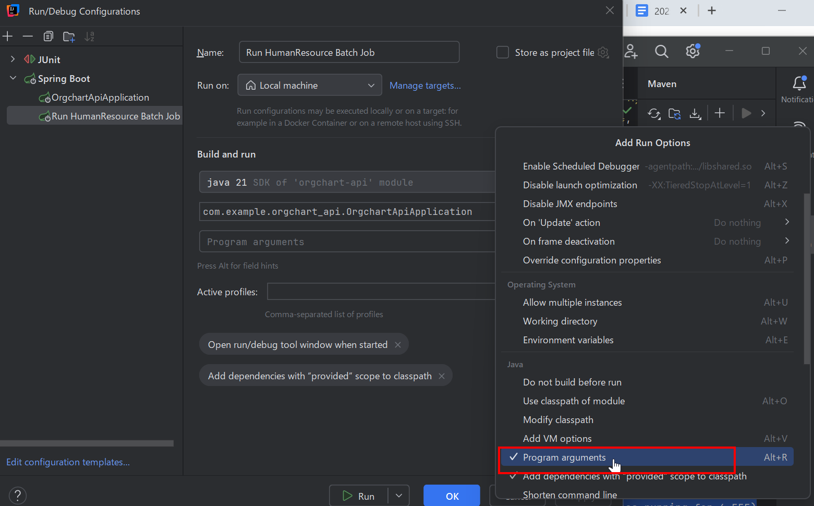
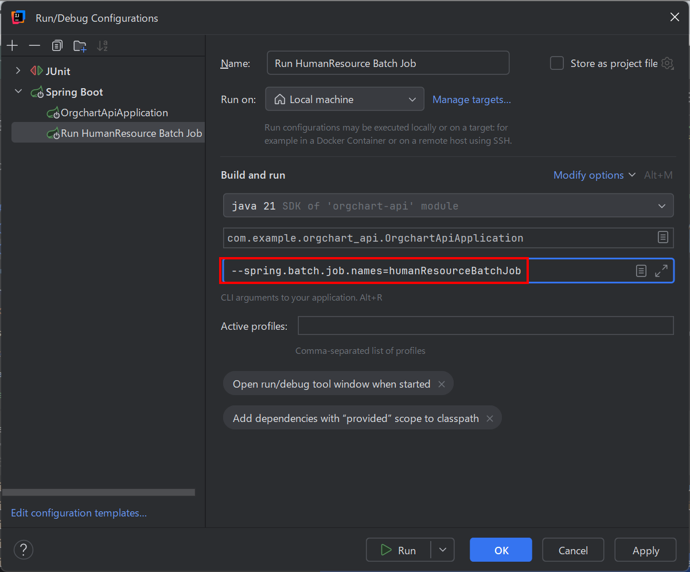
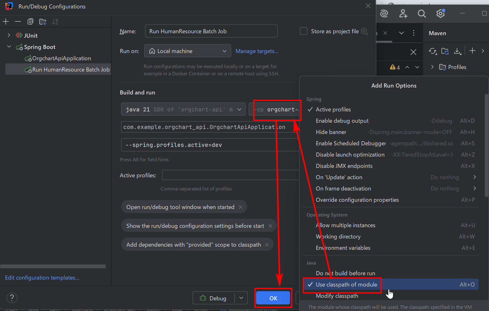
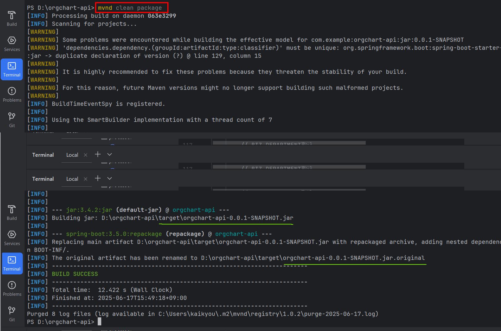

## バッチ実装の雛形が一応出来上がったので、挙動確認しながら実装していきます。

### 読込みフェイルの準備

```
C:\batch\files\importfiles
ad.csv
department.csv
employee.csv
EOFAD
EOFAM
organization.csv
shit.csv
```

### 読込みフェイルの内容

```
C:\batch\files\importfiles

employee.csv
organization_cd,company_cd,department_cd,department_nm,employee_cd,employee_nm_kanji,employee_nm_kana,executive_post_cd,post_lineage_cd,class,sex_cd,birthday,mail_address,assign_grade,class_tel_addressbook,class_temporary_transfer,mail_address_automa_de_flg,class_data_input,update_date
12300A00099H0000000,123,00123,TEST(TEST),1234567,田中　一郎,タナカ　イチロウ,101,12,1231,1,1970-05-23,0231231@test.co.jp,12,1,1,1,12,2023-01-25 12:31:23
2456789511454547000,001,32561,1課2組,3256101,山田 太郎,ヤマダ タロウ,201,23,2341,1,1998-12-31,test@test.com,11,1,0,0,32,2023-06-09 12:30:00
7758125845525575000,001,33785,aフィート,3378501,佐藤 花子,サトウ ハナコ,301,33,3341,2,1999-11-30,hoge@example.com,12,0,0,0,32,2023-07-15 18:00:00
5684558558588520000,001,92402,北海,9240201,鈴木 次郎,スズキ ジロウ,401,42,2341,1,1999-10-15,fuga@example.com,13,0,0,0,54,2023-12-24 23:45:00
3456789045678990000,002,22123,営業部,2212301,高橋 三郎,タカハシ サブロウ,101,12,1231,1,2001-04-05,test@example.com,11,1,1,1,12,2023-12-31 23:59:59

organization.csv
organization_cd,organization_nm,organization_no,organization_abbreviated_nm,print_order,class_sales,class_data_input,update_date
1006525684558558581,Organization A,1074564,Org A,1,1,1,2023-06-15 12:00:00
1065256845585585802,Organization B,2745640,Org B,2,1,1,2023-06-15 12:00:00
1003652568455855858,Organization C,7456430,Org C,3,1,1,2023-06-15 12:00:00
2456789511454548957,生活サポート連合会,3274564,生連,16,9,7,2023-06-09 12:30:00
7758125845525575895,afterフィート,3378515,aフィート,12,11,3,2023-07-15 18:00:00
6525684558558588520,北海株式会社,9240236,北海,3,8,36,2023-12-24 23:45:00

department.csv
organization_cd,company_cd,company_nm,control_cd,control_nm,charge_cd,charge_nm,parent_department_cd,parent_department_nm,department_cd,department_nm,department_nm_en,zip_cd,address,telephone_no,fax_no,extension_no,class_sales,class_data_input,update_date
2456789511454547,001,yu株式会社,00321,yu株式会社部門,00123,yu株式会社部門1課,35621,1課2組,32561,1課2組主任,Section 1 Section 2 Chief,1050012,東京都港区芝大門2⁻4⁻6 豊国ビル,092-292-1752,092-292-1750,092-292-1750-092,32,54,2023-12-24 23:45:00
2456789511454547,002,ABC株式会社,00322,ABC株式会社部門,00124,ABC株式会社部門1課,35622,1課3組,32562,1課3組主任,Section 1 Section 3 Chief,1050013,東京都港区六本木1-1-1 ABCビル,092-292-1753,092-292-1751,092-292-1751-092,32,54,2023-12-24 23:45:00
2456789511454547,003,XYZ株式会社,00323,XYZ株式会社部門,00125,XYZ株式会社部門1課,35623,1課4組,32563,1課4組主任,Section 1 Section 4 Chief,1050014,東京都港区新橋2-2-2 XYZビル,092-292-1754,092-292-1752,092-292-1752-092,32,54,2023-12-24 23:45:00
2456789511454547,004,DEF株式会社,00324,DEF株式会社部門,00126,DEF株式会社部門1課,35624,1課5組,32564,1課5組主任,Section 1 Section 5 Chief,1050015,東京都港区品川3-3-3 DEFビル,092-292-1755,092-292-1753,092-292-1753-092,32,54,2023-12-24 23:45:00
2456789511454547,005,GHI株式会社,00325,GHI株式会社部門,00127,GHI株式会社部門1課,35625,1課6組,32565,1課6組主任,Section 1 Section 6 Chief,1050016,東京都港区港南4-4-4 GHIビル,092-292-1756,092-292-1754,092-292-1754-092,32,54,2023-12-24 23:45:00
2456789511454547,006,JKL株式会社,00326,JKL株式会社部門,00128,JKL株式会社部門1課,35626,1課7組,32566,1課7組主任,Section 1 Section 7 Chief,1050017,東京都港区浜松町5-5-5 JKLビル,092-292-1757,092-292-1755,092-292-1755-092,32,54,2023-12-24 23:45:00
2456789511454547,007,MNO株式会社,00327,MNO株式会社部門,00129,MNO株式会社部門1課,35627,1課8組,32567,1課8組主任,Section 1 Section 8 Chief,1050018,東京都港区赤坂6-6-6 MNOビル,092-292-1758,092-292-1756,092-292-1756-092,32,54,2023-12-24 23:45:00
2456789511454547,008,PQR株式会社,00328,PQR株式会社部門,00130,PQR株式会社部門1課,35628,1課9組,32568,1課9組主任,Section 1 Section 9 Chief,1050019,東京都港区虎ノ門7-7-7 PQRビル,092-292-1759,092-292-1757,092-292-1757-092,32,54,2023-12-24 23:45:00
2456789511454547,009,STU株式会社,00329,STU株式会社部門,00131,STU株式会社部門1課,35629,1課10組,32569,1課10組主任,Section 1 Section 10 Chief,1050020,東京都港区麻布8-8-8 STUビル,092-292-1760,092-292-1758,092-292-1758-092,32,54,2023-12-24 23:45:00
2456789511454547,010,VWX株式会社,00330,VWX株式会社部門,00132,VWX株式会社部門1課,35630,1課11組,32570,1課11組主任,Section 1 Section 11 Chief,1050021,東京都港区赤坂見附9-9-9 VWXビル,092-292-1761,092-292-1759,092-292-1759-092,32,54,2023-12-24 23:45:00

ad.csv
user_logon_name,display_name,last_name,first_name,mail,position_name,deleted
568AW745,tanaka hiroshi,hiroshi,tanaka,tanaka@ttp.co.jp,AW975-023,false
129XZ811,suzuki yuko,yuko,suzuki,suzuki@ttp.co.jp,XZ456-789,false
786QW532,kimura takeshi,takeshi,kimura,kimura@ttp.co.jp,QW123-456,false
375DF235,yamada sato,sato,yamada,yamada@ttp.co.jp,DF987-654,false
904JK613,ito aya,aya,ito,ito@ttp.co.jp,JK321-654,false

shift.csv
old_branch_cd,old_company_cd,old_department_cd,new_branch_cd,new_company_cd,new_department_cd
A1234,001,12345,B5678,002,67890
B1111,002,22222,C9999,003,33333
C2222,003,33333,D0000,004,44444
D3333,004,44444,E1111,005,55555
E4444,005,55555,F2222,006,66666

EOFAD
空

EOFAM
空
```

# IntelliJ で Spring Batch ジョブを実行する方法

この Spring Batch ジョブを IntelliJ で実行するには、以下の手順に従ってください。

## 前提条件

- IntelliJ IDEA がインストールされていること
- プロジェクトが正しく設定されていること（Maven/Gradle 依存関係が解決されている）
- 必要なデータベース設定が完了していること

## 実行手順

IntelliJ IDEA で Spring Batch ジョブを実行するための具体的な手順を説明します。特に、コマンドライン引数で特定のジョブを実行する方法に焦点を当てます。

## 方法 1: メインクラスから直接実行（簡単な方法）

1. `@SpringBootApplication`が付いたメインクラス（例: `OrgchartApiApplication.java`）を開く
2. クラス内の`main`メソッドを右クリック
3. 表示されるコンテキストメニューから:
   - 通常実行: 「Run 'OrgchartApiApplication.main()'」を選択
   - デバッグ実行: 「Debug 'OrgchartApiApplication.main()'」を選択

## 方法 2: コマンドライン引数で特定のジョブを実行（詳細設定）

### 実行構成の編集手順

1. **実行構成の作成/編集**:

   - IntelliJ の上部ツールバーにある実行構成ドロップダウン（通常は緑色の実行ボタンの左側）をクリック
   - 「Edit Configurations...」を選択
     > **もしくは**
   - メニューから「Run」→「Edit Configurations...」

2. **新しい構成の追加**:

   - 左ペインの「+」ボタンをクリック
   - 「Spring Boot」を選択

3. **基本設定の入力**:

   - **Name**: 任意の名前（例: "Run HumanResource Batch Job"）
   - **Main class**: メインアプリケーションクラスを指定（例: `com.example.orgchart_api.OrgchartApiApplication`）

4. **プログラム引数の追加**:

- **Modify options**: ドロップダウンをクリックして「Add Run Options」ダイアログを開きます。

- 「Java」タブ内の「Program arguments」フィールドをクリックします。
  
- 新しく表示された「Program arguments」フィールドに以下を入力

```
--spring.batch.job.names=humanResourceBatchJob
```



- 複数のジョブを指定する場合はカンマ区切り:

```
--spring.batch.job.names=humanResourceBatchJob,anotherJobName

```

#### モジュールクラスパスの設定（重要）

1. 「Modify options」▸ → 「Add module classpath」を選択
2. 表示されるドロップダウンでプロジェクトのメインモジュールを選択

   ```diff
   ! 注意: マルチモジュールプロジェクトの場合、Spring Bootメインクラスを含むモジュールを選択
   ```

   

3. **オプション設定（必要に応じて）**:

   - 「VM Options」: メモリ設定など（例: `-Xmx512m`）
   - 「Environment variables」: 環境変数を設定
   - 「Working directory」: プロジェクトルートを指定

4. **構成の保存と実行**:
   - 「Apply」→「OK」をクリック
   - 実行構成ドロップダウンから新しく作成した構成を選択
   - 緑色の実行ボタン（またはデバッグボタン）をクリック

## 補足情報

- **プロファイルを指定する場合**:

  ```
  --spring.batch.job.names=humanResourceBatchJob --spring.profiles.active=dev
  ```

- **ジョブパラメータを渡す場合**:

  ```
  --spring.batch.job.names=humanResourceBatchJob jobParam1=value1 jobParam2=value2
  ```

- **デバッグ時のヒント**:
  - ブレークポイントを設定したい場合は、`Debug`モードで実行
  - Spring Batch のメタデータテーブルが作成されていることを確認

この設定で、指定した`humanResourceBatchJob`がアプリケーション起動時に自動実行されます。ジョブが正常に実行されない場合は、ログを確認して設定を見直してください。

### 2.コマンドラインで実行する方法（Windows ターミナル、CMD、PowerShell）

Windows で IntelliJ IDEA を使って `java -jar your-application.jar --spring.batch.job.names=humanResourceBatchJob --spring.profiles.active=dev` を実行するには、以下の手順があります。

---

## ✅ 1. **JAR をビルドする**

まず、アプリケーションを `.jar` ファイルにビルドしておく必要があります。

### Maven の場合:

```
mvn clean package
```

### Gradle の場合:

```
gradlew build
```

出力された `.jar` ファイル（例: `your-application.jar`）は通常 `target/` または `build/libs/` にあります。

---

## ✅ 2. **コマンドラインで実行**

ターミナルを開いて、以下のように実行します。

```
java -jar your-application.jar ^
  --spring.batch.job.names=humanResourceBatchJob ^
  --spring.profiles.active=dev
```

> `^` は Windows のコマンドプロンプトでの改行文字です。1 行に書くなら `^` は不要です。

---


ログを見る限り、あなたの `.jar` ファイルは以下の場所に生成されています：

```
D:\orgchart-api\target\orgchart-api-0.0.1-SNAPSHOT.jar
```

そのため、実行コマンドは以下のように修正できます（Windows PowerShell または CMD 用）：

---

### ✅ Windows PowerShell / CMD（1 行でも可）

```bash
java -jar target/orgchart-api-0.0.1-SNAPSHOT.jar ^
  --spring.batch.job.names=humanResourceBatchJob ^
  --spring.profiles.active=dev
```

または、1 行で書く場合：

```bash
java -jar target/orgchart-api-0.0.1-SNAPSHOT.jar --spring.batch.job.names=humanResourceBatchJob --spring.profiles.active=dev
```

---

### 💡 補足

- コマンドは **プロジェクトルート (`D:\orgchart-api`)** で実行してください。
- `^` は **CMD / PowerShell 用の改行記号** です。Bash や Git Bash の場合は `\` を使います。
- `target/` フォルダに jar があることが Maven により確認されています。

---

もし `java` コマンドが見つからないと言われた場合は、`JAVA_HOME` の設定を確認してください。

何かエラーが出た場合は、内容を貼ってくれれば一緒に調査できます。

### 3. テストクラスから実行

1. テストクラスを作成（例）:

```java
@SpringBootTest
@RunWith(SpringRunner.class)
public class HumanResourceJobTest {

    @Autowired
    private JobLauncherTestUtils jobLauncherTestUtils;

    @Test
    public void testHumanResourceBatchJob() throws Exception {
        JobExecution jobExecution = jobLauncherTestUtils.launchJob();
        assertEquals(BatchStatus.COMPLETED, jobExecution.getStatus());
    }
}
```

2. テストを右クリックして実行

## 4. REST API エンドポイントから実行 (Spring Batch Admin スタイル)

Spring Boot アプリケーションに REST API を追加してジョブを実行する方法:

1. まず、`JobLauncher`と`JobExplorer`を注入するコントローラーを作成します:

```java
@RestController
@RequestMapping("/api/batch")
public class BatchJobController {

    @Autowired
    private JobLauncher jobLauncher;

    @Autowired
    private JobExplorer jobExplorer;

    @Autowired
    @Qualifier("humanResourceBatchJob")
    private Job humanResourceBatchJob;

    @PostMapping("/run/human-resource")
    public ResponseEntity<String> runHumanResourceJob() {
        try {
            JobParameters jobParameters = new JobParametersBuilder()
                    .addLong("time", System.currentTimeMillis())
                    .toJobParameters();

            JobExecution jobExecution = jobLauncher.run(humanResourceBatchJob, jobParameters);

            return ResponseEntity.ok("Job started with ID: " + jobExecution.getId());
        } catch (Exception e) {
            return ResponseEntity.status(HttpStatus.INTERNAL_SERVER_ERROR)
                    .body("Job failed to start: " + e.getMessage());
        }
    }

    @GetMapping("/status/{executionId}")
    public ResponseEntity<JobExecution> getJobStatus(@PathVariable Long executionId) {
        JobExecution jobExecution = jobExplorer.getJobExecution(executionId);
        if (jobExecution != null) {
            return ResponseEntity.ok(jobExecution);
        }
        return ResponseEntity.notFound().build();
    }
}
```

2. このコントローラーを追加したら、以下の方法でジョブを実行できます:
   - POST リクエストで `/api/batch/run/human-resource` を呼び出す
   - 実行 ID を使って `/api/batch/status/{executionId}` でステータスを確認

## 5. IntelliJ の Spring Boot 実行構成で直接実行

1. IntelliJ の右上にある実行構成ドロップダウンから「Edit Configurations...」を選択
2. 新しい「Spring Boot」構成を追加
3. メインクラスを指定
4. 「Program arguments」に以下を追加:
   ```
   --spring.batch.job.enabled=true --spring.batch.job.names=humanResourceBatchJob
   ```
5. 実行ボタンをクリック

## 6. スケジュール実行 (Spring Scheduler を使用)

定期的にジョブを実行する場合は、`@Scheduled`アノテーションを使用できます:

```java
@Configuration
@EnableScheduling
public class BatchSchedulerConfig {

    @Autowired
    private JobLauncher jobLauncher;

    @Autowired
    private Job humanResourceBatchJob;

    @Scheduled(cron = "0 0 2 * * ?") // 毎日午前2時に実行
    public void scheduleHumanResourceJob() throws Exception {
        JobParameters jobParameters = new JobParametersBuilder()
                .addLong("time", System.currentTimeMillis())
                .toJobParameters();

        jobLauncher.run(humanResourceBatchJob, jobParameters);
    }
}
```

## 注意事項

1. データベース接続が正しく設定されていることを確認してください
2. Spring Batch のメタデータテーブルが作成されていることを確認
3. ジョブを再実行する場合は、新しい JobParameters が必要です（特に`time`パラメータ）
4. 本番環境ではジョブの同時実行制御を検討してください

どの方法を選択するかは、アプリケーションの要件と実行環境に依存します。開発中は IntelliJ から直接実行する方法が簡単で、本番環境では REST API やスケジューラーを使用するのが一般的です。
