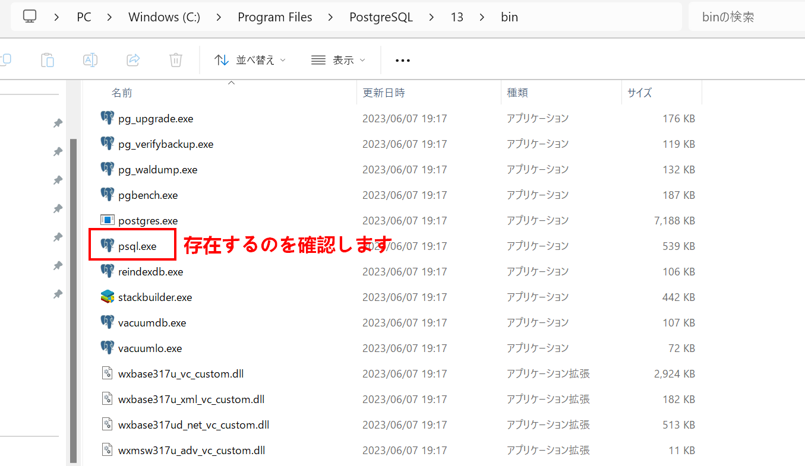

## Spring Batch がジョブの実行状態を管理するための メタデータテーブルの作成

**Spring Boot 3.5.0（= Spring Batch 5.x）** を使用している場合、`spring-batch-core-5.x.x.jar` に対応する `schema-postgresql.sql` を使用する必要があります。

# Windows 版手順

**Windows 環境**で **Spring Batch 5.2.0** を使い、`schema-postgresql.sql` を抽出・実行する具体的な手順を説明します。

---

## ✅ 前提

- 使用するファイル: `spring-batch-core-5.2.0.jar`
- 作業目的: JAR から `schema-postgresql.sql` を取り出して PostgreSQL に適用する

---

## ✅ 手順（Windows）

### ① `spring-batch-core-5.2.0.jar` をダウンロード

1. ブラウザで以下のページを開く：
   📦 [https://repo1.maven.org/maven2/org/springframework/batch/spring-batch-core/5.2.0/](https://repo1.maven.org/maven2/org/springframework/batch/spring-batch-core/5.2.0/)

2. 次のファイルをクリックしてダウンロード：
   ▶️ `spring-batch-core-5.2.0.jar`

3. 保存先の例（任意）：
   `C:\Users\あなたのユーザー名\Downloads\spring-batch-core-5.2.0.jar`

---

### ② JAR を展開（Windows 標準または 7-Zip 使用）

#### 方法 A：7-Zip を使う（推奨）

1. [https://www.7-zip.org/](https://www.7-zip.org/) から 7-Zip をインストール

2. `spring-batch-core-5.2.0.jar` を右クリック →
   `7-Zip` → `展開...` または `ここに展開`

3. 次のフォルダを探してください：

   ```
   org\springframework\batch\core\schema-postgresql.sql
   ```

---

### ③ PostgreSQL で SQL ファイルを実行

#### 必要なもの

- PostgreSQL のコマンドラインツール（`psql.exe`）
- `schema-postgresql.sql` ファイルのパス（例：`C:\Users\YourName\Downloads\schema-postgresql.sql`）

#### 実行手順

1. 「スタートメニュー」→「SQL Shell (psql)」または `cmd.exe` を開く

2. 以下のように実行（ファイルパスはご自分の環境に合わせて修正）：

```bash
psql -U postgres -d irdb -f "C:\Users\YourName\Downloads\org\springframework\batch\core\schema-postgresql.sql"
```

- `-U postgres`：データベースのユーザー名
- `-d irdb`：データベース名
- `-f`：SQL ファイルのフルパス

> ✅ パスに空白がある場合は `"ダブルクォーテーション"` で囲んでください

---

## ✅ 補足：エラーが出た場合

- `psql` が見つからない → PostgreSQL の bin パス（例：`C:\Program Files\PostgreSQL\15\bin`）を環境変数 `PATH` に追加
- パスワードを聞かれたら、PostgreSQL インストール時に設定したパスワードを入力

---

## ✅ まとめ

| ステップ | 内容                                               |
| -------- | -------------------------------------------------- |
| ①        | Maven Central から JAR をダウンロード              |
| ②        | 7-Zip などで展開し、`schema-postgresql.sql` を探す |
| ③        | `psql -f` コマンドで DB に適用                     |

## 実践作業



```bash
cd "C:\Program Files\PostgreSQL\15\bin"
```

```bash
.\psql.exe -U postgres -d irdb -f "C:\Users\kaikyou\Downloads\org\springframework\batch\core\schema-postgresql.sql"
```

- `-U postgres`：データベースのユーザー名
- `-d irdb`：データベース名
- `-f`：SQL ファイルのフルパス
- 次
  

完了メッセージを見る限り、**指定したデータベース `irdb` に対して、Spring Batch のスキーマが正常に作成されました。**
つまり、あなたの使っているデータベース名は **`irdb`** で正しいです。

---

## ✅ データベース名の確認方法（他の候補を確認したいとき）

### 1. `psql` に接続して確認

```powershell
.\psql.exe -U postgres
```

そのあと、PostgreSQL のプロンプト（`postgres=#`）で下記を実行：

```sql
\l
```

これで現在の PostgreSQL サーバーに存在する **全データベース一覧**が表示されます。

出力結果：

```
                                             データベース一覧
   名前    |  所有者  | エンコーディング |      照合順序      | Ctype(変換演算子)  |     アクセス権限
-----------+----------+------------------+--------------------+--------------------+-----------------------
 irdb      | postgres | UTF8             | Japanese_Japan.932 | Japanese_Japan.932 |
 orgchart  | postgres | UTF8             | Japanese_Japan.932 | Japanese_Japan.932 |
 postgres  | postgres | UTF8             | Japanese_Japan.932 | Japanese_Japan.932 |
 template0 | postgres | UTF8             | Japanese_Japan.932 | Japanese_Japan.932 | =c/postgres          +
           |          |                  |                    |                    | postgres=CTc/postgres
 template1 | postgres | UTF8             | Japanese_Japan.932 | Japanese_Japan.932 | postgres=CTc/postgres+
           |          |                  |                    |                    | =c/postgres
 testirdb  | postgres | UTF8             | Japanese_Japan.932 | Japanese_Japan.932 |
(6 行)

```

### 2. 終了したいとき

PostgreSQL のプロンプトから抜けるには：

```sql
\q
```


Spring Batch によって作成された **テーブル名を確認するには、以下のコマンドを使って PostgreSQL に接続し、対象のスキーマ内のテーブル一覧を表示**します。

---

## ✅ 手順：作成されたテーブルを一覧表示する

### 1. `psql` に接続

```powershell
.\psql.exe -U postgres -d irdb
```

するとプロンプトが以下のようになります：

```text
irdb=#
```

---

### 2. public スキーマのテーブル一覧を表示

```sql
\dt public.*
```

または、スキーマを省略して：

```sql
\dt
```

出力例：

```
               List of relations
 Schema |          Name           | Type  |  Owner
--------+-------------------------+-------+----------
 public | batch_job_execution     | table | postgres
 public | batch_job_instance      | table | postgres
 public | batch_step_execution    | table | postgres
 public | batch_job_execution_seq | seq   | postgres
...
```

---

### 3. 終了するには

```sql
\q
```

---

## 🔍 Spring Batch 5.x が作成する主なテーブル（PostgreSQL）

以下は `schema-postgresql.sql` によって作成される代表的なテーブルです：

| テーブル名                     | 説明                           |
| ------------------------------ | ------------------------------ |
| `batch_job_instance`           | ジョブのインスタンス情報       |
| `batch_job_execution`          | ジョブ実行履歴                 |
| `batch_job_execution_params`   | ジョブのパラメータ             |
| `batch_step_execution`         | ステップの実行履歴             |
| `batch_step_execution_context` | ステップごとの実行コンテキスト |
| `batch_job_execution_context`  | ジョブごとの実行コンテキスト   |
| `batch_job_execution_seq`      | ジョブ実行 ID シーケンス       |
| `batch_job_seq`                | ジョブ ID シーケンス           |
| `batch_step_execution_seq`     | ステップ実行 ID シーケンス     |

---


よくできました！現在 `irdb` データベースの中に存在する **全テーブル一覧（`public` スキーマ）** が表示されており、`Spring Batch` のテーブルも正しく作成されていることが確認できます。

---

## ✅ Spring Batch が作成したテーブル（あなたの一覧の中）

以下のテーブルが Spring Batch によって作成されたものです：

| テーブル名                     | 説明                         |
| ------------------------------ | ---------------------------- |
| `batch_job_instance`           | ジョブのインスタンス情報     |
| `batch_job_execution`          | ジョブ実行履歴               |
| `batch_job_execution_params`   | ジョブのパラメータ情報       |
| `batch_job_execution_context`  | ジョブの実行時のコンテキスト |
| `batch_step_execution`         | ステップ実行情報             |
| `batch_step_execution_context` | ステップ実行のコンテキスト   |

## 📌 エラー解決などでバッチメタデータテーブルのクリア（開発環境向け）方法

以下の SQL で`humanResourceBatchJob`に関連するメタデータを削除：

```sql
-- ステップ実行コンテキスト削除
DELETE FROM batch_step_execution_context
WHERE step_execution_id IN (
  SELECT step_execution_id
  FROM batch_step_execution
  WHERE job_execution_id IN (
    SELECT job_execution_id
    FROM batch_job_execution
    WHERE job_instance_id = (
      SELECT job_instance_id
      FROM batch_job_instance
      WHERE job_name = 'humanResourceBatchJob'
    )
  )
);

-- ステップ実行記録削除
DELETE FROM batch_step_execution
WHERE job_execution_id IN (
  SELECT job_execution_id
  FROM batch_job_execution
  WHERE job_instance_id = (
    SELECT job_instance_id
    FROM batch_job_instance
    WHERE job_name = 'humanResourceBatchJob'
  )
);

-- ジョブ実行パラメータ削除
DELETE FROM batch_job_execution_params
WHERE job_execution_id IN (
  SELECT job_execution_id
  FROM batch_job_execution
  WHERE job_instance_id = (
    SELECT job_instance_id
    FROM batch_job_instance
    WHERE job_name = 'humanResourceBatchJob'
  )
);

-- ジョブ実行コンテキスト削除
DELETE FROM batch_job_execution_context
WHERE job_execution_id IN (
  SELECT job_execution_id
  FROM batch_job_execution
  WHERE job_instance_id = (
    SELECT job_instance_id
    FROM batch_job_instance
    WHERE job_name = 'humanResourceBatchJob'
  )
);

-- ジョブ実行記録削除
DELETE FROM batch_job_execution
WHERE job_instance_id = (
  SELECT job_instance_id
  FROM batch_job_instance
  WHERE job_name = 'humanResourceBatchJob'
);

-- ジョブインスタンス削除
DELETE FROM batch_job_instance
WHERE job_name = 'humanResourceBatchJob';

```

## 💡 その他のテーブルについて

それ以外に表示されている `biz_`, `mst_`, `rel_` などで始まるテーブルは、**あなたやアプリケーションによって作成された業務用のテーブル**だと考えられます。Spring Batch とは直接関係ありません。

## 🔍 その他の便利コマンド

| コマンド                             | 説明                                 |
| ------------------------------------ | ------------------------------------ |
| `\dt`                                | テーブル一覧表示（カレントスキーマ） |
| `\d テーブル名`                      | テーブルの詳細な構造を表示           |
| `SELECT * FROM テーブル名 LIMIT 10;` | テーブルの中身を確認                 |

## 完全な動作フロー：

- アプリケーション起動
- Spring が HumanResourceJobConfig を読み込み、ジョブを定義
- CommandLineRunner が実行され、JobLauncher でジョブを起動
- ジョブがステップを順次実行

この構成により、@EnableBatchProcessing がメインクラスになくても、バッチ処理が正しく動作します。

#### 已深度思考

> 既に`HumanResourceJobConfig`クラスに`@EnableBatchProcessing`が付与されているため、メインクラスには不要です。
> しかし、メインクラスで`@EnableBatchProcessing`が設定されていないことを心配されているようです。
> 実は、`HumanResourceJobConfig`クラスに`@Configuration`と`@EnableBatchProcessing`が付いているので、バッチ処理は有効化されています。
> したがって、メインクラスに追加する必要はありません。
> 問題なくジョブが実行されるはずです。
> ただし、もしジョブが実行されない場合は、以下の点を確認してください：

1.  `HumanResourceJobConfig`がコンポーネントスキャンの対象となっているか（`@SpringBootApplication`が付いたクラスのパッケージ以下にあるか）
2.  起動時のコマンドライン引数に`--spring.batch.job.names=humanResourceBatchJob`が指定されているか
3.  プロファイル`dev`が正しく設定されているか（`environment.properties`や`application-dev.properties`などの設定）
    > また、ジョブを明示的に実行する`CommandLineRunner`を追加したい場合は、以下のようにメインクラスに追加することもできますが、必須ではありません。
    >
    > ```java
    > package com.example.orgchart_api;
    > import org.mybatis.spring.annotation.MapperScan;
    > import org.springframework.boot.CommandLineRunner;
    > import org.springframework.boot.SpringApplication;
    > import org.springframework.boot.autoconfigure.SpringBootApplication;
    > import org.springframework.context.annotation.Bean;
    > import org.springframework.context.annotation.PropertySource;
    > import org.springframework.batch.core.Job;
    > import org.springframework.batch.core.JobParameters;
    > import org.springframework.batch.core.launch.JobLauncher;
    > @SpringBootApplication
    > @PropertySource("classpath:environment.properties")
    > @MapperScan("com.example.orgchart_api.mapper")
    > @MapperScan("com.example.orgchart_api.batch.persistence")
    > public class OrgchartApiApplication {
    >     public static void main(String[] args) {
    > ```
            SpringApplication.run(OrgchartApiApplication.class, args);
        }
    >     // オプション: ジョブを明示的に起動する場合（コマンドライン引数で指定する方法と併用すると二重実行になるので注意）
        @Bean
        public CommandLineRunner commandLineRunner(JobLauncher jobLauncher, Job humanResourceBatchJob) {
            return args -> {
                // コマンドライン引数でジョブ名が指定されていない場合に実行するなどの制御が可能
                jobLauncher.run(humanResourceBatchJob, new JobParameters());
            };
        }
    }

````
 >  ただし、この`CommandLineRunner`を追加すると、`--spring.batch.job.names`を指定しなくてもジョブが実行されるようになります。
 また、`--spring.batch.job.names`と`CommandLineRunner`の両方があるとジョブが二重に実行される可能性があるため、どちらか一方の方法を選択してください。
 >  通常は、`--spring.batch.job.names`を使用する方法が推奨されます。理由は、ジョブの起動をより柔軟に制御できるためです（例えば、複数のジョブの中から選択して実行する場合など）。
 >  結論として、現状のままで問題なくジョブは実行されるはずです。メインクラスに`@EnableBatchProcessing`を追加する必要はありません。


`@EnableBatchProcessing` アノテーションがメインクラスにない場合でも、バッチ処理は正しく動作します。重要なのは、**ジョブ設定クラス（`HumanResourceJobConfig`）に `@EnableBatchProcessing` が付与されていること**です。

### 現在の設定の状態と動作について：

1. **`HumanResourceJobConfig` クラスの状態**:
   ```java
   @Configuration
   @EnableBatchProcessing // ここでバッチ処理が有効化されている
   public class HumanResourceJobConfig {
       // ジョブとステップの定義
   }
````

この設定により、Spring Batch の基本コンポーネント（JobRepository, JobLauncher など）が自動構成されます。

2. **メインクラスの役割**:
   メインクラスはアプリケーションのエントリーポイントとして機能しますが、`@EnableBatchProcessing` は設定クラスに配置するのが一般的です。現在の構成で問題ありません。

### 追加する必要があるもの：

**ジョブを実行するための `CommandLineRunner` の実装**が必要です。メインクラスに以下を追加してください：

```java
package com.example.orgchart_api;

import org.mybatis.spring.annotation.MapperScan;
import org.springframework.boot.CommandLineRunner;
import org.springframework.boot.SpringApplication;
import org.springframework.boot.autoconfigure.SpringBootApplication;
import org.springframework.context.annotation.Bean;
import org.springframework.context.annotation.PropertySource;
import org.springframework.batch.core.Job;
import org.springframework.batch.core.JobParameters;
import org.springframework.batch.core.launch.JobLauncher;

@SpringBootApplication
@PropertySource("classpath:environment.properties")
@MapperScan("com.example.orgchart_api.mapper")
@MapperScan("com.example.orgchart_api.batch.persistence")
public class OrgchartApiApplication {

    public static void main(String[] args) {
        SpringApplication.run(OrgchartApiApplication.class, args);
    }

    // ジョブを実行するためのCommandLineRunnerを追加
    @Bean
    public CommandLineRunner commandLineRunner(JobLauncher jobLauncher, Job humanResourceBatchJob) {
        return args -> {
            // コマンドライン引数でプロファイルを指定する場合
            jobLauncher.run(humanResourceBatchJob, new JobParameters());
        };
    }
}
```


### なぜこの追加が必要か？

- Spring Boot はデフォルトではバッチジョブを自動実行しません
- `CommandLineRunner` はアプリケーション起動後に実行されるため、ジョブ起動に最適です
- `JobLauncher` と `Job` インスタンスは Spring が自動的に注入します

### 起動方法の変更：

以前のコマンドライン引数から `--spring.batch.job.names` を**削除**し、代わりにプロファイルのみ指定します：

```bash
java -jar your-application.jar --spring.profiles.active=dev
```

### 完全な動作フロー：

1. アプリケーション起動
2. Spring が `HumanResourceJobConfig` を読み込み、ジョブを定義
3. `CommandLineRunner` が実行され、`JobLauncher` でジョブを起動
4. ジョブがステップを順次実行

この構成により、`@EnableBatchProcessing` がメインクラスになくても、バッチ処理が正しく動作します。

---

# Unix 版手順

以下に、**Spring Batch 5 用の schema-postgresql.sql を入手し、実行する手順**を詳しく説明します。

---

## ✅ 手順概要（Spring Batch 5 対応）

### 🔹 1. jar ファイルをダウンロード（Spring Batch 5 対応）

以下の Maven Central の URL を開きます：

📦 [https://repo1.maven.org/maven2/org/springframework/batch/spring-batch-core/](https://repo1.maven.org/maven2/org/springframework/batch/spring-batch-core/)

**使用中のバージョン（例: 5.1.0）をクリック** → `spring-batch-core-5.1.0.jar` をダウンロード

---

### 🔹 2. JAR ファイルを展開して `schema-postgresql.sql` を抽出

```bash
mkdir -p ~/spring-batch-core-5
cd ~/spring-batch-core-5
# ダウンロードしたJARをここに置いたと仮定して展開
jar xf spring-batch-core-5.1.0.jar
```

ファイルが展開され、次のようなパスに SQL が見つかります：

```text
org/springframework/batch/core/schema-postgresql.sql
```

---

### 🔹 3. schema-postgresql.sql を PostgreSQL に適用

```bash
psql -U postgres -d irdb -f ~/spring-batch-core-5/org/springframework/batch/core/schema-postgresql.sql
```

- `-U postgres`：ユーザー名
- `-d irdb`：接続する DB 名
- `-f`：ファイルパスを指定して実行

**実行後、以下のテーブルが作成されます**：

- `BATCH_JOB_INSTANCE`
- `BATCH_JOB_EXECUTION`
- `BATCH_JOB_EXECUTION_PARAMS`
- `BATCH_STEP_EXECUTION`
- …など

---

## ✅ 補足：Spring Boot 3.5.x + Batch 5.x 用の依存設定（Maven）

```xml
<dependency>
  <groupId>org.springframework.batch</groupId>
  <artifactId>spring-batch-core</artifactId>
  <version>5.1.0</version> <!-- Spring Boot 3.5.0 に対応 -->
</dependency>
```

※Spring Boot を使っている場合は、`spring-boot-starter-batch` で自動的に依存が入りますが、jar を手動で使うには上記が必要です。

---

## ✅ まとめ

| ステップ | 説明                                                |
| -------- | --------------------------------------------------- |
| ①        | Maven Central から Spring Batch 5.x の `.jar` を DL |
| ②        | `jar xf` で展開して `schema-postgresql.sql` を探す  |
| ③        | `psql -f` コマンドで PostgreSQL にスキーマ適用      |

---

ご希望であれば、`schema-postgresql.sql`（Spring Batch 5.1.0 版）の中身をこの場で全文貼ることも可能です。必要ですか？
