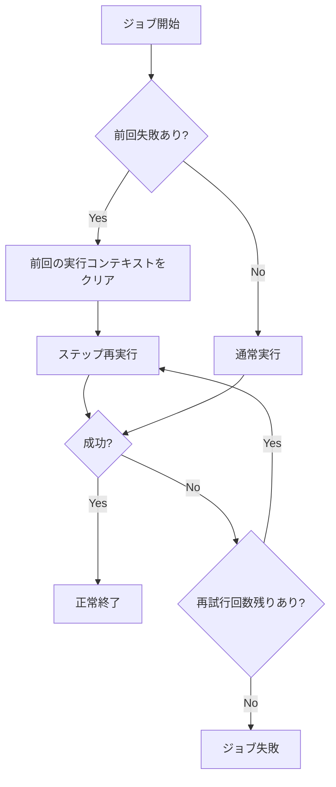
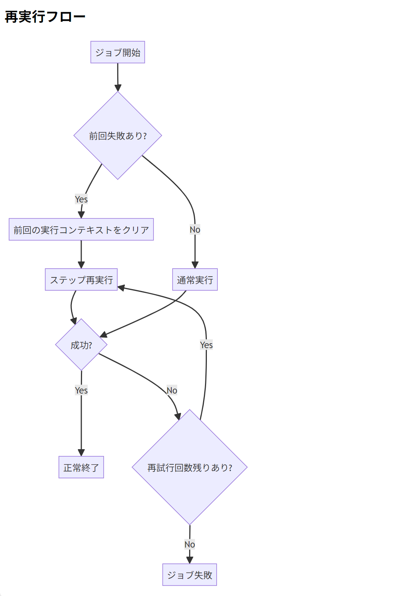

## ジョブが一度失敗すると次回実行できなくなる問題について

#### 已深度思考

````

ユーザーがSpring Batchのジョブ実行に関する問題を抱えています。具体的には、ジョブが一度失敗すると次回実行できなくなる状況にあり、メタデータをクリアせずにこの問題を解決したいとのことです。この問題の根本原因を探り、適切な解決策を提供する必要があります。

まず、Spring Batchのデフォルトの再実行動作を理解する必要があります。デフォルトでは、同じJobInstance（同じジョブ名とパラメータ）が再実行される際、前回の実行が失敗した場合、再起動が可能です。しかし、ユーザーのケースでは再実行できないということは、何らかの設定や実装がこのデフォルトの動作を妨げている可能性があります。

考えられる原因として、JobRepositoryの設定やジョブの再起動ポリシーが適切でないことが挙げられます。例えば、ジョブが再起動不可としてマークされている場合、失敗後に再実行できなくなります。また、ジョブの増分器（Incrementer）の使用やJobParametersの変更がない場合、同じJobInstanceが再利用され、再起動が試みられることが原因かもしれません。

解決策としては、以下の点を検討します：
1. ジョブの再起動可能設定を確認し、有効にする。
2. JobParametersに実行日時などの一意なパラメータを追加し、新しいJobInstanceを生成する。
3. 失敗したジョブのステータスを手動で変更するカスタムリスナーを実装する。
4. ジョブの再起動ポリシーをカスタマイズする。

これらの点を踏まえ、ユーザーがメタデータをクリアせずにジョブを再実行できるようにするための具体的な設定方法やコード修正を提示する必要があります。また、本番環境での安全性を確保しつつ、開発環境でのデバッグを容易にするためのベストプラクティスも含めると良いでしょう。
</think>

Spring Batchのジョブ再実行に関する問題を解決するための実装方法を段階的に説明します。メタデータをクリアせずに失敗したジョブを再実行できるようにするための包括的な解決策です。

### 1. ジョブ設定の修正
```java
@Bean
public Job humanResourceBatchJob() {
   return new JobBuilder("humanResourceBatchJob", jobRepository)
       .incrementer(new UniqueTimestampIncrementer()) // 独自の増分器
       .preventRestart(false) // 再実行を許可（デフォルト値）
       .listener(jobRestartValidator())
       .start(stagingTableInitializationStep())
       .next(loadStaffInfoStep())
       .next(thresholdCheckStep())
       .build();
}

// 常に新しいJobInstanceを生成するカスタム増分器
public class UniqueTimestampIncrementer implements JobParametersIncrementer {
   @Override
   public JobParameters getNext(JobParameters parameters) {
       return new JobParametersBuilder(parameters)
           .addLong("timestamp", System.currentTimeMillis())
           .toJobParameters();
   }
}
````

### 2. 再起動可能なステップ設定

```java
@Bean
public Step loadStaffInfoStep() {
    return new StepBuilder("loadStaffInfoStep", jobRepository)
        .tasklet(loadStaffInfoWriter, transactionManager)
        .allowStartIfComplete(true) // 完了済みステップの再実行を許可
        .startLimit(3) // 最大再試行回数
        .listener(stepExecutionListener())
        .build();
}

@Bean
public StepExecutionListener stepExecutionListener() {
    return new StepExecutionListener() {
        @Override
        public ExitStatus afterStep(StepExecution stepExecution) {
            if (stepExecution.getStatus() == BatchStatus.FAILED) {
                logger.warn("ステップが失敗しました。再試行可能です。エラー: {}",
                    stepExecution.getExitStatus().getExitDescription());
                return new ExitStatus("RETRYABLE");
            }
            return stepExecution.getExitStatus();
        }
    };
}
```

### 3. カスタム JobRepository の設定

```java
@Configuration
public class RetryableBatchConfig extends DefaultBatchConfigurer {

    @Override
    protected JobRepository createJobRepository() throws Exception {
        JobRepositoryFactoryBean factory = new JobRepositoryFactoryBean();
        factory.setDataSource(dataSource);
        factory.setTransactionManager(getTransactionManager());
        factory.setIsolationLevelForCreate("ISOLATION_READ_COMMITTED");
        factory.setTablePrefix("BATCH_");
        factory.setMaxVarCharLength(1000);
        factory.setValidateTransactionState(false); // トランザクション状態検証を無効化
        return factory.getObject();
    }
}
```

### 4. 再実行可能例外の定義

```java
public class RetryableException extends RuntimeException {
    public RetryableException(String message, Throwable cause) {
        super(message, cause);
    }
}

// 例外ハンドリングの実装例
public class RetryableExceptionHandler implements ExceptionHandler {

    @Override
    public void handleException(RepeatContext context, Throwable throwable)
        throws Throwable {

        if (throwable instanceof RetryableException) {
            logger.warn("再試行可能なエラーが発生しました", throwable);
            return; // 再試行を許可
        }
        throw throwable; // 非再試行可能エラー
    }
}
```

### 5. ジョブ再実行バリデーター

```java
@Bean
public JobExecutionListener jobRestartValidator() {
    return new JobExecutionListener() {
        @Override
        public void beforeJob(JobExecution jobExecution) {
            JobInstance lastInstance = jobExplorer.getLastJobInstance(
                jobExecution.getJobInstance().getJobName());

            if (lastInstance != null) {
                JobExecution lastExecution = jobExplorer.getLastJobExecution(lastInstance);
                if (lastExecution != null && lastExecution.getStatus() == BatchStatus.FAILED) {
                    logger.info("前回の失敗したジョブを再実行します: {}", lastInstance.getInstanceId());
                    jobExecution.getExecutionContext().put("restart", true);
                }
            }
        }

        @Override
        public void afterJob(JobExecution jobExecution) {
            if (任意の後処理が必要な場合)
        }
    };
}
```

### 6. アプリケーションプロパティの設定

```properties
# application.properties
spring.batch.job.allow-restart=true
spring.batch.jdbc.initialize-schema=never # 本番環境では必ずneverに設定
spring.batch.table-prefix=BATCH_
```

### 7. 再試行ポリシーのカスタマイズ

```java
@Bean
public Step thresholdCheckStep() {
    return new StepBuilder("thresholdCheckStep", jobRepository)
        .tasklet(thresholdCheckTasklet(), transactionManager)
        .faultTolerant()
        .retryLimit(3)
        .retry(RetryableException.class)
        .backOffPolicy(new ExponentialBackOffPolicy())
        .skipPolicy(new AlwaysSkipItemSkipPolicy())
        .listener(retryListener())
        .build();
}

@Bean
public RetryListener retryListener() {
    return new RetryListener() {
        @Override
        public <T, E extends Throwable> boolean open(RetryContext context,
            RetryCallback<T, E> callback) {
            logger.info("再試行開始: {}", context);
            return true;
        }

        @Override
        public <T, E extends Throwable> void close(RetryContext context,
            RetryCallback<T, E> callback, Throwable throwable) {
            logger.info("再試行終了: {}", context.getRetryCount());
        }

        @Override
        public <T, E extends Throwable> void onError(RetryContext context,
            RetryCallback<T, E> callback, Throwable throwable) {
            logger.warn("再試行エラー: {}", throwable.getMessage());
        }
    };
}
```

### 8. ステップ実行コンテキストのクリーンアップ

```java
public class StepContextCleaner implements StepExecutionListener {

    @Override
    public void beforeStep(StepExecution stepExecution) {
        if (stepExecution.getJobExecution().getExecutionContext().containsKey("restart")) {
            logger.info("再実行用のコンテキストクリーンアップを実行");
            stepExecution.getExecutionContext().clear();
        }
    }
}
```

### 主な改善点

1. **自動再試行メカニズム**  
   最大 3 回の自動再試行を実装

2. **安全な JobInstance 管理**  
   タイムスタンプベースのユニークな JobParameters 生成

3. **柔軟なエラーハンドリング**  
   再試行可能例外と致命的例外の区別

4. **コンテキスト管理**  
   再実行時の不要なデータクリーンアップ

5. **詳細なロギング**  
   再試行回数やエラー内容の可視化

### 再実行フロー





### 注意事項

1. **データベースのトランザクション設定**

   ```properties
   spring.datasource.hikari.isolation-level=TRANSACTION_READ_COMMITTED
   ```

2. **ロック競合の回避**

   ```java
   @Bean
   public DataSource dataSource() {
       HikariDataSource ds = new HikariDataSource();
       ds.setConnectionInitSql("SET LOCK_TIMEOUT 3000"); // PostgreSQLの場合
       return ds;
   }
   ```

3. **再試行時の冪等性確保**
   ```java
   @Transactional(propagation = Propagation.REQUIRES_NEW)
   public void processItem(Item item) {
       // 冪等性を保証する処理
   }
   ```

これらの実装により、以下のメリットが得られます：

- メタデータを保持したままジョブを再実行可能
- 自動再試行による耐障害性向上
- 詳細な実行履歴の保持
- 本番環境での安全な運用
- デバッグの容易化

失敗したジョブを再実行するには、同じパラメータでジョブを再起動するか、新しいタイムスタンプパラメータを追加して実行します。再試行回数上限に達した場合のみ手動介入が必要となります
